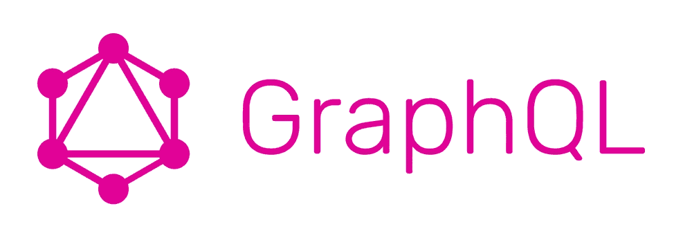
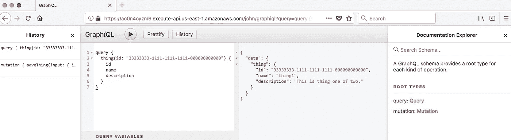

# 如何实现一个 GraphQL CRUD BFF

> 原文：<https://javascript.plainenglish.io/how-to-implement-a-graphql-crud-bff-efcb0117ec71?source=collection_archive---------5----------------------->

## *在本教程中学习如何实现 GraphQL CRUD BFF，作者是 JavaScript CloudNative 开发指南***。**

*BFF 模式加速了创新，因为实现前端的团队也拥有并实现了支持前端的后端服务。这使得团队能够自给自足，不受共享后端服务的竞争需求的影响。在本文中，您将创建一个 CRUD BFF 服务，该服务在其生命周期的开始阶段支持数据。*

*该服务的唯一职责是为特定的有界上下文创作数据。它利用**数据库优先**事件源向下游服务发布域事件。该服务公开了一个基于 GraphQL 的 API。*

**

# *做好准备*

*在开始这个食谱之前，你需要一个 AWS Kinesis 流。*

# *怎么做…*

1.  *从以下模板创建项目:*

*2.用`cd cncb-bff-graphql-crud`导航到`cncb-bff-graphql-crud`目录。*

*3.然后，查看名为`serverless.yml`的文件，内容如下:*

*4.查看名为`./schema/thing/typedefs.js`的文件，内容如下:*

*5.查看名为`./schema/thing/resolvers.js`的文件，内容如下:*

*6.查看名为`handler.js`的文件，内容如下:*

*7.使用 npm install 安装依赖项。*

*8.用`npm test — -s $MY_STAGE`运行测试。*

*9.查看在`.serverless`目录中生成的内容。*

*10.部署堆栈:*

*11.在 AWS 控制台中查看堆栈。*

*12.使用以下 curl 命令调用该函数:*

*13.通过在部署期间使用端点输出，使用 GraphQL 执行相同的转换和查询:*

**

*14.看一下`trigger`功能日志:*

*15.查看数据湖桶中收集的事件。*

*16.完成`npm run rm:lcl — -s $MY_STAGE`后，移除堆叠。*

# *它是如何工作的…*

*GraphQL 正变得越来越流行，这是因为由此产生的 API 的灵活性和客户端库的强大功能，比如 Apollo 客户端。我们实现一个单独的`graphql`函数来支持我们的 API，然后通过`schema`、`resolvers`、`models`和`connectors`添加必要的功能。*

*GraphQL 模式是我们定义`types`、`queries`和`mutations`的地方。在本教程中，我们可以通过 ID 和名称查询`thing`类型，以及`save`和`delete`。`resolvers`将 GraphQL 请求映射到封装业务逻辑的`model`对象。*

*反过来，`models`与封装数据库 API 细节的`connectors`对话。`models`和`connectors`在`handler`函数中用`schema`注册，这是一种非常简单但有效的基于构造函数的依赖注入形式。*

*我们并不经常在原生云中使用依赖注入，因为这些函数非常小而且非常集中，以至于它是多余的，并且会影响性能。对于 GraphQL，这种简单的形式对于促进测试非常有效。`Graphiql`工具对于揭示 API 的自文档化本质非常有用。*

*该服务的唯一职责是使用数据库优先事件源为特定的有界上下文创作数据和发布事件。服务中的代码遵循一个非常可重复的编码约定`types`、`resolvers`、`models`、`connectors`和`triggers`。因此，即使服务中的业务域数量增加，也很容易推断出代码的正确性。*

*这就是为什么在单个创作 BFF 服务中有大量域是合理的，只要这些域是内聚的，是同一有界上下文的一部分，并且是由一致的用户组创作的。*

*我们希望本教程对你有所帮助。如果想了解更多关于云原生的知识，可以阅读 [*JavaScript 云原生开发食谱*](https://www.amazon.com/JavaScript-Cloud-Native-Development-Cookbook/dp/1788470419) *。本书通过采用基于菜谱的方法，帮助您更快地学习云原生开发的主要概念，您可以尝试不同的解决方案来理解这些概念。**