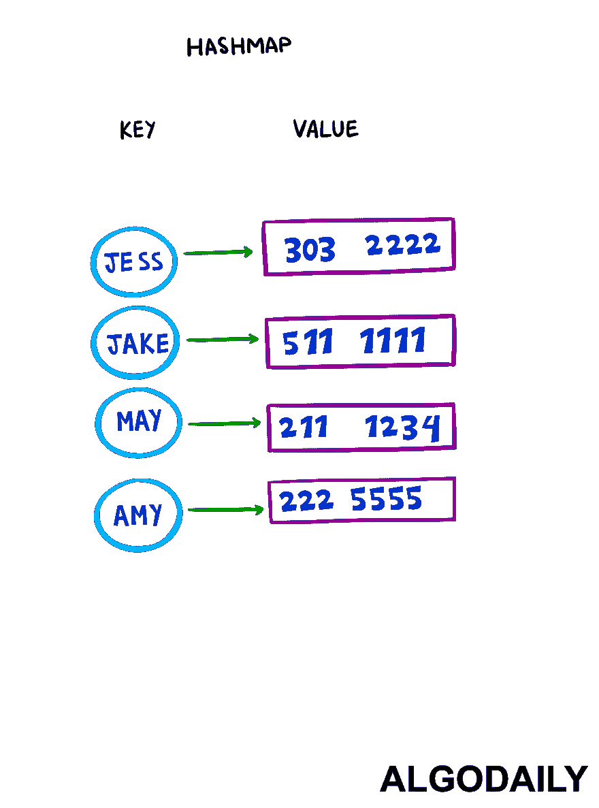

# 如何用 JavaScript 实现散列映射

> 原文：<https://javascript.plainenglish.io/how-to-implement-a-hash-map-be6a2696f250?source=collection_archive---------1----------------------->

数组在查找特定索引处的元素方面非常出色，因为内存中的所有元素都是连续的，允许进行`O(1)`或常量时间查找。但是我们经常不或者不能通过索引来执行查找。哈希表和哈希表是解决这个问题的一种方法，使我们能够通过`keys`进行查找。

你能从头开始实现`Map`类吗？只有两种方法是必需的- `get`和`set`。许多编程语言都有内置的散列或字典原语(如`Javascript` `Object` s 和`{}`符号)，但是我们不想在这个练习中使用它们。

*这一课最初发表在 https://algodaily.com*[](https://algodaily.com/challenges/implement-a-hash-map)**上，我在那里开设了一门技术面试课程，并为雄心勃勃的开发人员撰写思考文章。**

**

***注意:**常规的`Javascript`对象和`Map`类都是简单的键值散列表/关联数组，有一些关键的区别:*

**一个* `*Map*` *对象可以按照插入顺序遍历它的元素，而 JavaScript 的* `*Object*` *不保证顺序。另外，* `*Object*` *s 由于原型原因有默认键，* `*Map*` *s 没有自带默认键。* [*下面就好好细分一下*](https://medium.com/front-end-weekly/es6-map-vs-object-what-and-when-b80621932373) *这两个。出于本练习的目的，让我们假设两者具有相同的功能。**

*对于您将定义的两种方法:*

1.  *`get(key: string)`应该给定一个键，并返回该键的值。*
2.  *`set(key: string, val: string)`应该以一个键和一个值作为参数，并存储这一对。*

*此外，我们还提供了下面的散列函数`hashStr`。它试图避免碰撞，但并不完美。它接受一个字符串值并返回一个整数。*

```
*function hashStr(str) {
    let finalHash = 0;
    for (let i = 0; i < str.length; i++) {
        const charCode = str.charCodeAt(i);
        finalHash += charCode;
    }
    return finalHash;
}

console.log(hashStr('testKey'))*
```

*让我们称我们的新类为`Hashmap`类，并像这样使用它:*

```
*const m = new Hashmap();
m.set('name', 'Jake');
console.log(m.get('name'));*
```

*让我们先回顾一下普通哈希表是如何工作的，这个理论是我们的`Hashmap` `data structure`所基于的。正如我们已经注意到的，在许多编程语言中，有一个基于遗产`Hashtable`的`Hashmap`类。让我们一步一步地完成我们建议的代码实现。*

**

*所以我们知道哈希表的工作原理是将数据存储在桶中。要访问这些桶，我们需要一种方法将`key`转换成桶号。(桶可以使用数组和`[binary search](https://dev.to/lessons/binary-search-technique)`树来建模，但是为了保持简单和速度最大化，我们将坚持使用数组。)*

*使用键使我们不必知道数据在数组中的位置。因此，我们的`data structure`需要一个散列函数，在本例中提供为`hashStr`，将`index`计算到存储所需值的`buckets`中。我们本质上是通过我们的`hashStr`散列函数将`key`映射到一个数组索引。*

```
*hashStr('r')
// 114

// array = [  _  ,  X  ,  _  ,  _ ]
// index     113   114   115   116*
```

*如您所见，`hashStr`所做的就是获取`set()`中提供的`key`，并为我们计算一个位置。因此，我们需要另一个`data structure`来存放值的实际存储和存储桶。当然，你已经知道它是一个数组了！*

# *填写*

*哈希表的槽或桶通常存储在 _ _ _ _ _ _ _ _ _ 及其索引中。*

***解:**阵*

*编写该类的良好开端是仅使用存储阵列对其进行初始化:*

*我们将使用`hashStr`返回的索引来决定输入的值应该放在`this._storage`中的什么位置。*

**关于冲突的一句话* : `collisions`当一个哈希函数为多个键返回相同的索引时，不在这个问题的范围之内。但是，有一些方法可以使用额外的数据结构来处理这些问题。*

# *多项选择*

*以下哪一项是哈希表实现中冲突的解决方案？*

*   *没有好的冲突解决方案，哈希函数必须是唯一的*
*   *使用单独的链接，通常使用链表，其中数组的索引由一系列值组成*
*   *使用 trie 存储每个索引的值*
*   *将该存储桶中的所有值连接成一个字符串*

***解决方案:**使用单独的链接，通常使用一个链表，其中数组的索引由一串值组成*

*现在，我们有了自己的构建模块，所以让我们继续实现`set`方法。该方法将:*

1.  *乘`key`通过了*
2.  *通过哈希函数运行它，然后*
3.  *将我们的`storage`中的值设置为特定的指数*

*请注意我们存储它的方式:在`this._storage` ( `this._storage[idx]`)中的每个索引本身就是一个数组，从而初步解决了冲突问题。*

```
*set(key, val) {
  let idx = this.hashStr(key);

  if (!this._storage[idx]) {
    this._storage[idx] = [];
  }

  this._storage[idx].push([key, val]);
}*
```

*`set`方法现在看起来很简单，对吗？*

*这与我们的`get`方法是同一个概念。我们在那里所做的也是通过`hashStr`方法运行传递的`key`，但是我们将转到结果索引并检索值，而不是设置。*

```
 *for (let keyVal of this._storage[idx]) {
    if (keyVal[0] === key) {
      return keyVal[1];
    }
  }*
```

*我们应该注意的一个警告是，传递一个不存在的键(或者没有被`set`)是可能的，所以如果是这种情况，我们应该通过返回`undefined`来处理它。*

```
*get(key) {
  let idx = this.hashStr(key);

  if (!this._storage[idx]) {
    return undefined;
  }

  for (let keyVal of this._storage[idx]) {
    if (keyVal[0] === key) {
      return keyVal[1];
    }
  }
}*
```

*那应该差不多了！让我们试一试。*

```
*class Hashmap {
  constructor() {
    this._storage = [];
  }

  hashStr(str) {
    let finalHash = 0;
    for (let i = 0; i < str.length; i++) {
      const charCode = str.charCodeAt(i);
      finalHash += charCode;
    }
    return finalHash;
  }

  set(key, val) {
    let idx = this.hashStr(key);

    if (!this._storage[idx]) {
      this._storage[idx] = [];
    }

    this._storage[idx].push([key, val]);
  }

  get(key) {
    let idx = this.hashStr(key);

    if (!this._storage[idx]) {
      return undefined;
    }

    for (let keyVal of this._storage[idx]) {
      if (keyVal[0] === key) {
        return keyVal[1];
      }
    }
  }
}*
```

**本课最初发表于*[*https://algodaily.com*](https://algodaily.com/challenges/implement-a-hash-map)*，我在那里开设了一门技术面试课程，并为雄心勃勃的开发人员撰写思考片段。**