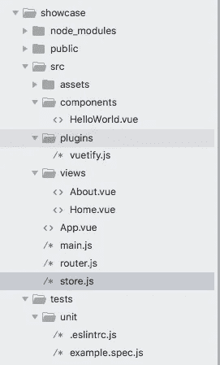
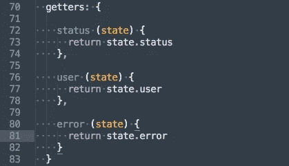
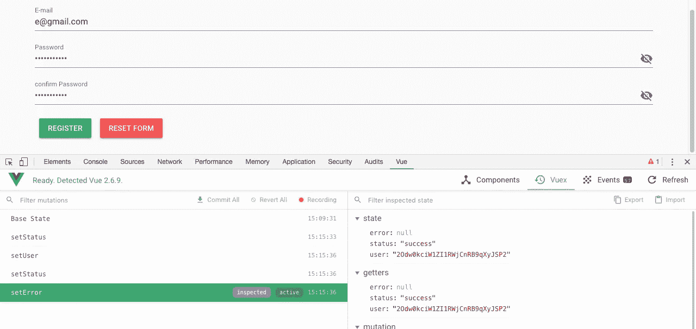

# 如何用 Firebase、Vuex 和 Vue Router 在 Vue.js 中创建 web app(第 1 部分)

> 原文：<https://javascript.plainenglish.io/how-to-implement-a-showcase-web-app-in-vue-js-with-firebase-and-register-functionality-part-1-992089d17828?source=collection_archive---------0----------------------->


在这里，我们将使用 firebase 后端实现一个展示应用程序。我们将使用 Vuetify、Vuex 和 Vue 路由器和 Firebase。

# 我们将要做什么

1.  创建 Vue.js 应用程序
2.  添加 vuetify
3.  为我们的应用创建一个结构
4.  我们应用的工作流程
5.  创建一个 firebase 帐户
6.  将 firebase 链接到应用程序
7.  创建应用程序的导航栏
8.  添加注册页面
9.  使用 firebase 测试注册
10.  添加登录页面
11.  使用 firebase 测试登录
12.  集成 vuex
13.  重构 Register.vue 文件
14.  重构 Signin.vue 文件
15.  修复登录和注销中的导航问题

# 1.创建 Vue.js 应用程序

为此，我使用了 vue-cli。它有一些很好的特性，通过这些特性我们可以选择创建 Vue.js 应用程序的所有特性。它们还提供了一些将配置保存为预置的选项，这样我们就可以在创建新应用程序时使用相同的配置。因此，默认情况下，当使用 vue-cli 时，它也会安装和配置 vuex 和 vue 路由器。

```
vue create showcase
```


万岁，第一步完成了，现在需要运行本地开发使用

```
npm run serve
```

我们的应用程序运行在端口 8080 上。

# 2.添加 vuetify

Vuetify 是 Vue.js 的一个材料设计框架，它简化了我们应用需求的实现。我们也会用到它。因为我们使用的是 vue-cli，所以我们可以使用命令轻松地将 vuetify 添加到我们的应用程序中，

```
vue add vuetify
```


现在运行开发服务器，看看 vuetify 的魔力。


太棒了，vuetify 集成到我们的应用程序中

# 3.为我们的应用创建一个结构

目前，我们的应用程序结构是这样的。



我们正在对我们的应用程序做一些调整，以包含一些变化。这个结构是基于一些用例以及其他博客中的一些一般概念。这可能也冒犯了一些人。如果有，请随意使用您自己的项目结构。


这将是我们提出的申请计划。auth 文件夹将包含注册和登录组件。

服务文件夹将包含任何 API 调用或需要添加的数据。

助手的文件夹将有助于任何警卫一样，需要认证，以查看任何网页。

我相信文件夹结构的其余部分是不言自明的。

# 5.创建一个 firebase 帐户

在深入 firebase 之前，我们需要理解为什么要使用 firebase。首先，它是谷歌引用他们的话的产物

> Firebase 为您提供了分析、数据库、消息传递和崩溃报告等功能，因此您可以快速移动并专注于您的用户。

在我们的应用程序中，将只关注认证和数据库功能。

[fire base 的链接](https://firebase.google.com/)

我们可以使用 Gmail 登录 firebase 控制台。在右上角，我们有“转到控制台”将重定向到应用程序部分。

我已经用 firebase 运行了一个应用程序。单击添加项目链接，并添加您的项目名称，


是的，我们的项目准备在 firebase 中运行。

因为我们是使用 firebase 进行身份验证的，所以我们需要在 firebase 中配置一些点。

点击认证->设置登录方式。


我目前正在注册电子邮件密码方案，所以我们只启用它。


现在，我们需要将我们的应用程序与 firebase 链接起来，这可以通过点击 **web 设置、**时可用的配置来完成


复制配置，我们需要尽快将配置添加到 Vue.js 应用程序中。

# 6.将 firebase 链接到应用程序

到目前为止，我们已经创建了一个 firebase 应用程序，现在我们需要链接到我们的 Vue.js 应用程序。要做到这一点，我们需要一些步骤

1.  添加 env 实现。
2.  安装 firebase。
3.  将 firebase 密钥添加到应用程序中。

## 1.添加 env 实现。

这对我和每个人来说都是重要的一部分。我们已经创建了一个 firebase 应用程序，firebase 给了我们一些证书。我们不能盲目地添加到我们的应用程序中。这不是问题，其他人可能会使用我们的凭据。所以把那些留在我们**T3 就好了。env 文件**

> 在这样做之前，需要记住以下几点。

a.在我们的应用程序的根路径中创建一个. env 文件，该文件将包含我们的应用程序在每种模式下运行时所需的所有细节。

b.创建一个.***env . development***文件，该文件将包含我们的应用程序在本地执行所需的所有细节。我们把我们的 firebase 证书放在这里。

c.所有的 env 变量都应该以***【VUE _ APP _】***开头。否则它们将被丢弃。

d.确保添加这些文件后重新启动应用程序。对我来说，它只有在重启后才能工作。

我刚刚添加了一个测试标题，以确保它在。环境文件。这将用于我们应用程序中的每个模式。

```
VUE_APP_TITLE='SHOW CASE'
```

现在，代码变成了，


将给**显示案例**作为链接

## 2.安装 firebase

要在我们的应用程序中使用 firebase，需要将 firebase 安装到我们的应用程序中。

```
npm install firebase --save
```


## 3.将 firebase 密钥添加到应用程序中。

现在，我们可以将 firebase 密钥复制到我们的应用程序中。我们可以使用*文件和 ***main.js*** 文件来实现这一点。*

*从 firebase 复制配置，并将它们添加到环境变量中的 main.js 文件中。*

**

*现在所有的键都用 ENV 变量改变了，它们被替换为来自一个***. ENV . development***文件的原始值。*

**

*将 firebase 导入 main.js 文件，main.js 中的全部代码变成，*

```
*import Vue from 'vue'
import './plugins/vuetify'
import App from '@/App.vue'
import router from '@/router'
import store from '@/store'
import * as firebase from 'firebase'Vue.config.productionTip = falsenew Vue({
  router,
  store,
  render: h => h(App)
}).$mount('#app')var config = {
  apiKey: process.env.VUE_APP_FIREBASE_API_KEY,
  authDomain: process.env.VUE_APP_FIREBASE_AUTH_DOMAIN,
  databaseURL: process.env.VUE_APP_FIREBASE_DATASE_URL,
  projectId: process.env.VUE_APP_FIREBASE_PROJECT_ID,
  storageBucket: process.env.VUE_APP_FIREBASE_STORAGE_BUCKET,
  messagingSenderId: process.env.VUE_APP_FIREBASE_MESSAGE_SENDER_ID
}
firebase.initializeApp(config)*
```

# *7.创建应用程序的导航栏*

*我们目前有一个导航栏，但我们正在将所有与导航相关的代码作为一个名为 NavBar.vue 的独立组件进行移动。我们目前正在 NavBar 中创建一个注册、登录和注销按钮的选项。为了做到这一点*

*将导航栏组件导入 App.vue，并在 App.vue 中定义该组件。*

```
*<template>
  <v-app>
    <!-- display nav bar -->
    <nav-bar></nav-bar>
  </v-app>
</template><script>
import NavBar from '@/views/NavBar'export default {
  name: 'App',
  components: {
    NavBar
  }
}
</script>*
```

*这里重要的一点是，一旦我们将一个组件声明为子组件，那么我们就可以使用与声明相同的名称来使用该组件。*

> *这里 NavBar ===<nav-bar></nav-bar>*

# *8.添加注册页面*

*现在是注册页面的时间。我们需要在**components/auth/register . vue**中创建一个组件*

*我在表格中添加了一些验证，如电子邮件是强制性的，显示隐藏的密码一旦点击图标禁用注册按钮时，无效的数据给定。这些都是我从 vuetify 找到的。您可以查看更多信息。*

*为了显示注册页面，我们已经在导航栏中添加了一个链接，现在我们需要将它链接到我们的组件，并且需要显示组件。这可以使用 vue 路由器轻松执行。*

*为此，*

1.  *将组件导入到 **router/index.js** 文件中*
2.  *在 **router/index.js** 文件中设置路径和组件。*
3.  *设置导航栏中的链接。*
4.  *使用 App.vue 中的< ***路由器-视图>*** 显示组件*

## *1.将组件导入到 **router/index.js 文件***

```
*import Register from '@/components/auth/Register.vue'*
```

## *2.在 router/index.js 文件中设置路径和组件。*

```
*routes: [
    {
      path: '/register',
      name: 'Register',
      component: Register
    }
  ]*
```

## *3.设置导航栏中的链接。*

*这已经是我们做的了，我只是补充到这里来理解，*

```
*{
          title: 'Register',
          icon: 'face',
          link: '/register'
        },*
```

## *4.使用 App.vue 中的< ***路由器-视图>*** 显示组件*

```
*<router-view></router-view>*
```

*就这些，现在我们可以看到注册页面了。*

**

*[提交变更链接](https://github.com/anoobbava/showcase/commit/3cb3046b43f853b9de04c96bb497f6c88db7e1bd)*

# *9.使用 firebase 测试注册*

*现在是真正比赛的时候了。我正在添加一些 firebase 注册模块到 Register.vue。我们将在这之后使用 vuex。目前，我们正在检查，以确保它的工作。*

*我们已经有一个名为 ***的方法在注册页面中验证*** 。我们正在向该方法添加 firebase 模块，或者我们可以创建一个单独的方法，并从 ***验证*** 中调用它。此外，还需要将 firebase 导入 Register.vue。*

*用于注册的 firebase 模块*

```
*registerWithFirebase () {
      firebase.auth().createUserWithEmailAndPassword(this.email, this.password)
        .then((response) => {
          alert('success')
          console.log(response)
        })
        .catch((error) => {
          alert('failure')
          console.log(error)
        })
    }*
```

*在 ***validate()*** 中调用此方法使用*

```
*this.registerWithFirebase()*
```

*我们成功了！！！*

**

*现在检查 firebase，它在那里更新，*

**

# *10.添加登录页面*

*这里的变化也与注册页面相同。*

1.  *在 auth/Signin.vue 中添加登录代码*
2.  *将 auth/Signin.vue 导入路由器文件。*
3.  *在路由器文件中添加路由。*

*我们有一个登录页面，*

**

*[提交代码更改的链接](https://github.com/anoobbava/showcase/commit/2893de6d0846dc9a29cb3f7057ccb7a43f98a597)*

# *11.使用 firebase 测试登录*

*我们目前正在将登录模块添加到 Signin.vue 中。一旦 vuex 完成，将转移到那里。我们正在创建一个新方法，并在 ***validate()*** 中调用这个方法。此外，还需要在这里导入 firebase，*

1.  *将 firebase 导入 Signin.vue*
2.  *将 firebase 登录模块添加到新方法中。*

```
*loginWithFirebase () {
      firebase.auth().signInWithEmailAndPassword(this.email, this.password)
        .then((response) => {
          alert('success')
          console.log(response)
        })
        .catch((error) => {
          alert('failure')
          console.log(error)
        })
    }*
```

*3.在 validate 方法中调用 firebase 登录方法*

```
 *this.loginWithFirebase()* 
```

## *4.测试成功登录*

**

## *5.测试失败登录*

****

*console output*

# *12.集成 vuex*

*现在是最重要的部分，用 vuex 进行状态管理。我们需要编写我们现有的大部分代码。在深入研究之前，我们需要清楚地知道目前我们要拯救什么。*

*如果你不知道 vuex 是如何工作的，请浏览我之前的博客，*

*l[vuex 博客的墨水](https://medium.com/js-dojo/vuex-and-vue-bread-and-butter-4519a21e95ce)*

*到目前为止，我们已经在相应的 vue 文件中创建了一个注册和登录。现在我们将代码移动到 ***store/index.js****

## *1.vuex 中可用的状态*

*vuex 中的状态将在所有组件之间共享。因此，一旦一个组件更新了状态，它将会影响所有正在使用该状态的其他组件。*

*我们有 ***用户状态*** ，一旦用户签名或注册，它将从 firebase 中保留 user-id*

*我们有一个 s ***状态，*** 将指示登录或注册是否成功。*

*我们有 ***错误状态*** ，它会保留使用 firebase 时的任何错误，以后会显示这些错误。*

**

## *2.vuex 的突变*

*如果我们想改变状态，也需要使用突变。这里我们使用的是，*

****setUser()*** 将设置我们从 firebase 中得到的用户*

****removeUser()*** 将从状态中删除 user-id。*

****setStatus()*** 改变状态。*

****setError()*** 设置错误状态或从状态中删除错误*

**

## *3.vuex 中的操作*

*只有突变需要改变状态，但有时异步操作完成后，会使用动作。*

*突变只对同步操作有好处。反过来，行动也将调用突变。*

**

*我们可以从 vue 文件中删除代码，并从那里调用操作。*

## *4.vuex 中的吸气剂*

*为了根据状态显示一些数据，可以使用 getters 来完成，*

**

*最后但同样重要的是，*

> *将 firebase 导入 store/index.js。*

# *13.重构 Register.vue 文件*

*现在我们有了一个存储，我们可以很容易地从 Register.vue 文件中删除 firebase 注册模块。*

*我们可以删除 Register.vue 文件中的导入 firebase，registerWithFirebase() 变为:*

```
*registerWithFirebase () {
      const user = {
        email: this.email,
        password: this.password
      }
      this.$store.dispatch('signUpAction', user)
    }*
```

***法典*本。$ store . dispatch(' sign-action '，user)*** 将调用该状态并更新详细信息、*

*现在运行寄存器，并使用 vue-development 工具检查 vuex。*

*注册后，我们获得了成功，vuex 也更新了，*

**

# *14.重构 Signin.vue 文件*

*这里，我们还应用了 Register.vue 文件的逻辑。代码变成了，*

```
*loginWithFirebase () {
      const user = {
        email: this.email,
        password: this.password
      }
      this.$store.dispatch('signInAction', user)
    }*
```

*输出是，*

**

# *15.解决登录和注销时的导航问题。*

*目前，我们正在显示所有的链接，也需要修复。还需要实现注销按钮。*

1.  *仅当用户未登录时显示登录和注册*
2.  *如果用户登录，则显示注销。*
3.  *实现注销。*

## *1.仅当用户未登录时显示登录和注册*

*为此，我们可以使用商店的帮助，我们可以检查如果用户的状态为空，那么我们需要显示这些。我将为此使用计算属性。*

```
*userLogedIn () {
      return this.$store.getters.user
    }*
```

*它将调用 store getters 并将结果用 **v-if** 链接到 navbar*

```
*<v-toolbar-items class='hidden-xs-only' v-if="!userLogedIn">
        ...
      </v-toolbar-items>*
```

## *2.如果用户登录，则显示注销。*

*我们可以使用与注册和登录相同的方法。但只是 **v-else***

```
*v-toolbar-items class='hidden-xs-only' v-else>
        <v-btn>
         ...
        </v-btn>
</v-toolbar-items>*
```

## *3.实现注销。*

*需要将 firebase 注销功能添加到存储操作中，并更新其他状态，*

```
*signOutAction ( {commit}) {
      firebase.auth().signOut()
        .then((response) => {
          commit('setUser', null)
          commit('setStatus', 'success')
          commit('setError', null)
        })
        .catch((error) => {
          commit('setStatus', 'failure')
          commit('setError', error.message)
        })
    }*
```

*现在，我们需要添加一个一旦点击就会调用 store 操作的 signout 方法，*

```
*[@click](http://twitter.com/click)='logoutFromFirebase'*
```

*在 NavBar.vue，*

```
*methods: {
    logoutFromFirebase () {
      this.$store.dispatch('signOutAction')
    }
  }*
```

*签出完成后，*

**

*我知道，有很多悬而未决的工作，需要完成，但在这里，我们只完成了注册和登录功能，将自动登录时，页面刷新，重定向到新的页面一旦认证，清除表单字段，从不想要的页面攻击认证，显示错误消息从 firebase 等，所有这些都将涵盖在下一部分。*

> *如果这个故事对你有所帮助，请随意[给我买杯咖啡](https://www.buymeacoffee.com/anoobbava)*

*正如我承诺的，GitHub 回购的 [*链接。*](https://github.com/anoobbava/showcase)*

*如果您认为有用，请发表评论或鼓掌。*