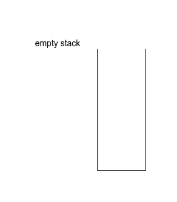
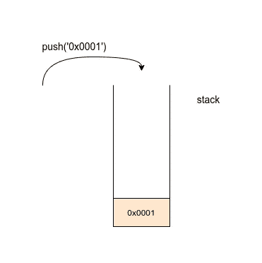

# 如何在 Node.js 中实现堆栈

> 原文：<https://javascript.plainenglish.io/how-to-implement-a-stack-in-node-js-e7b43af282d4?source=collection_archive---------1----------------------->

堆栈是编程中最重要的数据结构之一，但是如何在 javascript 中实现堆栈呢？让我们开始吃吧。


Photo by [Nathan Dumlao](https://unsplash.com/@nate_dumlao?utm_source=medium&utm_medium=referral) on [Unsplash](https://unsplash.com?utm_source=medium&utm_medium=referral)

# 1.介绍

[**栈**](https://en.wikipedia.org/wiki/Stack_(abstract_data_type)) 是计算机科学的基本抽象数据结构，它利用 [**LIFO**](https://en.wikipedia.org/wiki/FIFO_and_LIFO_accounting#LIFO) 方法和两个主要操作来服务于元素的集合:

*   推送(向堆栈添加新元素)
*   pop(移除顶部元素)

堆栈主要由算法(回溯、深度优先搜索、…)、OS(操作系统)、编程语言(内存管理、调用堆栈、…)、框架和许多其他应用程序使用。

# 2.履行

我们将使用一个数组实现一个堆栈，并使用以下函数创建一个类:

*   isEmpty(打印堆栈是否为空)
*   长度(打印堆栈中元素的数量)
*   推送(向堆栈添加新元素)
*   pop(获取并移除顶部元素)
*   printStack(打印堆栈中的所有元素)

用 node.js 创建一个新项目

```
mkdir stackjs
npm init -y
```

## 堆栈类

让我们先构建一个堆栈类，创建一个文件 **stack.js** 并粘贴以下代码:



empty stack

```
class Stack {constructor() {//array used to store the stacks elementsthis.stack= []; }}module.exports = Stack;
```

堆栈类有 1 个属性:

**stack** :存储堆栈元素的数组

## 推送操作



push operation

推送操作将一个元素添加到堆栈的顶部。

```
// push operationpush(element) {// add the element into the stackthis.stack.push(element);}
```

## 弹出操作


pop operation

弹出操作从堆栈中移除并返回最后一个元素

```
// pop operationpop() {// return top most element from the stack// and removes it// Underflow if stack is emptyif (this.stack.length == 0)return "Stack Is Empty";return this.stack.pop();}
```

## IsEmpty 操作

IsEmpty 操作检查堆栈长度是否为空

```
// isEmpty operationisEmpty() {// return true if stack is emptyreturn this.stack.length == 0;}
```

## 长度运算

长度运算返回堆栈的实际长度

```
// length operationlength() {// return stack legthreturn this.stack.length;}
```

## 打印堆栈操作

PrintStack 操作迭代并打印所有堆栈元素

```
// printStack functionprintStack() {var stringBuilder = "";for (var item = 0; item < this.stack.length; item++)stringBuilder += `${item}:` + this.stack[item] + '\n';return stringBuilder;}
```

最后一个包含所有函数的类。

stack.js

# 3.测试堆栈类

现在，我们将尝试测试我们构建的堆栈。

创建一个新文件 **index.js**

index.js

运行 index.js

```
node index.js
//console output
**Check if the stack is empty
true
**Check if the stack has zero length
0
**Pop from the empty stack
Underflow
**Push 3 memory slots to the stack
stack length:3
0:0x0000
1:0x0001
2:0x0002**Pop the last memory slot from the stack
0x0002
stack length:2
0:0x0000
1:0x0001
```

# 4.结论

学习和使用数据结构可以让你成为一名优秀的软件开发人员。

# 参考

*   [维基](https://en.wikipedia.org/wiki/Stack_(abstract_data_type))
*   [node.js](https://nodejs.org/en/)

# 感谢你阅读我的故事

随时评论我的任何想法，变化等。

[](https://medium.com/javarevisited/boost-your-productivity-at-csv-files-with-apache-commons-csv-in-java-c52b33037c4c) [## 使用 Java 中的 Apache.commons.CSV 提高 CSV 文件的产量

### Apache 软件基金会给了我们 Apache。通过 CSV 文件读/写使我们的生活变得更容易的 Commons.CSV 库…

medium.com](https://medium.com/javarevisited/boost-your-productivity-at-csv-files-with-apache-commons-csv-in-java-c52b33037c4c) [](https://medium.com/javarevisited/how-to-build-a-rest-api-with-node-js-and-oracle-18c-xe-f57bbbdd9b09) [## 5 分钟用 Node.js 和 Oracle 18c 构建你的第一个 REST API。

### 在本教程中，我们将介绍如何使用 node.js 和 Oracle 18c XE 构建 REST API。

medium.com](https://medium.com/javarevisited/how-to-build-a-rest-api-with-node-js-and-oracle-18c-xe-f57bbbdd9b09)