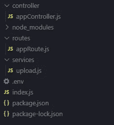

# 如何用 Express 和 React 实现图像上传系统

> 原文：<https://javascript.plainenglish.io/how-to-implement-an-image-upload-system-with-express-and-react-4a6511d8e097?source=collection_archive---------1----------------------->


在这篇文章中，我们将学习如何使用 multer 将图像上传到服务器，并保存在 cloudinary 这样的云服务中。如果你只是想把图片保存在服务器上，这篇文章也会有。我们将使用 React 作为前端上传我们的图像，并在一个旋转木马显示我们的图像。

你可以看到我们最终的应用程序如下所示:


你需要对 Node.js、Express.js、mongoose、React.js、React Bootstrap 有一个基本的了解才能理解这篇文章。

## multer 简介

Multer 是一个快速中间件，帮助我们上传文件到服务器。中间件是一种帮助我们执行特定任务的功能。

现在，让我们开始吧。

在工作目录中，编写以下命令:

```
npm int -y
```

这里的`-y`标志有助于将所有值设置为默认值。

现在让我们安装一些软件包。

```
npm i cloudinary dotenv express mongoose multer multer-storage-cloudinary
```

我们已经安装了相当多的软件包。我认为您理解了大多数包的用例，并且您将会在这个过程中学习其他包的用例。

现在，在主项目目录中创建一个名为 **index.js** 的文件。这应该使我们的文件夹结构看起来像这样:


现在，在文件 **index.js** 中编写以下代码行:

```
require("dotenv").config();const express = require("express");const mongoose = require("mongoose");const appRoute = require("./routes/appRoute");const app = express();const PORT = process.env.PORT || 5000;app.use("/api", appRoute);mongoose.connect(process.env.MONGO_URI, {useNewUrlParser: true,useUnifiedTopology: true,}).then(() => console.log("connected to mongo database")).catch((*error*) => console.errror(error));app.listen(PORT, () => console.log(`listening on port : ${PORT}`));
```

在上面的代码中，我们已经导入并初始化了`dotenv`。然后我们有进口`express`、`mongoose`、`appRoute`。不用担心`appRoute`。我们很快就会着手处理。之后，我们初始化了我们的`app`。然后，我们创建了一个端点`/api/`，它使用`appRoute`作为中间件。然后，我们连接到我们的 mongoDB 数据库。之后，我们在`PORT`上启动了我们的服务器。很清楚，对吗？

您可以在代码中看到，我们已经指定`mongoose`通过`process.env.MONGO_URI`连接到数据库 URL。但是我们还没有告诉 URI 应该是什么。为此，创建一个**。env** 文件在我们的主项目目录中。然后，打开该文件并编写以下内容:

```
MONGO_URI=      //enter the mongo URL here
```

如上所述，您需要在那里输入`MONGO_URI`。

现在您已经输入了`MONGO_URI`，您现在需要在您的主工作目录中创建一个名为 routes 的文件夹。之后，在 routes 目录中创建一个名为 **appRoute.js** 的文件。这将使文件夹结构看起来像这样:


现在，打开文件 **appRoute.js** 并编写以下代码行:

```
const express = require("express");const upload = require("../services/upload");const { uploadImage, getImages } = require("../controller/appController");const router = express.Router(); *// /api/images*router.get("/images", getImages);*// /api/upload*router.post("/upload", upload.single("picture"), uploadImage);module.exports = router;
```

可以看到在文件 **appRoute.js** 中，有导入。我们已经导入了`express`来创建路由器。然后我们导入了`upload`，这是一个中间件，我们将很快创建它来帮助我们上传文件。然后你可以看到我们已经导入了`getImages`，和`uploadImage`。这些是控制器，我们将很快创建。之后，我们创建了两个端点`/api/images`和`/api/upload`。在这些端点，我们提供了控制器。注意，在端点`/api/upload`中，我们使用了`upload`中间件。现在不要担心创建`upload`中间件。但是请记住,`upload`将为我们提供上传文件的功能。`upload`为我们提供了一个`.single`选项，帮助我们上传单个文件。`single`选项接受表单字段的名称作为参数。在我们的例子中是`"picture"`。

> 如果我们想上传多个文件呢？在这种情况下，我们需要使用`.array`而不是`.single`。`array`接受两个参数。第一个参数是字段的名称，而第二个参数是可以上传的文件的最大数量。让我们在代码中看看这个:`upload.array("picture", 12)`。这里`"picture"`是表单字段的名称，`12`是可以上传的最大图像数量。如果你想深入了解，你可以查看 multer 的文档。

现在我们已经在 **appRoute.js** 中编写了代码，让我们创建一个名为 services 的文件夹。然后，在 services 文件夹中创建一个名为 **upload.js** 的文件。我们的文件夹结构应该是这样的:


现在我们已经创建了文件 **upload.js** ，让我们写一些代码。

在进入这一部分之前，让我们创建一个 [Cloudinary](https://cloudinary.com/) 帐户。创建帐户后，检查您的仪表板。你会看到一个类似这样的部分:


现在，坚持住。我们需要将一些值复制到我们的**中。env** 文件。让我们打开**。env** 文件，并编写以下内容:

```
MONGO_URI=          // Mongodb URL
CLOUD_NAME=         // Clodudinary cloud name
API_KEY=            // Cloudinary API Key
API_SECRET=         // Cloudinary API Secret
```

在文件中，我们只需要输入它们各自的值，就像上面的评论中提到的那样。

现在让我们继续看文件 **upload.js** 。然后，编写下面几行代码:

```
const multer = require("multer");const cloudinary = require("cloudinary").v2;const { CloudinaryStorage } = require("multer-storage-cloudinary"); cloudinary.config({ cloud_name: process.env.CLOUD_NAME, api_key: process.env.API_KEY, api_secret: process.env.API_SECRET,}); const storage = new CloudinaryStorage({ cloudinary: cloudinary, folder: "app", allowedFormats: ["jpg", "png", "jpeg"], transformation: [{ width: 500, height: 500, crop: "limit" }],});const upload = multer({ storage: storage });module.exports = upload;
```

现在，我们来谈谈上面几行代码。

我们分别从`multer`、`cloudinary`、`multer-storage-cloudinary`引进了`multer`、`cloudinary`、`CloudinaryStorage`。很清楚了，对吧？

之后，我们使用`cloudinary.config`来配置我们的 Cloudinary 帐户。`cloudinary.config`接收`cloud_name`、`api_key`和`api_secret`。从名字本身就很清楚了，对吧？

现在，我们来看看`CloudinaryStorage`。在说涉及的代码之前，先说一下`CloudinaryStorage`是做什么的。它帮助我们创建一个存储选项，multer 需要它来将文件上传到特定的目的地。

现在，我们来谈谈`CloudinaryStorage`中涉及的代码。它接受`cloudinary`选项。它还接受了`folder`选项，这是我们的 Cloudinary cloud 中的文件夹的名称。你想叫它什么都可以。之后，您可以看到`allowedFormat`，它接受允许的文件格式类型的数组。在我们的例子中，它是 PNG 和 jpeg/jpg。然后就可以看到`transformation`。这有助于我们对文件进行一些转换。这是 Cloudinary 提供的一个功能。如果想了解一下，可以查看 Cloudinary 的文档。

现在来说说`multer()`。你可以看到`multer`接受了一个对象。这个对象接收`storage`。记住，这个`storage`是由`CloudinaryStorage`创造出来的。

之后，我们导出了`upload`中间件。

现在让我们暂停一下，看看如果我们把文件上传到我们自己的服务器而不是上传到云端，我们会有什么不同。如果您已经知道如何上传和保存文件到服务器，您可以跳过这一部分。

现在，看一下下面的代码:

```
const multer = require("multer");const path = require("path");let storage = multer.diskStorage({destination: (*req*, *file*, *cb*) => { cb(null, "uploads");}, filename: (*req*, *file*, *cb*) => { cb(null, `${file.fieldname}-${Date.now()}-${Math.random() * 1000}${path.extname(file.originalname)}` ); }, });const fileFilter = (*req*, *file*, *cb*) => { if ( file.mimetype === "image/png" || file.mimetype === "image/jpg" || file.mimetype === "image/jpeg" ) { cb(null, true); } else { cb(new Error("File format should be PNG,JPG,JPEG"), false); }};const upload = multer({ storage: storage, fileFilter: fileFilter });module.exports = upload;
```

我们不会使用这个项目的工作代码。但是，你绝对可以在你的下一个项目中尝试一下。您也可以尝试在这个项目中上传文件的代码。但是你需要在控制器中做一些改变，我们很快就会开始工作。我不会在这里谈论这个。在使用控制器将文件上传到 Cloudinary 之后，您可以很容易地理解这一点。

现在让我们仔细看看上面的代码。我们已经导入了`multer`和`path`。在这里，`path`是由节点提供的。

在代码中，你可以看到`multer.diskStorage`，它接受了`destination`和`file`选项。这个`destination`选项帮助我们告诉 multer 我们的文件应该存储在哪里。记住`destination`有三个参数`req`、`file`和`cb`。`cb`接受两个参数。第二个参数接受存储上传文件的文件夹的名称。在我们的例子中，文件夹是“上传”。如果我们不定义`destination`，文件将被上传到我们操作系统的临时文件夹。这里您还应该注意的一点是，您必须在主项目目录中创建文件夹 uploads。

现在，我们来看看`filename`选项。顾名思义，`filename`帮助我们改变文件的文件名。如果我们没有使用`filename`选项，multer 会给文件分配一个随机名称。

现在，我们来谈谈代码。`filename`函数接受`req`、`file`和`cb`——类似于`destination`。然后你可以看到我们已经实现了`cb`，它接受两个参数。第一个是`null`，另一个是文件名。在那里你可以看到我们使用了反勾号(```)。你显然知道```的用法。你也可以看到我们已经为文件名创建了一个模式，就像这样:`<file's fieldname>-<current date>-<random number>.<file extension>`。为了实现这种模式，我们在`file.fieldname`的帮助下添加了字段名，其中`file`是参数。然后我们用`Date.now()`添加了当前日期。之后我们通过`Math.random()*1000`添加随机数。之后，我们在`path.extname`的帮助下添加了文件的扩展名。`extname`接受文件名并返回扩展名。

之后，我们创建了一个`fileFilter`。`fileFilter`的作用是过滤可以上传的文件类型。在函数`fileFilter`中，我们实现了一个`mimetype`检查。如果它与`mimetype`匹配，我们就实现了回调，并且不会以这种方式返回任何错误:`cb(null,true)`。如果`mimetype`不匹配，我们在`cb`的帮助下抛出一个新的错误。

之后，我们在`multer`上增加了`storage`和`fileFilter`选项。这个过程很简单，对吗？

这样，您就可以将文件上传到服务器。既然你已经学会了如何上传文件到服务器，让我们回到我们真正的任务。

现在让我们在主项目目录中创建一个名为 controller 的目录。然后，在控制器目录中创建一个名为 **appController.js** 的文件。这应该使我们的文件夹结构看起来像这样:



现在，在文件 **appController.js** 中，编写以下代码行:

```
const Image = require("../models/Image");const getImages = async (*req*, *res*) => { try { let images = await Image.find({}, " -__v"); return res.status(200).json({ images, msg: "image info fetched"    }); } catch (error) { console.error(error); return res.status(500).json({ error: "some error occured" }); } };const uploadImage = async (*req*, *res*) => { try { if (req.file && req.file.path) { const image = new Image({ description: req.body.desc, url: req.file.path,});await image.save();return res.status(200).json({ msg: "image successfully saved" });} else { console.log(req.file); return res.status(422).json({ error: "invalid" }); } } catch (error) { console.error(error); return res.status(500).json({ error: "some error occured" }); }};module.exports = { getImages, uploadImage,};
```

你可以看到在上面的代码中我们已经导入了`Image`模型。不要担心那个。我们将很快创建它。

现在我们来看看`getImages`功能。当用户向路线`/api/images`发出 get 请求时，该函数被调用；你显然知道那件事。在这个函数中，我们向用户发送图像数组。如果出现任何服务器错误，我们将向用户发送状态代码 500。我认为这不需要更多的解释。

现在，我们来看看函数`uploadImage`。您显然知道，当用户向路由`/api/upload`发出 post 请求时，就会调用这个函数。在代码中，我们检查了`req.file`和`req.file.path`是否存在。如果它们存在，我们已经编写了代码来创建一个新的`Image`模型实例，然后用状态代码 200 和一条消息来响应用户。如果它们不存在，我们实现代码向用户发送状态代码 422 和一条错误消息。如果在这个过程中有任何错误，我们将用状态代码 500 和一条错误消息来响应用户。很简单吧？

之后我们又导出了`uploadImage`和`getImages`函数。

现在我们已经完成了控制器的实现，让我们在工作目录中创建名为 models 的文件夹。然后创建一个名为 **Image.js** 的文件。之后，编写下面几行代码:

```
const mongoose = require("mongoose");const { Schema } = mongoose;const Image = new Schema({url: { type: String },description: { type: String },});module.exports = mongoose.model("image", Image);
```

我想这里很清楚了。我们有一个带有`url`和`description`的图像模型，它们都有`String`数据类型。

这样，我们终于完成了项目的后端。现在让我们来做项目的前端部分。

让我们在主项目目录中打开命令行，并编写以下命令:

```
npx create-react-app views
```

安装完成后，我们的文件结构应该如下所示:


现在让我们在前端部分安装我们需要的包。首先，让我们在终端中将工作目录改为视图。为此，我们需要编写以下命令行:

```
cd views
```

现在让我们安装我们需要的包。为此，我们需要编写以下命令行:

```
npm i axios bootstrap react-bootstrap
```

我们需要 axios 进行请求，需要 bootstrap 和 react-bootstrap 进行样式设计。

现在，我们需要在前端部分添加代理。为此，从视图目录中打开 **package.json** 文件。然后在文件末尾添加这一行:

```
"proxy": "http://localhost:5000/"
```

我们这样做是为了防止向后端发出请求时出现 CORS 错误。

现在打开 views/src 目录中的文件 **App.js** 。然后在文件中编写以下代码行:

```
import React from "react";import "bootstrap/dist/css/bootstrap.css";import Upload from "./component/Upload";import ImageCarousel from "./component/ImageCarousel";function App() { return ( <div className="container"> <ImageCarousel /> <Upload /> </div> );}export default App;
```

在文件中，我们导入了 React。我们还从 bootstrap 导入了 CSS 文件。我们还导入了两个组件`Upload`和`ImageCarousel`。然后我们渲染组件。

现在，让我们继续研究这些组件。为此，让我们在 views/src 目录中创建一个名为 component 的目录。现在，创建两个名为 **ImageCarousel.js** 和 **Upload.js** 的文件。

让我们打开文件 **Upload.js** 并编写以下代码行:

我们在这里创建了一个按钮和一个模态。在本文中，我不会解释如何创建模态。如果你想了解它，你可以查看 react-bootstrap 的文档[的这一部分。你可以看到我们在模态中有一个形式。它包含两个字段，即描述和文件字段。我们已经编写了代码，以便在表单字段发生变化时改变状态。](https://react-bootstrap.github.io/components/modal/)

你可以在图像字段中看到，我们在第 80 行调用了`fileData()`函数。这个函数返回图像的名称。现在，我们来看看第 15 行的`onSubmit`函数。在这个函数中，我们创建了一个新的`FormData`实例。`FromData`返回给我们`Content-Type: multipart/form-data`。如果你想了解更多关于`FormData`的信息，请点击[链接](https://javascript.info/formdata)到 javascript.info。之后，我们编写代码来实现对 URL `/api/upload`的 POST 请求。

现在我们已经实现了上传模型，让我们来处理图片轮播。在文件 **ImageCarousel.js** 中，编写以下代码行:

我们已经从 react bootstrap 导入了`Carousel`。我不会在这篇文章里谈论`Carousel`。如果你想了解更多，你可以按照文档的这部分去做。下面我们来谈谈`getImages`功能。在这个函数中，我们编写了对 URL `/api/images`发出 get 请求的代码。当组件被挂载时，这个函数被调用。之后，我们添加了`Carousel.Item`内部的图像和`Carousel.Caption`内部的图像描述。

这样我们就完成了项目的开发。现在，你可以尝试这个项目了。