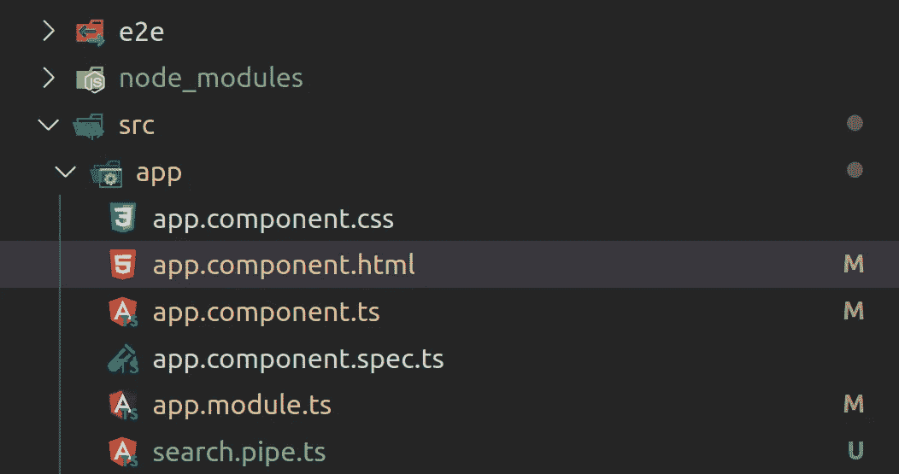
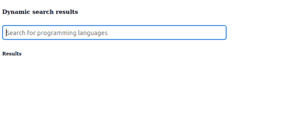

# 如何在 Angular 中实现即时搜索功能

> 原文：<https://javascript.plainenglish.io/how-to-implement-an-instant-search-functionality-in-angular-e0c0a1e97502?source=collection_archive---------1----------------------->

## 如何在用户键入时显示即时搜索结果


Photo by [Markus Winkler](https://unsplash.com/@markuswinkler?utm_source=medium&utm_medium=referral) on [Unsplash](https://unsplash.com?utm_source=medium&utm_medium=referral)

# 介绍

即时搜索是一种允许您在用户输入搜索查询时显示结果的功能。这有助于增强用户体验，因为用户不必在显示搜索结果之前等待很长时间。

在本指南中，我将向您展示如何使用 Angulars 最强大的功能之一 pipe 来实现即时搜索。我们将实现的 Angular 应用程序将从一些数据源中搜索编程语言。

# 入门指南

如果您还没有一个 Angular 应用程序，但是想继续使用，您可以使用下面的命令轻松地创建一个。我已经将我的应用程序命名为 ***即时搜索*** ，但是您可以随意选择任何名称。

```
$ ng new instant-search --defaults
```

我们将从创建用于输入搜索的用户界面开始。现在，转到 app.component.html 的*，删除所有模板代码，用下面的代码替换。*

```
*<section>
    <h5> Dynamic search results </h5>
    <input name="searchInput" type="text" placeholder="Search for      programming languages" size="50">
</section>*
```

*上面的代码非常简单，我们创建一个标题，然后创建一个输入字段。输入字段是您可以键入您正在寻找的编程语言的地方。此外，输入有一些占位符文本。*

*在这个阶段，用户界面应该如下所示。这就是我们基本需要的一切。*

**

*要为 Angular 应用程序提供服务，请从应用程序的根文件夹中运行以下命令。*

```
*$ ng serve*
```

# *更新组件逻辑*

*为了简单起见，我们的数据源将是一组硬编码的编程语言，但也可以是任何东西。*

*在***app . component . ts***文件中，我们将创建一个编程语言数组，我们将从中进行搜索。此外，我们将创建一个名为 **searchInput** 的 string 类型的属性。*

*用如下粗体代码更新您的***app . component . ts***。*

```
*export class AppComponent {
    title = 'instant-search';

   ** public searchInput: string;
    public programmingLanguages = [
      'Python','TypeScript','C','C++','Java',
      'Go','JavaScript','PHP','Ruby','Swift','Kotlin'
   ]**
}*
```

# *创建有角度的管道*

*如前所述，搜索功能将建立在一个有角度的管道之上。基本上，角度管道接收一些数据输入，并返回根据管道指令格式化或转换的数据。*

*创建一个名为***search . pipe . ts***的文件。为了简单起见，我将管道文件放在保存***app . component . ts***文件的同一个根文件夹中。您的文件夹结构现在应该如下所示。*

**

*复制下面的代码并粘贴到新创建的***search . pipe . ts***文件中。我已经命名了管道**搜索**；这是我们在模板中引用管道时将使用的名称。*

```
*import { Pipe, PipeTransform } from '@angular/core';@Pipe({
    name:'search'
})export class SearchPipe implements PipeTransform {
    transform(languages: string[], searchInput: string): any[]{     
        if(!searchInput) {
            return  [];
        } searchInput = searchInput.toLowerCase();
       return languages.filter(
           x =>x.toLowerCase().includes(searchInput)
       )
     }
}*
```

*上面的管道逻辑从我们的数据源中获取所有编程语言的数组，并在您键入时返回与输入文本匹配的编程语言的数组。*

*如果没有输入文本，它将返回一个空数组，这意味着没有任何内容可以显示。*

*此外，请注意，我们将所有输入文本更改为小写，以确保获得适当的匹配。*

# *将资产添加到主模块文件*

*要能够在其他组件中使用导管，必须在 ***app.module.ts*** 文件中注册。此外，还可以导入如下代码中的**表单模块**。添加到 ***app.module.ts*** 文件中的代码以粗体显示如下。*

```
***import { SearchPipe } from './search.pipe';
import { FormsModule } from '@angular/forms';**declarations: [
  AppComponent,
  **SearchPipe** ],imports: [
   BrowserModule,
   **FormsModule**
],*
```

# *更新模板代码*

*最后，我们需要更新模板代码，以便可以使用管道搜索并显示相应的结果。*

*用粗体代码更新***app.component.html***文件。*

```
*<section> <h5> Dynamic search results </h5><input name="searchInput" **[(ngModel)]="searchInput"** type="text"  placeholder="Search for programming languages" size="50" > **<article>
        <h6> Results </h6>
        <ul>
          <li *ngFor="let programmingLanguage of     
                        programmingLanguages | search: searchInput">
             {{programmingLanguage}}
          </li>
        </ul>
    </article>**
</section>*
```

*我添加了一个文章部分来显示搜索结果。管道根据搜索输入过滤编程语言。*

# *行动中的搜索*

*如果你一直正确地跟随，你现在应该有一个工作的即时搜索功能。*

*转到为您的应用程序提供服务的浏览器页面，键入我们数组中编程语言的名称。您应该会得到与下面类似的输出。*

**

# *结论*

*你可以看到，这是一个动态搜索，当我们键入时，它会显示即时搜索结果。*

*我们在 Angular 管道的顶部构建了我们的搜索，这是 Angular 提供的一种经过良好测试的强大功能。*

*喜欢这篇文章吗？如果是这样，通过 [**订阅解码得到更多类似内容，我们的 YouTube 频道**](https://www.youtube.com/channel/UCtipWUghju290NWcn8jhyAw) **！***