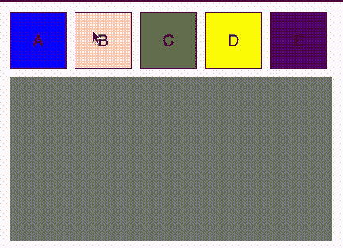

# 如何实现从 React 到 SVG (d3)的拖放

> 原文：<https://javascript.plainenglish.io/how-to-implement-drag-and-drop-from-react-to-svg-d3-16700f01470c?source=collection_archive---------1----------------------->

当创建拓扑构建器(或任何类型的基于一组绘制在一个画布上的节点的图形/布局)时，最常见的操作之一是从构建块列表中拖动一个节点，并将其放到该画布上。


我们可以将一个节点拖放到画布上，它将基于拖放的[x，y]位置进行绘制，或者我们可以将它拖放到一个特定的拖放点，甚至是另一个节点的内部。

我过去已经实现过几次这样的系统，并且总是需要构建块(我拖到画布中的节点列表)是常规的 HTML 节点而不是 SVG。主要原因是我希望他们成为应用程序框架的一部分，能够与应用程序本身进行交互。例如，它们是从我的模型中已经有的一些列表中生成的，在节点上有更多的操作(比如 settings\edit ),或者它们需要像 DOM 一样工作(比如，因为屏幕尺寸或者监听一些 DOM 事件而改变布局)等等。

在 SVG 中定义拖放关系非常简单，在 HTML 中定义拖放关系也非常简单。然而，将两者结合起来有点棘手。

我将演示如何使用 React 和 D3 实现这一点，我假设您对这两者都有些熟悉。

## 可拖动组件

我们将从定义可拖动组件开始。Draggable 组件可以包装任何组件，并为其添加拖放功能。

每个可拖动对象都有一个拖动对象。拖动对象是与我们正在包装的块相关的数据。例如，如果我从雇员列表中创建拖动对象(无聊的例子，我知道…)，那么拖动对象将是雇员数据。根据这些数据，我们将绘制图块。假设我们画了一个圈，圈里有员工的名字，还有一个代表她所属部门的图标。

在我们的例子中，拖动对象将有一个名称和一种颜色。


除了拖动对象，我们还想保存鼠标光标从拖动对象边缘的偏移量。从截图中可以看出，当您抓取一个对象并开始拖动它时，光标就在被拖动组件的内部。当我们将它放下时，我们将需要被拖动对象的左上角的坐标。但是，拖动事件总是与鼠标位置相关，而与拖动对象位置无关。我们将计算这个偏移量，并在以后使用它来计算正确的落点。

为了计算偏移量，我们将首先使用当前目标的 *getBoundingClientRect* 。我们将简单地从事件当前 X 位置- *e.clientX* 减少左边，从当前 Y 位置- *e.clientY* 减少上面。

请注意，如果您在该块上有余量，您将需要从计算中减少余量大小(例如*e . clientx-currenttargetrect . left-5*)

对于拖动包装器，我们将定义两个事件处理程序:

onDragStart:

当我们开始拖动操作时运行。在这个回调中，我们希望保存我们的拖动数据。我们稍后将在拖放节点时使用这些拖动数据，这样我们就可以正确地绘制它。
拖动数据将由我们上面描述的拖动对象和偏移量组成。数据将由我们传递的处理程序 onDragStart 保存，我们在方法结束时调用该处理程序。

onDragEnd:

在这个回调中，我们将简单地禁用传播来启用 drop。我们还将为 onDragEnd 调用呼叫者的回拨。

## 可拖动的积木

我们将定义一个要拖动的块列表，并为每个块使用可拖动的包装器。我们将为每个块提供颜色和文本(例如拖动对象):

正如你所看到的，DraggableBlocks 只是一个可拖动组件的列表。我们使用一个数据块列表，并对其进行迭代以呈现数据块。每个可拖动对象映射到数据列表中的一个可拖动对象。

请注意，在真实的系统中，这个数据列表可能来自 API 或配置。

我们对 onDragStart 的回调将只调用我们得到的 setDragObject 回调。这个回调将确保保存拖动对象，以便我们以后在拖放时可以使用它。

## 保存拖动数据

在一个真实的系统中，我们可能会使用一些模型来保存我们的数据。可以是 Mobx，Redux，也可以是你选择的任何其他型号。

出于这个例子的考虑，我将通过直接保存在 App.js 状态来简化事情。我将使用适当的回调函数在组件树上“冒泡”它，并最终将它保存在主应用程序组件上。

然后，拖动数据将被传递到 SVG 容器，这样当一个被拖动的组件被放到 SVG 容器中时，它可以获得正确的放置信息。

App.js 组件如下所示:

## SVG 组件

现在让我们添加我们的 SVG 容器。我们稍后将希望能够将这些块放到 SVG 容器中，并让 SVG 在它被放下的地方准确地绘制这些块。

SVG 是我们的降落区。我们将定义一些拖放回调来处理拖放操作。目前，当一个被拖动的对象被拖动到 SVG (onDragOver)上时，我们将在 SVG 容器上添加\移除一个“drag-over”类，当块退出 SVG 容器(onDragLeave)或被放下(onDrop)时，我们将移除它。

在本例中，该类将在 SVG 容器中添加\移除红色虚线边框。通常，这是用来给用户一些关于放置点有效性的反馈。它可以是边框颜色、容器颜色，甚至是添加一些文本“放在这里”。



## 放下拖动的组件

为了实现“drop ”,我们需要首先获取拖动数据，计算它的新位置，然后将其添加到节点列表中。稍后我将展示我们如何获取这个节点列表并绘制它。

让我们看看 onDrop:

onDrop 回调首先计算 SVG 上的新放置点。它使用一个助手方法将我们从事件中获得的 DOM 坐标转换成 SVG 坐标。我们需要这样做的原因是 SVG 有一个不同于 DOM 的坐标系。此外，SVG 可以放大和缩小(我在这个例子中没有实现它，但它通常是我们想要添加到绘图中的一个功能)，并且可以“滚动”——以画布本身的拖动方式从一边移动到另一边。

我不会详细说明 convertCoordinatesDOMtoSVG，我只是补充说，如果我们的 SVG 中有一个容器是可滚动\可缩放的容器，我们将需要更改

```
return pt.matrixTransform(svg.node().getScreenCTM().inverse());
```

到

```
return pt.matrixTransform(container.node().getScreenCTM().inverse());
```

onDrop 要做的第二件事是将新节点的信息添加到节点列表中，包括生成的 id(在真实的应用程序中，我们可能会使用一些实用程序来创建唯一的 UUID)、拖动数据和我们刚刚计算的新位置。

节点列表是什么？

节点列表只是一个数组，包含我们在 SVG 容器中删除的所有节点。

在一个真正的应用程序中，我们可能会从一个 API 中获得一些节点的初始列表，并有一些节点的初始绘图，拖动新节点只是为了扩展这个图形\图表。

现在我们有了关于节点的所有正确信息，我们可以画出它们了。为了在 SVG 上绘制节点，我使用了另一个名为 SVGDrawer 的类。

```
SVGDrawer.draw(nodes)
```

每次删除一个节点时，我都会调用这个方法。此外，您将在完整的示例中看到，我还将在初始加载时调用它来绘制列表中已经存在的节点——理论上我将从 API 中获取这些节点。

## 绘制节点:

使用 d3 绘制节点。一旦我们有了坐标，这里就没有什么特别要做的了。

这是 SVG 抽屉:

请注意这里 enter 的用法。当使用“join”时，第一个参数是对“enter”的回调，这意味着所有符合条件的新节点(选择+数据)，第二个参数是“update”，第三个参数是“exist”-delete。

当我们使用 enter only 时，这意味着这段代码将只在新的节点上运行，这意味着它不会重新绘制已经在列表中并且之前已经绘制过的节点。假设我已经在容器中放置了 10 个节点，现在我又添加了一个。“回车”只会在新添加的节点上运行，不会重画前 10 个节点。

这是 SVGArea 的最终版本:

你可以在这里看到我们简单地放了一个<svg>标签，所有的绘制都是在 SVGDrawer 类中完成的。注意，我从两个地方调用 draw 方法:onDrop 和 on initial load (useEffect 用[]作为第二个参数)。</svg>

## 全部完成！

至此，我们有了一个工作示例。我们可以拖放一个节点。被拖放的节点将被精确地绘制在其被拖放的位置。


## 下一步是什么？

除了简单地在画布上添加一个节点之外，有时我们会希望将拖放的节点捕捉到网格中，或者允许将该节点拖放到现有节点中，或者只允许拖放到特定区域中。

那么，我们如何检测到我们正在将一个节点拖到另一个节点上呢？如何才能只设置特定的投放点？

我将在下一篇文章中尝试涵盖这些场景。

你可以在我的 Github repo [这里](https://github.com/Kinnza/Drag-n-Drop-React-to-SVG-example)或者 CodeSandBox 中找到完整的代码: