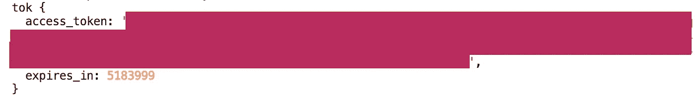

# 如何用 Next.js 实现 LinkedIn 签到

> 原文：<https://javascript.plainenglish.io/how-to-implement-linkedin-sign-in-with-next-js-3f00e7dee310?source=collection_archive---------2----------------------->

## LinkedIn API 如何工作，这样您就可以将 LinkedIn 登录添加到您的 Next.js 项目中！

最近，我为一个客户在一个网站上实现 LinkedIn OAuth。这很难。


Photo by [inlytics](https://unsplash.com/@inlytics?utm_source=unsplash&utm_medium=referral&utm_content=creditCopyText) on [Unsplash](https://unsplash.com/s/photos/linkedin?utm_source=unsplash&utm_medium=referral&utm_content=creditCopyText)

回想起来，我认为这很难，因为我的第一个错误是没有足够仔细地阅读 LinkedIn 文档。所以，不要和我犯同样的错误，这里是[这里是](https://docs.microsoft.com/fr-fr/linkedin/consumer/integrations/self-serve/sign-in-with-linkedin)。或者说吧，反正我会解释一切的！

# 1.创建 LinkedIn 应用程序

第一步是在 LinkedIn 上创建一个应用程序。这很简单。点击[此处](https://www.linkedin.com/developers/)，然后点击“我的应用”，然后点击“创建应用”。


创建应用程序后，您将能够在“我的应用程序”中看到您需要的所有信息，单击您的应用程序，然后进入“验证”选项卡:


# 2.创建新的 next 应用程序

对于本教程，我决定模拟我第一次登录 LinkedIn 的网站。因此，我将使用相同的技术，从头开始开发新的 next 应用程序。

```
npx create-next-app linkedin-sign-in
cd linkedin-sign-in
npm start # open http://localhost:3000
```

如果要跟着来，gitHub 回购这里是[这里是](https://github.com/marieqg/medium-linkedIn-sign-in)。

# 3.LinkedIn 登录后面

第一部分非常简单。现在，让我们首先从理解我们将要做的事情的概念开始:


## 3.1.创建您的前端

所以，第一步是最容易的。我们将创建一个带有按钮的前端。让我们从创建一个`component`文件夹开始，我们将在其中创建一个名为`LinkedInAuth.js`的文件，它看起来像这样:

正如你在按钮中看到的，我使用了一个 LinkedIn 登录按钮的链接，这个链接是在网上找到的，用于演示目的。强烈建议你用自己的:)

正如您在 localhost:3000 中看到的，它现在无法工作。这是因为我们没有创建按钮应该发送给你的`LINKEDIN_URL`变量。那么，让我们开始吧，让我们创建一个`helpers`文件夹，和一个文件`auth.js`文件夹。在这个文件夹中，我们将有一个函数，它将从不同的参数创建一个查询 URL。


这个 URL 的目的是调用 LinkedIn 登录页面来获得 LinkedIn 用户的许可。根据 [LinkedIn 文档](https://docs.microsoft.com/fr-fr/linkedin/shared/authentication/authorization-code-flow?context=linkedin/context)，将需要以下参数来处理请求。

其中一些参数非常机密，所以不要忘记将它们配置为环境变量，也不要放在 GitHub 上。

要将它们配置为环境变量，在项目的根目录下创建一个`.env`文件(即。和你的 a `package.json`和 a `next.config.js`一个级别。在您的`.env`文件中，添加我们在第一步中创建的 LinkedIn 应用程序中可以找到的以下变量:

.env

然后，做一个`npm install dot-env`，并在你的`next.config.js`中添加以下内容:

完成这些更改后，不要忘记重启开发服务器。这就是`auth.js`文件应该看起来的样子:

auth.js

现在，我们有了一个重定向到 LinkedIn 登录页面的按钮🎊🎉：


Our button with the LinkedIn Sign In page

如果你在路上的某个地方迷路了，我们就在这里。

## 3.2.调用 LinkedIn API 来获取登录页面

让我们继续前进！现在，我们的用户可以登录他的 LinkedIn 帐户。一旦他成功登录，LinkedIn 将向我们发送一个响应代码。因此，在这一步中，我们的工作是取回授权码，并将其交换为授权令牌。


LinkedInDoc

一旦用户成功登录 LinkedIn，LinkedIn 会将我们重定向到我们设置的页面。这个页面已经在我们的环境变量中设置为`LINKEDIN_REDIRECT`。不要忘记在你的 LinkedIn 应用程序中添加 URL，该 URL 位于授权 URL 要重定向的部分。

现在，让我们在文件夹`pages/api`中创建一个名为`oauth.js`的文件:

oauth.js

正如你所看到的，我们正在通过服务器的请求获取 LinkedIn 发送给我们的代码(即此处上下文)。有了这些代码，我们将使用之前创建的`getURLWithQueryOParams`函数来创建一个新的 URL 进行查询。如果响应是好的，我们有我们的令牌。

如果您尝试 console.log(tok ),您将从 LinkedIn 获得如下授权令牌:



console.log(tok)

如果你在路上的某个地方迷路了，我们就在这里。

## 3.3.获取 LinkedIn 答案并收集用户信息

现在我们有了令牌，我们离获取用户信息还有一步之遥。正如您在 LinkedIn 文档中看到的，您现在可以提出一个经过身份验证的请求:


Extract of the LinkedIn doc

因此，让我们在`oauth.js`文件中提出这个请求:

如果您使用 console.log(u ),您将得到以下响应:


console.log of u

如果你在路上的某个地方迷路了，我们就在这里。

请注意，如果您想获得您的用户电子邮件，这是另一个需要完成的请求。这里的文档是。

# 4.再直接的

如您所见，您正在设法获取数据。但是，您的前端页面保持不变。所以，现在是时候在用户登录后重定向他或她了。

我一开始稍微清理了一下我的代码，只是为了让服务器的请求和响应出现(即请求和结果)。现在，有了响应，我可以在找到我的用户后重定向到另一个页面:

如果你在路上的某个地方迷路了，我们就在这里。

有了 LinkedIn 用户登录后，还可以做更多的事情，但我在这里选择了一个快速取胜的方法，只是为了验证一下。回购在这里是[这里是](https://github.com/marieqg/medium-linkedIn-sign-in)，但是看看:


Final result

祝贺你完成了项目🎉🎊，并感谢阅读到最后！