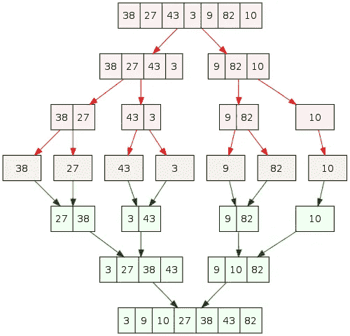

# 如何在 JavaScript 中实现合并排序

> 原文：<https://javascript.plainenglish.io/how-to-implement-merge-sort-in-javascript-764d640050b3?source=collection_archive---------9----------------------->

## 如何实现这个众所周知的算法

Photo by [Iker Urteaga](https://unsplash.com/@iurte?utm_source=medium&utm_medium=referral) on [Unsplash](https://unsplash.com?utm_source=medium&utm_medium=referral)

为了描述合并排序，让我们打个比方。

假设你有一块可以拆开的乐高积木。每个子块都有自己的数字，你不断打破，打破，直到有一个块彼此，有自己的数字。

下面的图表展示了它的外观:

要理解合并排序，您必须记住以下几点:

*   合并排序
*   合并

以下是要遵循的步骤:

*   **步骤 1:** 创建一个名为 mergeSort 的函数。
*   **第二步:**在 mergeSort 中，创建左右子数组，取元素的前半部分，复制到左子数组中。将元素的后一半复制到右边的子数组中。
*   **第三步:**用左子数组递归调用归并排序(函数本身)
*   **步骤 4:** 用右子数组递归调用归并排序(函数本身)
*   **第五步:**调用 merge with left subarray，right subarray，原数组本身，with size of left array，and the size of the right array。

在 Merge 函数中，您将比较左右子数组中的元素，I 和 j 分别作为跟踪每个数组中要比较的当前元素的索引。

`i`和`j`始于`0`。您还有另一个索引，`k`，它用于跟踪我们正在移入新元素的最新索引。如果是当前的`left_arr[i] < right_arr[j]`，移动`left_arr[i] to arr[k]`，增加 I 和`k`，否则移动`right_arr[j]`到`arr[k]`，增加 j 和 k

## 下面是合并排序的代码:

在这里，如果少于 2 个元素，我们甚至不需要排序。我们将一半的元素放入`left_arr`，另一半放入`right_arr`。然后我们调用`mergeSort`并进一步划分为每个子数组— `merge`是实际将事物分类在一起的部分。

## 下面是合并的代码:

如前所述，左和右索引允许我们跟踪当前元素来检查左和右子数组。我们比较这些值，并将较小的值移入原始数组。无论我们应该从哪个数组中移出较小的元素，我们都将索引 I 或 j 加 1，k 也加 1。

一旦全部完成，其中一个数组将留下要复制的元素。如果左边的子数组还有元素，我们将剩余的元素复制到原始数组中。否则，我们将右边子数组中的其余元素复制到原始数组中。

Photo by [Headway](https://unsplash.com/@headwayio?utm_source=medium&utm_medium=referral) on [Unsplash](https://unsplash.com?utm_source=medium&utm_medium=referral)

对于那些正忙于准备面试的人来说，你可能已经想到了这些问题:快速排序和合并排序在空间和复杂度方面有什么区别？

首先，quicksort 在最差性能上是 o(n)，在平均性能上是 o(n log n)。每次都有可能需要对每个元素进行透视和分区。它不需要额外的内存，所以在内存方面它是 o(1)。

关于快速排序的更多信息，你可以在这里阅读我的文章:

 [## 快速排序的解释

### 在本文中，我将讨论快速排序&您需要知道的所有组件。

medium.com](https://medium.com/weekly-webtips/explanation-of-quick-sort-8f7e12f57194) 

另一方面，合并排序将总是 o(n log n)，最差或平均性能。然而，合并排序总是需要分配左右子数组，所以在内存方面是 o(n)。

这就是合并排序的方式。现在轮到你练习这些算法，了解它们是如何工作的。