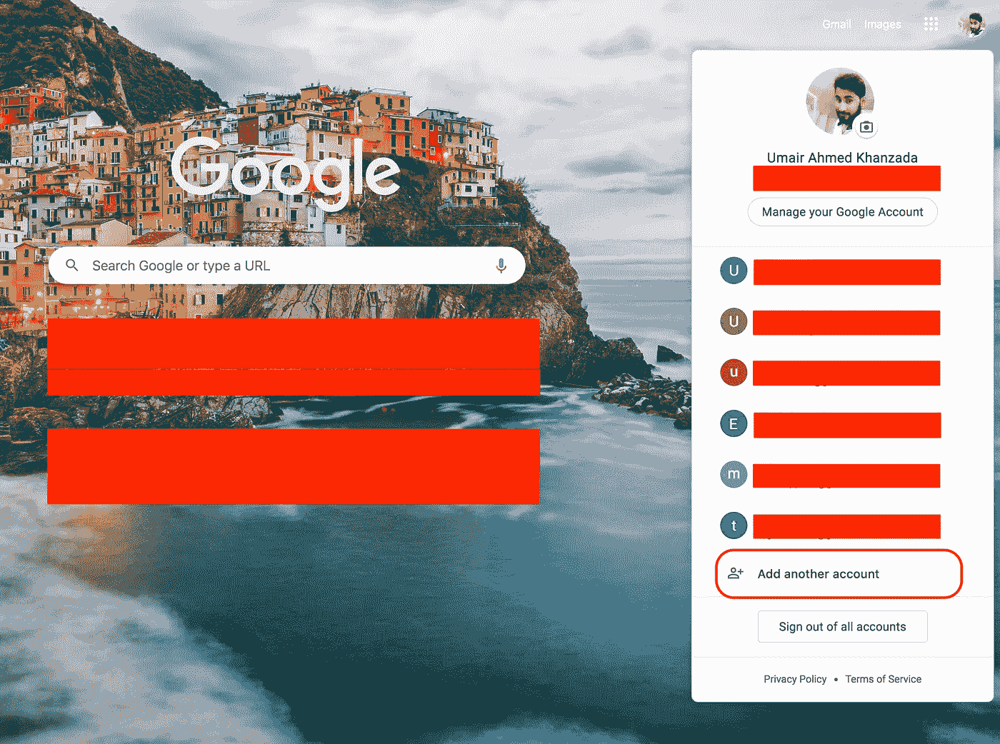
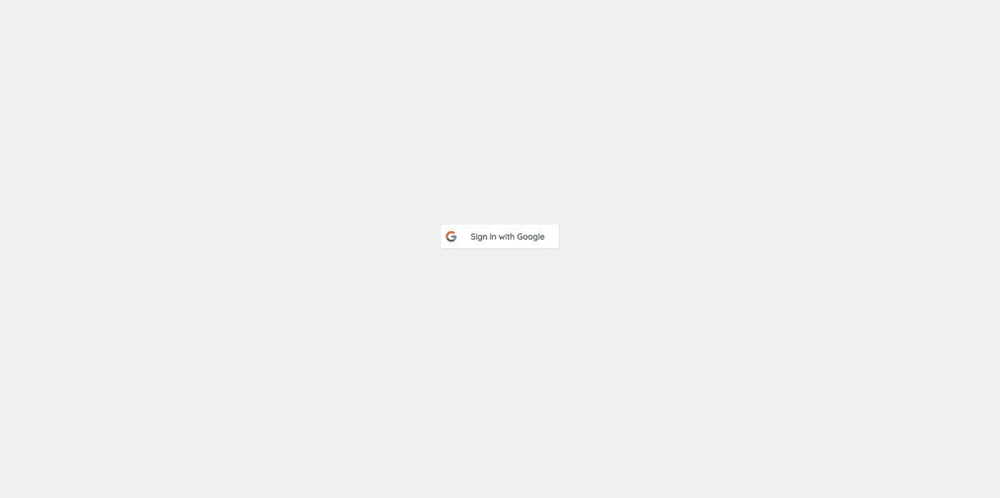

# 像谷歌的 Gmail 一样的多用户登录支持🎭

> 原文：<https://javascript.plainenglish.io/how-to-implement-multi-user-login-support-like-googles-gmail-f17f2f207c84?source=collection_archive---------5----------------------->


Photo by [Stephen Phillips - Hostreviews.co.uk](https://unsplash.com/@hostreviews?utm_source=medium&utm_medium=referral) on [Unsplash](https://unsplash.com?utm_source=medium&utm_medium=referral)

在这个故事中，我将分享我的经验**如何实现多用户登录/登录支持**，我还创建了一个演示，演示和源代码链接在故事的结尾提到。

我在做一个需要实现多用户登录支持的项目，最初，我很困惑，因为我不知道如何实现像“多用户登录”这样的功能。

在做了一些研究后，我发现 Gmail 具有我正在寻找的类似功能，然后我决定玩 Gmail，当我玩时，我注意到我的每个登录帐户的地址栏都发生了变化，每当我在帐户之间切换时，URL 中只有一个参数发生了变化，这很可能是一个索引，但不确定，因为我不是谷歌的开发人员😁

如果你想体验，请遵循以下说明。
你必须有多个 Gmail 账户，试着同时登录，你可以点击**添加另一个账户**按钮，我相信下面的附件能帮助你找到添加另一个账户的选项。



一旦你用多个帐户登录，试着在帐户之间切换，注意地址栏中的 URL，你的地址栏可能看起来像这样。

> https://mail.google.com/mail/u/0/#inbox
> https://mail.google.com/mail/u/1/#inbox
> https://mail.google.com/mail/u/2/#inbox
> https://mail.google.com/mail/u/3/#inbox

如果你和我一样注意到了，除了我称之为索引的值之外，所有的值都是相同的，为了进一步验证这一点，你可以手动将索引号从 0 更改为 1，然后点击 enter 或重新加载页面，肯定是加载了第二个帐户的数据的 Gmail。

进一步挖掘 Gmail，我发现它在 API 中添加了带有当前索引值的 **authuser** 参数，该值可能来自 URL，但同样不确定。

我不知道到底发生了什么，但至少我知道如何在我的应用程序中实现多用户登录支持。


Photo by [Mark Fletcher-Brown](https://unsplash.com/@boab?utm_source=medium&utm_medium=referral) on [Unsplash](https://unsplash.com?utm_source=medium&utm_medium=referral)

所以在我的例子中，我遵循传统的认证机制，即:使用用户凭证点击登录 API，返回一个 JWT 令牌，然后在每个请求的头中添加 JWT 令牌。

嗯，我的想法非常简单，只是将 JWT 令牌保存到一个数组中，并创建类似 Gmail 的路由，这样我就可以在整个应用程序中访问活动索引，使用这种技术，我可以很容易地确定我需要在请求的头中添加哪个 JWT 令牌，而且 backed 会根据从前端添加的令牌进行操作。

通过使用上述方法，我们的地址栏看起来类似于 Gmail，例如
。

> https://your-domain.com/0/dashboard
> https://your-domain.com/1/dashboard
> https://your-domain.com/2/dashboard
> https://your-domain.com/3/dashboard

所以，我终于找到了如何在前端管理多用户登录支持的方法，现在我对**该做什么，以及如何做……**有了更高层次的理解

让我们开始编码，⌨ ️and 举个例子。


我使用 React 和 Firebase 来构建这个例子，因为我擅长 React，而且使用 Firebase 进行认证非常简单，你可以使用任何你喜欢的技术栈。

## 路线

```
**// App.js****function** *App*() {
  **return** (
   <**Router**>
     <**Switch**>
       <**Route exact path="/"**>
         <**Login** />
       </**Route**>
       <**Route path="/:index/dashboard"**>
         <**Dashboard** />
       </**Route**>
     </**Switch**>
   </**Router**>
  );
}**export default** *App*;
```

## 注册

```
**function** Login() {
 **let** history = *useHistory*();

 **function** handleLogin() {
  **firebase**.*auth*().signInWithPopup(provider).then(**function**(result) {
   **const** {
    **credential**: { accessToken },
    **additionalUserInfo**: { isNewUser, profile },
    **user**: { phoneNumber }
   } = result;
   **const** id = profile.**id**;
   profile.**phone_number** = phoneNumber;
   **if**(isNewUser) *addUser*(profile);

   **const** tokens = *getFromStorage*(**'tokens'**) || [];
   **const** users = *getFromStorage*(**'users'**) || [];
   profile.**access_token** = accessToken;
   **const** index = users.findIndex(user => user.**id** === id);
   **if**(index === -1) {
    tokens.push(accessToken);
    users.push(profile);
    *setInStorage*(**'tokens'**, tokens);
    *setInStorage*(**'users'**, users);
    history.push(**`/**${tokens.**length** - 1}**/dashboard`**);
   } **else** {
    history.push(**`/**${index}**/dashboard`**);
   }
  }).catch(**function**(error) {
   ***console***.log(**'error'**, error);
  });
 }

 **return** (
  <**div className="login"**>
   <**button className="google-button" onClick=**{handleLogin}>
     <**span className="google-button__icon"**>
       Google login icon
     </**span**>
    <**span className="google-button__text"**>Sign in with Google</**span**>
   </**button**>

  </**div**>
 );
}

**export default** *memo*(Login);
```

## 仪表盘

```
**function** Dashboard() {
 **const** tokens = *getFromStorage*(**'tokens'**);
 **const** history = *useHistory*();
 **const** params = *useParams*();
 **const** users = *getAllUsers*();
 **const** currentUser = *getCurrentUser*(tokens[params.**index**]) || {};

 **function** signOut() {
  *setInStorage*(**'users'**, []);
  *setInStorage*(**'tokens'**, []);
  history.push(**'/'**);
 }
 **function** loggedInUsers() {
  **return** users.map((user, i) => {
   **const** isActive = params.**index** == i;
   **return** (
    <**li className=**{isActive ? **'active'** : **''**} **key=**{user.**id**}>
     <**Link to=**{**`/**${i}**/dashboard`**} **target=**{isActive ? **''** : **'_blank'**}>
      <**p**>{user.**name**}</**p**>
      <**small**>{user.**email**}</**small**>
     </**Link**>
    </**li**>
   )
  })
 }

 **return** (
  <**Fragment**>
   {!tokens.**length** && <**Redirect to="/"** />}
   {
    tokens.**length** &&
    !tokens[params.**index**] && <**Redirect to="/0/dashboard"** />
   }
   <**div className="account-list"**>
    <**ul**>
     {loggedInUsers()}
     <**Link className="add-account" to="/"**>Add another account</**Link**>
     <**button onClick=**{signOut}>Sign out of all accounts</**button**>
    </**ul**>
   </**div**>
   <**div className="account-details"**>
    <**div className="card"**>
     <**img className="avatar" src=**{currentUser.**picture**} **alt=""**/>
     <**h3**>{currentUser.**name**}</**h3**>
     <**p**>{currentUser.**email**}</**p**>
    </**div**>
   </**div**>
  </**Fragment**>
 );
}

**export default** *memo*(Dashboard);
```

还有很多其他文件，你可以在[回购](https://github.com/umair-khanzada/multi-user-login-app)中找到。

示例应用程序如下所示。



Login Screen


Dashboard Screen

恭喜你，我们成功了。

实现多用户登录支持是一个很好的体验，但我意识到没有从特定或单一帐户注销的选项，我期待着添加这样的功能。

## 结论

我们已经研究了 Gmail 的多用户登录流程，并提出了如何在我们的应用程序中实现它的想法，然后构建了一个也支持多用户登录的原型应用程序，我对原型应用程序使用了 React 和 Firebase，但策略非常简单，您可以用任何编程语言实现它。

## 链接

github:【https://github.com/umair-khanzada/multi-user-login-app
试玩 App:[https://multi-user-login.web.app/](https://multi-user-login.web.app/)


[Subscribe to Decoded, our official YouTube channel!](https://www.youtube.com/channel/UCtipWUghju290NWcn8jhyAw)