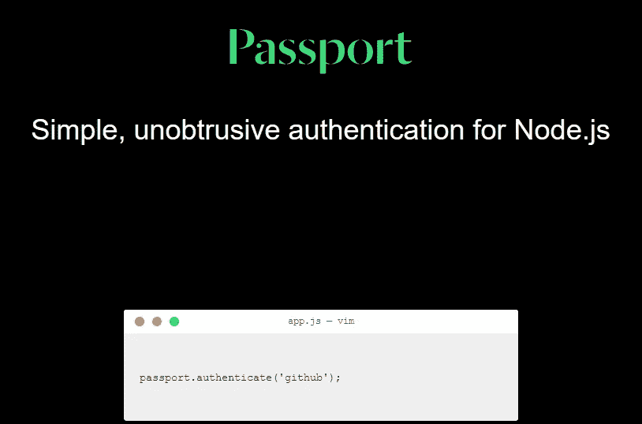

# 如何用 Passport 创建认证系统

> 原文：<https://javascript.plainenglish.io/how-to-implement-passport-js-local-authentication-7617a2ef93e8?source=collection_archive---------3----------------------->



这是一个分步指南，帮助您使用 passport.js 创建电子邮件/密码验证。

## **先决条件**

为了理解这篇文章，您需要对 Node.js、Express.js 和 MongoDB 有一个基本的了解。

## **passport . js 简介**

根据 passport 的网站，Passport 的定义如下:

*“Passport 是*[*node . js*](https://nodejs.org/)*的认证中间件。极其灵活和模块化，Passport 可以不引人注目地放入任何基于*[*Express*](https://expressjs.com/)*的 web 应用程序中。一套全面的策略支持使用一个* [*用户名和密码*](http://www.passportjs.org/docs/username-password/)*[*脸书*](http://www.passportjs.org/docs/facebook/)*[*Twitter*](http://www.passportjs.org/docs/twitter/)*，以及* [*更多*](http://www.passportjs.org/packages/) *进行身份验证。”***

**是的，passport 是一个中间件。从某种意义上说，它是灵活和模块化的，我们可以安装不同的策略来帮助我们完成不同的任务。策略是帮助我们使用用户名和密码或其他 OAuth 选项执行用户身份验证的工具。如果你不知道策略是做什么的，不要着急，过一会儿我们实施策略之后你就能明白它是做什么的了。**

**现在我们已经理解了 passport.js 的功能，让我们开始实现它。为此，让我们在主工作目录中打开终端，并编写以下命令:**

```
**npm init -y**
```

**这里的`-y`标志将每个值设置为默认值。**

**现在让我们安装一些我们需要的包。**

```
**npm i bcrypt connect-mongo express express-session express-validator mongoose passport passport-local**
```

**现在，让我们在主项目目录中创建一个名为 **index.js** 的文件，并编写以下代码行:**

**前几行是导入。从第 1 行到第 4 行，我们导入了`express`、`mongoose`、`express-session`和`connect-mongo`。这里，`express-session`的任务将是创建会话；`connect-mongo`的任务是帮助我们将会话存储在 mongoDB 数据库中。注意，在第 4 行`connect-mongo`接受`session`作为参数。**

**现在让我们看看第 6 行，我们从*导入了`MONGO_URI`和`SECRET`。/config* 。`MONGO_URI`是 MongoDB 数据库 URI，而`SECRET`是我们解析 cookies 时需要的秘密值。我们将在*上工作。/config* 很快。**

**然后我们分别在第 8 行和第 9 行导入了`passport`和`AuthRoute`。一会儿我们将讨论`passport`和`AuthRoute`。**

**在第 11 行，我们初始化了 express 应用程序。**

**然后，在第 13 行，我们在`app.use(express.json())`的帮助下使用了`express.json()`中间件。**

**然后，从第 14 行到第 24 行，我们编写了在我们的`app`中使用`session`中间件的代码。该会话接受采用多个选项的键值对。让我们讨论一下这些选择。在第 16 行，我们有一个`secret`选项。这是不言自明的，对不对？在第 17 行，我们有接受布尔值的`resave`选项。我们不想保存该会话。所以，我们把它设置为`false`。在第 18 行，我们有`saveUninitialized`选项，它也接受布尔值。我们不想保存未初始化的会话。所以，我们将其设置为`false`。然后，在第 19 行，我们有了`cookie`选项，它接受了`secure`选项。`secure`选项接受布尔值。在我们的例子中，我们将`secure`设置为`false`。因为我们将在`localhost`上工作，所以`secure`选项被设置为`false`，如果我们将`secure`选项设置为`true`，我们需要有[*https://*](https://.)*。*记住，当我们在产品中发布我们的应用程序时，我们需要将`secure`设置为`true`。现在，让我们看看第 20 行。这里，我们有一个名为`store`的选项。`store`接收关于数据库的信息，或者仅仅是存储会话的内存地址。在我们的例子中，我们将会话存储在 MongoDB 中。为此，我们使用了`MongoStore`。我们用一个名为`mongooseConnection`的选项创建了一个新的`MongoStore`实例。`mongooseConnection`收进`mongoose.connection`。**

**在第 26 行，我们使用`passport.initialize()`初始化了在第 8 行导入的`passport`。然后，在第 27 行，我们编写了代码，告诉 passport 它必须使用 session 进行身份验证过程。**

**在第 29 行，我们在`AuthRoute`的帮助下创建了一个端点 */api/auth* 。**

**在第 31 行，我们编写了存储端口值的代码，我们的服务器将在该端口中运行。我们检查端口是否存在于环境变量中。如果存在，我们存储环境变量的值，否则我们使用默认值 5000。**

**从第 33 行到第 36 行，我们编写了连接 MongoDB 数据库的代码。很简单吧？**

**然后，在第 38 行，我们编写了在给定的`PORT`启动服务器的代码。**

**既然我们已经理解了在 **index.js** 文件中发生了什么，现在让我们开始处理*。/config。*让我们在主项目目录中创建一个名为 *config* 的目录。之后，让我们在 *config* 目录下创建三个名为 **index.js** 、 **prod.js** 和 **dev.js** 的文件。**

**现在，让我们打开 *config* 目录下的文件 **index.js** ，并编写以下代码行:**

```
**if (process.env.NODE_ENV === "production") { module.exports = require("./prod");} else { module.exports = require("./dev");}** 
```

**上面的代码或者从 **prod.js** 或者 **dev.js** 文件中导出模块。如果`process.env.NODE_ENV`等于`"production"`，我们将从 **prod.js** 中导出模块，否则我们将从 **dev.js** 中导出模块。**

**现在让我们打开 **dev.js** 文件，并编写以下代码行:**

```
**module.exports = {MONGO_URI:    ,// add mongoDB URI hereSECRET:      ,// add Secret here};**
```

**在这个文件中，我们导出了`MONGO_URI`和`SECRET`。我们需要输入它们各自的值，如上面的评论中所提到的。`MONGO_URI`接收 mongoDB 数据库 URL，而`SECRET`接收一些秘密值。我们可以在`SECRET`中输入任何随机的字符串。记住，只有当`NODE_ENV`不是`"production"`时，这个文件才会被导出。**

**既然我们已经处理了 **dev.js** 文件，现在让我们处理 **prod.js** 文件。让我们在 **prod.js** 文件中编写下面几行代码:**

```
**module.exports = {MONGO_URI: process.env.MONGO_URI,SECRET: process.env.SECRET,};**
```

**在 **prod.js** 文件内部，我们已经编写了代码来导出`MONGO_URI`和`SECRET`。`MONGO_URI`从我们的环境变量中获取`process.env.MONGO_URI`作为值。类似地，`SECRET`接受`process.env.SECRET`作为值。记住，只有当`NODE_ENV`为`"production"`时，这些模块才会被导出。所以，在本文中，我们不会花时间在创建环境变量上，好吗？**

**让我们现在开始研究我们的路线。为此，让我们在主项目目录 ***中创建一个名为 *routes* 的目录。*** 然后，在 *routes* 目录下创建一个名为 **Auth.js** 的文件。现在让我们在文件 **Auth.js** 中编写以下代码行:**

*前几行只是导入。在第 1 行，我们导入了`express`。在第 2 行，我们导入了`passport`。在第 3 行，我们从`express-validator`导入了`check`和`validationResult` 。在第 5 行，我们导入了我们的控制器，即`login`、`logout`、`me`和`signup`。*

*在第 7 行，我们在`express.Router()`的帮助下创建了`router`。*

*从第 10 行到第 50 行，我们已经为我们的`*api/auth/signup*` 路线编写了代码。从第 12 行到第 37 行，我们已经编写了使用`express-validator`验证数据的代码。如果你不知道`express-validator`的基本知识，你可能想看看我写的这篇文章。*

*[](https://medium.com/javascript-in-plain-english/getting-started-with-express-validator-fae0bbeeb0f9) [## 快速验证器入门

medium.com](https://medium.com/javascript-in-plain-english/getting-started-with-express-validator-fae0bbeeb0f9) 

让我们快速浏览一下第 12 行到第 37 行。从第 13 行到第 16 行，我们编写了代码来指定`name`字段的最小长度应该是 3。如果最小长度不是 3，我们生成一个带有`.withMessage`的验证错误消息。从第 18 行到第 21 行，我们编写了代码来检查`email`字段是否有实际的电子邮件地址。类似地，从第 23 行到第 29 行，我们编写了验证密码字段的代码。

我们指定密码的最小长度为 8，最大长度为 15。我们还指定密码字段应该至少有一个数字和一个特殊字符。从第 31 行到第 36 行，我们编写了代码来检查`confirmPassword`和`password`字段是否有相同的值。在第 39 行，我们提取并格式化了错误。然后我们检查错误是否存在。如果错误存在，我们向用户发送一组错误消息，在第 44 行显示状态代码 422。如果错误不存在，我们在第 46 行运行`next()`。

然后在第 49 行，我们指定`*/api/auth/signup*` 路线的控制器应该是`signup` *。*

从第 53 行到第 59 行，我们为`/*api/auth/login*` 端点*创建了一条路线。我们已经使用了`passport.authenticate`作为这个端点的中间件。`authenticate`接受两个参数。第一个参数接受策略名。在我们的例子中是`local`。第二个参数接受一个对象。我们可以看到，我们在第二个论点中使用了一个名为`failureMessage`的选项。这个选项的目的是不言自明的，对吗？在第 58 行，我们指定了`/*api/auth/login*`的控制器是`login`。*

然后，在第 62 行，我们为`/api/auth/logout`创建了一个端点。我们还指定该路线应该使用`logout`作为控制器。

然后在第 65 行，我们为`/api/auth/me`路线创建了一个端点。我们也指定了，这条路线应该有`me`作为控制器。`me`控制器的目的是获取登录用户的信息。

让我们现在研究模型。为此，让我们在主项目目录中创建一个名为 *models* 的目录。现在让我们在 *models* 目录下创建一个名为 **User.js** 的文件。现在，让我们在文件中编写以下代码行:

在第 1 行，我们导入了`mongoose`。然后，在第 2 行，我们导入了`bcrypt`。然后我们从第 12 行到第 25 行创建了一个`UserSchema`。用户模式有`name`、`email`、`password`字段。这些字段都是`String`。

然后，在第 12 行，我们使用了`pre("save",...)`方法。在第 13 行，我们将`this`存储在`user`常量中。之后，在第 16 行，我们检查了`user`的`password`字段是否被修改。如果`password`字段没有被修改，我们使用`next()`否则，我们继续散列`password`。我们已经编写了代码来散列密码，并将其存储在第 18 行的变量`hash`中。这里，我们使用了`bcrypt.hash`来散列密码。`bcrypt.hash`接受纯文本密码作为第一个参数，散列轮作为第二个参数。我们已经指定 13 为散列回合。然后，我们将散列保存在第 19 行的`user.password`中。之后，我们在第 20 行使用了`next()`。如果在散列密码时出现任何错误，我们已经编写了代码在第 22 行记录该错误。然后，我们在第 23 行使用`next(error)`。

现在，在第 27 行，我们使用`UserSchema.methods.comparePassword`创建了`comparePassword`方法。这种方法将帮助我们比较哈希密码和纯文本密码。在第 29 行，我们编写了代码来比较纯文本密码(`password`)和散列密码(`this.password`)，并将其存储在`result`变量中。如果密码匹配，则`result`为真。然后我们在第 31 行返回`result`。如果在执行这个方法时出现任何错误，我们在第 33 行记录这个错误。然后，我们在第 34 行返回`false`。我们将在开发 passport 中间件时使用这种方法。

在第 38 行，我们导出了用户模型。

现在让我们来研究我们的控制器。为此，让我们在主项目目录中创建一个名为*控制器*的目录。之后，让我们在*控制器*目录中创建一个名为 **AuthController.js** 的文件。

在第 1 行，我们已经导入了`User`模型。

在第 3 行，您可以看到我们有一个名为`login`的函数。在第 4 行，我们编写了代码，向用户发送用户已经成功登录的消息和状态代码 200。记住，登录过程是由`passort.authenticate`中间件执行的，这个控制器只有在认证成功时才会被调用。

我们来看看第 7 行到第 24 行的`signup`函数。在第 8 行，我们存储了来自`req.body`的`email`、`name`、`password`的值。在第 10 行，我们编写了用`email`查询`User`模型的代码。如果已经存在具有相同`email`的用户，我们向该用户发送一条错误消息，表明该用户已经存在(从第 16 行到第 18 行)。如果提供的用户`email`不存在，我们已经编写了代码在第 12 行创建一个新用户。之后，我们在第 13 行使用`user.save()`保存用户数据。然后，我们编写代码在第 14 行向用户发送成功消息。如果在此过程中出现任何错误，我们将向用户发送状态代码 500 和错误消息(在第 22 行)。

现在让我们看看第 26 行。在那里，我们有一个函数叫做`logout`。记住，当用户请求路由`/api/auth/logout`时，它会被调用。在第 27 行，我们使用`req.logout()`将用户注销。注销用户后，我们已经编写了代码，在第 28 行向用户发送成功消息。

现在让我们看看第 31 行的`me`函数。这里，我们检查用户是否在`req.user`的帮助下登录。如果`req.user`不存在，我们已经编写了代码，在第 32 行和第 33 行向用户发送错误消息和状态 403。如果`req.user`存在，我们发送用户信息(在第 35 行)。

从 38 线到 43 线，我们已经出口了`login`、`signup`、`logout`和`me`。

现在让我们来研究一下 passport 中间件。为此，让我们在主项目目录*中创建一个名为 *services* 的目录。*然后，在*服务*目录中创建一个名为 **passport.js** 的文件，并编写以下代码行:

这里，前几行只是导入。在第 1 行，我们导入了`passport`。在第 2 行，我们导入了`LocalStrategy`。在第 5 行，我们导入了`User`模型。

在第 7 行，我们使用了`passport.serializeUser`。`serializeUser`的功能是告诉 passport 用户的哪些数据应该存储在会话中。该指定数据稍后将被`deserializeUser`用于获取用户信息。在第 8 行，我们使用`done(null, user._id)`指定了应该在会话中存储什么值。使用这个命令，我们告诉 passport 会话应该存储用户的 id。

现在让我们看看第 11 行的`deserializeUser`。`deserializeUser`的功能是从会话中存储的给定用户的信息中接收关于该用户的信息。让我们仔细看看。这里，`deserializUser`为我们提供了`id`和`done`。在第 13 行，我们通过`id`查询了用户模型，并将其存储在`user`变量中。如果`user`不存在，我们在第 15 行抛出新的错误。如果用户存在，我们在第 17 行运行`done(null,user)`。

从第 22 行到第 41 行，我们设置了本地策略。让我们仔细看看。通过代码，我们告诉`passport`通过创建`LocalStrategy`的新实例来使用本地策略。在第 26 行，我们有一个名为`usernameField`的字段，它接受`"email"`作为值。这用来定义用户名字段应该是`"email"`。默认情况下，其值为`"username"`。

让我们看看第 27 行的函数。它有`email`、`password`、`done`作为自变量。在第 29 行，我们通过`email`查询了`User`模型，并将其存储在`user`变量中。如果用户不存在，我们在第 31 行运行`done(null, false)`。之后，在第 33 行，我们在`comparePassword`方法的帮助下比较了`password`，这个方法是我们在`User`模型中创建的，并存储在`passwordMatch`常量中。如果`passwordMatch`是`false`，我们在第 35 行运行`done(null, false)`。如果密码匹配，我们在第 37 行运行`done(null,user)`。通过使用`done(null,user)`,我们告诉 passport 为这个特定用户创建一个会话。如果在过程中出现任何错误，我们运行第 39 行的`done(err)`。然后我们在第 45 行输出护照。

如果你还在纠结`serializeUser`或`deserializeUser`的问题，你可以在[堆栈溢出](https://stackoverflow.com/questions/27637609/understanding-passport-serialize-deserialize)上看到这个答案，它可能会给你一个更清晰的画面。

这意味着我们现在可以验证我们的用户。*