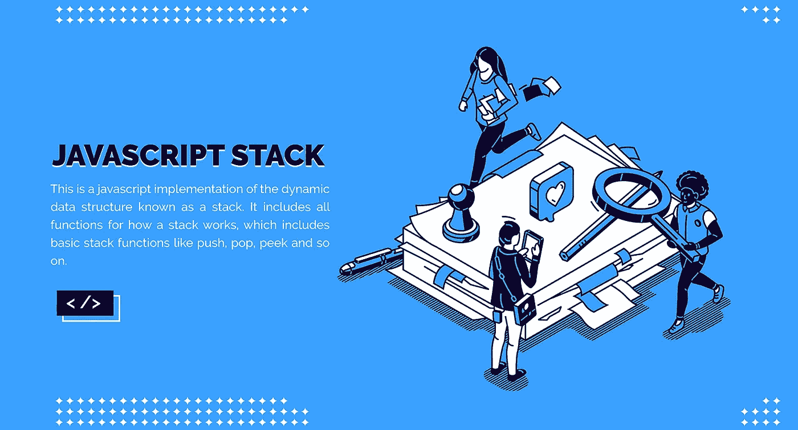

# 如何用 JavaScript 实现 Java Stack 类

> 原文：<https://javascript.plainenglish.io/how-to-implement-the-java-stack-class-in-javascript-e451bae008f8?source=collection_archive---------18----------------------->

*将 Java 集合框架栈数据结构实现为 JavaScript 的 npm 包。*

原生 JavaScript 没有提供实现堆栈的函数，它基于后进先出的原则。这个包提供了比基本堆栈操作更多的功能，如 push 和 pop，它提供了更多的操作，如 peek()、showStack()、isEmpty()、size()、maximumElement()和 minimumElement()。



This cover has been designed using resources from [Freepik.com](https://www.freepik.com/)

**使用软件包
创建堆栈**使用下面的命令将 npm 软件包安装到您的项目中

```
npm i javascript-stack
```

**示例用法**

```
const Stack **=** require("javascript-stack");const newStack **=** **new** Stack();
newStack.push(100); 
console.log("The top value of the stack is: ",newStack.peek());
newStack.push(200);
newStack.push(300);
newStack.pop();
console.log("The size of the stack is: ",newStack.size());
newStack.minimumElement();
console.log("Minimumelement of the stack is: ",newStack.size());
```

**上面代码的输出是**

```
The top value of the stack is: 100
The size of the stack is: 2
Minimumelement of the stack is: 100
```

**包中使用的各种操作**

1.  **将元素添加到堆栈:**可以使用名为 push()的操作将元素添加到已创建的堆栈中，这将向堆栈中添加元素。
2.  **移除堆栈元素:**可以使用一个名为 pop()的操作从堆栈中移除一个元素，这将从堆栈中移除最后输入的元素。
3.  **获取栈顶元素:**要从栈中获取栈顶元素，我们可以使用 peek()从创建的栈中返回栈顶元素。
4.  **打印堆栈中的所有值:**要打印堆栈包中的所有值，提供一个名为 showStack()的操作，该操作将返回一个包含该堆栈中所有值的字符串。
5.  **检查堆栈是否为空:**为了知道堆栈是否为空，package 提供了一个名为 is empty()的函数，它将返回一个布尔值。如果堆栈为空，则返回 false，否则返回 true。
6.  **最大值和最小值元素:**如果堆栈增加了一个整数值，我们可以得到最大值和最小值，为此，这个包提供了 maximumElement()和 Minimum element()函数。
7.  **确定堆栈的大小:**通过方法 size()返回堆栈的当前大小。
8.  **移除所有元素:**clear()方法用于从堆栈中移除所有添加的值。
9.  **将堆栈转换成数组:**这个包提供了将堆栈转换成数组的方法，用来做这个操作的方法是 toArray()。
10.  **反转堆栈:**我们可以通过 reverseStack()方法反转堆栈，这将在相反的方向反转初始化的堆栈值。
11.  **搜索值:**堆栈中的搜索操作可以通过方法 Search()来完成，如果堆栈中存在给定的值，该方法将返回 true，否则将返回 false 值。

**栈在软件开发中的实际应用**

*   **撤销操作:**在我们日常使用的文件编辑器中，我们多次使用撤销操作，这个撤销操作可以在软件开发过程中使用堆栈来完成。
*   **平衡括号:**在一些代码编辑器中，开始括号的末尾会有一个高亮符号，这可以通过软件开发中的 stack 来完成。
*   **认回文**
*   **用于回溯**
*   **支持多种方式的递归运算**

更多关于软件包和源代码的信息可在 [npm 页面](https://www.npmjs.com/package/javascript-stack)上找到。