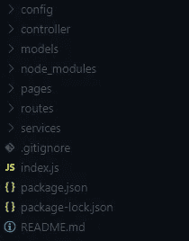
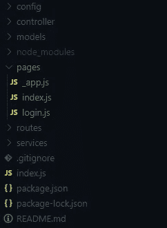
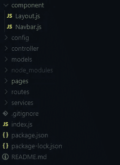
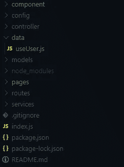
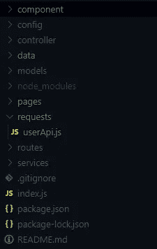
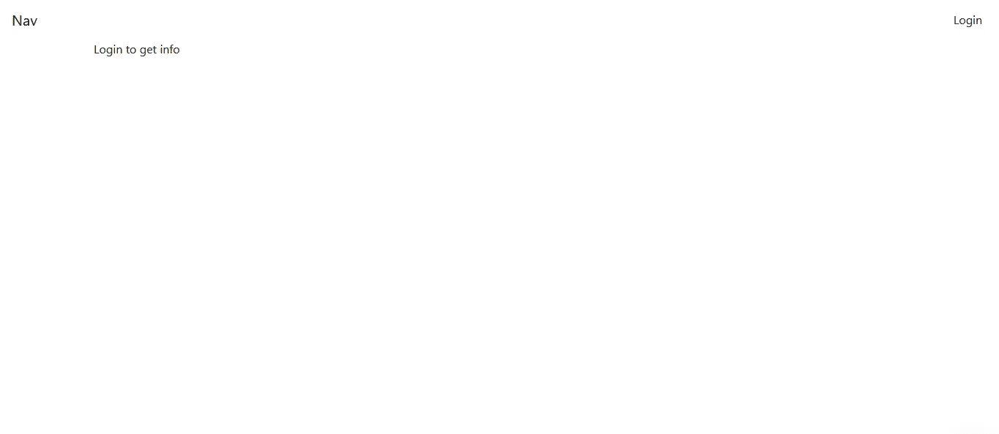
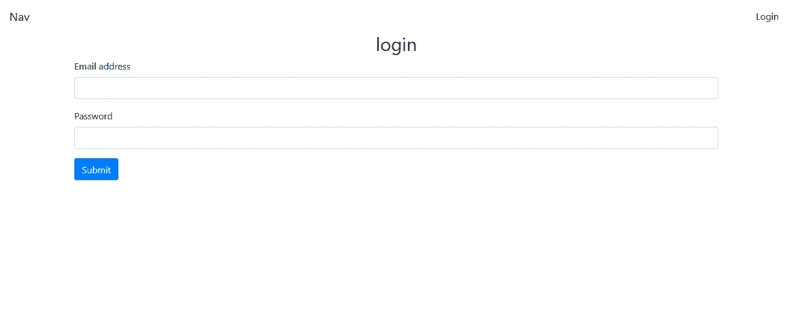
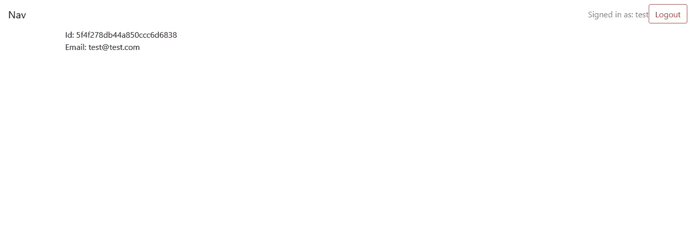

# 如何在 Next.js 中实现用户认证

> 原文：<https://javascript.plainenglish.io/how-to-implement-user-authentication-in-next-js-2929ea94493a?source=collection_archive---------0----------------------->


## 这是在 Next.js 中实现用户认证的逐步指南

为了实现这一点，我们将使用一个名为 SWR 的数据获取工具。如果你不知道如何使用 SWR，你可能想先看看这篇文章。

[](https://medium.com/javascript-in-plain-english/getting-started-with-data-fetching-in-react-with-swr-bfb37ec0c65d) [## 与 SWR 互动中的数据获取入门

medium.com](https://medium.com/javascript-in-plain-english/getting-started-with-data-fetching-in-react-with-swr-bfb37ec0c65d) 

在这里，我们不会花时间为我们的应用程序创建后端。我已经写了后端代码，我们将使用它，好吗？

因此，让我们启动我们的终端并编写以下命令:

```
git clone [https://github.com/aa1aac/next-auth.git](https://github.com/aa1aac/next-auth.git) 
```

这将克隆 git repo，我在其中发布了用于我们的身份验证的后端代码。克隆了 repo 之后，让我们安装我们需要的包。为此，编写以下命令:

```
 npm install 
```

现在我们已经安装了这些包，让我们来讨论这些包的用例。我们不会讨论后端使用的包。使用上面的安装命令，我们已经为我们的前端安装了 Axios、bootstrap、SWR、react-bootstrap、react、next、react-dom。我们将使用 bootstrap 和 react-bootstrap 来设计我们的应用程序。我们安装了 Axios 用于向后端发出请求，安装了 SWR 用于缓存数据。

我们的后端为我们提供了以下路线:

*   */API/auth/登录*
*   */API/auth/注册*
*   */api/auth/me*
*   */API/auth/注销*

我认为，这些路线的目的是自我描述的。

接下来，让我们在主项目目录中创建一个名为 *pages* 的目录。这应该使我们的文件夹结构看起来像这样:



现在让我们在*页面*目录中创建名为 **_app.js** 、 **index.js** 、 **login.js** 的文件。这应该使我们的文件夹结构看起来像这样:



让我们现在开始工作在*页*目录。在此之前，我们需要向我们的 *config* 目录添加一些东西。让我们在 *config* 目录下创建一个名为 **dev.js** 的文件，并在文件中写入以下代码行:

```
module.exports = {
    MONGO_URI: "",      // MongoDB's URI goes here
    SECRET: "",         // SECRET key goes here
};
```

正如上面评论中提到的，你需要写`MONGO_URI`和`SECRET`。`MONGO_URI`必须包含 MongoDB 数据库的 URL，而`SECRET`应该包含一个秘密字符串。秘密字符串可以是任何随机字符串。

现在，让我们在*页面*目录中打开文件 **_app.js** ，并添加以下代码行:

```
import "bootstrap/dist/css/bootstrap.min.css"; export default function App({ Component, pageProps }) { return <Component {...pageProps} />;}
```

您可以看到，我们已经在第一行导入了引导程序的 CSS 文件。然后，我们导出了`App`函数。

到目前为止，我们已经处理了 **_app.js** 文件，现在让我们处理文件 **index.js** 。让我们打开文件并编写以下代码行:

让我们仔细看看上面的代码。前几行是导入。在第 1 行，我们导入了`Layout`；在第 3 行，我们导入了`useUser`。

在第 5 行，我们定义了一个箭头函数`IndexPage`，并在第 28 行将其导出。

在第 6 行，我们使用了`useUser()`——一会儿我们将讨论`useUser()`。现在，请记住，`useUser()`函数为我们提供了`user`、`loading`、`loggedIn`、`mutate`。注意，在我们的例子中，我们使用了对象析构来从`useUser()`接收`user`、`loading`和`loggedIn`。`loading`提供一个布尔值，表示数据是否正在加载。`loggedIn`提供布尔值，表示用户是否登录。`user`包含关于用户的信息，如果存在的话。`mutate`是一个帮助重新运行请求的函数，这样缓存的信息就会发生变化。换句话说，`mutate`重新验证数据。

从第 21 行到第 25 行，我们返回了将它包装在`Layout`中的`DisplayInfo`组件。注意，我们已经将`title`道具传递给了`Layout`组件。这个`title`道具设置页面的标题；在我们的例子中，我们将它设置为“index”。

现在让我们看看第 8 行的组件`DisplayInfo`。在第 9 行，我们检查数据是否正在加载。如果数据正在加载，我们向用户呈现“正在加载…”。然后，在第 10 行，我们检查用户是否登录并且`user._id`是否存在。如果两者都存在，我们从第 12 行到第 16 行呈现用户的 id 和电子邮件地址。

在第 19 行，我们返回了一条消息，用户应该登录来获取信息。记住，这个 get 只有在用户没有登录的时候才会被渲染。

现在让我们来处理 **login.js** 文件。打开文件并编写以下代码行:

**login.js** 文件的前几行是导入。在第 1 行，我们从`’react’`导入了`useState`和`useEffect`。第 2 行，导入`Router`；在第 4 行，我们导入了`Layout`组件。在第 6 行，我们导入了`login`函数，它将帮助我们发出登录请求。在第 7 行，我们导入了`useUser`函数。

在第 9 行，我们创建了一个名为`Login`的箭头函数。我们已经在第 66 行导出了这个函数。在函数内部，我们在`useState()`的帮助下初始化了`email`和`password`状态，并将它们的默认值设置为一个空字符串(第 10 行和第 11 行)。

在第 13 行，我们使用 object destructure 从`useUser()`接收`mutate`和`loggedIn`。

从第 15 行到第 17 行，我们使用了`useEffect`。我们检查了用户是否在`useEffect`中登录。如果用户登录，我们将用户重定向到索引页面，在第 16 行。

在第 19 行，我们再次检查用户是否登录。如果用户登录，我们将重定向消息返回给用户。这样，我们可以防止登录用户访问登录页面。

从第 29 行到第 63 行，我们呈现了一个登录表单。我们将表单包装在`Layout`组件中。在`Layout`标题属性的帮助下，我们将页面的标题设置为“登录”。从第 34 行到第 60 行，我们看到了登录表单。我们已经从第 35 行到第 45 行为`email`字段设置了输入和标签。从第 46 行到第 55 行，我们已经为`email`设置了输入和标签。

然后，从第 57 行到第 59 行，我们创建了提交按钮。注意，我们已经在第 34 行为表单设置了`onSubmit`事件处理程序。当用户点击提交按钮时，函数`onLoginSubmit`被调用。

我们来看看函数`onLoginSubmit`(从第 21 行到第 27 行)。这个函数接受`e`(事件)作为第一个参数。我们已经运行了代码来阻止默认事件在第 22 行执行。然后，我们在第 23 行检查`email`和`password`是否存在。如果`email`和`password`存在，我们运行第 24 行的`login`函数。登录函数向后端发出请求，让用户登录。然后，在第 25 行，我们运行`mutate()`。这个`mutate`重新验证用户数据。

到目前为止，我们已经处理了我们的*页面*，现在让我们处理组件。为此，让我们在主项目目录中创建一个名为*组件*的目录。在目录内部，创建名为 **Layout.js** 和 **Navbar.js** 的文件。这应该使我们的文件夹结构看起来像这样:



现在让我们打开文件 **Layout.js** 并编写以下代码行:

前几行是文件中的导入内容。第 1 行，我们导入了`Head`；在第 3 行，我们导入了`Nav`。

在第 5 行，我们创建了一个名为`Layout`的箭头函数。然后，我们使用对象析构来接收`title`和`children`道具。

在第 9 行，我们在`Head`中使用`title`属性定义了页面的标题。

然后在第 14 行，我们使用`children`道具渲染子组件。

现在我们已经处理了我们的 **Layout.js** 文件，让我们现在处理 **Navbar.js** 文件。打开文件并编写以下代码行:

让我们仔细看看这个文件。在第 1 行，我们导入了`Link`；在第 2 行，我们从`’react-bootstrap’`导入了`Navbar`。在第 4 行，我们导入了`useUser`。然后在第 5 行，我们导入了`logout`。

在第 7 行，我们创建了一个名为`Nav`的箭头函数，并在第 53 行将其导出。

在第 8 行，我们收到了来自`useUser()`的`loading`、`loggedIn`、`user`和`mutate`。

从第 39 行到第 50 行，我们呈现了导航栏。从第 41 行到第 43 行，我们提供了“navbar-brand”的链接。然后，在第 47 行，我们渲染了`LoginOrInfo`组件。根据登录状态,`LoginOrInfo`组件将显示一个登录按钮或一个带有用户信息的注销按钮。

让我们仔细看看第 10 行的`LoginOrInfo`组件。在第 11 行，我们检查数据是否被加载。如果数据正在加载，我们返回 null。如果用户登录，我们在第 15 行返回用户名。然后，我们从第 16 行到第 25 行呈现一个注销按钮。我们在注销按钮的第 18 行添加了`onClick`事件监听器。当用户点击按钮时，我们运行`logout`功能，在第 19 行。这个`logout`函数向后端发送请求，让用户注销。然后，我们在第 20 行运行`mutate()`来改变用户的数据。如果用户没有登录，我们会呈现一个登录链接，从第 29 行到第 37 行。该登录链接仅在用户未登录时呈现。

至此，我们已经完成了`Navb`的工作。让我们开始研究`useUser`函数。为此，让我们在主项目目录中创建一个名为 *data* 的目录。在*数据*目录中，创建一个名为 **useUser.js** 的文件。这应该使我们的文件夹结构看起来像这样:



之后，让我们在 **useUser.js** 文件中编写以下代码行:

在第 1 行，我们导入了`useSWR`。然后，在第 3 行，我们导入了`getUser`函数。

在第 5 行，我们创建了`useUser`函数并将其导出。在第 6 行，我们使用了`useSWR`。`useSWR`接受两个参数。第一个参数应该是唯一的，因为 SWR 使用它作为特定数据的标识符。记住第一个参数不一定是 URL。因此，在我们的例子中，我们提供第一个参数为`”api_user”`。然后，我们提供 fetcher 函数作为第二个参数。在我们的例子中，获取函数是`getUser`。

我们使用对象析构在第 6 行从`useSWR`接收`data`、`mutate`和`error`。`data`包含从请求中收到的数据。`error`包含发出请求时收到的任何错误。我们有另一个函数叫做`mutate`。如您所知，这个`mutate`函数帮助我们重新验证数据。

在第 8 行，我们创建了一个布尔值`loading`。在第 9 行，我们为`loggedIn`创建了一个布尔值。最后，我们从第 11 行到第 16 行返回了`loading`、`loggedIn`、`mutate`和`user`。

既然我们已经处理了我们的 **useUser.js** 文件，现在让我们在我们的主项目目录中创建一个名为 *requests* 的目录。之后，让我们在*请求*目录中创建一个名为 **userApi.js** 的文件。这应该使我们的文件夹结构看起来像这样:



现在让我们打开文件 **userApi.js** 并编写以下代码行:

在第 1 行，我们导入了 axios。

在第 3 行，我们创建了一个名为`login`的箭头函数并将其导出。`login`函数接受一个带有`email`和`password`的对象。在第 5 行，我们向路由 */api/auth/login* 发出 post 请求，字段为`email`和`password`。在第 9 行，我们记录了数据。如果在这个过程中发生了任何错误，我们记录这个错误(在第 11 行)。

在第 15 行，我们创建并导出了一个名为`getUser`的箭头函数。这个函数的目的是获取用户信息。在第 17 行，我们向路由 */api/auth/me* 发出了一个 get 请求。如果用户已登录，此路由将提供用户的数据。然后，在第 19 行，我们从`res.data.user`返回用户的数据。如果在这个过程中出现任何错误，我们在第 21 行记录`error`。然后，我们在第 22 行抛出`error`。注意，我们没有在其他请求函数中返回任何数据，但是我们为`getUser`函数返回了数据。这是因为我们使用了`getUser`函数作为 **useUser.js** 文件中 SWR 的提取函数。`getUser`返回的数据被 SWR 缓存。我们应用程序中的许多组件都可以使用这些缓存数据。

在第 26 行，我们已经创建并导出了`logout`函数。该功能的目的是注销用户。在第 28 行，我们向路由 *api/auth/logout* 发出 get 请求。这将注销用户。如果过程中出现任何错误，我们在第 30 行记录`error`。

至此，我们已经完成了认证工作。现在让我们来试试这个。在试用这个应用程序之前，让我们先快速挑选一下我们的用户。我们本来可以花时间来创建注册页面，但是这篇博文变得很长。要注册我们的用户，打开 Postman 并向端点*localhost:5000/API/auth/sign up*发出 POST 请求。在提出请求时，我们应该提供以下字段:`name`、`email`、`password`、`confirmPassword`。你需要记住的是，`name`字段的最小长度应该是 3。`password`字段的最小长度应为 8，最大长度应为 15。`password`字段还应包括至少一个数字和一个特殊字符。

注册成功后，您可以试用该应用程序。

当用户没有登录时，我们的索引页面应该是这样的:



我们的登录页面应该如下所示:



当用户登录时，我们的索引页面应该如下所示:



如果您想看看最终的代码，您可以将 git 的分支改为 final-project。为此，您可以在终端中使用以下命令:

```
git checkout final-project
```

## 简单英语的 JavaScript

你知道我们有三份出版物和一个 YouTube 频道吗？在 [**寻找一切的链接 plainenglish.io**](https://plainenglish.io/) ！