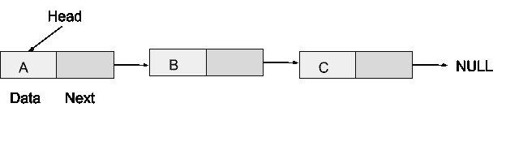
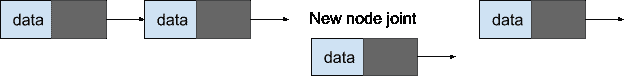

# 如何在 JavaScript 中实现第一个链表数据结构

> 原文：<https://javascript.plainenglish.io/how-to-implement-your-first-linked-list-data-structure-in-javascript-433652a55445?source=collection_archive---------10----------------------->


Photo by [Kelly Sikkema](https://unsplash.com/@kellysikkema?utm_source=medium&utm_medium=referral) on [Unsplash](https://unsplash.com?utm_source=medium&utm_medium=referral)

在本文中，我们将介绍链表的概念，什么是链表，以及如何在项目中实现链表。本文介绍了在 JavaScript 中实现链表的基本方法。

在本文中，我将假设您已经了解或有了 javascript 和一般编程概念(如字符串和数组)的基本知识。

链表只是另一种类似数组、堆栈或队列的数据结构。与数组不同的是，链表包含节点，其中每个节点都有一个存储数据的数据部分和列表中下一个节点的下一部分或引用。

这些节点通过链接连接在一起。更简单地说，链表是通过链接相互连接的节点的集合。这些节点有两部分。第一部分存储我们的数据，而第二部分存储列表中下一个节点的地址或链接。

想想下面的图表。



列表中的第一个节点通常被称为 head。头通过下一个链接链接到下一个节点，并且它一直持续到最后一个不指向任何其他节点的节点，所以最后一个节点的下一个值变为空。

链表不能随机访问。也就是说，您不能使用它的索引访问数据(这是可以操作的，但不像我们使用数组那样)。在链表中，我们指的是内存位置地址，而不是索引位置。

现在我们对链表有了更好的理解。让我们继续用 javascript 实现它。

我们要做的第一件事是创建一个节点构造函数或类。我将在本文中使用 ES6 类。

```
class Node{constructor(data, next = null){this.data = data;this.next = next;}
```

每当我们需要向列表中添加一个新节点时，这个节点类将帮助我们创建或制作一个新节点。

下一步是创建我们的链表。为了创建链表，我们还需要另一个类来创建链表，并编写函数来帮助我们对链表进行一些基本的操作

*   添加节点
*   附加节点
*   删除节点
*   获取节点的值
*   也可以在阵列上完成的其他相关操作

```
class List{constructor(){this.head = null;this.size = 0;}}
```

这个我们的类称为列表，是我们实际的链表。我们已经将头部初始化为空，因为它现在是空的。因此，我们需要向其中添加第一个元素或节点。就像 javascript array unshift 方法将一个元素放在数组的第一个位置一样，我们也可以将一个节点放在链表的第一个位置(头),这就是我们现在要做的。

```
First(data){this.head = new Node(data, this.head);this.size++;}
```

这个函数接受我们传递给它的数据，并设置一个新的节点作为链表的头。还要注意，我们正在设置与下一个节点相同的头，这样，如果链表中有一个节点，它将被移动到第二个位置，我们刚刚创建的节点将成为头。

现在我们已经创建了第一个节点，它是链表的头，让我们继续添加另一个节点到链表中。下一个函数将把一个节点追加到链表中的最后一个节点。

```
Append(data){if(!this.head){this.head = new Node(data, this.head);this.size++;return;}let current = this.head; let node = new Node(data);while(current.next){current = current.next;}current.next = node;this.size++;}
```

在上面的函数中，首先我们检查了链表中是否已经有一个头，如果没有，我们将继续添加新的节点作为链表的第一个节点或头。如果我们已经有一个头部，那么我们将变量 current 设置为头部，并实例化一个新的节点。使用 while 循环，我们遍历所有节点，直到到达最后一个节点，在那里我们简单地添加了新节点，该节点在实例化过程中已经接收了我们的数据。

接下来，让我们看看如何像数组一样使用索引将节点添加到链表中。我们可以通过遍历链表在链表中的任何索引处添加节点，当我们到达索引时，我们只需追加我们的节点，然后设置新节点的下一部分指向链表的继续部分。

```
appendAtIndex(data, index){if(index < 0 || index > this.size) return;if(index == 0){this.head = new Node(data);this.size++;}else{let current, previous, count = 0;current = this.head; let node = new Node(data);while(count < index){previous = current;current = current.next;count++;}previous.next = node;node.next = current;this.size++;}}
```

上面的函数接收两个参数，一个是我们的数据，另一个是我们想要添加到节点的索引。

这里的逻辑是循环遍历列表并设置一个计数器，帮助我们计数到我们正在寻找的索引。一旦我们得到了索引，我们就将列表一分为二，并使用我们的新节点将两部分再次连接在一起，从而将新节点放在两部分之间。



append new node at an index position

现在我们已经看到了向链表添加节点的不同方法，让我们探索从链表中检索数据的方法。

我们既可以打印出链表中的全部数据，也可以打印出我们在特定时刻需要的特定数据。

让我们先看看如何打印出链表中的全部数据。

```
printListdata(){let current = this.head;while(current){console.log(current.data);current = current.next;}}
```

这里的简单逻辑是遍历列表并打印出每个数据。简单吧？。

就是这么爽。

我们要写的下一个函数将帮助我们根据想要得到的索引打印出特定的数据。所以我们来看看下面的函数。

```
getAtIndex(index){if(index < 0 || index > this.size) return;let current = this.head; let count = 0;while(count < index){current = current.next;count++}console.log(current.data);}
```

考虑上面的函数，注意它接受一个名为 index 的参数，这个参数实际上决定了我们想要访问的节点的索引。我们还初始化了一个计数器，帮助我们在遍历列表时计数。一旦计数器等于我们的索引，我们就简单地记录该索引处的数据。

最后，让我们试着从列表中删除。我们的函数将帮助我们找到并删除任何我们想要删除的节点。

```
deleteIndex(index){if(index < 0 || index > this.size)returnlet current = this.head; let previous; let count = 0;if(index == 0){previous = current;current = current.next;this.head = current;return;}current = this.head;while(count < index){previous = current;current = current.next;count++;}previous.next = current.next;this.size--;}
```

在上面的函数中，我们检查索引是否为 0，当它为 0 时，我们简单地断开头部，并将下一个节点设置为头部。

当索引大于 0 时，我们循环遍历列表，并在计数器变量的帮助下计数。一旦计数器等于索引，我们就断开该索引处的节点。current 变量保存我们想要从列表中断开的节点，因此我们通过将 previous 链接到 current.next 来断开连接，从而从列表中删除当前节点。

到目前为止，我们已经看到了可以在链表上执行的不同操作，下面是完整的代码。

```
class Node{constructor(data, next = null){this.data = data;this.next = next;}}class List{constructor(){this.head = null;this.size = 0;}First(data){this.head = new Node(data, this.head);this.size++;}Append(data){if(!this.head){this.head = new Node(data, this.head);this.size++;return;}let current = this.head; let node = new Node(data);while(current.next){current = current.next;}current.next = node;this.size++;} appendAtIndex(data, index){if(index < 0 || index > this.size) return;if(index == 0){this.head = new Node(data);this.size++;}else{let current, previous, count = 0;current = this.head; let node = new Node(data);while(count < index){previous = current;current = current.next;count++;}previous.next = node;node.next = current;this.size++;}}getAtIndex(index){if(index < 0 || index > this.size) return;let current = this.head; let count = 0;while(count < index){current = current.next;count++}console.log(current.data);} printListdata(){let current = this.head;while(current){console.log(current.data);current = current.next;}}deleteIndex(index){if(index < 0 || index > this.size)returnlet current = this.head; let previous; let count = 0;if(index == 0){previous = current;current = current.next;this.head = current;return;}current = this.head;while(count < index){previous = current;current = current.next;count++;}previous.next = current.next;this.size--;} }
```

您可以通过尝试下面的实现来测试您的代码。

```
const list = new List();list.First(231);list.First(232);list.First(233);list.First(200);list.Append(100);list.appendAtIndex(780,2);list.getAtIndex(3);list.deleteIndex(4);list.printListdata();
```