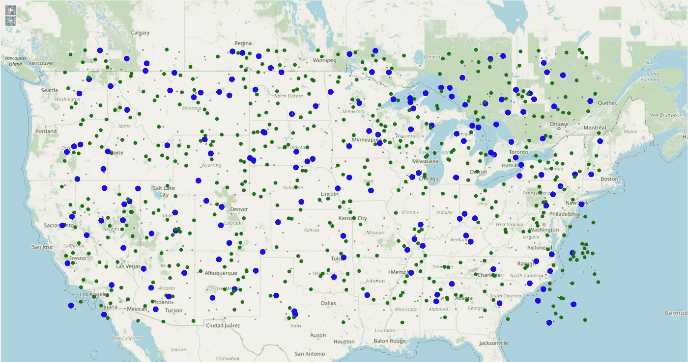
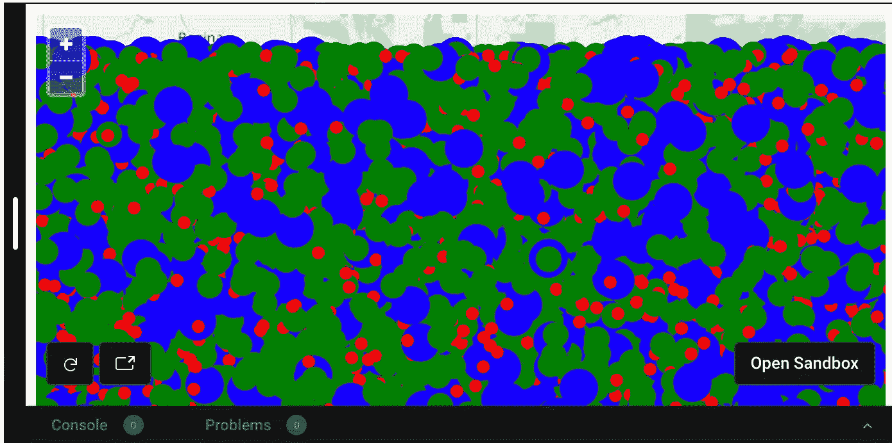
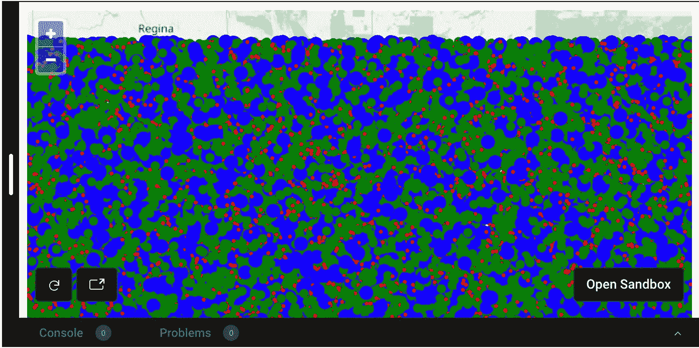

# 如何提高在 OpenLayers 地图中显示大型数据集时的响应速度

> 原文：<https://javascript.plainenglish.io/how-to-improve-responsiveness-when-displaying-large-data-sets-in-openlayers-maps-dd6d0ad9abdf?source=collection_archive---------7----------------------->

## 呆滞地图？网络救援队来了！



Screenshot by the author

我工作的初创公司处理大量地理空间数据。我的任务是在我们的应用程序中显示这些大量的数据，同时还要注意页面的执行情况。

一旦你开始在地图上显示大量的数据，他们就会开始反应迟钝，这就造成了糟糕的用户体验。

我们使用 OpenLayers 在地图上显示我们的数据，幸运的是，他们在其 API 中提供了一种简单的方法来解决这个问题。但是首先，让我们看一个不要做什么的例子。

# 呆滞的地图…

为了演示我们可以在多大程度上提高性能，我们将首先构建一个快速示例，展示在大量数据的情况下，对地图的响应速度会有多慢。

我在 CodeSandbox 中创建了一个例子，我喜欢下面的例子，所以你可以看到它是如何工作的。

```
import Map from "ol/Map";import TileLayer from "ol/layer/Tile";import OSM from "ol/source/OSM";import View from "ol/View";import Vector from "ol/source/Vector";import GeoJSON from "ol/format/GeoJSON";import { fromLonLat } from "ol/proj";import VectorLayer from "ol/layer/Vector";import { Point } from "ol/geom";import Feature from "ol/Feature";import { Circle as CircleStyle, Fill, Stroke, Style } from "ol/style";function getRandomInRange(from, to, fixed) { return (Math.random() * (to - from) + from).toFixed(fixed) * 1;}// Generate 50,000 random points to display on the maplet count = 50000;let features = new Array(count);for (let i = 0; i < count; ++i) { features[i] = new Feature({ geometry: new Point([ getRandomInRange(-8000000, -13500000, 1), getRandomInRange(6500000, 3700000, 1) ]), i: i, value: i % 2 ? (i % 3 ? 1 : 3) : 2 });}let circleStyle1 = new Style({ image: new CircleStyle({ radius: 5, fill: new Fill({ color: "red" }) })});let circleStyle2 = new Style({ image: new CircleStyle({ radius: 10, fill: new Fill({ color: "green" }) })});let circleStyle3 = new Style({ image: new CircleStyle({ radius: 15, fill: new Fill({ color: "blue" }) })});let vectorSource = new Vector({ features: features, format: new GeoJSON()});let pointsLayer = new VectorLayer({ source: vectorSource, style: function (feature) { let value = feature.get("value"); return value === 1 ? circleStyle1 : value === 2 ? circleStyle2 : circleStyle3; }, disableHitDetection: true});let map = new Map({ target: "map", layers: [ new TileLayer({ source: new OSM() }) ], view: new View({ center: fromLonLat([-95.7129, 37.0902]), zoom: 5 })});map.addLayer(pointsLayer);
```

让我们看看这个脚本中发生了什么:

*   首先，我们生成 50，000 个随机 GeoJSON 点显示在我们的地图上，以演示这是如何工作的。每个点都被赋予一个值属性，该属性被设置为 1、2 或 3。
*   我们创建了三种不同的圆样式来显示点。每种款式都有不同的尺寸和颜色。
*   接下来，我们将这些显示在一个 *VectorLayer 上。*对于样式，我们提供了一个函数来检查每个特性的*值*属性，以选择使用哪种样式。

然后，我们在底图上显示矢量层，如果你看一下下面的 CodeSandbox 示例，你可以看到 50，000 个点的地图表现相当缓慢。



View on [CodeSandbox](https://codesandbox.io/s/rough-wildflower-347h5)

现在你可能会说 5 万？这是一个疯狂的数据量！对于我的工作，我们使用农业机械数据，单个田地有多个点并不罕见。

# 网络救援队来了！

从前面的例子可以看出，这是可行的，但绝对是理想的。既然我们已经确定这是一个问题，我们如何解决它？

幸运的是，如果您正在显示点数据，OpenLayers API 提供了一个简单的解决方案。 *WebGLPointsLayer* 利用 WebGL API 使用硬件加速来极大地提高地图渲染的性能。

加速图层的另一个好处是提供了一种更简单的方法来为每个要素的 value 属性提供不同的样式，就像我们上面所做的那样。

代码有一部分是相同的，但是让我们看看更新后的代码，看看我们如何利用这一点。

```
import "./styles.css";import "ol/ol.css";import Map from "ol/Map";import TileLayer from "ol/layer/Tile";import OSM from "ol/source/OSM";import View from "ol/View";import Vector from "ol/source/Vector";import GeoJSON from "ol/format/GeoJSON";import { fromLonLat } from "ol/proj";import WebGLPointsLayer from "ol/layer/WebGLPoints";import { Point } from "ol/geom";import Feature from "ol/Feature";function getRandomInRange(from, to, fixed) { return (Math.random() * (to - from) + from).toFixed(fixed) * 1;}let count = 100000;let features = new Array(count);for (let i = 0; i < count; ++i) { features[i] = new Feature({ geometry: new Point([ getRandomInRange(-8000000, -13500000, 1), getRandomInRange(6500000, 3700000, 1) ]), i: i, value: i % 2 ? (i % 3 ? 1 : 3) : 2 });}let circleStyle = { symbol: { symbolType: "circle", size: ["interpolate", ["linear"], ["get", "value"], 1, 5, 2, 10,       3, 15], color: [ "interpolate", ["linear"], ["get", "value"], 1, "red", 2, "green", 3, "blue" ], rotateWithView: false }};let vectorSource = new Vector({ features: features, format: new GeoJSON()}); let pointsLayer = new WebGLPointsLayer({ source: vectorSource, style: circleStyle, disableHitDetection: true});let map = new Map({ target: "map", layers: [ new TileLayer({ source: new OSM() }) ], view: new View({ center: fromLonLat([-95.7129, 37.0902]), zoom: 5 })});map.addLayer(pointsLayer);
```

让我们回顾一下不同之处。

*   在这个例子中，我们生成了 100，000 个点。因此，加倍点只是为了证明这是多么强大。
*   这些点的样式看起来非常不同。我们定义了一个样式对象，它非常强大，可以像上面一样基于属性值进行样式化。在 *["get "，" value"]* 之后，数组中的下一个值将是数据中要匹配的值，之后的下一个值将是要使用的样式值。因此，在我们的示例中，无论是尺寸还是颜色，您都可以根据需要提供尽可能多的匹配值。
*   唯一的不同是我们用*的*替换了*的*。简单吧？

这个小小的调整提供了显著的性能改进，我更喜欢使用这个方法提供的基于属性改变样式的界面，而不是我们的第一个例子。

我也在 CodeSandbox 中为更新版本创建了一个实例。下面来看看吧。



View on [CodeSandbox](https://codesandbox.io/s/sharp-wind-2tv2k)

# 结论

我们最近刚刚在我工作的初创公司转而使用 OpenLayers 地图，到目前为止，它们非常容易使用，并且在向我们的用户显示数据方面非常强大。我希望这篇文章能让你了解如何通过显示大量点数据来解决性能问题，或者了解 OpenLayers 地图有多棒。感谢阅读！