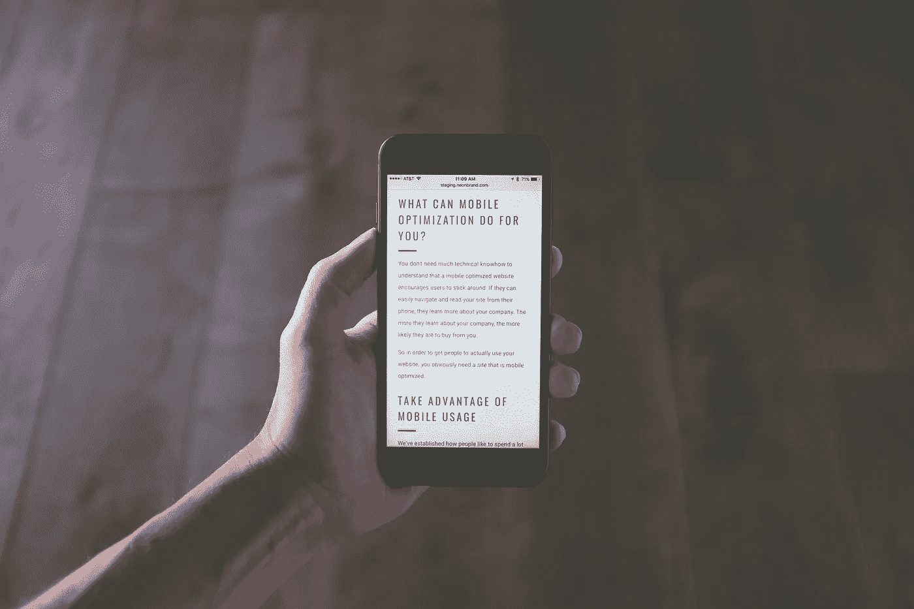
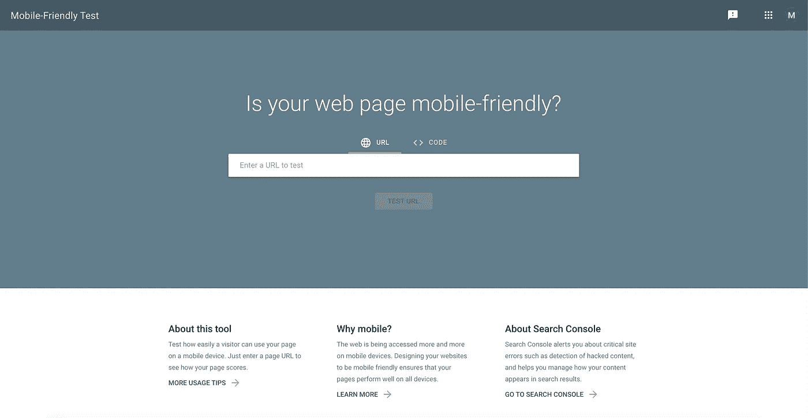
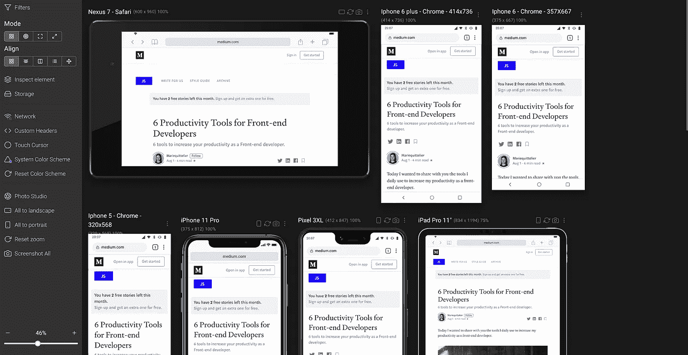
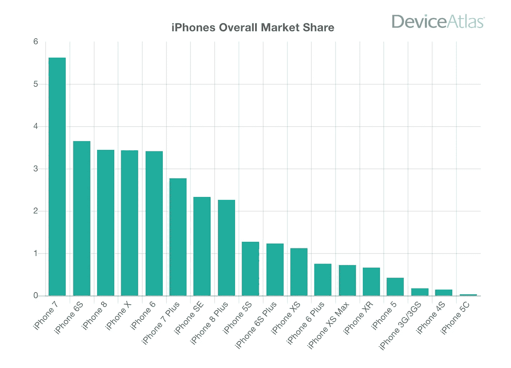

# 如何提高网站的移动响应能力

> 原文：<https://javascript.plainenglish.io/how-to-improve-the-mobile-responsiveness-of-your-website-3f3410dabc27?source=collection_archive---------4----------------------->

## 关于如何使你的网站易于移动友好的一些提示。

第一批自由职业者的工作之一是让现有的网站更适合手机使用。我不想撒谎，制作一个友好的网站基本上就是摆弄 CSS 和断点。这不容易，有时我想把电脑扔出窗外。

Photo by [NeONBRAND](https://unsplash.com/@neonbrand?utm_source=unsplash&utm_medium=referral&utm_content=creditCopyText) on [Unsplash](https://unsplash.com/s/photos/mobile?utm_source=unsplash&utm_medium=referral&utm_content=creditCopyText)

# 如何审核您的移动响应能力？

当你提高网站响应能力时，首先要考虑的是知道你需要做什么。为此，你可以使用谷歌开发的移动测试。

T[he mobile test developed by google](https://search.google.com/test/mobile-friendly).

我浏览了一些我知道没有响应的网站。它会给你一些有趣的评论，如:

*   可点击的元素靠得太近
*   文本太小，无法阅读

这样的例子不胜枚举。即使谷歌认为你的网站是响应性的，也不意味着它是以用户友好的方式响应的。我在通过谷歌检查的手机上看到过可怕的网站。为了检查这一点，你别无选择，只能用不同大小的设备浏览你的网站。

如果你不是一个开发者，你还是应该看看你的页面在手机上的样子。为此，你可以使用[这个工具](https://www.responsivedesignchecker.com/)。我曾经和一位企业家共事，她不明白自己为什么会失去顾客。打开她的一个页面，它反应太慢，以至于弹出窗口无法关闭。客户被困在这一页。哪一页？第一个！

如果你是一个开发者，有很多页面需要检查，你可以用[sizy](http://sizzy.co/mariequittelier)一次检查完！它附带了一些已经设置好的设备，但是您可以根据需要添加任意多的设备。我喜欢[性感](http://sizzy.co/mariequittelier)的两点是:

*   你可以同时移动所有的屏幕
*   可以一键截图全部。

试试看，软件自己会说话。

Here is how my Sizzy app looks like

我并不把 Sizzy 局限于响应性审计，我在编码时也把它作为开发工具。现在你已经知道你的应用程序哪里有问题了，让我们深入研究一下。

# 如何提高您的移动响应能力？

## 从一般到细节

为了让你的网站更有响应性，你必须使用媒体查询，它们真的依赖于断点。

> CSS 断点是网站内容根据设备宽度做出响应的点，允许您向用户显示最佳布局。([来源](https://getflywheel.com/layout/css-breakpoints-responsive-design-how-to/#:~:text=CSS%20breakpoints%20are%20points%20where,adapts%20to%20the%20screen%20size.))

使用断点有很多种方法，你可以创建很多断点。它并不完美，但这里是我的媒体查询表:

然后你只需要把‘设备’导入到任何文件中，你就可以使用海关规则了。

在提高响应能力的同时，你将会使用大量的 CSS。CSS 意味着层叠样式表，所以您应该使用相同的逻辑。从更一般的到最特殊的细节。一个公平的起点是你的布局。你所有的页面应该被封装成一个布局。一旦布局有了反应，你的生活就会变得更加容易。然后，**你应该试着让不止一个页面上的所有组件都做出响应**。例如，您的页眉或页脚。

**另一个立竿见影的方法可能是你的字体**。你的字体大小应该在你的应用程序中全局设置，以确保你所有的段落都有相同的大小。如果是这样的话，将它们调整到屏幕大小是一种快速的方法。有一点要记住的是，你的正文字体不能小于 16px，否则就太小了。

**由大变小**。在制作一个有响应性的网站时，我总是一步一步来。也就是说，我从小型设备开始，一旦一个设备完全完成。我检查它在大一点的屏幕上看起来怎么样。有时候，它可以节省你的时间和麻烦。

现在，80%的工作应该完成了。但是就像帕累托原则一样，剩下的 20%会占用你 80%的时间。会有一些小细节，比如一个组件与另一个组件不太匹配。或者那个小小的空白。好吧，坚持住！

Most popular iphone in 2019\. Source: [https://deviceatlas.com/blog/most-popular-iphones](https://deviceatlas.com/blog/most-popular-iphones)

对我来说棘手的部分总是 iPhone 5 和 SE。它们比所有其他手机都小(320 * 568 磅)。有了他们两个，他们仍然拥有大量的 iPhone 市场份额。所以，我总是要为那个尺寸定制 CSS。

**如果你有机会这样做，在真实设备上检查你的网站。是的，我仍然有一部旧的 iPhone 5，就是为了这个目的。在屏幕上和设备上的感觉可能会有所不同。你可能会发现一个在屏幕上没有看到的小细节。例如，按钮不够大，无法点击。**

## 一点适应性设计怎么样？

现在，你的网站在手机或平板电脑上应该看起来相当不错。但这意味着它是手机友好的吗？不完全是。我想需要了解的一件事是每个版本应该包含多少信息？尼尔森诺曼集团的研究表明，在手机屏幕上阅读时，理解信息要困难得多。所以，是的，没错，并不是所有在你电脑上的数据都应该在你的手机上。

所以，最后一步，试着看看你的网站上什么是过分的？你如何能使它变得更简单？为每一页设定一个目标应该包括和排除在那一页之外。与其说这是一种响应式设计，不如说是一种适应性设计。但是，一点点清洁不会伤害任何人。