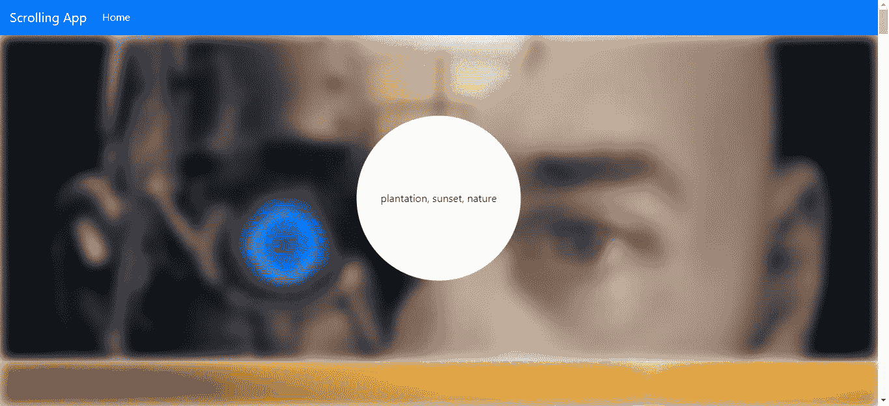

# 如何在 React 应用程序中包含环境变量

> 原文：<https://javascript.plainenglish.io/how-to-include-environment-variables-in-your-react-app-e4657c178b5c?source=collection_archive---------2----------------------->

如果您使用 Create React App 来开发应用程序，那么在应用程序中使用环境变量是很容易的。您只需在项目文件夹的根目录下创建一个`.env`文件，并且您的环境变量的键应该以`REACT_APP_`开始。例如，如果你需要在你的应用中包含一个 API 密匙，那么你的`.env`文件应该是这样的:

```
REACT_APP_API_KEY='your api key'
```

然后在您的代码中，您可以使用`process.env.REACT_APP_API_KEY`来访问它。

在本文中，我们将制作一个应用程序，在背景中显示图像列表，在前景中显示标签文本。图像将由 Pixabay API 提供。你可以在[https://pixabay.com/api/docs/](https://pixabay.com/api/docs/)注册一个 API 密钥

有了 React，用`react-parallax`库创建视差滚动效果是不是又快又简单。

视差滚动的效果是背景图像比前景中的元素滚动得慢，从而产生页面深度的错觉。网站经常在信息页面中使用这种方式，在这种页面中，一些文本在前景中，图像在背景中，滚动速度较慢，为用户创造更有趣的体验。

[本页](https://www.mockplus.com/blog/post/parallax-scrolling-websites)有一些视差滚动的网页示例。

为了开始构建应用程序，我们通过运行 Create React App 来创建应用程序。运行`npx create-react-app scrolling-app`构建 app 的骨架。一旦运行完成，我们安装一些软件包。我们需要安装 Axios 来从 Pixabay API 获取图像，安装 Bootstrap 来进行样式设计，安装 React Router 来将 URL 路由到我们创建的页面，安装`react-parallax`来创建视差滚动效果。

接下来，我们编写视差滚动应用程序的代码。在`App.js`中，我们用以下代码替换现有代码:

```
import React from "react";
import TopBar from "./TopBar";
import { Router, Route, Link } from "react-router-dom";
import { createBrowserHistory as createHistory } from "history";
import HomePage from "./HomePage";
import "./App.css";
const history = createHistory();function App() {
  return (
    <div className="App">
      <Router history={history}>
        <TopBar />
        <Route path="/" exact component={HomePage} />
      </Router>
    </div>
  );
}export default App;
```

我们添加了一个将要创建的顶栏，以及一个到 React 路由器主页的路由。

接下来，我们创建视差滚动应用程序的主页。在`src`文件夹中创建一个名为`HomePage.js`的文件，并添加以下内容:

```
import React, { useState, useEffect } from "react";
import { Parallax, Background } from "react-parallax";
import "./HomePage.css";
import { getPhotos } from "./requests";const insideStyles = {
  background: "transparent",
  padding: 20,
  position: "absolute",
  top: "50%",
  left: "50%",
  transform: "translate(-50%,-50%)",
};function HomePage() {
  const [initialized, setInitialized] = useState(false);
  const [images, setImages] = useState([]);
  const [layers, setLayers] = useState([]);const loadImages = async () => {
    const response = await getPhotos();
    setImages(response.data.hits);
  };useEffect(() => {
    if (!initialized) {
      loadImages();
      setInitialized(true);
    }
  });
  return (
    <div className="home-page">
      {images.map((img, i) => {
        return (
          <>
            <Parallax
              blur={10}
              bgImage={img.userImageURL}
              bgImageAlt={img.tags}
              strength={600}
              renderLayer={percentage => (
                <div>
                  <div
                    style={{
                      position: "absolute",
                      background: `white`,
                      left: "50%",
                      top: "50%",
                      borderRadius: "50%",
                      transform: "translate(-50%,-50%)",
                      width: percentage * 500,
                      height: percentage * 500,
                    }}
                  />
                </div>
              )}
            >
              <div style={{ height: 500 }}>
                <div style={insideStyles}>{img.tags}</div>
              </div>
            </Parallax>
          </>
        );
      })}
    </div>
  );
}export default HomePage;
```

在这个页面中，当页面第一次加载时，我们首先用函数`loadImages`中的 Pixabay API 加载图像。我们检查页面是否是`initialized`。如果不是，那么我们加载图像。一旦图像被加载，我们通过将图像数据映射到由`react-parallax`提供的`Parallax`组件来显示它们。`strength`属性指定了为创建视差滚动而转换的像素数量。这个数字的绝对数越高，前景和背景的滚动速度差异就会越明显。

在`Parallax`组件中，我们指定想要显示的内容。我们指定显示来自 Pixabay API 的图像附带的标记文本。

`renderLayer`道具让我们显示前景和背景之间的元素，我们可以通过使用函数 adjust dimensions 中的`percentage`参数来激活这里定义的元素。例如，在本页中，我们用`percentage`调整`width`和`height`。

`bgImage`是我们图像的 URL，`bgImageAlt`是背景图像的`alt`属性。`blur` prop 指定背景图像的模糊程度。

接下来，我们创建从 Pixabay API 获取图像的文件。在`src`文件夹中创建一个名为`requests.js`的文件，并添加以下代码:

```
const axios = require("axios");
const apiUrl = "[https://pixabay.com/api](https://pixabay.com/api)";export const getPhotos = () =>
  axios.get(`${apiUrl}/?key=${[process.env.REACT_APP_APIKEY]}`);
```

API 键在项目根文件夹的`.env`文件中定义。环境变量的关键字是`REACT_APP_APIKEY`。

在`.env`文件中，我们有:

```
REACT_APP_APIKEY='your api key'
```

接下来，我们为图像创建一个顶栏。在`src`文件夹中创建一个名为`TopBar.js`的文件，并添加:

```
import React from "react";
import Navbar from "react-bootstrap/Navbar";
import Nav from "react-bootstrap/Nav";
import "./TopBar.css";
import { withRouter } from "react-router-dom";function TopBar({ location }) {
  const { pathname } = location;return (
    <Navbar bg="primary" expand="lg" variant="dark">
      <Navbar.Brand href="#home">Scrolling App</Navbar.Brand>
      <Navbar.Toggle aria-controls="basic-navbar-nav" />
      <Navbar.Collapse id="basic-navbar-nav">
        <Nav className="mr-auto">
          <Nav.Link href="/" active={pathname == "/"}>
            Home
          </Nav.Link>
        </Nav>
      </Navbar.Collapse>
    </Navbar>
  );
}export default withRouter(TopBar);
```

我们使用 React Bootstrap 中的`Navbar`创建顶栏，并用`withRouter`函数包装组件，这样我们就可以将`location`属性传递给组件。这让我们通过检查`location`属性的`pathname`属性来检查用户所在页面的 URL，让我们动态设置`Nav.Link`的`active`属性。

最后，在`index.html`中，我们用以下代码替换现有代码:

```
<!DOCTYPE html>
<html lang="en">
  <head>
    <meta charset="utf-8" />
    <link rel="shortcut icon" href="%PUBLIC_URL%/favicon.ico" />
    <meta name="viewport" content="width=device-width, initial-scale=1" />
    <meta name="theme-color" content="#000000" />
    <meta
      name="description"
      content="Web site created using create-react-app"
    />
    <link rel="apple-touch-icon" href="logo192.png" />
    <!--
      manifest.json provides metadata used when your web app is installed on a
      user's mobile device or desktop. See [https://developers.google.com/web/fundamentals/web-app-manifest/](https://developers.google.com/web/fundamentals/web-app-manifest/)
    -->
    <link rel="manifest" href="%PUBLIC_URL%/manifest.json" />
    <!--
      Notice the use of %PUBLIC_URL% in the tags above.
      It will be replaced with the URL of the `public` folder during the build.
      Only files inside the `public` folder can be referenced from the HTML.Unlike "/favicon.ico" or "favicon.ico", "%PUBLIC_URL%/favicon.ico" will
      work correctly both with client-side routing and a non-root public URL.
      Learn how to configure a non-root public URL by running `npm run build`.
    -->
    <title>Parallax App</title>
    <link
      rel="stylesheet"
      href="[https://maxcdn.bootstrapcdn.com/bootstrap/4.3.1/css/bootstrap.min.css](https://maxcdn.bootstrapcdn.com/bootstrap/4.3.1/css/bootstrap.min.css)"
      integrity="sha384-ggOyR0iXCbMQv3Xipma34MD+dH/1fQ784/j6cY/iJTQUOhcWr7x9JvoRxT2MZw1T"
      crossorigin="anonymous"
    />
  </head>
  <body>
    <noscript>You need to enable JavaScript to run this app.</noscript>
    <div id="root"></div>
    <!--
      This HTML file is a template.
      If you open it directly in the browser, you will see an empty page.You can add webfonts, meta tags, or analytics to this file.
      The build step will place the bundled scripts into the <body> tag.To begin the development, run `npm start` or `yarn start`.
      To create a production bundle, use `npm run build` or `yarn build`.
    -->
  </body>
</html>
```

我们添加了引导 CSS 并改变了这个文件的标题。

最后我们得到:

