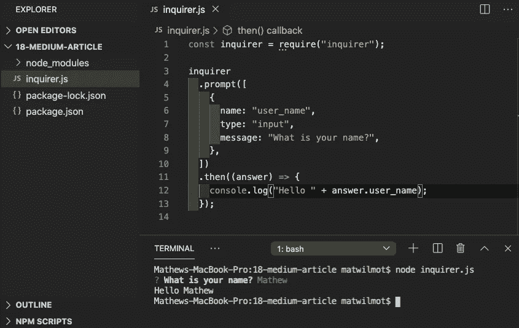
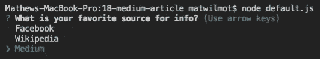

# 如何使用 Inquirer.js

> 原文：<https://javascript.plainenglish.io/how-to-inquirer-js-c10a4e05ef1f?source=collection_archive---------2----------------------->

## Inquirer 是一个基于 promise 的 npm 包，在节点项目中用于为基于查询的任务创建 CLI(命令行界面)工具

在这篇文章中，我想谈论一个我非常喜欢使用的 CLI 工具，希望有人在这个过程中学到一些东西。

# 让我们从头开始:什么是 Inquirer？

Inquirer 是一个基于 promise 的 npm 包，用在节点项目中，为基于查询的任务创建 CLI(命令行界面)工具。它非常适合询问用户问题，验证用户输入，以及处理给出的响应。

我使用 Inquirer 和 mysql 数据库创建了一个名为“员工管理器”的 CLI 工具。它询问用户他们想做什么，并给他们一个选项列表。他们可以添加新员工、分配角色、部门和办公室、设定工资等等—所有这些都无需创建前端。

# Node 是什么？

Node.js 是基于 [Chrome 的 V8 JavaScript 引擎](https://v8.dev/)构建的 JavaScript 运行时。关于什么是节点以及如何设置它的更多信息，[点击这里](https://nodejs.org/en/about/)。在使用 Inquirer 之前，您需要 Node。

# 那么我该如何使用 Inquirer 呢？

很高兴你问了！就本文而言，我们将构建一个简单的基于 Inquirer 的项目，从最开始一直到更深入的内容。他们的文档(底部的链接)有你需要设置的所有信息，但是我们也在这里介绍一下。

如果您还没有这样做，请通过在项目根目录下的终端中键入以下内容来初始化项目中的 npm:

```
npm init -y
```

现在你已经准备好安装 Inquirer 了。在您的终端中键入以下内容:

```
npm install inquirer
```

下一步包括将 Inquirer 库引入到您正在处理的文件中。您可以通过在代码开头添加以下行来实现这一点:

```
const inquirer = require("inquirer")
```

现在我们已经将 inquirer 引入到我们的项目中，让我们构建第一个查询并运行它。每个查询都以相同的代码开始:

```
inquirer.prompt()
```

所以我们访问 inquirer 库并使用 prompt 方法向用户显示我们的问题。但它比那更复杂——inquirer 为它的问题获取一系列对象。所以我们在括号内打开一个数组，然后在数组内打开一个对象，得到这样的结果:

```
inquirer.prompt([{}])
```

每个问题对象应至少包含三个关键字:

*   姓名——你以后如何提及这个问题(以及给出的答案)
*   这是什么类型的问题？(输入、多项选择、数字等)
*   信息——你问用户的问题

利用这些新知识，我们可以创建一个基本问题，看起来像这样:

```
inquirer
  .prompt([
    {
      name: "user_name",
      type: "input",
      message: "What is your name?",
    },
  ]);
```

*需要注意的是,‘type’的默认选项是‘input ’,因此在这个场景中实际上是不必要的，但是为了清楚起见，我喜欢包含它。*

但是我们还没有完成，我们已经提出了问题，但是我们没有对答案做任何事情。答案作为一个对象返回给我们，其中键是问题的“名称”属性，答案是它的值。您可以使用获取答案。then()内部有一个回调函数。假设我们想将这个问题的答案打印到控制台，我们可以使用下面的代码:

```
inquirer
  .prompt([
    {
      name: "user_name",
      type: "input",
      message: "What is your name?",
    },
  ])
  .then((answer) => {
    console.log("Hello " + answer.user_name);
  });
```

祝贺您，您刚刚使用 Inquirer.js 编写了您的第一个问题。要运行此问题，请在您的控制台中键入以下内容:

```
node <filename>
```

出于本文的目的，我编写了自己的文件来演示。



Demonstrating usage and expected outcome

# 让我们更进一步

所以我们问了一个问题，我们如何问多个问题？这就像在数组中添加另一个问题对象一样简单。在下面的示例中，我在我们之前编写的代码中添加了一些小的修改，以询问用户的名字和姓氏:

```
inquirer
  .prompt([
    {
      name: "first_name",
      type: "input",
      message: "What is your first name?",
    },
    {
      name: "last_name",
      type: "input",
      message: "What is your last name?",
    },
  ])
  .then((answer) => {
    console.log("Hello", answer.first_name, answer.last_name);
  });
```

# 问题类型

所以我们学会了添加基于输入的问题。如果我们想让用户从一系列可能的选项中选择呢？我们需要做的就是改变问题的“类型”字段。Inquirer 提供了许多类型的问题，我最常用的是:

*   投入
*   数字
*   确认
*   目录
*   检验盒
*   密码

我们已经看到了一些输入类型的问题，所以让我们看看我们可以对其他类型做些什么。

# 类型:数量

下面是一个使用数字并将结果打印到控制台的问题示例。

```
inquirer
  .prompt([
    {
      name: "pet_count",
      type: "number",
      message: "How many pets do you own?",
    },
  ])
  .then((answer) => {
    console.log("You own", answer.pet_count, "pets");
  });
```

它带有一些内置的验证，如果你试图输入一个不是数字的东西(比如“八”)，它会返回“NaN”。我们可以利用这一点，如果你没有给出一个数字，我们可以通过将问题转化为一个函数来建立一个条件，再次询问这个问题，如下所示:

```
const getPetCount = () => {
  inquirer
    .prompt([
      {
        name: "pet_count",
        type: "number",
        message: "How many pets do you own?",
      },
    ])
    .then((answer) => {
      if (!answer.pet_count) {
        console.log("That wasn't a number!");
        getPetCount();
      } else {
        console.log("You own", answer.pet_count, "pets");
    });
};getPetCount();
```

我们所做的是将问题转化为一个可重用的函数，如果答案为假，则再次调用该问题。注意，由于问题函数不会立即被调用，我们需要实际调用声明它的函数下面的函数**。**

# 类型:确认

Confirm 为用户提供一个简单的是或否选项，并返回一个布尔值作为答案。以下代码是如何使用确认类型的示例:

```
inquirer
  .prompt([
    {
      name: "wants_pizza",
      type: "confirm",
      message: "Do you want a free pizza?",
    },
  ])
  .then((answer) => {
    console.log(answer.wants_pizza);
  });
```

向用户提出问题:

**你想吃免费披萨吗？(是/否)**

一个简单的 Y 或 N 会给你“真”或“假”。您可以使用它来构建一系列问题，所有问题都保存为函数，从而创建一个披萨订单生成器。你想吃披萨吗？*你想要多少披萨？我们应该把披萨送到什么地址？*这是一系列使用确认、数字和输入问题类型的问题。但是比萨饼应该有什么样的外壳呢？

# 类型:列表

列表类型要求您向问题对象添加一个额外的键:选择数组。这将为用户提供一个选项列表，用户可以从中进行选择，并将他们的提交保存为问题的答案。这种类型完全阻止用户输入他们自己的输入，并将他们的选择限制在您预先定义的列表中。这里有一个例子:

```
inquirer
  .prompt([
    {
      name: "pizza_crust",
      type: "list",
      message: "Choose your crust:",
      choices: ["Thin Crust", "Stuffed Crust", "Pan"],
    },
  ])
  .then((answer) => {
    console.log(answer.pizza_crust);
  });
```

用户将能够从列表中选择他们的外壳类型，他们的选择将被打印到控制台。如果我们坚持 pizza order builder 的想法，假设您在文档的开头定义了一个“order”对象，带有地址、皮、比萨饼数量等的键..你可以将这些答案中的值推送给那个对象，然后继续下一个问题。那么，如果我们想从一个列表中选择多个选项，比如比萨饼配料，该怎么办呢？

# 类型:复选框

复选框的工作方式类似于列表，因为您必须提供一个选择数组，只是用户可以选择多个选项。这将是一个选择比萨饼配料的好方法。这里有一个例子:

```
const toppingArray = ["Cheese", "Pepperoni", "Onions", "Peppers", "Jalapeños", "Chicken"]inquirer
  .prompt([
    {
      name: "pizza_toppings",
      type: "checkbox",
      message: "Choose your toppings:",
      choices: toppingArray,
    },
  ])
  .then((answer) => {
    console.log(answer.pizza_toppings);
  });
```

将向用户提出问题“选择你的浇头:”然后给出一个选项列表，在这个例子中，我在变量中定义了这个列表。用户可以使用空格来选择/取消选择选项，并按 enter 来提交他们的答案。一旦回答完毕，答案将作为字符串保存在一个数组中。这个问题的答案可能是这样的:

```
["Cheese", "Onions", "Peppers", "Chicken"]
```

有趣的想法，您可以将这些答案保存到一个变量中，并在以后的另一个“列表”或“复选框”样式的问题中再次使用它们。

# 类型:密码

这个例子并不适合比萨饼订单生成器的例子，但是它是一个重要的例子。密码类型将完全隐藏用户输入。没有星号或空白字符，当你输入时，你将什么也看不到。这是非常有用的，因为任何人从你身后看都看不到你的密码有多长！这里有一个例子:

```
inquirer
  .prompt([
    {
      name: "user_password",
      type: "password",
      message: "Enter Password:",
    },
  ])
  .then((answer) => {
    console.log(answer.user_password);
  });
```

显然，您不希望将您刚刚输入的敏感信息直接打印到控制台中，但是最初这样做是测试它是否有效的一个好方法。成品中更好的解决方案可能是将密码保存到一个变量中，或者立即将其与用户名一起提交，以便让某人登录服务。

# 想建一个披萨订单生成器？

太棒了。我已经创建了一个超级简单的例子，并上传到 GitHub ，你可以随意克隆这个回购，看看一切是如何工作的！

# 那么 inquirer 还能做什么呢？

我最喜欢 Inquirer 的一个特性，在我知道我可以把我所有的问题分成函数之前，就是‘when’。在比 pizza order builder 更复杂的场景中，您可能希望添加一个后续问题，只有当用户从上一个问题中选择了某个答案时，才会询问这个问题。这里有一个如何使用 when 的例子:

```
inquirer
  .prompt([
    {
      name: "wants_pizza",
      type: "confirm",
      message: "Do you want a free pizza?",
    },
    {
      name: "confirm_answer",
      type: "confirm",
      message: "Are you sure?",
      when: (answers) => answers.wants_pizza === false,
    },
  ])
  .then((answers) => {
    if (answers.wants_pizza) {
      console.log("The user wants free pizza");
    } else if (answers.confirm_answer) {
      // the user definitely doesn't want pizza
    } else {
      // the user changed their mind
      // run the function to ask this question again
    } 
  });
```

所以我们可以看到‘when’属性实际上是在使用一个带有基本条件的回调函数。如果答案是假的，那么询问用户是否确定。在。then()块，我们用一个条件来看:

*   如果第一个问题的答案是“真”，做点什么。
*   如果第一个答案是**不是**真，如果第二个答案是真，用户肯定不想要比萨饼，在这里运行某种退出功能
*   否则用户说他们不想要比萨饼，然后改变了主意，所以他们应该被重定向到最初的问题

值得注意的是，如果用户说他们确实想要一个免费的披萨，他们不会被问及是否确定——这就是“何时”的力量。**通过使用‘when ’,我们可以在满足给定标准时只问一个问题*和*,否则跳过它。**

# 那么，我应该把我的询问分成几个功能，还是用‘when’？

在我看来，两者都有其用例。将事物分解成函数对于制造可重用的问题来说是很棒的，但是这些问题的答案被限制在它们的。then()块，除非您将它们保存到该范围之外的变量中。在 pizza order builder 的例子中，这很好，因为每个问题都为一个对象贡献了一个值。

*pizza order builder 可以有两个功能——一个显示开始菜单，另一个包含所有后续问题，因为我们总是询问列表中的所有问题。*

使用‘when’特性的一个理由是，它可以节省代码行数，使你的文件更短；你不需要写一个完整的 inquirer.prompt()块，然后有一个条件要么把你送到那个问题，要么送到下一个问题。另一个好处是，通过这种方式提问，你不会因为改变范围而丢失问题的答案。

# 默认值

Inquirer 允许您将默认值添加到您的查询中，以加速导航并向用户提出建议。这里有一个如何使用它的例子:

```
const mediaArray = ["Facebook", "Wikipedia", "Medium"];inquirer
  .prompt([
    {
      name: "fav_media",
      type: "list",
      message: "What is your favorite source for info?",
      choices: mediaArray,
      default: "Medium",
    },
  ])
  .then((answer) => {
    console.log(answer.fav_media);
  });
```

现在，当用户被问及他们最喜欢的信息源时，选择的选项将是第三个选项——“中”。



How the inquiry begins when you use a ‘default’ option

如果您试图在项目中实现 CRUD 功能，特别是更新部分，这将非常有用。您可以将现有值放入变量或函数参数中，并将其用作默认值。

# 更多信息

*   如果你想了解 Inquirer.js 更深入的特性，可以在这里查看 npm [上的官方文档。](https://www.npmjs.com/package/inquirer)

# 该表扬就表扬

*   感谢 [Squirrel](https://medium.com/u/b616c834b117?source=post_page-----c10a4e05ef1f--------------------------------) 关于如何向中型文章添加代码块的文章。这东西看上去一片 ***乱*** 我才发现那条。
*   感谢托马斯·w·史密斯首先教会我这一切(以及更多),并校对了这篇文章。