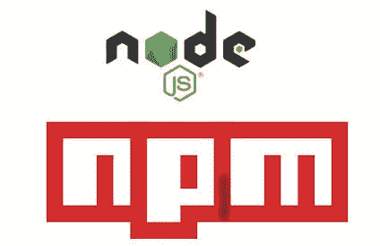

# 如何通过节点程序包管理器安装特定版本的程序包(NPM)

> 原文：<https://javascript.plainenglish.io/how-to-install-a-specific-version-of-a-package-via-node-package-manager-npm-4cfe6db250f3?source=collection_archive---------10----------------------->



*注意:本文面向基于 macOS 或 Linux 操作系统的用户。*

# 什么是节点程序包管理器(NPM)？

`npm`是`Node.js`项目的默认包管理器。它相当于`Python`的`pip`。它的命令行工具允许你方便快捷地安装任何你需要的基于`Node.js`的应用程序包。

作为一个快速演示，这是你如何从终端使用`npm`安装一个包。

```
$ npm install -g serverless
```

`*serverless*` *是一个允许你无缝构建和部署无服务器应用的框架。查看他们的* [*网站*](https://serverless.com/) *了解更多信息。*

# 如何用自制软件安装 npm？

使用`Homebrew`安装`npm`是一个非常简单的过程。从您的终端，运行以下命令。

```
$ brew install node
Updating Homebrew...
...
...
==> Downloading [https://homebrew.bintray.com/bottles/node-13.5.0.catalina.bottle.tar.gz](https://homebrew.bintray.com/bottles/node-13.5.0.catalina.bottle.tar.gz)
Already downloaded: /Users/joe/Library/Caches/Homebrew/downloads/023a1fc6036bb78809191e42a2cbf9e9f79be8b1a9fc4b7bbd1f5bb8c13f871b--node-13.5.0.catalina.bottle.tar.gz
==> Pouring node-13.5.0.catalina.bottle.tar.gz
==> Caveats
Bash completion has been installed to:
  /usr/local/etc/bash_completion.d
==> Summary
🍺  /usr/local/Cellar/node/13.5.0: 4,663 files, 59.1MB
```

就是这样。如我所说，这很简单，对吗？:)

**奖励**:要安装`Homebrew`，从您的终端运行以下命令。

```
$ /usr/bin/ruby -e "$(curl -fsSL https://raw.githubusercontent.com/Homebrew/install/master/install)"
```

*请注意* `*Homebrew*` *是只针对 macOS(或 Linux)的包管理器。更多信息请访问他们的* [*网站*](https://brew.sh/) *。*

# 如何安装特定版本的节点包？

现在你已经在 macOS 上安装了`node`，让我们开始行动吧。

在本文的第一部分，我已经向您展示了如何使用 npm 安装包。回忆以下命令。

```
$ npm install -g serverless
...
...
/usr/local/bin/serverless -> /usr/local/lib/node_modules/serverless/bin/serverless.js
/usr/local/bin/sls -> /usr/local/lib/node_modules/serverless/bin/serverless.js
/usr/local/bin/slss -> /usr/local/lib/node_modules/serverless/bin/serverless.js> serverless@1.60.4 postinstall /usr/local/lib/node_modules/serverless
> node ./scripts/postinstall.js┌───────────────────────────────────────────────────┐
   │                                                   │
   │   Serverless Framework successfully installed!    │
   │                                                   │
   │   To start your first project run “serverless”.   │
   │                                                   │
   └───────────────────────────────────────────────────┘+ serverless@1.60.4
updated 1 package in 10.679s
```

让我给你解释一下。

*   `npm install`是安装您指定的`Node`包的基本命令。(在本例中，它是`serverless`包)。
*   `-g`是全局安装标志，如果您正在安装的包提供了命令行工具，您可以将这个选项添加到`npm install`命令中。通过将`-g`添加到`npm install`命令中，软件包的二进制文件被添加到您的`PATH`变量中。有一个 [stackoverflow 问题](https://stackoverflow.com/questions/5817874/how-do-i-install-a-module-globally-using-npm)详细讨论了这个问题。
*   `serverless`是您要安装的软件包的名称。

默认情况下，`npm install`命令将安装您指定的软件包的最新可用版本。这就是为什么在上面的例子中，`npm`安装了`serverless 1.60.4`——这是本文撰写时的最新版本。

在某些情况下，由于某些原因，例如兼容性、缺陷，您可能希望安装一个旧版本的软件包。为了安装软件包的特定版本，您需要执行以下操作。

```
$ npm install -g serverless@1.58.0
```

注意附加的`@1.58.0`，它告诉`npm`安装`serverless`包的版本`1.58.0`而不是最新版本。

就是这样。:)