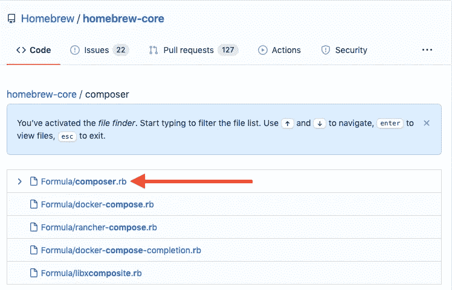
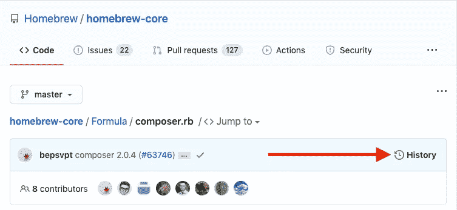
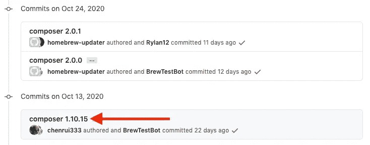
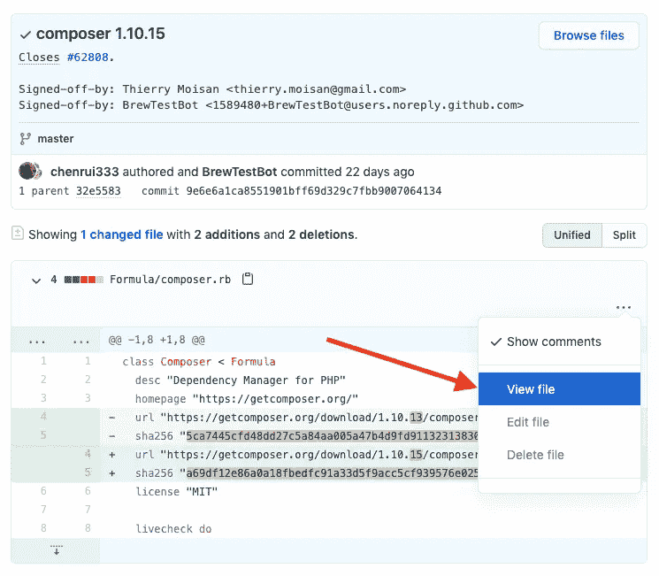
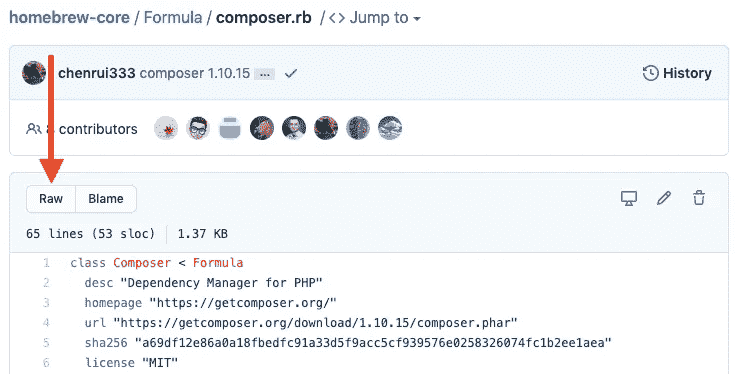
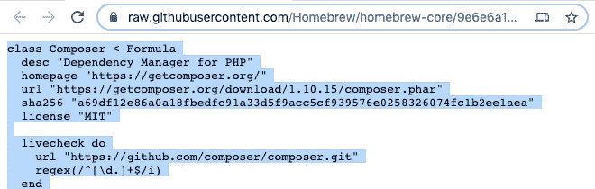

# 如何安装一个旧的自制软件包

> 原文：<https://javascript.plainenglish.io/how-to-install-an-older-homebrew-package-b4a4577fd00f?source=collection_archive---------5----------------------->


[Homebrew](https://b.remarkabl.org/homebrew)

你知道可以安装旧版本的[自制软件](https://b.remarkabl.org/homebrew)包或配方吗？

以前，您可以通过安装旧的公式 URL 来完成此操作:

```
brew install <FORMULA_URL>
```

然而，这不再有效:

```
Error: Calling Installation of <FORMULA> from a GitHub commit URL is disabled! Use 'brew extract <FORMULA>' to stable tap on GitHub instead.
```

现在，您需要在安装前更换[芯](https://github.com/Homebrew/homebrew-core/find/master)或[桶](https://github.com/Homebrew/homebrew-cask)配方:

```
# copy formula code
pbpaste > $(find $(brew --repository) -name <FORMULA>.rb)
brew install <FORMULA>
```

# 例子

以下步骤概述了如何安装 [composer](https://getcomposer.org/) 版本`1.10.15`。

# 先决条件

卸载作曲家:

```
brew uninstall composer
```

更新 brew:

```
brew update
```

# 找到公式

在[自制核心](https://github.com/Homebrew/homebrew-core/find/master)或[自制桶](https://github.com/Homebrew/homebrew-cask/find/master)中找到配方:



公式文件名应该是`composer.rb`。

打开[文件](https://github.com/Homebrew/homebrew-core/blob/master/Formula/composer.rb)点击[历史](https://github.com/Homebrew/homebrew-core/commits/eb56ac0aba935d203d0e5833e50f75360f3bf5be/Formula/composer.rb):



浏览历史记录并找到您想要的提交:



转到[提交](https://github.com/Homebrew/homebrew-core/commit/9e6e6a1ca8551901bff69d329c7fbb9007064134#diff-ced640e69fef80e26244a11c06d6b5f6a8a2bc478643ffcf7697cb3c370786fd)，点击文件旁边的省略号，点击[查看文件](https://github.com/Homebrew/homebrew-core/blob/9e6e6a1ca8551901bff69d329c7fbb9007064134/Formula/composer.rb):



点击 [Raw](https://raw.githubusercontent.com/Homebrew/homebrew-core/9e6e6a1ca8551901bff69d329c7fbb9007064134/Formula/composer.rb) 打开 Raw 文件:



# 替换公式

选择并复制原始配方:



在您的计算机上打开本地公式:

```
find $(brew --repository) -name composer.rb
```

粘贴复制的公式，使其替换本地公式:

```
pbpaste > $(find $(brew --repository) -name composer.rb)
```

安装公式:

```
brew install composer
```

完成后，撤销对公式的更改:

```
cd $(find $(brew --repository) -name composer.rb -exec dirname {} \;)
git checkout .
```

固定公式以防止意外升级:

```
brew pin composer
```

# 资源

自制文件:

*   [自制核心](https://github.com/Homebrew/homebrew-core)
*   [自制酒桶](https://github.com/Homebrew/homebrew-cask)
*   [配方食谱](https://docs.brew.sh/Formula-Cookbook)

[*本文原载于 2017 年 2 月 3 日 remarkablemark.org。*](https://b.remarkabl.org/34XQ6Ys)