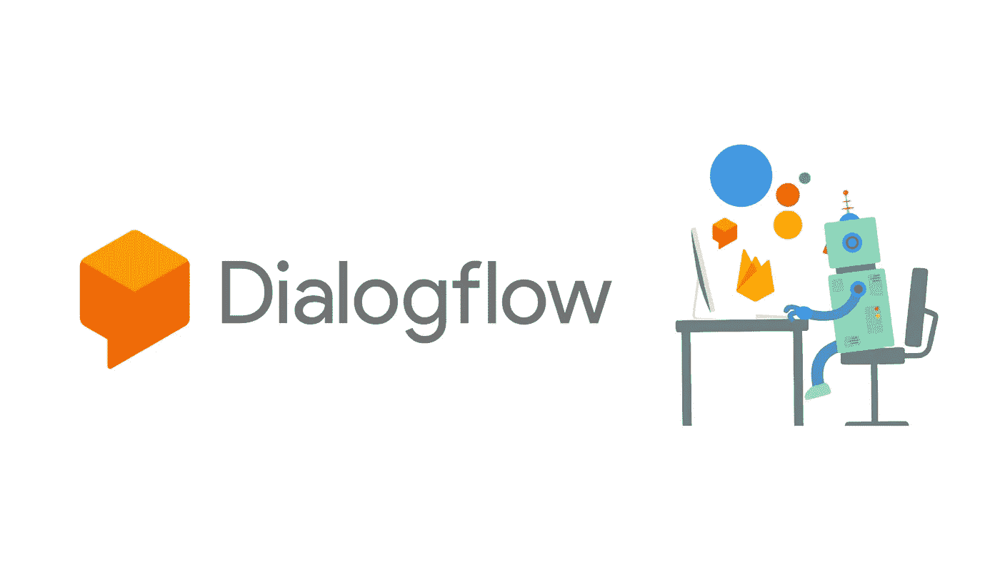
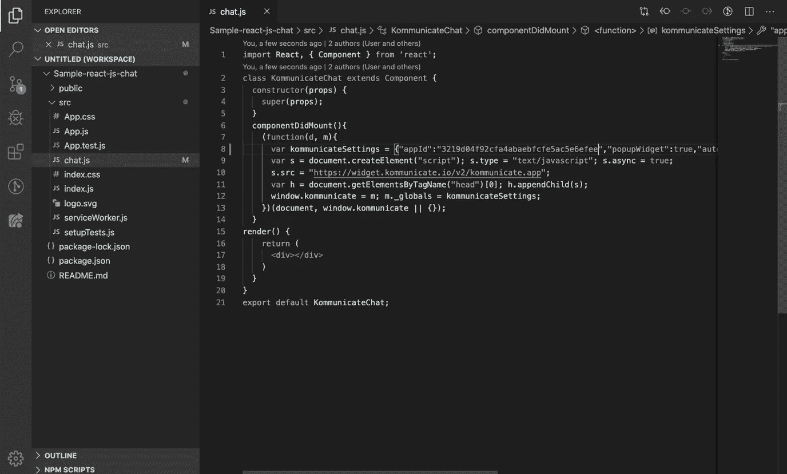
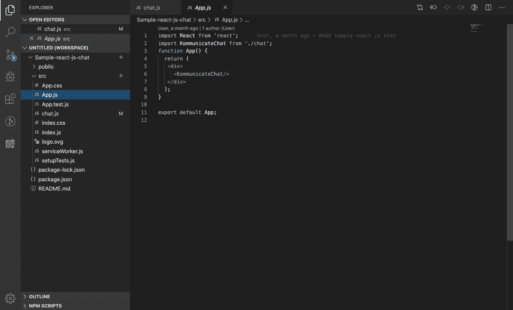
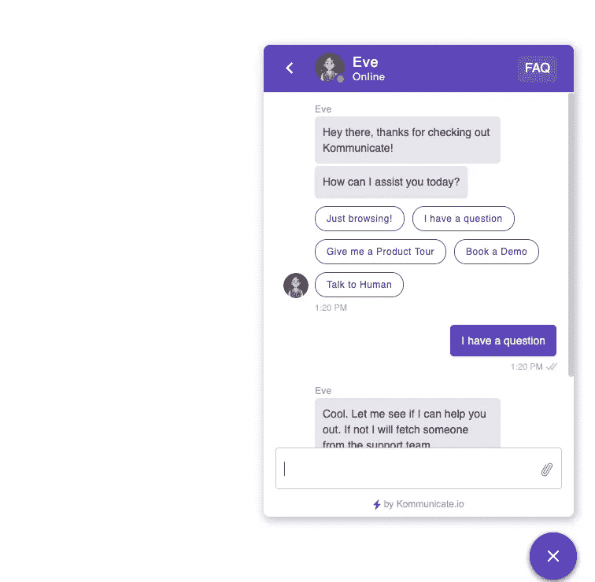

# 如何将 Dialogflow Bot 与 React 集成

> 原文：<https://javascript.plainenglish.io/how-to-integrate-a-dialogflow-bot-with-react-ece565324a1a?source=collection_archive---------6----------------------->

## 将 Dialogflow bot 集成到 React 应用程序的分步指南



## 先决条件

首先，你需要一个 [Dialogflow](https://dialogflow.com/) bot 或者 Dialogflow 和 React 的工作知识。要将聊天机器人与 React 整合，你需要一个[通信](https://www.kommunicate.io/)账户。所有上述工具都可以免费试用。此外，应该在系统中安装节点。

[**创建免费聊天机器人**](https://dashboard.kommunicate.io/signup)

## 在 React 网站中集成 Dialogflow bot 的步骤

我将解释我是如何连接 Dialogflow 并在 Kommunicate 的帮助下做出反应的。

*注意:为了保持简单明了，本教程用非常基本和简单的代码开发来解释。还要提一下，这个项目可以在*[*Github*](https://github.com/Kommunicate-io/Kommunicate-Web-Samples/tree/master/Sample-react-js-chat)*上找到。*

# 第一步。创建您的对话流机器人

首先，您可以在 Dialogflow 中轻松创建一个聊天机器人。这是一个非常直观而强大的聊天机器人构建工具。[这里有一个示例](https://docs.kommunicate.io/docs/bot-samples)可以帮助您开始使用 Dialogflow bot。更进一步，你可以创建你自己的意图实体。

# 第二步。集成 Dialogflow 聊天机器人和通信

要在 komunicate 中集成您的 Dialogflow bot，请登录到您的 komunicate 仪表板并导航到 [Bot 部分](https://dashboard.kommunicate.io/bot)。如果您没有帐户，您可以在这里创建一个[。找到 Dialogflow 部分并点击 **Integrate Bot** 。](https://dashboard.kommunicate.io/signup)

现在，导航到您的 Dialogflow 控制台并下载服务帐户密钥文件。以下是查找文件的步骤:

1.  从左侧面板的下拉列表中选择您的代理。
2.  点击设置按钮。这将为代理打开一个设置页面。
3.  在常规选项卡内搜索**谷歌项目**并点击你的服务账户。
4.  在重定向到您的**服务帐户**之后，从 **Actions** 部分为您的项目创建一个 JSON 格式的密钥，它将被自动下载。
5.  现在上传**密钥文件**。

在机器人档案部分，你可以给你的机器人一个名字。每当用户与机器人交互时，该名称将对用户可见。进一步处理并填写细节。

1.  **仪表盘→机器人集成→管理机器人**:你可以在这里查看你所有集成的机器人
2.  **仪表板→机器人集成:**你的对话流图标应该是绿色的，显示你成功集成的机器人数量。您还可以选择在这里测试您新创建的机器人。(见下图)

完成设置，然后您可以检查和测试您新创建的机器人。

[**免费试用 30 天**](https://dashboard.kommunicate.io/signup)

# 第三步。创建 React 应用程序

使用以下命令创建一个新的 React 应用程序(my-app ):

```
npx create-react-app my-app
```

# 第四步。现在，导航到我的应用程序文件夹

```
cd my-app
```

# 第五步。在 src 文件夹中创建新文件 chat.js

创建 chat.js 后，将下面的代码添加到 **componentDidMount 中。下面的代码将使用集成的 Dialogflow bot 在您的网站上启动一个聊天小部件。确保用您的[通信应用程序 ID](https://dashboard.kommunicate.io/settings/install) 替换<您的应用程序 ID >。**

您也可以在 komunicate 的[安装部分获得该代码。](https://dashboard.kommunicate.io/settings/install)

```
(function(d, m){
        var kommunicateSettings = {"appId":"<YOUR APP_ID>","popupWidget":true,"automaticChatOpenOnNavigation":true};
        var s = document.createElement("script"); s.type = "text/javascript"; s.async = true;
        s.src = "[https://widget.kommunicate.io/v2/kommunicate.app](https://widget-test.kommunicate.io/v2/kommunicate.app)";
        var h = document.getElementsByTagName("head")[0]; h.appendChild(s);
        window.kommunicate = m; m._globals = kommunicateSettings;
      })(document, window.kommunicate || {});
```

下面是相同的代码编辑器的屏幕截图:



# 第六步。在 App.js 中导入 KommunicateChat 组件

在 App.js 文件中导入 KommunicateChat 组件。下面是代码编辑器的屏幕截图:



# 第七步。在本地启动你的应用

使用以下命令启动安装了 Dialogflow bot 的新创建的网站。

```
npm start
```

瞧啊。有多简单？通过这几个简单的步骤，您可以将 Dialogflow bot 集成到 React 网站中。这是聊天小部件在网站上的外观:



# 包扎

在 React 网站中用 Dialogflow bot 创建一个支持富文本的聊天小部件相当简单。您可以进一步[定制聊天工具](https://dashboard.kommunicate.io/settings/chat-widget-customization#chat-widget-styling)以匹配您的网站颜色和主题。

[**免费试用**](https://dashboard.kommunicate.io/signup)

*原载于 2020 年 1 月 28 日*[*https://www . komunicate . io*](https://www.kommunicate.io/blog/integrate-dialogflow-bot-react-js/)*。*