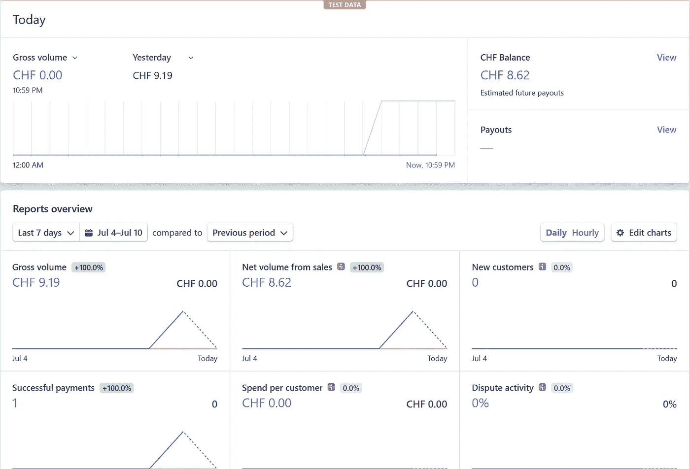
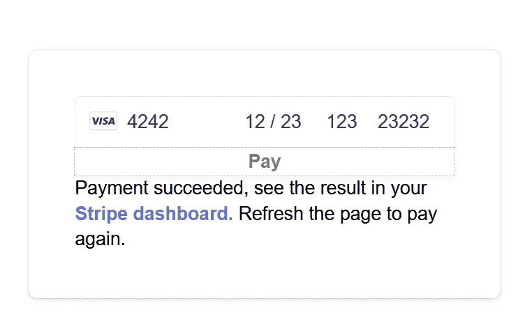

# 如何在没有后端的情况下将带 Stripe 的卡支付集成到您的 Web 应用程序中

> 原文：<https://javascript.plainenglish.io/how-to-integrate-card-payment-with-stripe-into-your-web-app-6bf17e0108ef?source=collection_archive---------3----------------------->

## 使用 React & Azure 函数的分步指南


Photo by [Paul Felberbauer](https://unsplash.com/@servuspaul?utm_source=medium&utm_medium=referral) on [Unsplash](https://unsplash.com?utm_source=medium&utm_medium=referral)

作为我和我的朋友[德扬](https://medium.com/u/974f70f18518?source=post_page-----6bf17e0108ef--------------------------------)的第一个#100DaysOfCode 挑战，我们决定在 100 天内创造三个产品，每个产品的运行成本不到 10 美元/月。我们创造的第一个产品是 [EIOPA rates API](https://www.yield-curves.com/) 。如果你有兴趣看我们的进度和每个产品的代码，欢迎在 Twitter 上关注我们([颖](https://twitter.com/fu_yingying)、[德扬](https://twitter.com/simicdds))。

创建可销售产品的一个重要部分是将信用卡支付整合到你的网站中。

在本文中，我将向您展示如何将 Stripe 集成到您的 React 应用程序中。

涵盖的主题概述:

*   如何在线处理支付
*   我们为什么选择条纹
*   如何集成 Stripe API
*   如何测试 Stripe API

它代表了我们的经验和我们的选择推理，它绝不是唯一的好办法。在这篇博文中，我想与你分享如何复制我们所经历的平稳整合。

# 如何在线处理支付

作为一个 web 开发新手，我有很多问题要从这里开始。首先也是最重要的，你的网站是如何付款的？


Photo by [Campaign Creators](https://unsplash.com/@campaign_creators?utm_source=medium&utm_medium=referral) on [Unsplash](https://unsplash.com?utm_source=medium&utm_medium=referral)

事实证明，这个问题的答案也是理解如何将支付整合到网站中的关键。(这仅包括 API 模式，还有其他集成支付的模式[1])

**首先**，一个客户来到你的网站，选择了一个产品。通过点击产品的链接，浏览器可以存储`service`信息。

**然后**，该信息通过`Checkout Form`发送到服务器，服务器用存储在其上的密钥处理该信息。

**最后**，付款被进一步转发给 [PSP](https://en.wikipedia.org/wiki/Payment_service_provider) 。PSP 是一个支付服务提供商，负责处理与银行的支付和清算。

上述过程表明:

1.  你需要一个在线产品
2.  您需要建立一个结帐表单(通过购买链接触发)
3.  您需要一台服务器(或者使用功能即服务来实现无服务器化)

本教程的重点是第二和第三点。我会写一个单独的教程，如何使支付形式美丽，一旦我们完成了建立基础。

# 为什么我们选择条纹

在进入实现模式之前，我想和大家分享一下我们选择 Stripe 的原因。有四个主要考虑因素:

1.  **适宜性**:我们的网站是销售金融产品的，我们不是网店，所以没有选择 *Shopify* 或*亚马逊支付*等网购平台。另一方面，*条纹*一般适合商家。
2.  **成本**:由于我们的目标是拥有<10 美元/月的固定运营成本，因此剔除了每月固定费用+每件产品可变成本的产品( *PayPal* 、*Authorize.net*)。 *Stripe* 要求每笔交易收取 2.9% + 30cc 可变费用。
3.  易于集成 : *Stripe* 有一个非常好的关于如何集成支付 API 的[文档](https://stripe.com/docs/payments/integration-builder)。
4.  **仪表板** : *条纹*的仪表板提供了轻松监控交易和分析业务的可能性。



Stripe dashboard for business

# 如何集成 Stripe API

所以我们选择条纹的。下一个问题是如何将它嵌入到我们的 web 应用程序中？下面的 GIF 展示了我们第一次整合到我们的网站时的样子。


你可以在其[网站](https://stripe.com/docs/payments/integration-builder)中找到 Stripe API 的文档，我将使用 Stripe 所展示的相同示例，以避免额外的信息让你生吞活剥。你也可以在我们的 GitHub [repo](https://github.com/simicd/yield-curves/tree/feature/integrate-stripe) 中找到所有代码。

## 第 1 部分:创建 React 应用程序

前端包括三个文件:

*   **Checkout.jsx** :这是结账页面的内容
*   App.jsx :这是你调用结帐页面的地方
*   Checkout.css :这是默认包含的样式表

要运行它们，您需要设置 React 应用程序并安装文档中提到的必要的条带库。

## **1。创建结帐表单**

文档包括所有开始使用的代码，下面的例子是`CheckoutForm`与后端服务器交互以请求`clientSecret`的部分。

Checkout Form

*   *第 19–24 行:*转到服务器并发出 POST 请求。这个请求的主体是一个 json 格式，包含一个服务元素和一个字典列表:第一对包含键`id`和值`xl-tshirt`。
*   *第 30 行*:接收客户秘密值，该值是继续处理付款所需的密钥

一旦该步骤成功，其余的`CheckoutForm`模块使用条带包来处理不同的场景，如`submit`、`Change of details`等。

**2 .使用 App.jsx 中的结账表单**

使用文档中完全相同的代码，您应该能够让 React 应用程序为`CheckoutForm`运行。现在我们去`npm start`吧，你应该在你的浏览器里看到下面简单的结账表单。


Checkout Form

## 第 2 部分:为后端实现创建 Azure 函数

**1 .没有后端会发生什么**

通过上面的结账表单，您可以输入测试卡信息(条纹测试卡号:`4242 4242 4242 4242`任意未来失效日期、任意 CVC 代码、任意邮政编码)，但这只会导致您出错。


Error Checkout Form

浏览器没有收到继续处理交易所需的`clientSecret`。为什么会这样？它从哪里得到`clientSecret`的？

请记住，在上面的章节中，我们提到过反应应用需要向服务器提出请求，以获得`clientSecret`作为响应。这个错误消息不可避免地出现，因为我们还没有 REST API 调用的后端。

**2 .后端服务器选择**

对我们来说，让自己的服务器一直运行根本没有意义。拥有服务器的唯一目的是每当客户进入支付页面时触发开机自检请求以生成客户秘密。

因此，我们选择了 Azure 云服务来完成这项任务。Azure Functions [消费计划定价](https://azure.microsoft.com/en-us/pricing/details/functions/)包括每月 100 万次免费订阅请求和每月 40 万 GB-s 的资源消耗，这对我们来说是一个完美的计划，尤其是在我们的客户基础很小的时候。

**3 .Azure 功能背景**

本质上, [Azure 函数](https://docs.microsoft.com/en-us/azure/azure-functions/functions-overview)的功能是允许你在 Azure 云基础设施上运行一段代码，并且它只在调用该函数时被使用。这意味着您不需要让自己的服务器一直运行，也不需要担心基础架构。

在我们的例子中，我们使用 Azure 函数来编写 Rest API，以支持 React App 的请求。这仅在客户打算购买时使用。

**4。如何设置 Azure 功能**

作为先决条件，您需要在 Azure 门户上设置一个帐户，创建一个资源组，并在 Visual Studio 代码中创建一个本地 Azure 函数。这在[微软 Azure 的文档](https://docs.microsoft.com/en-us/azure/azure-functions/functions-create-first-function-vs-code?pivots=programming-language-python)中有很好的记录，我在这里就不详述了。

**5。如何创建 Python Azure 函数作为 Stripe 后端**

用 Azure 函数创建 REST API 非常简单。在几行代码中，您可以创建条纹支付所需的内容。我将一行一行地向您介绍代码。

*第 1–5 行*:导入所有需要的库

*第 9 行* : Stripe API key 是网站所有者(你)能够验证和处理交易的秘密密钥。您可以在开发人员 API 密钥下的条带控制面板中找到该密钥:


Stripe API key

*   对于本地测试，您可以将这个键包含在`local.settings.json`文件中

```
{
  "Values": {
    "STRIPE_API_KEY":  "your secret stripe API key"
  }
}
```

*   为了在服务器上运行，您可以通过`+ New application setting`将这个键包含在 Azure Functions 的配置部分中


Add Strip API key in Azure Functions Configuration

*   在你的代码中引用 API 键的方法很简单`os.environ[STRIPE_API_KEY]`

*第 11–21 行*:这是一个根据购买的商品在服务器上计算价格的功能。在服务器上计算价格的原因是为了避免客户端的操纵。

*第 24–40 行*:这里是构建 REST API 的地方。它本质上是说:从浏览器接收到的`service`信息中选取`id`，得到这个物品的价格并实例化一个`PaymentIntent`。`PaymentIntent`是 stripe 库中用于收集支付信息的对象。发送回浏览器的响应是`clientSecret`。

为了测试 REST API 是否工作，让我们去`cd azure-function`保存 azure 函数的地方。`func start`查看信息。如果是第一次初始化 Azure 函数，需要在`func start`之前`func init`。一旦该函数运行完毕，您将在控制台中看到正在运行的本地主机端口。


Azure Functions Localhost

*   `localhost:7071/api/stripe-payment`是我们感兴趣的，我们也可以使用 [Postman](https://www.postman.com/about-postman/) 与我们的 REST API 进行交互。
*   Postman 是测试你的 API 的一个很好的平台。您可以将本地主机位置插入到路径中，并选择要发出的请求类型(POST、GET 等。).在这种情况下，REST API 期望通过 body 从浏览器获得一些信息。因此，我们可以像在 React 应用程序中那样插入主体`{"service": {"id": "xl-tshirts"}}`。如果一切正常，我们应该会得到如下所示的状态代码为 200 的`clientSecret`(状态 OK)。


Postman response

**6。更新 React 应用程序中发出请求的路径**

由于我们还没有在真正的域上运行，React App 和 Azure 函数在不同的本地主机端口上运行。这意味着要进行测试，我们需要指定 REST API 在 React 应用程序中的运行位置。在我们的例子中，我们把它改成了`http://127.0.0.1:7071/api/strip-payment`。

```
useEffect(() => {
window
.fetch("http://127.0.0.1:7071/api/stripe-payment", {
 method: "POST",                               
 headers: {                                 
    "Content-Type": "application/json"                               },                 
 body: JSON.stringify({service: [{ id: "xl-tshirt" }]})                             })
```

**7。配置 CORS 设置**

> 跨源资源共享(CORS)是一种机制，它使用额外的 HTTP 头来告诉浏览器向在一个源上运行的 web 应用程序提供对来自不同源的选定资源的访问。出于安全原因，浏览器限制从脚本发起的跨来源 HTTP 请求。[1]

当我们在不同的端口运行 React App 和 Azure 函数时，它会向我们抛出一个 CORS 错误。


Cross-region request blocked

当我们将前端和后端设置为在同一个域上运行时，这种情况不会发生。但是对于本地测试，需要在`local.settings.json`文件中进行额外的设置。

```
{
  "Host":{
    "LocalHttpPort": 7071,
    "CORS": "*",
    "CORSCredentials": false
  }
}
```

一旦设置完成，我们可以再次运行它，现在我们得到一个状态 ok 响应！

*   注意:您需要重新启动 Azure 功能才能应用本地设置中的更改


Successfully received response from server

## 第 3 部分:运行 React 应用程序测试

现在我们已经为测试做好了准备！让我们再试一次`npm start`，并再次输入测试号码。


Test Stripe payment

这一次，当我们点击`Pay`时，我们进入了下一页:成功！



Payment successful

当我们前往仪表板时，我们将看到测试付款已经通过！


Stripe payment success on dashboard

# 结束语

希望一步一步的指南可以帮助你为你的网站设置条纹支付。我们发现最具挑战性的是 React 应用程序和后端服务器之间的连接。幸运的是，Azure Functions 为我们提供了非常好的解决方案来实现这一点。

如果您有本教程中未涉及的问题或遇到的情况，请告诉我们，我们将尝试更新本教程，以包含您的问题。

# 未来主题

对于我这样一个 web 开发新手来说，学习曲线很陡，很难理解所有东西是如何工作和组合在一起的，但是我相信，在正确的指导下，每个人都可以做到。

接下来我们将继续这个话题，用 tailwindcss 让支付表单看起来很漂亮，敬请期待。

以下主题都是我们应用程序的重要组成部分，我相信您在开发过程中也会经历类似的步骤:

*   创建收益曲线产品
*   用 React 和 tailwindcss 创建一个漂亮的网站
*   设置 Azure 功能
*   将谷歌分析整合到网络应用中

我们将在进行过程中写下每个主题，非常欢迎您在 Twitter [(Ying](https://twitter.com/fu_yingying) ， [Dejan](https://twitter.com/simicdds) )上加入我们，检查我们的进度和代码。

# 参考

[1]Eiji Kitamura(2017 年 11 月 22 日)，*将支付请求 API 与支付服务提供商集成*，[https://medium . com/dev-channel/Integrating-the-Payment-Request-API-with-a-Payment-service-provider-B6 a23 aa 44 BD 6](https://medium.com/dev-channel/integrating-the-payment-request-api-with-a-payment-service-provider-b6a23aa44bd6)

[2] MDN Wed docs，*跨区域资源共享*，[https://developer.mozilla.org/en-US/docs/Web/HTTP/CORS](https://developer.mozilla.org/en-US/docs/Web/HTTP/CORS)