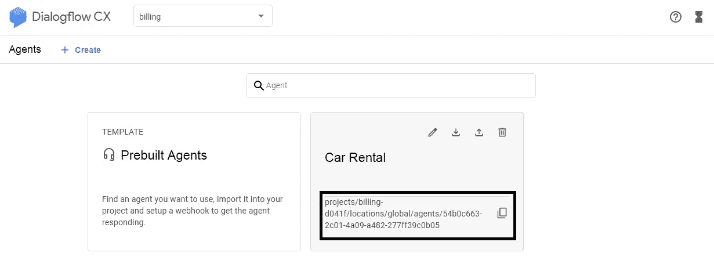

# 如何将 Dialogflow CX 和 ES 聊天机器人与 Angular 整合

> 原文：<https://javascript.plainenglish.io/how-to-integrate-dialogflow-cx-and-es-chatbot-with-angular-js-9fd26d82121e?source=collection_archive---------12----------------------->

有许多关于使用 Dialogflow 开发聊天机器人的帖子。但是创造聊天机器人还不够。将 Dialogflow CX 和 ES 连接到 web 界面更加有趣和具有挑战性。随着 Angular 成为一个受欢迎的新兴平台，这里是我们将 Dialogflow 聊天机器人与 Angular 集成的指南。

[**创建免费聊天机器人**](https://dashboard.kommunicate.io/signup)

在我们寻求简化聊天机器人与不同平台的集成时，我们之前已经编写了将聊天机器人与网站和应用程序集成的指南。

## 先决条件

首先，你需要一个 [Dialogflow](https://dialogflow.com/) 聊天机器人或者 Dialogflow 和 Angular 的工作知识。要将聊天机器人与 Angular 集成，您需要一个通信帐户。所有上述工具都可以免费试用。

如果您没有 Kommunicate 帐户，请在这里免费注册[—我们将在后续步骤中需要它。](https://www.kommunicate.io/product/dialogflow-integration)

# 集成 Dialogflow 聊天机器人和 Angular 的步骤

我将解释我是如何在通信的帮助下连接 Dialogflow 和 Angular 的。

*注意:为了保持简单明了，本教程用非常基本和简单的代码开发来解释。此外，这个项目可以在我的。要获得如何将机器人集成到网站的详细教程，您可以查看这里的*[](https://www.kommunicate.io/blog/integrate-bot-using-dialogflow-in-kommunicate/)**。**

# *步骤 1:创建您的 Dialogflow 聊天机器人*

*首先，您可以在 Dialogflow 中轻松创建一个聊天机器人，或者编辑他们提供的示例聊天机器人模板。为了更进一步，你可以创建你自己的意图和实体。*

# *步骤 2:将 Dialogflow 聊天机器人与 Kommunicate 集成*

*登录到您的[通信](https://www.kommunicate.io)仪表板，并导航到[机器人部分](https://dashboard.kommunicate.io/bot)。如果您没有帐户，您可以在这里创建一个[。找到“对话流”部分，然后单击“设置”。](https://dashboard.kommunicate.io/signup)*

*现在，导航到您的 Dialogflow 控制台并下载服务帐户密钥文件。以下是查找文件的步骤:*

1.  *打开 **Dialogflow agent** 设置(左侧面板上的齿轮图标)*
2.  *点击谷歌项目栏中提到的谷歌云链接*
3.  *在谷歌云页面中，点击 **API 的&服务**，导航至**凭证部分***
4.  *在“**凭证部分**下，找到服务帐户并点击 **Dialogflow 集成的编辑***
5.  *在屏幕底部点击**添加密钥**按钮并创建密钥选项， **JSON 密钥**将被下载*

*要将 **Dialogflow CX** 集成到 komunicate 中，请遵循相同的说明下载 JSON 密钥，并在 komunicate 仪表板中提及**代理 Id***

***获取代理 Id** :转到**对话流 CX 控制台** > > **在您已创建的代理中选择项目**>>‘将代理名称复制到剪贴板将采用下面提到的格式，其中代理 Id 为`54b0c663-2c01-4a09-a482-277ff39c0b05`*

```
*projects/billing-d041f/locations/global/agents/54b0c663-2c01-4a09-a482-277ff39c0b05*
```

**

*设置您的机器人的名称和个人资料图片，并选择是否允许[机器人向人类移交](https://www.kommunicate.io/blog/chatbot-human-handoff/)您新创建的机器人。点击**完成机器人集成设置**，瞧，你的机器人现在集成了。*

*[**免费试用 30 天**](https://dashboard.kommunicate.io/signup)*

*您可以使用以下路径检查/编辑您的集成机器人:*

*仪表板→机器人集成→管理机器人:你可以在这里检查你所有的集成机器人。*

*仪表盘→ Bot 集成。完成后，您的 Dialogflow 部分将有一个绿色图标，显示您成功集成的机器人数量。*

# *步骤 3:全局安装 Angular CLI。*

*要使用 npm 安装 CLI，请打开终端/命令提示符并输入以下命令:*

```
*npm install -g @angular/cli*
```

*现在，创建一个新的工作空间和初始应用程序项目。运行 CLI 命令 ng new，并提供名称 my-app，如下所示:*

```
*ng new my-app*
```

*初始的 app 项目包含一个简单的欢迎应用程序，可以运行了。Angular 包括一个服务器，以便您可以轻松地在本地构建和服务您的应用程序。*

*现在，导航到工作区文件夹(my-app)。*

*使用带-open 选项的 CLI 命令 ng serve 启动服务器。*

# *步骤 4:在 Angular 组件中安装聊天机器人*

*在角形组件上安装聊天机器人。CLI 将创建第一个角度分量。它是根组件，名为 app-root。*

*运行任何代码编辑器并打开工作区文件夹(my-app)。*

**注:组件是角度应用的基本构件。它们在屏幕上显示数据，监听用户输入，并根据输入采取行动。**

```
*@Component({
 selector: 'app-root',
 templateUrl: './app.component.html',
 styleUrls: ['./app.component.css']
})
export class AppComponent {
 title = 'My First Angular App!';
}*
```

*要安装聊天机器人，请打开 Kommunicate 并导航至仪表板→设置。点击配置部分下的[安装](https://dashboard.kommunicate.io/settings/install)。复制要添加到网站或应用程序中的 JavaScript 代码。*

*将 javascript 代码粘贴到 app.component.ts 文件中。组件的代码应该如下所示*

```
*[@Component](http://twitter.com/Component)({
    selector: 'app-root',
    templateUrl: './app.component.html',
    styleUrls: ['./app.component.scss']
})
export class AppComponent {
    title = 'my first app';
    ngOnInit() {
        (function(d, m) {
            var kommunicateSettings = {
                "appId": "<YOUR_APP_ID>",
                "popupWidget": true,
                "automaticChatOpenOnNavigation": true
            };
            var s = document.createElement("script");
            s.type = "text/javascript";
            s.async = true;
            s.src = "[https://widget.kommunicate.io/v2/kommunicate.app](https://widget.kommunicate.io/v2/kommunicate.app)";
            var h = document.getElementsByTagName("head")[0];
            h.appendChild(s);
            window.kommunicate = m;
            m._globals = kommunicateSettings;
        })(document, window.kommunicate || {});
    }
}*
```

*ng serve 命令启动服务器，监视您的文件，并在您对这些文件进行更改时重建应用程序。*

*-open(或者只是-o)选项自动打开您的浏览器到 [http://localhost:4200/](http://localhost:4200/) 。*

*如果你运行浏览器，你应该看到一个聊天窗口弹出，这意味着你的聊天机器人准备好了。这就是如何使用 Kommunicate 通过几个简单的步骤将 Dialogflow 聊天机器人与 Angular 集成在一起。*

*[**免费试用**](https://dashboard.kommunicate.io/signup)*

**原载于 2019 年 5 月 29 日*[*https://www . komunicate . io*](https://www.kommunicate.io/blog/integrate-dialogflow-angular-js/)*。**