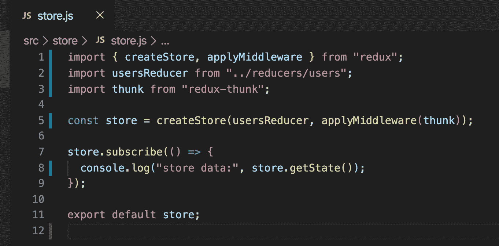
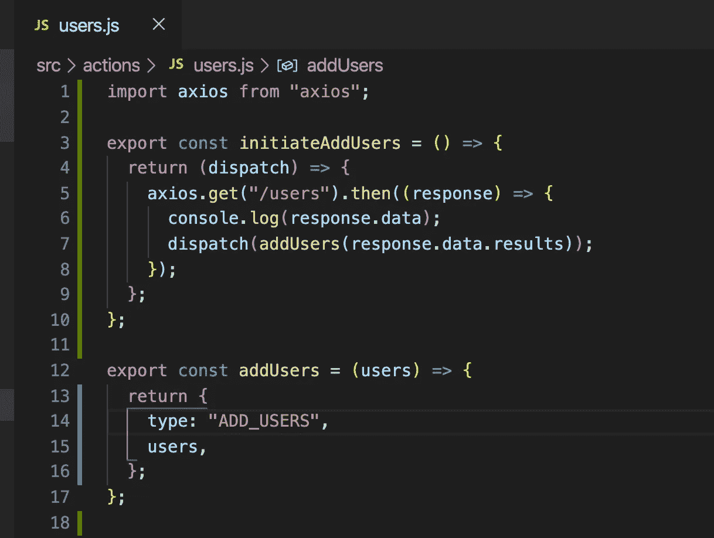
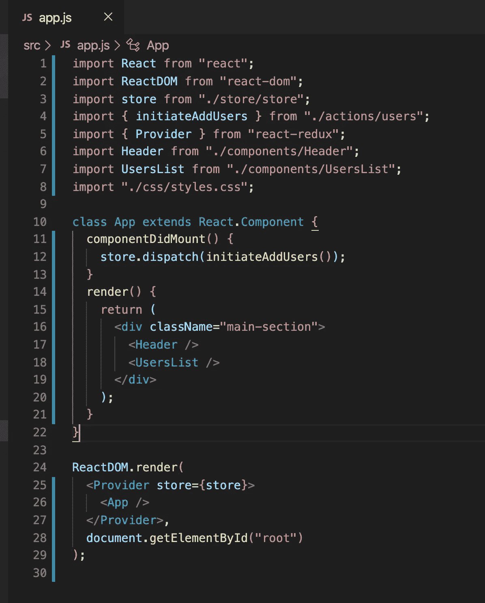
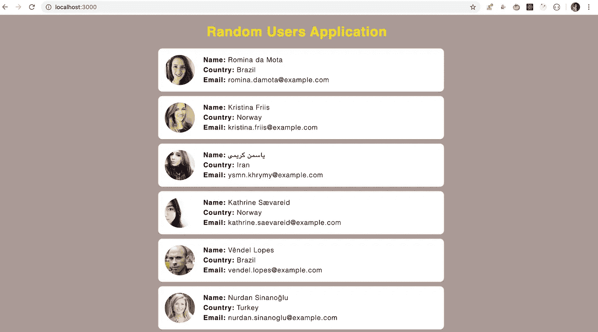
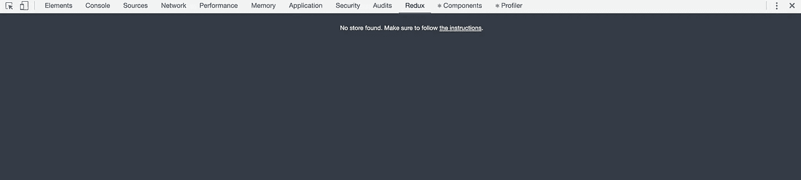
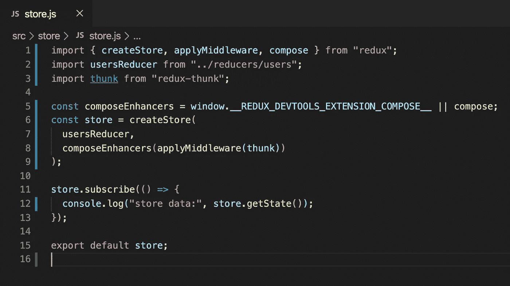
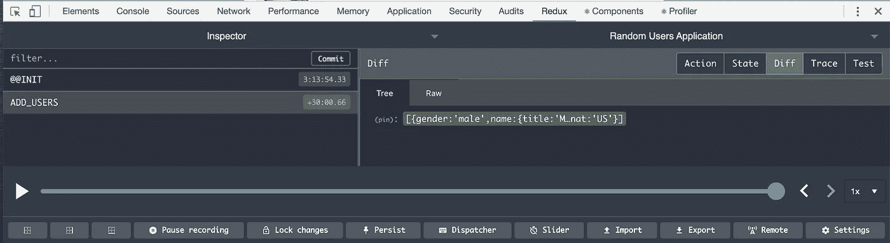
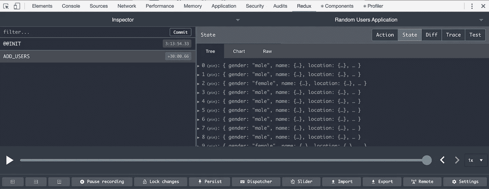

# 如何将 Redux Thunk 集成到您的 React 应用程序中

> 原文：<https://javascript.plainenglish.io/how-to-integrate-redux-thunk-into-your-react-application-cd92b87c1629?source=collection_archive---------2----------------------->

## 了解如何使用 redux thunk API 进行异步 API 调用


Photo by [Caspar Camille Rubin](https://unsplash.com/@casparrubin?utm_source=medium&utm_medium=referral) on [Unsplash](https://unsplash.com?utm_source=medium&utm_medium=referral)

在本文中，我们将了解 redux thunk 以及将其集成到 react 应用程序中的步骤。所以让我们开始吧

**什么是 redux thunk，我们为什么需要它？**

`Redux thunk`是一个中间件，允许我们编写异步代码来与商店交互。

> 因为 reducer 是一个纯函数，这意味着它不应该修改它的参数，也不应该产生副作用。此外，它应该同步工作，所以不建议在 reducer 内部调用异步 API。

为了解决这个问题，我们需要中间件，redux-thunk 提供了一种方法。

如果我们从动作文件中调用 API，只要我们需要 API 的响应就调用 dispatch，而不是调用`componentDidMount.`，这总是好的

首先，从这里的[克隆本文](https://github.com/myogeshchavan97/react_node_optimized)[中创建的](https://medium.com/javascript-in-plain-english/how-to-optimize-react-app-for-production-and-deploy-it-to-heroku-498fbf222de?source=friends_link&sk=9a2b48e4cafe7aaeca2cbd6f398d4f5d)存储库。

克隆完成后，通过依次运行以下命令来启动应用程序

```
1\. npm install
2\. npm run start
```

现在，您可以通过导航到 [http://localhost:3000/](http://localhost:3000/) 来访问该应用程序

通过从终端运行以下命令来安装`redux-thunk`库

```
npm install redux-thunk@2.3.0
```

如果你打开`src/app.js`，你会看到我们正在`componentDidMount`内部进行 API 调用，所以我们将把这个 API 调用移动到动作文件中。

打开`store/store.js`并添加让我们添加`redux-thunk`支持，这样我们就可以使用它。

为`redux-thunk`添加导入

```
import thunk from "redux-thunk";
```

这里，`thunk`是默认的导出，所以我们可以随意命名，比如

```
import reduxThunk from "redux-thunk";
```

从 redux 导入`applyMiddleware`并在`createStore`功能中使用

```
const store = createStore(usersReducer, applyMiddleware(thunk));
```



store.js

所以现在我们已经配置了我们的商店来使用`redux-thunk`中间件。

打开`src/actions/users.js`添加一个函数进行 API 调用。

```
export const initiateAddUsers = () => {
 return (dispatch) => {
  axios.get("/users").then((response) => {
   console.log(response.data);
   dispatch(addUsers(response.data.results));
  });
 };
};
```

另外，导入顶部的`axios`

```
import axios from "axios";
```



users.js

如果你注意到，以前我们有返回一个对象的`addUsers`动作生成器。当我们像这样从`app.js`调用`store.dispatch`方法时，这个动作对象被发送到 reducer

```
store.dispatch(addUsers(response.data.results));
```

现在，我们已经添加了`initiateAddUsers`函数，它将*返回一个接受`dispatch`作为参数的函数*，一旦它接收到来自`/users` API 的响应，它将调用我们的常规`addUsers`动作生成器，该生成器将把动作发送给我们的`usersReducer`，并且它将更新 redux 存储。

打开`src/app.js`，添加`initiateAddUsers`函数的导入，在`componentDidMount`方法中调用`initiateAddUsers`函数



app.js

**注意:**我们能够从`actions/users.js`中的`initiateAddUsers`函数返回一个自动传递了`dispatch`参数的函数，只是因为我们在`store.js`文件中添加了`redux-thunk`作为中间件

```
const store = createStore(usersReducer, applyMiddleware(thunk));
```

现在，通过重新运行`npm run start`命令重启应用程序，应用程序仍将像以前一样工作。唯一的区别是，我们现在已经将 API 调用从组件转移到动作文件，并使用`redux-thunk`来管理它。



Application

**配置 redux 开发工具**

如果你想看到存储的数据和分派给 reducer 的动作，你可以从[这里](https://chrome.google.com/webstore/detail/redux-devtools/lmhkpmbekcpmknklioeibfkpmmfibljd?hl=en)为 chrome 安装`redux devtools`

安装完成后，打开`chrome developer toolbar`并点击`Redux`选项卡，您将看到以下消息



No store found message in redux devtools

消息说我们没有存储，因为我们需要将开发工具配置添加到我们的代码中

点击**说明**链接，向下滚动到`"Advanced store setup"` 部分[此处](https://github.com/zalmoxisus/redux-devtools-extension#user-content-12-advanced-store-setup)

让我们对我们的应用程序进行这些配置更改。

打开`store/store.js`和`composeEnhancers`代码



store.js

现在，通过重新运行`npm run start`命令重启应用程序，并检查 redux 选项卡。您将在左侧部分看到调度动作`ADD_USERS`



redux devtool

点击右侧部分的`state`子菜单(默认选择`Diff`),您将看到 redux store 中添加的所有数据



Redux store data

你可以在这里找到这个应用程序的完整源代码

今天到此为止。我希望你学到了新东西。

**别忘了订阅我的每周时事通讯，里面有惊人的技巧、窍门和文章，直接在你的收件箱** [**这里。**](https://yogeshchavan.dev/)