# 如何将 Vue 集成到 Rails 应用程序中—第 1 部分

> 原文：<https://javascript.plainenglish.io/how-to-integrate-vue-into-a-rails-app-part-1-32ce8f68f54c?source=collection_archive---------3----------------------->


作为介绍，我会解释我在这个博客上做了什么，所以你会对此有一个想法。此博客旨在为希望将后端集成到 Vue.js 的中级人员提供基本的 Vue.js。重要的一点是，我们不只是在处理 ROR，无论后端是什么，如果我们有基于后端的认证可用，我们都遵循前端的通用路径。

# 我们在这里做什么！！

在这一部分中，我们只讨论身份验证机制、警报和部署。 ***Todo 和 crud 将在第 2 部分讨论。***

1.  在 ROR 后端之上创建一个 Vue.js 应用程序
2.  来自 Vue.js 的认证
3.  Vuex 用于状态管理。
4.  Vue.js 中的 CRUD 应用
5.  Vue.js 中不错的提醒
6.  将应用程序部署到 netlify

N ***注:*** 我将添加我的 github 链接，在我更改代码的地方，它将被指向 **GitHub-link**

# 我们如何做到这一点？

1.  创建 Vue.js 应用程序并安装依赖项
2.  创建身份验证组件
3.  设计登录页面和导航栏
4.  添加 Axios，为什么？
5.  实现登录功能
6.  为登录实现 Vuex
7.  重构代码
8.  小管家
9.  实现签出功能。

# 1.创建 Vue.js 应用程序并安装依赖项

1.  创建 Vue.js 应用程序
2.  选择应用程序的功能
3.  删除搭建的代码
4.  创建应用程序结构
5.  为设计添加价值

**1。创建 Vue.js 应用程序**

我已经使用 yarn 安装了 vue-cli，所以我将依赖 yarn

```
vue create todo_vue_app
```


**2。选择应用程序的功能**

现在，是时候选择我们的应用程序所需的功能了，将在我选择的地方添加屏幕。

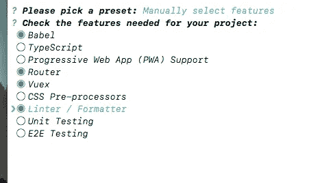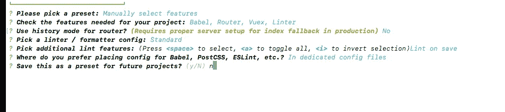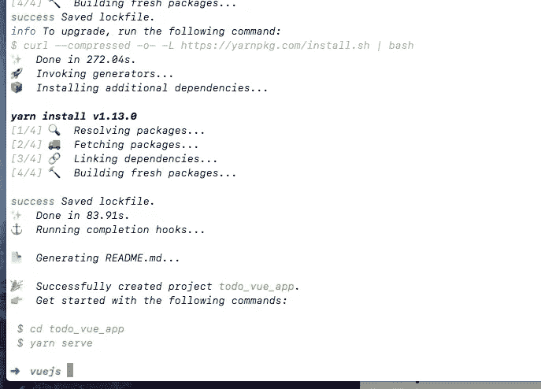

太棒了，我们的基本应用已经准备好了，我们可以开始使用服务器了

```
cd todo_vue_app && yarn serve
```

***G***[***itHub-link***](https://github.com/anoobbava/todo_vue_app/commit/4f6d23e7f7218ace8085726b5021067ec0a0361a)

**3。移除脚手架代码**

当一个应用程序被创建时，Vue.js 会提供一些基本的功能，比如一些组件和其他文件，我们会移除`HelloWorld.vue`和一些样式，如果你真的想知道，请查看下一个 GitHub-link

[***GitHub-link***](https://github.com/anoobbava/todo_vue_app/commit/3f82a0227989218733a9694fe87cb52a1168d641)

**4。创建应用程序结构**

我们将为我们的应用程序创建一些结构，因为它有一些 API 调用和一些布局的东西。如果你喜欢，请随意选择你自己的结构。

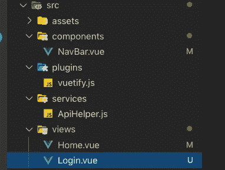

**组件:**将驻留我们的组件。

**服务:**将包含我们的 API 调用和任何其他库，如警报代码文件等。

**视图:**将有我们的模板文件，就像`Home.vue`是我们的基本模板，`Login.vue`将包含我们的登录模板文件。

**5。为设计添加验证**

`Vuetify`是设计库，用于模板和一些内置组件，如工具栏和日历等。

我们可以将它添加到项目中，使用

```
vue add vuetify
```

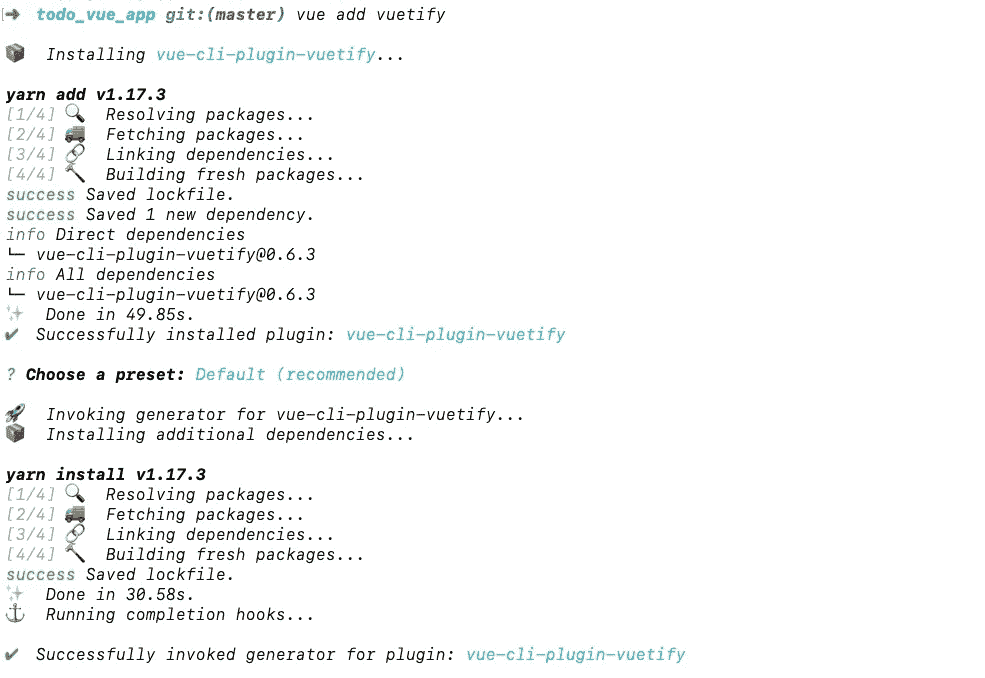

[***GitHub-link***](https://github.com/anoobbava/todo_vue_app/commit/6a68152795c33a9f3b763128d81fb53c732f6d55)

# 2.创建身份验证组件

现在，我们需要创建一个页面，用户需要输入电子邮件和密码。这就是我们的登录页面出现的地方。还需要使用 Vue.js 提供的路由器。

1.  为登录模板创建 Login.vue
2.  用 Login.vue 链接路由器
3.  使用 URL 进行测试。
4.  **为登录模板**创建 Login.vue

创建一个名为 Login.vue 的文件，该文件包含登录页面，该页面将驻留在我们的`src/views/Login.vue`中

作为一个基本，我们的文件只包含这么多，以后会添加。

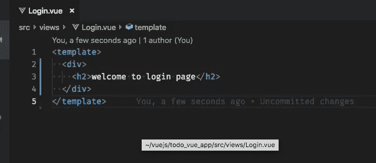

**2。用 Login.vue** 链接路由器

`vue-router`是一个额外的库，处理路由功能，SPA 应用中的参数处理。

所有路线都登记在我们的`src/router.js`里。默认情况下， `Home.vue`是添加在那里的，我们需要做的是导入我们的`Login.vue`并注册我们的登录页面。

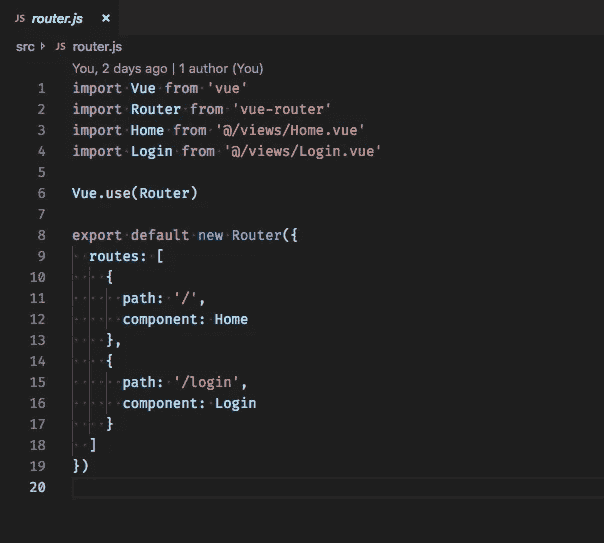

**3。使用 URL 进行测试**

现在是测试时间，当我们进入`[http://localhost:8080/#/](http://localhost:8080/#/)`时，我们将指向主页。

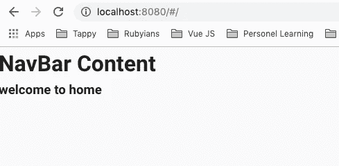

同样当我们输入`[http://localhost:8080/#/](http://localhost:8080/#/)login,`

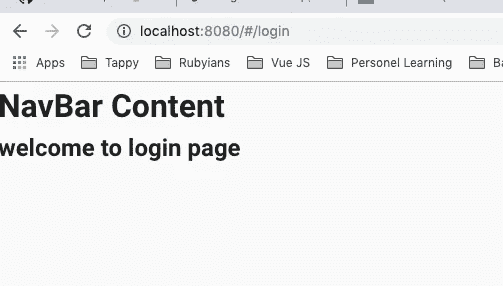

我知道，我已经在图像中添加了一个额外的`navbar`，将在下面介绍。

[***GitHub-link***](https://github.com/anoobbava/todo_vue_app/commit/73beb2c0124347d461a1b99906d1f8a35a022da9)

# 3.设计登录页面和导航栏

这里，我们设计了用于登录和注销的`navbar`,添加了 todo 功能。以下是我们的预期行为。

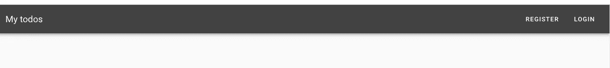

user is not signed in

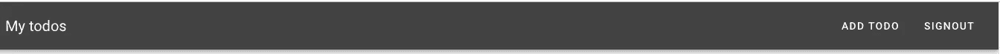

when user is signed in

1.  设计导航条
2.  设计登录页面
3.  **设计导航条**

Navbar 将驻留在我们的`src/components/NavBar.vue`

该文件的完整代码如下。增加了两种重定向到主页和登录页面的方法。

[***GitHub-link***](https://github.com/anoobbava/todo_vue_app/commit/99762816b1f3f4e6bf07f2667d73ba97d23502a4)

**2。设计登录页面**

目前，我们的登录页面没有文本字段，需要添加这些。

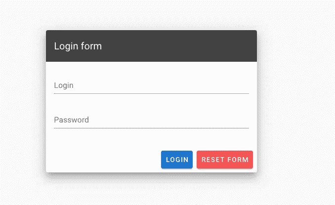

太棒了，现在我们也有了一个很好的登录界面。我们可以继续使用应用程序中的登录功能。

# 4.添加 Axios，为什么？

为了实现登录，我们需要使用一个库来处理我们的 http 请求并回复响应。Vue.js 已经有一个内置插件，但在这里，我们使用的是第三方插件 axios，这是目前的趋势之一。主要优点是对**处理成功/失败案例也有承诺支持**。

安装由

```
yarn add axios
```

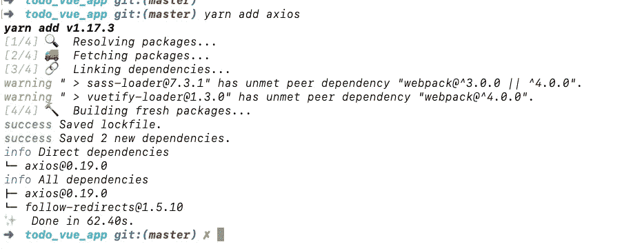

[***GitHub-link***](https://github.com/anoobbava/todo_vue_app/commit/8431fa470f5b3a5f852a7edd7e590fc4b0ac498f)

# 5.实现登录功能

现在，是登录的时候了。最初，我们需要将我们的`axios`链接到 Vue.js，这样所有的 http 请求将只通过我们的`axios`。

需要解释的一件重要事情是，我们的 Vue.js 应用程序如何与 ROR 一起工作。俗话说，一张图胜过一千个字。

**用户添加邮箱和密码时**

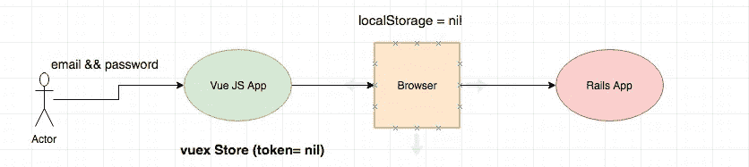

在基于令牌的身份验证中，令牌是我们的替代密码。Vuex 最初为空，所以请求通过浏览器传递给 Rails 应用程序，由 Rails 应用程序处理。

**当邮箱/密码成功时。**

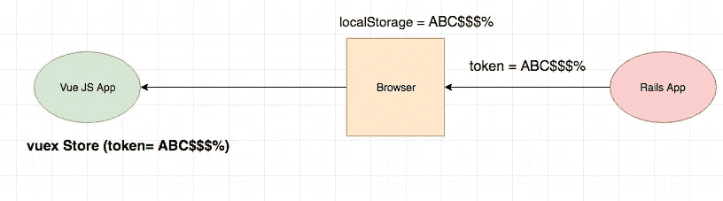

它将返回令牌，并使用 localStorage 和 Vue.js 应用程序 Vuex 将其保存到浏览器中。当页面刷新时，Vuex 中的内容将被删除，这也是我们保存令牌浏览器的原因。

**每一个后续请求，**

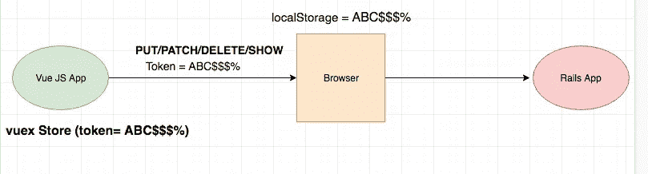

以上是我们的工作行动，现在我们能做的是功能性，

**将 axios 注册到 Vue.js 中**

首先需要将 axios 导入到我们的`src/main.js`

```
import axios from 'axios
```

然后，需要获取本地存储中可用的令牌，然后我们需要使用它并在 axios 头中设置。

```
const token = localStorage.getItem('token')
```

下面是我们整个文件的内容

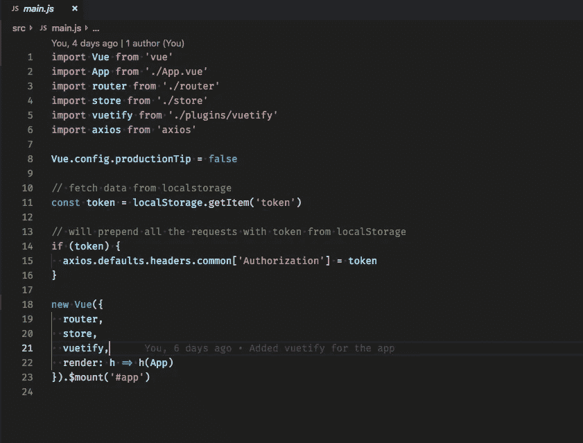

**接受用户的电子邮件和密码**

我们已经为电子邮件和密码文本字段创建了用户界面，现在我们需要将它们链接到我们的应用程序，这可以使用 **v-model 来解决。**类似于 getters 和 setters。它们在我们的脚本部分中声明，并使用我们的 v-model 属性进行链接。

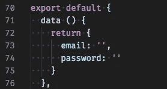

declare email and password as data property

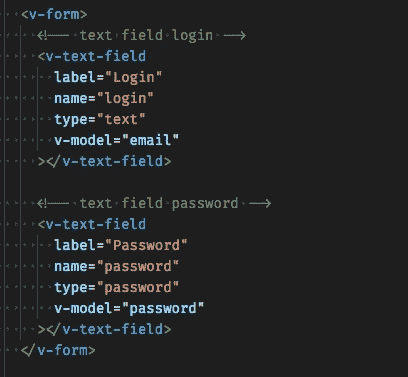

link the data property to the fields

**添加复位按钮清除数据**

这将是很好的，如果我们有一个按钮来重置电子邮件和密码，这可以通过调用按钮来处理，并用 `this.property`关键字清除电子邮件密码的数据。

```
<v-btn
  color="error"
  [@click](http://twitter.com/click)="resetForm"
  class="reset">
  Reset Form
</v-btn>//reset button
resetForm () {
  this.email = ''
  this.password = ''
},
```

[***GitHub-link***](https://github.com/anoobbava/todo_vue_app/commit/9aa176c010f01d33e62f9fbbdd8497257045f820)

# 6.为登录实现 Vuex

到目前为止，我们已经创建了用户登录页面、电子邮件/密码数据，然后我们需要使用 Vuex 实现登录过程，并调用 API 和响应是否成功/失败。为此，需要设置 Vuex 结构。如果你不知道 Vuex，我推荐你通过这个[链接](https://medium.com/js-dojo/vuex-and-vue-bread-and-butter-4519a21e95ce)。

下图将解释我们将如何使用 Vuex。

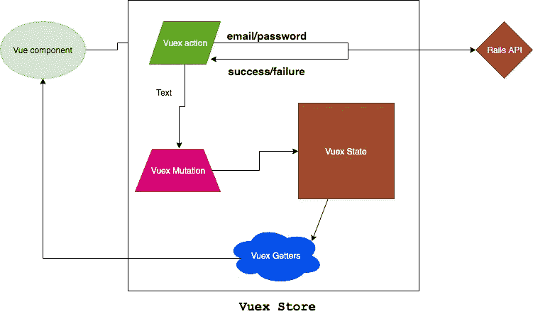

要做到这一点，需要在 Vuex 中创建动作、getters、突变和状态。下面是我们的 Vuex 文件的基本结构。

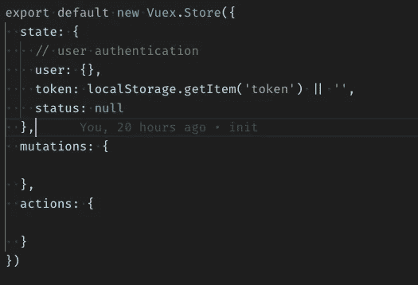

**Vuex 状态**

`user`将保存从我们的 Rails API 获取的用户对象，`token`将保存我们的 auth_token，`status`将指示用户登录成功/失败。在 API 响应之后，我们将通过动作用突变更新所有这些状态。

**Vuex 突变**

突变是更新我们状态的关键因素。**我们可以省略我们的动作直接调用我们的**突变，但是我们当我们有一个异步任务并且可以通过使用动作来完成的时候**突变只是同步过程**。

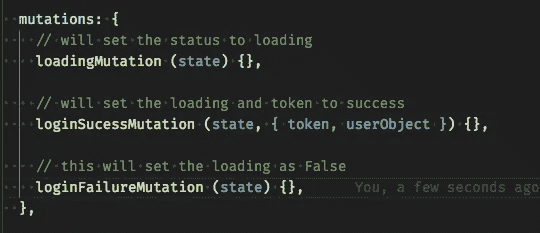

`loadingMutation:` 将设置状态为加载中

`loginSucessMutation`:将登录设置为成功，并更新用户资料

`loginFailureMutation`:将登录设置为失败，并清除用户详细信息。

**Vuex 动作**

将从 Vue 组件调用动作，Vue 组件将依次调用 API 并获取响应，调用突变并更新 Vuex 状态。

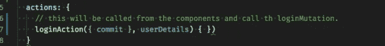

[***GitHub-link***](https://github.com/anoobbava/todo_vue_app/commit/8f6c26861515e57799f06d9ebc73887db4765ed9)

现在，是真正行动的时候了；)


**调用执行逻辑**的动作

我们定义的动作将接受用户详细信息，并使用`axios`调用 API 并获取响应。如果响应成功，它将调用`loginSucessMutation`，如果响应失败，它将调用`loginFailureMutation`并分别更新状态。


**突变过程**

当动作调用突变时，有了响应，突变将接受参数并更新状态。

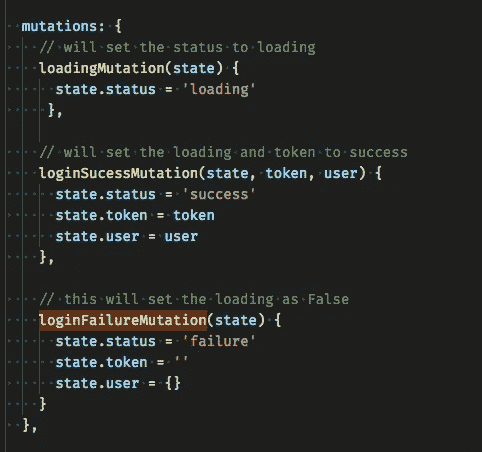

我们已经实现了很多，现在我们可以从 UI 调用动作(Vue 组件。).为此，我们在 Vue.js 模板中使用了`mapActions`。如果你想了解更多关于`mapActions`的信息，请点击[链接](https://vuex.vuejs.org/guide/actions.html)

1.  需要将`mapActions`导入我们的 Vue.js 模板。
2.  将电子邮件和密码传递给`mapActions`
3.  测试我们的代码

在脚本标签中导入`mapActions`

```
import { mapActions } from 'vuex
```

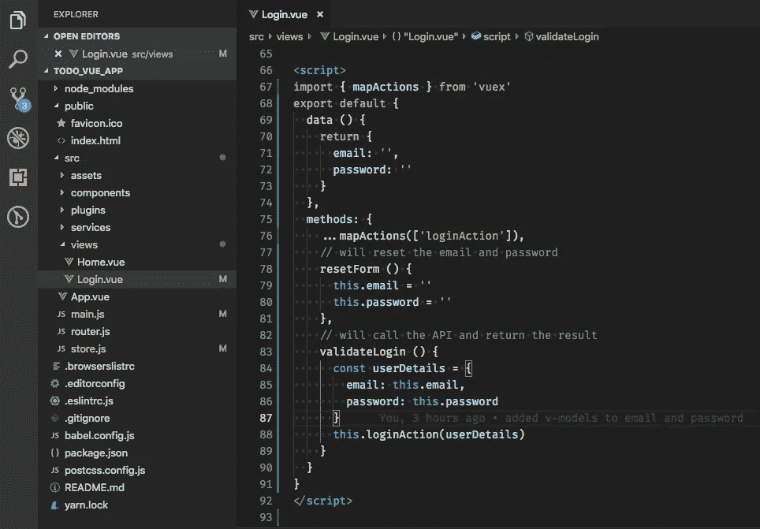

就这样，现在我们可以测试我们的代码了，

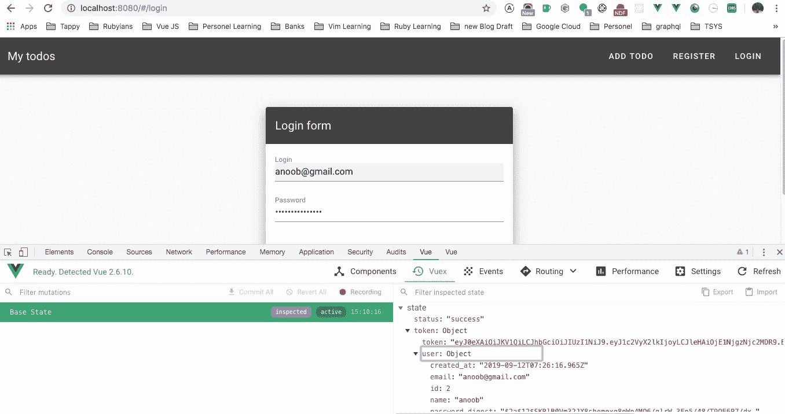

太棒了，现在我们需要对 Vuex 进行一些重构，并在登录后进行一些重定向。

[***GitHub-link***](https://github.com/anoobbava/todo_vue_app/commit/a439fe7a0534b07c04aefbb03dd37f7efaf173df)

# 7.重构代码

## 重构我们的 API 端点

我们的代码可以正常工作，但是如果我们想要改变 API url，需要更新代码，所以如果我们将 API 端点移动到`.env`文件中会很好。为了做到这一点，

1.  在根路径中创建一个`.env`文件并添加端点。
2.  通知 Vue.js 我们将使用来自`.env`文件的 API 端点

> **重要提示:**添加端点时，在端点前加上**VUE _ 应用 _ 你的端点名**。相信我，我已经因为认为我的 API 失败而浪费了一天的时间。

要通知 Vue.js，需要在我们的 store.js 或者调用 axios 的地方添加下面的代码。

```
axios.defaults.baseURL = process.env.VUE_APP_RAILS_API_URL
```

现在，我们只需要为 axios 调用设置搜索字符串/请求，如下所示，

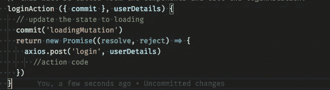

[***Github-link***](https://github.com/anoobbava/todo_vue_app/commit/9ace770454e911a6398070984d1e5847decc3048)

## 重构我们对服务文件夹的 API 调用

我们已经在`src/services/ApiHelper.js`中创建了一个文件

这个文件将包含我们的代码，就像 API 一样，所以我们可以把我们的 API 调用逻辑从 Vuex 文件中移出，放到它自己的文件中。为了做到这一点，

1.  在`src/services/ApiHelper.js`中创建一个文件
2.  导入`axios`(因为 API 是从文件中调用的)
3.  设置默认 API URL
4.  创建一个将被 Vuex 动作调用的函数并返回响应。

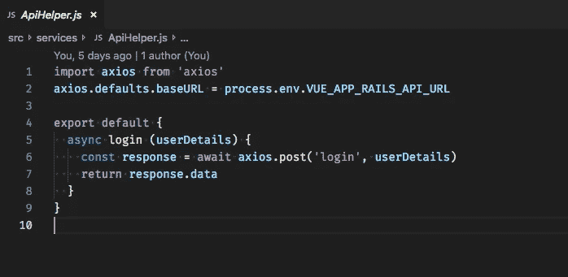

如果你想知道，为什么我使用异步/等待。更好的做法是使用 async/await 使我们的函数异步，它将等待响应(返回承诺)。如果您想了解更多信息，请使用此[链接](https://javascript.info/async-await)。

[***GitHub-link***](https://github.com/anoobbava/todo_vue_app/commit/5d325292d52ab092588f5674f0cb9223dca4a6e6)

**重构我们的 Vuex 商店**

在一个 Vuex 流程之后，我们的 Vuex 商店有点大，想象一下一个大项目，那么我们的 Vuex 商店会相当大。为了解决这个问题，我们将使用 Vuex 中的模块概念。为了做到这一点，

1.  在我们的`src/`中创建一个名为`store`的文件夹(或者你可以使用你自己的文件夹)
2.  将我们的`src/store.js`文件移动到`src/store/`路径
3.  将我们的`src/store.js` 文件重命名为`src/store/index.js`(这将是我们的根存储文件夹)
4.  在 `src/store`中创建另一个文件夹`modules`，并在里面创建另一个文件`src/store/modules/user.js`
5.  将我们的用户相关代码从`src/store/index.js` 移到`src/store/modules/user.js`
6.  将 user.js 链接到我们的存储根文件夹，导入该文件，并将用户声明为我们存储中的一个模块。

我们最终的根存储(`src/store/index.js`)将会是这样的，

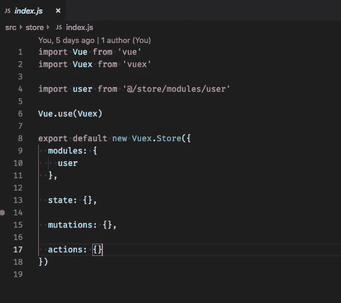

我知道，这有点混乱，但它使我们的 Vuex 文件简单易懂，我在下面添加了提交。如果你想知道这些变化，请访问下面的链接。

[***GitHub-link***](https://github.com/anoobbava/todo_vue_app/commit/6a8c464fd191a82c67a3030863c0085fd8f0e543)

# 8.小管家

这里我们讨论了一些基本的错误/问题，

1.  如果用户未登录，则呈现登录页面
2.  成功登录后重定向到主页
3.  将警报显示为成功/失败。
4.  如果用户提供了无效的凭证，请停留在登录页面

## 如果用户未登录，则呈现登录页面

如果用户没有签名，我们可以使用 Vuex getters 找到。为此，需要在`store/modules/user.js`中创建 getters

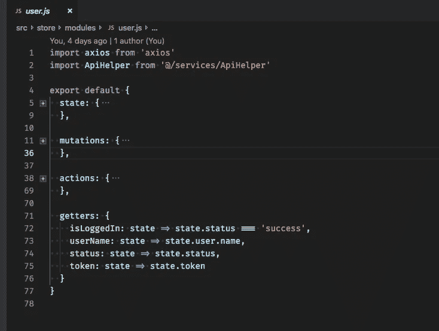

> 吸气剂是一些将提供我们的当前状态的 Vuex 将可用于组件。

为此，需要使用 Vuex 的`mapGetters`。它将使用`mapGetters`提供状态。我们能检查的最好的地方是我们的`App.vue`

需要导入`mapGetters`并在计算的属性中使用它。现在我们可以直接调用`this.isLoggedIn`，并根据响应进行重定向。

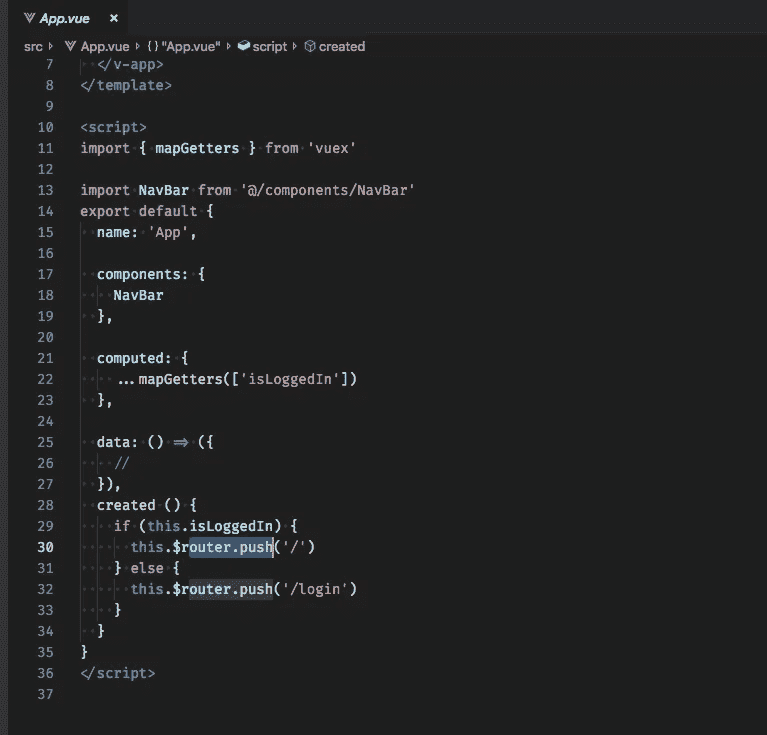

**成功登录后重定向至主页**

我们可以使用上面使用的相同逻辑，在`Login.vue`文件的操作中创建一个回调

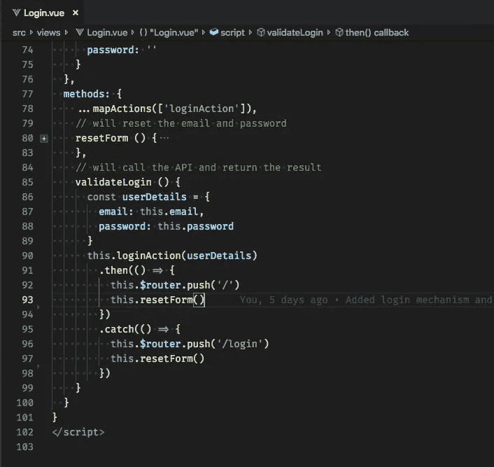

**将预警显示为成功/失败。**

警报是人们热切期待的部分。为此，我们可以使用`sweetalerts2` [链接](https://sweetalert2.github.io/)

安装由，

```
yarn add sweetalert2
```

为了实现`sweetalert2`，

1.  创建一个名为`src/services/SweetAlert`的文件(将我们的代码放在 self 模块中)。
2.  将`sweetalert2`导入到该文件中。
3.  创建警报功能。
4.  在我们的 Vue.js 模板中导入警报。

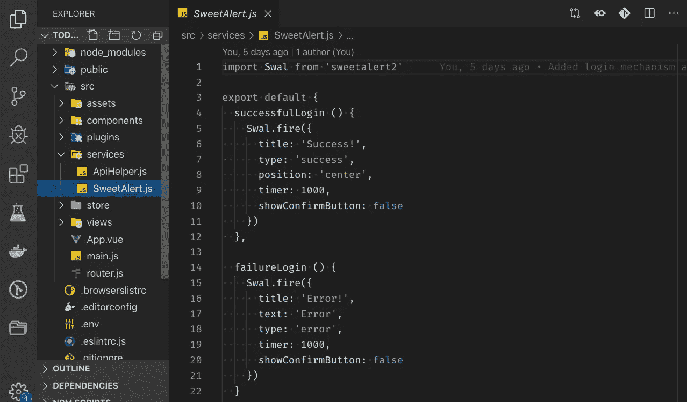

`successfulLogin`和`failureLogin`功能用于响应。你可以选择自己的名字。如果您想要定制，请访问 sweetalert2 链接。

我们可以使用`import`命令将这些方法导入我们的文件。之后我们可以直接调用`Login.vue`文件中的`SweetAlert.successfulLogin()`

下面是一个例子，我们将在登录成功时调用`SweetAlert.successfulLogin()`，在登录失败时调用`SweetAlert.failureLogin()`。

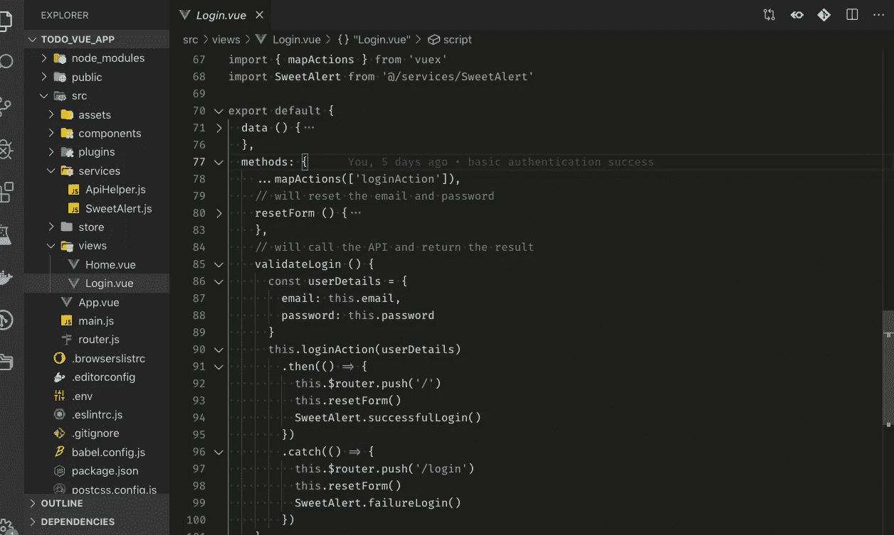

Login Response Alert

[***GitHub-link***](https://github.com/anoobbava/todo_vue_app/commit/b0d00909c1fc5f0a830dc930caacebd6327c25ab)

# 9.实现签出功能。

目前，我们正在使用`navbar`功能登录。因此，如果用户仅登录，则需要显示登录和注销链接。我们可以使用`isLoggedIn` getters 轻松实现这个特性。

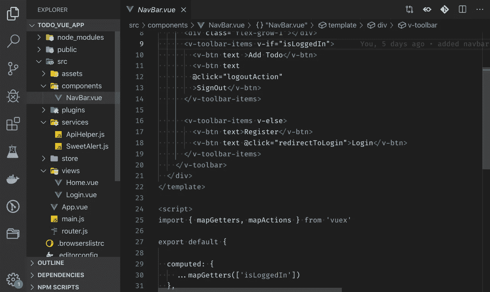

[***GitHub-link***](https://github.com/anoobbava/todo_vue_app/commit/cbdc80de4fca03fd0cb0e69a9e0d57eba24042d3)

现在，我们可以继续使用注销功能，为此，

1.  在`Navbar`中创建一个退出按钮，该按钮将调用 Vuex 退出动作
2.  Vuex signoutAction 将调用 Vuex 突变
3.  Vuex 突变会将状态清除到原始值


only required code alone(Vue.js Template)

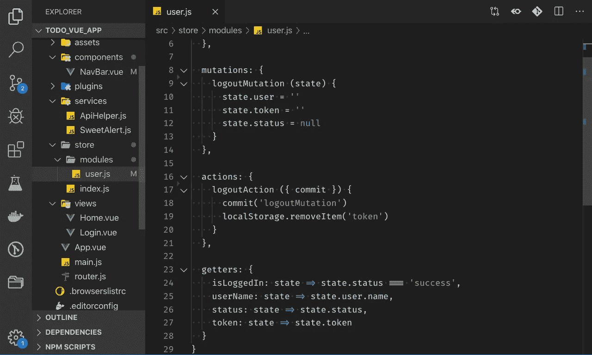

Vuex code with Action and mutation

[***GitHub-link***](https://github.com/anoobbava/todo_vue_app/commit/e9bffa0d856ba48ee4bc6f773bfcc0e601658b55)

就这样，谢谢大家看完这个，喜欢的请做评论或者鼓掌。将在第 2 部分中发布 todo API 数据获取和更新。[第二部分链接](https://medium.com/javascript-in-plain-english/how-to-integrate-vue-into-a-rails-app-part-2-1e79e25ffc30)

谢了。

注意:我在下面发布了代码细节，

```
ROR Heroku deployed endpoint: [https://todorailsapiapp.herokuapp.com/](https://todorailsapiapp.herokuapp.com/)Vue.js App app deployed link in netlify: [https://todo-vue-app.netlify.com/#/login](https://todo-vue-app.netlify.com/#/login)email/password in heroku endpoint: anoob@gmail.com/anoob@gmail.comGitHub-link for Vue.js App:[https://github.com/anoobbava/todo_vue_app](https://github.com/anoobbava/todo_vue_app)GitHub-link for the ROR App: [https://github.com/anoobbava/todo_api](https://github.com/anoobbava/todo_api)
```

> 如果这个故事对你有所帮助，请随时[给我买杯咖啡](https://www.buymeacoffee.com/anoobbava)

人员详情: [GitHub-link](https://github.com/anoobbava) 。 [Linkedin 链接](https://www.linkedin.com/in/anoob-k-bava-676b3337/)

## [第二部分链接](https://medium.com/javascript-in-plain-english/how-to-integrate-vue-into-a-rails-app-part-2-1e79e25ffc30)