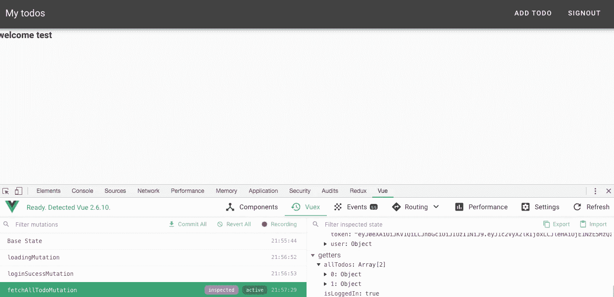
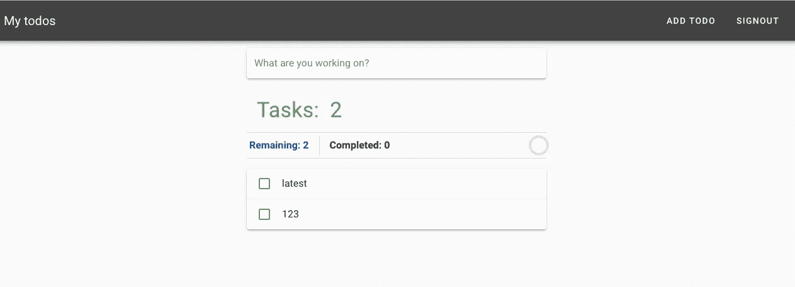
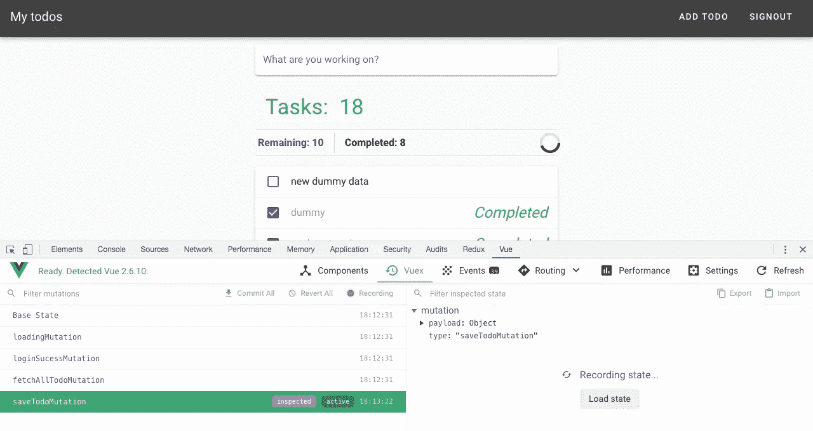
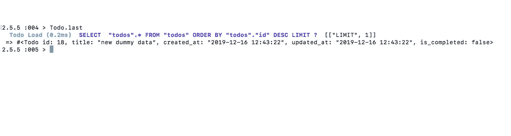
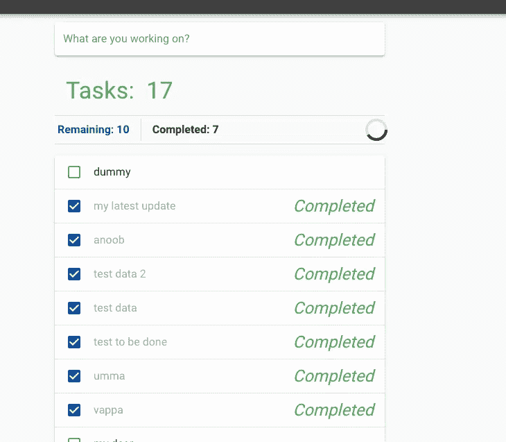
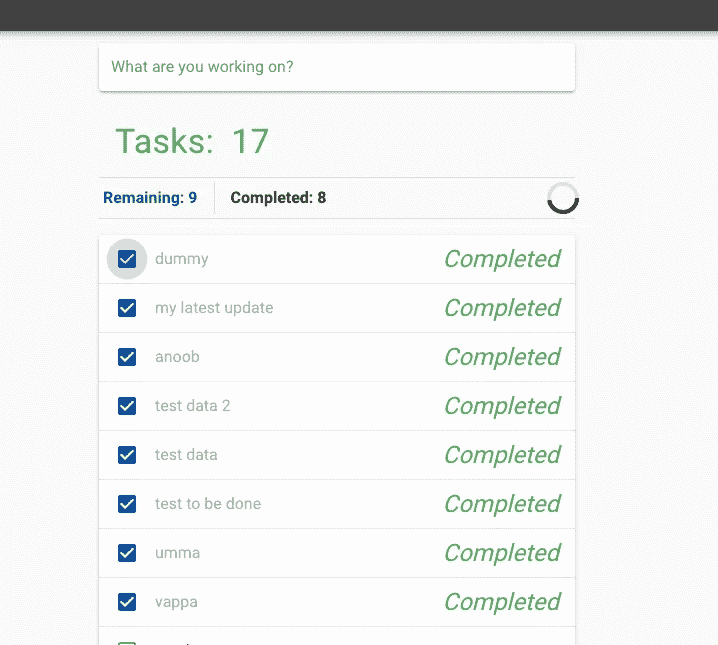
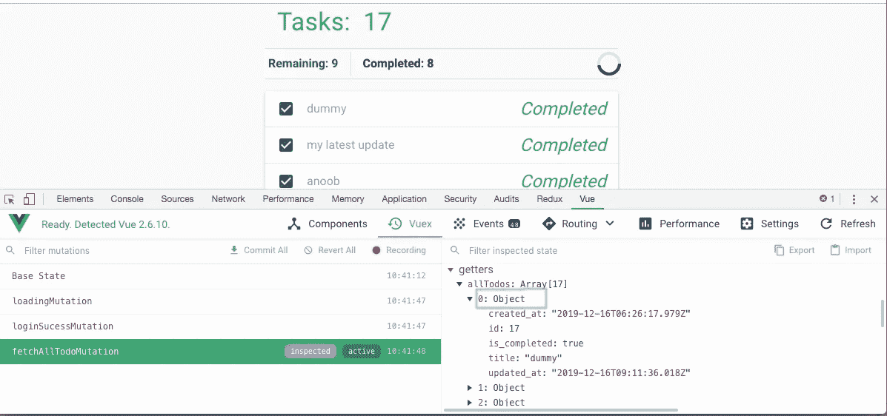
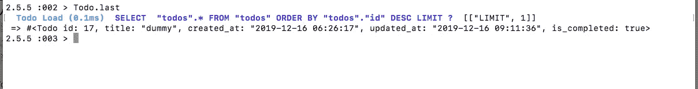

# 如何将 Vue 集成到 Rails 应用程序中—第 2 部分

> 原文：<https://javascript.plainenglish.io/how-to-integrate-vue-into-a-rails-app-part-2-1e79e25ffc30?source=collection_archive---------2----------------------->


这是 Rails 和 Vue 组合的第 2 部分，讨论了我们如何使用 Rails API 应用程序与 Vue 进行交互。如果您想阅读第 1 部分，请先阅读此[链接](https://medium.com/javascript-in-plain-english/how-to-integrate-vue-into-a-rails-app-part-1-32ce8f68f54c)再继续。

# 我们要在这里做什么！！

到目前为止，我们已经完成了登录和注销，我们主要是尝试处理从 Rails API 应用程序获取的 todo 数据，并尝试创建一个新的数据，并使现有数据成为已完成数据。我会补充那些。

1.  创建一个选项来获取待办事项
2.  创建新待办事项的选项
3.  选项来完成待办事项

要做到这一点，需要将工作分成小块。

# 1.创建一个选项来获取待办事项

到目前为止，我们在 Rails API 中有一些虚拟的 to do， ***我们需要做的是创建一个机制来调用 Rails API，获取这些值并在 Vue 应用程序中显示它们。*** 我们不直接获取这些 todos，而是获取这些值并保存到一个名为 Vuex Store 的中央存储区，可以使用 getters、actions 和 mutations 来访问这个存储区。

Vuex 有助于访问多个组件的状态，但是我们没有一个场景，但是出于学习的目的，我们可以继续使用 Vuex。如果你不知道 Vuex，访问这个[链接](https://vuex.vuejs.org/)并观看视频，这是一件很棒的事情，可以通过 Adam Jhar 直观地理解。

## a.将 Rails API 链接到 Vue 应用程序

我们已经在第 1 部分做了将 Rails API 链接到 Vue 应用程序的基础工作，所以我们不需要重复，我们只需要将 Rails GET API 注册到`apiHelper.js`

为此，我们需要向 Rails API 添加带有 GET 请求的 axios 调用。

```
async todos () { 
  const response = await axios.get('todos')
  return response.data
}
```

将从 API 返回响应，并可以在我们的 Vue 应用程序中使用。

## b.将数据保存到 Vuex 模块

在第 1 部分中，我们将用户存储重构为一个名为`user.js`的独立模块，以处理与用户相关的 Vuex 存储。同样，我们将做一个新的模块来处理所有与 Vuex 商店相关的事情。为了做到这一点，

***)** 在`@/store/modules`中创建一个名为`todos.js`的文件

***)** 链接`todos.js`到我们的根存储文件`[src/store/index.js](https://github.com/anoobbava/todo_vue_app/pull/1/commits/f4e533f7bb5bf17e9d5d00fc7372352d13a81f41#diff-e3b1ca4ad5a207c170c97a435b3d1ff3)`

如果你有疑问，检查这个 [PR](https://github.com/anoobbava/todo_vue_app/pull/1/commits/f4e533f7bb5bf17e9d5d00fc7372352d13a81f41) 。

## c.为 Vuex 模块设置 `todos.js`

现在，是最重要的部分，我们只有一个干净的文件，需要创建的 Vuex 动作将调用我们的 API 和获取响应，并将调用突变来设置响应，反过来可以由 Vuex getters 处理。

1.  **需要将 API 导入到 todos.js 中**

我们已经在一个单独的助手文件`apiHelper.js`中添加了 GET API 调用，我们需要导入那个文件，然后只有我们可以从`todos.js`文件中调用 API

```
import ApiHelper from '@/services/ApiHelper'
```

**2。为 todos.js 创建一个状态**

我们需要一个状态对象，它将包含我们将被创建或从 Rails API 获取的所有 todos，

```
state: {                       
        todos: []                
}
```

**3。todos.js 的突变**

只有突变可以改变状态，并且基于来自 Rails API 的响应调用哪个状态。*如果变异成功，我们将调用成功变异并更新状态，如果是失败响应，我们将调用 API 并设置为失败。*

```
mutations: { fetchAllTodoMutation (state, todos) { state.todos = todos }, failureTodoMutation (state) { state.todos = [] }}
```

**4。救援行动**

动作是一个中间人，它从前端获取值，如果你需要 GET/POST，它会调用 API(**只是这里的情况，不是一般的**)，然后调用变异来保存响应。所以我们不会直接调用变异，只通过使用动作。

`ApiHelper.todos()` 是 Rails API 调用，一旦成功将调用`fetchAllTodoMutation`，如果失败将调用`failureTodoMutation`

**5。用户注册后调用 todos 工作流**

到目前为止，我们已经创建了整个 todos Vuex 工作流，但是我们需要在用户注册时调用这个 API，为此，需要调用`fetchAllTodoAction`。

在我们的`loginAction`里面，需要调用同样的动作。在动作内部调用动作是通过`dispatch`实现的

```
dispatch('fetchAllTodoAction', null, { root: true })
```

就这样，现在当用户登录时，将调用 Rails GET API 来获取 todos。



我们有 2 个 todos，可以使用`allTodos` getters 来访问。

[PR](https://github.com/anoobbava/todo_vue_app/pull/1/commits/362901aae67961d6044220115bb7a2ba5d31ce85) 为变更。

## d.todos 的一些风格

目前，我们在这里没有太多的风格，在 vuetify 页面添加了一个漂亮的风格。[链接](https://vuetifyjs.com/en/styles/transitions#todo-list)。

我们将复制这种风格，并添加一些变化。



Awesome 将进入下一部分

[变更公关](https://github.com/anoobbava/todo_vue_app/pull/1/commits/d1ce43523116a3bc39a434a19e64a68ff42a6244)

# 2.创建新待办事项的选项

现在，我们已经成功地从 API 获取了数据，是时候从 Vue 应用程序创建一个新的 todo 了。为此，需要

a.为 POST 请求注册 API

b.增强`todos.js`来创建和接受新的待办事项

## a.为 POST 请求注册 API

类似于我们的 GET 请求，需要使用 axios 创建一个帖子，并将其添加到我们的通用 API 文件 `src/services/ApiHelper.js`

## b.增强`todos.js`创造和接受新的 todos

在这里，我们需要一堆东西。

1.  能够从 UI 输入数据并调用 Vuex 动作。
2.  运行操作，获取响应并调用变异

3.调用突变并将响应保存到状态。

1.  **能够从 UI 输入数据并调用 Vuex 动作。**

在按下带有 todo 的回车键时，我们需要调用一个回调函数，该函数将依次执行 Vuex 操作。

我们只需要将数据解析为 Rails 应用程序可以接受的散列。这发生在`.vue`文件中。

**2。运行动作并获取响应，调用变异**

在调用动作时，将调用 API，然后获取响应，如果成功，将调用`saveTodoMutation`，并将这些响应保存到状态。

`ApiHelper.todo(todoData)`是用于发布新请求的 API 名称。

`todoData`是传递 Rails API 后端的新 todo 对象。

**3。调用突变并将响应保存到状态。**

我们目前有一些待办事项，需要添加新的待办事项到现有的状态。

现在，我们可以测试它是否有效。



a mutation called when the user pressed enter

太棒了， ***新的虚拟数据*** 刚刚被创建，它被更新状态并被更新到 Rails API。



rails backend to check the data is added or not.

[变更公关](https://github.com/anoobbava/todo_vue_app/pull/1/commits/939ee634259647b56fcb9a5dea033af72312e58e)

# 3.选项来完成待办事项

现在，我们已经成功地创建了一个待办事项，是时候完成一个待办事项了。

> 我们要做的是点击复选框，调用一个回调函数来调用 Vuex 动作→调用 Rails API →调用 Vuex 突变→相应地更新状态。

## 1.选中复选框时创建回调函数

当复选框被选中或未选中时，会将相应的需要更新的 todo 传递给回调函数`updateTodo`

`updateTodo` 方法将调用 Vuex 动作`updateTodoAction`，如果响应成功将显示成功，如果出错则设置为失败。

## 2.用于更新待办事项的 Vuex 操作

现在，是行动的时候了，这是从`updateTodo` 方法的回调函数中调用的。

一旦`updateTodoAction`被调用，它将调用 API 并获取响应

## 3.updateTodo 的 API

`ApiHelper.updateTodo()`是我们定义的`ApiHelper.js`类。我们需要调用 API 作为 PUT 请求，并传递参数。我们只更新已完成或未完成的 PUT 请求，并返回响应。

## 4.突变来更新状态。

一旦 API 成功，它将从动作中调用突变，然后用已完成或未完成状态更新状态。

一切都完成了，现在我们需要从前端检查它是否工作。

我已经添加了一个叫做 *dummy* 的 todo，现在我将它设置为已完成。



before completed



after completed

从前端看，它被标记为已完成，现在我们可以检查 Vuex 商店和 Rails 后端。



Vuex store with is_completed = true for dummy todo



Rails backend with the last entry

就这样，谢谢大家看完这个，喜欢的请做评论或者鼓掌。欢迎建议。

```
ROR Heroku deployed endpoint: [https://todorailsapiapp.herokuapp.com/](https://todorailsapiapp.herokuapp.com/)Vue.js App app deployed link in netlify: [https://todo-vue-app.netlify.com/#/login](https://todo-vue-app.netlify.com/#/login)email/password in heroku endpoint: anoob@gmail.com/anoob@gmail.comGitHub-link for Vue.js App:[https://github.com/anoobbava/todo_vue_app](https://github.com/anoobbava/todo_vue_app)GitHub-link for the ROR App: [https://github.com/anoobbava/todo_api](https://github.com/anoobbava/todo_api)
```

> 如果这个故事对你有所帮助，请给我买杯咖啡

人员详情: [GitHub-link](https://github.com/anoobbava) 。 [Linkedin 链接](https://www.linkedin.com/in/anoob-k-bava-676b3337/)