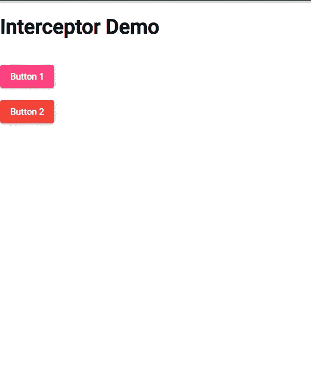
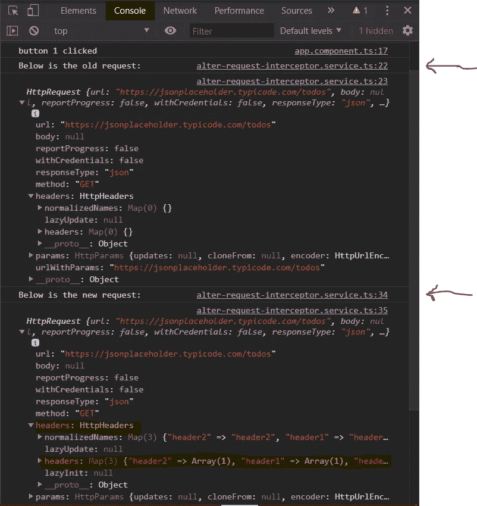
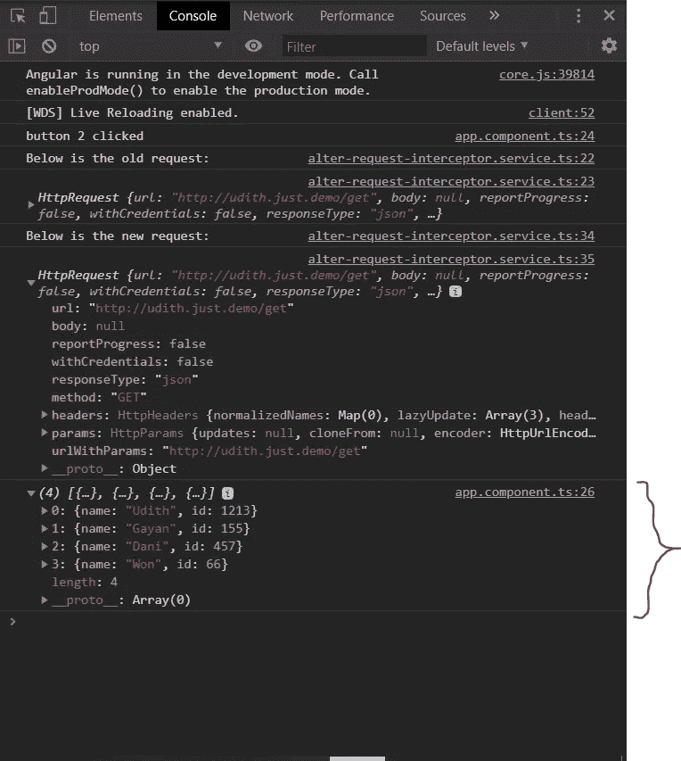

# 如何在 Angular 中拦截 HTTP 请求(第 2 部分)

> 原文：<https://javascript.plainenglish.io/how-to-intercept-the-http-requests-in-angular-part-2-a5aface03744?source=collection_archive---------7----------------------->

Photo by [Ishan](https://unsplash.com/@seefromthesky?utm_source=unsplash&utm_medium=referral&utm_content=creditCopyText) on [Unsplash](https://unsplash.com/s/photos/roads?utm_source=unsplash&utm_medium=referral&utm_content=creditCopyText)

# **内容**

本文由第一部分和第二部分两部分组成。

第一部分— [简介，角拦截器的一些优点。](https://medium.com/javascript-in-plain-english/how-to-intercept-the-http-requests-in-angular-2a67df423020)

第 2 部分——实现拦截器的实用说明。(这个)

# **简介**

正如我在上一篇文章中解释的，在 Angular 中使用拦截器有很多好处。我们可以在一个应用程序中为不同的目的创建许多拦截器。在这里，我将解释如何为

改变发出的请求并附加报头

**二。用虚假的后端数据回复请求**

# 让我们开始吧

**第一步**

首先，我在 src 文件夹的 app 文件夹的 Interceptors 文件夹中创建一个名为“Interceptor-list.ts”的文件。

(src >>> app >>>拦截器-列表> > >拦截器-列表. ts)

这个文件将我们为不同目的创建的拦截器类的列表保存为一个数组。您可以随时轻松地将任何新创建的拦截器服务类添加到这个列表中。

**第二步**

转到 app.module.ts 文件，在 providers 数组中提供拦截器服务类的常量数组。

*我也导入了 HttpClientModule 来处理 http 请求。

**第三步**

**1** 。创建用于更改请求的拦截器服务

让我们创建一个拦截器服务类来改变请求并向请求添加头。然后，我在浏览器中记录新旧请求，以便您可以区分两者。

在这里的代码中，*返回 next . handle(req)；*将请求传递给下一个拦截器进行处理，如果所有下一个拦截器都结束了，那么请求就被发送出去。

**2。**为模拟后端创建拦截器服务

我创建了另一个拦截器服务类来响应 url 为 200 的请求:[https://udith.just.demo/get](https://udith.just.demo/get)。

在此代码中，*返回(………..);可以根据需要用响应来回复请求。我已经匹配了网址，只回复了想要的网址。因此，您可以为不同的 URL 指定不同的响应。*

**然后将这两个服务类添加到 Interceptor-list.ts 中的 InterceptorProviders 数组，如下所示。

**第四步**

我在 app.component.html 创建了两个按钮来调用 http 请求。(您可以使用自己的组件)

browser view

**这是我的 App.component.ts**

# **我们来看看结果**

当我点击按钮 1 时，

console of the browser

当我点击按钮 2 时，

console of the browser

**就这样。**

> 正如我在上一篇文章中提到的，充分利用拦截器取决于您的创造力和需求。

你可以从 [github 这里](https://github.com/Udith-Gayan/Angular-Interceptor-Demo-Project)克隆这个项目。

谢谢你。