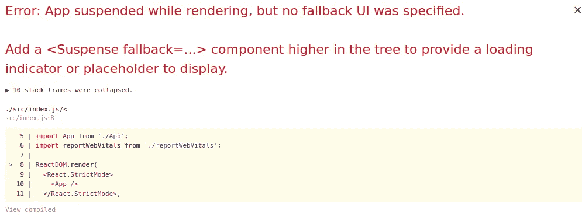
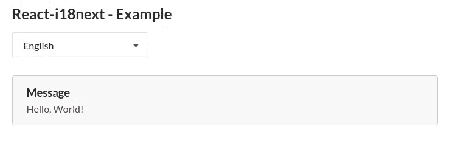
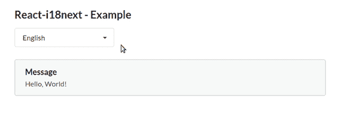
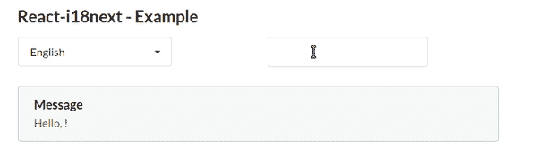
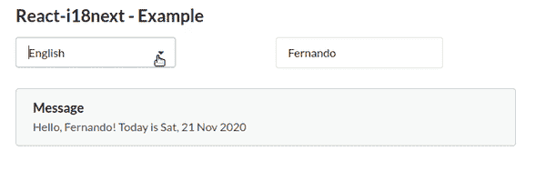

# 如何用 i18next 国际化你的 React 应用

> 原文：<https://javascript.plainenglish.io/how-to-internationalize-your-react-app-with-i18next-5e8ee9c85a2e?source=collection_archive---------10----------------------->

## 让更多人可以使用你的应用。


Photo by [NASA](https://unsplash.com/@nasa?utm_source=unsplash&utm_medium=referral&utm_content=creditCopyText) on [Unsplash](https://unsplash.com/s/photos/global?utm_source=unsplash&utm_medium=referral&utm_content=creditCopyText)

世界从未像现在这样紧密相连。你可以在几秒钟内获得来自地球另一端的新闻。世界上有 190 多个国家，现在有 7000 多种语言在使用。即使只算前 20 名，也还是很多。

这些语言中的每一种都有自己的方式来表达信息，从数字到文本的方向。开发应用程序来满足所有这些不同的语言可能非常麻烦。

*全球化* (g11n)对于任何想让产品为全球更多人所用的人来说，都是一种战略方法。分为两步:*国际化* (i18n)和*本地化* (l10n)。

按照 [W3C](https://www.w3.org/International/questions/qa-i18n) 的说法，国际化就是:

> [……]产品、应用程序或文档内容的设计和开发，能够针对不同文化、地区或语言的目标受众轻松实现本地化。

和本地化:

> [……]是指对产品、应用程序或文档内容进行调整，以满足特定目标市场(地区)的语言、文化和其他要求。

简而言之，i18n 允许应用程序支持不同的地区，从而实现本地化。

实现 i18n 的应用程序将具有一些特性:

*   没有必要改变源代码来支持一种新的语言。
*   它处理不同的数据格式，比如数字、货币、日期和复数。
*   它处理显示文本的不同方式，例如图标、字符和方向(从右到左、从左到右等)。
*   它能迅速适应新的环境。

> **TL；博士**:你可以在这里查看这个教程[的完整代码。](https://github.com/ustropo/react-i18n-tutorial)

# React i18n 库

幸运的是，已经有一些不错的库，你可以使用它们来开发你的应用程序，以立即支持 i18n。

## 反应-国际

最受欢迎的库之一，是[FormatJS](https://formatjs.io/)集合的一部分。它支持 150 多种语言。

它可以毫不费力地处理常见区域设置，如日期和时间、货币和数字。

它还有一个很棒的文档，你可以在这里查看。

## react-国际通用

这个[库](https://github.com/alibaba/react-intl-universal)由阿里巴巴集团打造，基于 react-intl 库。不同之处在于，这个库通过提供一个单独的对象来加载区域设置，使得非 React 组件也可以使用它。

它也很容易使用，你可以处理数字，货币和日期，而不必安装任何其他软件包。

## 语言

它是一个相对的[新库](https://lingui.js.org/)，包大小很小(5 kB)。它有一些关键特性，比如富文本支持、多元化和地区检测。

它可以使用 JSON 或 PO 文件来存储翻译。它是非常轻量级和优化的，所以它不影响最终的产品。

## react-i18 接下来

它也是一个流行的国际化库，基于 [i18next](https://www.i18next.com) 。它可以在 React 和 React-Native 应用程序上使用。

它支持服务器端渲染。它的目标是成为一个完整的 i18n 解决方案，并支持不同的[插件](https://www.i18next.com/overview/plugins-and-utils)(从后端、区域缓存等加载翻译)来丰富原始包。

它并不局限于 React，所以您也可以在其他应用程序中使用它。

# React-i18 入门接下来

对于本教程，我将使用 [i18next](https://www.i18next.com/overview/getting-started) 库。这是一个流行的库，您可以在其他应用程序上使用，而不仅仅是在 React 上。您可以轻松地扩展它。

> **注**:本教程是用 NodeJS 版本 12.16.2，Yarn 版本 1.22.4，React 17.0.1 制作的。

首先，我们必须使用`[create-react-app](https://github.com/facebook/create-react-app)`创建 React 应用程序:

```
yarn create react-app i18n-tutorial
cd i18n-tutorial
```

接下来，我们需要安装 i18 下一个依赖项:

```
yarn add react-i18next i18next i18next-http-backend
```

为了让我们的代码看起来更好，我将使用[语义 UI](https://react.semantic-ui.com/) 包(你可以使用其他你想要的，比如[引导](https://react-bootstrap.github.io/)或[材质 UI](https://material-ui.com/) ):

```
yarn add semantic-ui-react semantic-ui-css
```

# 设置

我们需要在代码中初始化和配置 i18next 库。因此，在`src`文件夹中创建一个文件`i18n.js`，并放入以下内容:

我们必须初始化`i18n`对象。调用`use`函数加载所有你想用于你的程序的插件。对于我们的案例，我们将使用两个 i18next 插件:

*   `[i18next-http-backend](https://github.com/i18next/i18next-http-backend)`:这个插件允许从后端服务器加载翻译文件。
*   `initReactI18next`:这个插件创建了一个内部存储，使得我们的反应组件可以使用这个实例。

> **注意**:在这里可以找到一些可用插件的列表[。](https://www.i18next.com/overview/plugins-and-utils)

在所有插件初始化之后，我们必须用一些参数来配置 i18n 对象。这里提供了完整的选项列表，但对我们的情况来说最重要的是:

*   `lng`使用哪种语言。
*   `fallbackLng`:如果找不到翻译，使用哪种语言。
*   `ns`:要加载名称空间的字符串或数组。在我们的例子中，每个名称空间都是一个不同的文件。
*   `defaultNs`:在我们没有明确告诉翻译函数的情况下使用的默认名称空间。
*   `debug`:如果您想在某些事件发生时在浏览器中获取控制台日志，例如语言更改或初始化，请将其设置为 true。

# 使用它

首先，让我们创建主应用程序。为了简化本教程，它将只是一个*下拉菜单*，包含可用的语言和一条好消息。当菜单更改时，我们会将信息更改为选定的语言。

因此，将文件`App.js`修改为以下内容:

目前，我们还没有使用任何翻译。所有的信息都是硬编码的，我们不会改变任何东西。

由于我们配置了`i18n`对象来使用 fetch 请求翻译文件，我们必须创建一种方法来加载它们。如果你愿意，你可以使用 API 或者其他 HTTP 服务，但是在本教程中，我们将把它们放在`public`文件夹中。

默认情况下，插件`http-backend`会在格式为`/locales/{lng}/{ns}.json`的 URL 中搜索文件。如果您想更改默认格式，请查看[文档](https://github.com/i18next/i18next-http-backend)。因为我们有两种不同的语言，只有一个名称空间，所以我们必须创建以下结构:

```
public/
|-- locales/
    |-- en/
    |   |-- common.json
    |-- pt/
        |-- common.json
```

每个`common.json`文件将接收一个包含翻译字符串的 JSON 对象。`en/common.json`文件:

而`pt/common.json`:

现在，我们必须在我们的应用程序中使用这些消息。为此，我们将使用包装`react-i18next`中的挂钩`useTranslation` 。它将返回一个`t`函数，我们将使用它来翻译我们的消息，传递我们想要使用的消息的密钥。

经过这些修改，我们的`App.js`将会是这样的:

> **注意**:不要忘记在`index.js`中加上`import './i18n.js'`。

如果您尝试运行该代码，将会收到以下错误消息:



Image by author.

插件`http-backend`异步加载所有必需的文件，并返回一个承诺，因此您需要使用一个`[React.Suspense](https://itnext.io/what-the-heck-is-this-in-react-suspense-c5e641e487a)`组件来呈现它。

> **注意**:您可以通过`react`选项中的配置`useSuspense: false`将其禁用。但是这会使所有的消息在还没有加载的时候返回一个空字符串。

因此，修复`index.js`文件:

现在，当您运行它时:



# 改变语言

但是在这个例子中你不能改变语言。所以让我们开始吧。

要改变语言，我们必须使用我们声明的`i18n`实例。我们通过钩子`useTranslation`访问它。

我们使用`Dropdown`组件的`onChange`方法来改变语言，用新值调用函数`i18n.changeLanguage`。

现在你可以运行程序并选择你想看的语言。您必须看到信息的变化:



# 消息格式

我们可能希望在运行时将值注入到翻译消息中，比如用户数据或多元化。

我们必须用格式`{{var_name}}`改变我们想要插入的消息:

让我们创建一个输入，这样用户可以插入一个要添加的值:

运行它:



# 日期格式

默认情况下，`i18next`不支持日期格式。我们可以用另一个库，用内插法来实现。

有一些不错的日期操作库(如 [Luxon](https://moment.github.io/luxon/) 和 [Day.js](https://github.com/iamkun/dayjs) )，但是对于本教程，我将使用 [date-fns](https://date-fns.org/) 。它很简单，并且支持超过 150 种语言。

要安装它:

```
yarn add date-fns
```

要使用它，我们必须覆盖`interpolation`选项中的`format`对象。这是一个接收三个参数的函数:我们想要格式化的值、格式字符串和当前语言。

我们必须在包`date-fns/locale`中包含我们支持的所有语言，这样`date-fns`库才能真正格式化消息。

在翻译文件中，我们必须使用语法`{{var_name, format}}`以便正确调用插值方法。

当然，要确保我们传递的是我们想要的格式的实际值。

最后的形式是:



Change language and date format.

# 结论

国际化(i18n)可以使产品的本地化变得更加容易。

React-i18next 是一个强大的库，如果你打算使用 i18n，你可以在你的应用中使用它。你可以很容易地配置它，它有一些不错的功能，如格式化和异步加载。

虽然它本身不支持日期格式，但是您可以扩展它，使用其他库来实现。

你可以点击查看完整代码[。](https://github.com/ustropo/react-i18n-tutorial)