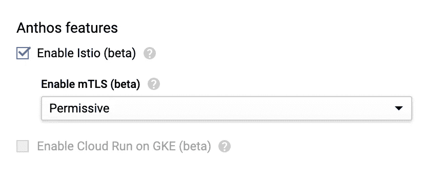

# 通过 8 个步骤启动 Kubernetes 集群的应用程序

> 原文：<https://javascript.plainenglish.io/how-to-launch-your-app-to-a-kubernetes-cluster-50b5b5637fba?source=collection_archive---------8----------------------->

Photo by [Callum Galloway](https://unsplash.com/@callumgalloway?utm_source=medium&utm_medium=referral) on [Unsplash](https://unsplash.com?utm_source=medium&utm_medium=referral)

要求

*   谷歌云 SDK:[https://cloud.google.com/sdk/docs/](https://cloud.google.com/sdk/docs/)
*   https://kubernetes.io/docs/tasks/tools/install-kubectl/
*   https://docs.docker.com/install/[码头工人](https://docs.docker.com/install/)
*   https://nodejs.org/en/

回购链接:[https://github.com/raymundoxmartinez/StoreService](https://github.com/raymundoxmartinez/StoreService)

# **第一步:**创建一个 App

对于这一部分，我们将使用 express 创建一个基本的应用程序来生成一个简单的 web 服务器，而不使用视图引擎。

您应该得到以下文件结构:

让我们对应用程序做一些更改。首先，我们将更改服务器正在监听的端口。

导航到 *bin/www*

改变这一点:

对此:

我们所做的只是将端口号从 3000 更改为 8080。

接下来，我们将编辑 */users* 路由的响应

导航至 *routes/users.js*

改变这一点:

对此:

现在运行您的服务器

并在 Postman 上测试您的服务。

我们现在有一个工作服务！

# **步骤 2:创建 Docker 图像**

首先，我们将向根目录添加一个 Dockerfile 文件。

您的 docker 文件应该如下所示:

注意， *CMD ["节点"，"。/bin/www"]* 是运行应用程序的命令。如果您有不同的命令(例如 *node server.js ),请更改该命令。*

下次运行:

在根目录中构建并标记 docker 映像。

您应该会得到这样的结果:

通过运行以下命令查看您的图像

您应该能够看到构建图像的列表。

现在让我们运行容器！！

这里，我们将服务器 8080 的端口映射到容器端口 49160。

让我们在 Postman 上测试我们的容器:

太好了！

现在我们正在与 docker 容器中的服务进行通信！

# **步骤 3:** 将图像推送到注册表

让我们在 Google 云平台中创建一个新项目。

登录 gcloud:

现在授权您的 gcloud 帐户连接 docker:

您应该看到这个:

现在，让我们标记映像并将其推送到 gcloud 存储库:

检查容器注册表以确保您的映像已成功推送。

噪音。

# 步骤 4: 创建一个集群

转到 gcloud 平台，创建一个新集群。

将集群重命名为 *store-cluster* ，并将位置类型更改为 r*regional*。

现在确保您**启用了 istio 设置！！**

我们将使用此功能与集群通信。

# **步骤 5:配置设置，将 Kubernetes 与您的新集群连接起来**

连接到您在步骤 3 中创建的项目:

现在，连接到步骤 4 中创建的集群:

检查 kubernetes 是否正在与您的 gcloud 集群通信:

您应该看到 gke _ YOUR _ PROJECT _ ID _ REGION _ CLUSTER _ NAME

快到了！！！

# 步骤 6:创建一个定义服务的 Yaml 文件

在根目录中创建名为 store-service.yaml 的新文件

该文件包含 3 个部分:

*   服务
*   服务帐户
*   部署

**服务:**

请确保在该部分的末尾包含“--”。

**服务账户:**

**部署:**

将“URL_TO_DOCKER_IMAGE”替换为步骤 3 中推送到注册表的图像的 URL。

您可以在容器注册表部分找到 url

点击*储存*储存库。

现在复制“完整映像名称”并将其添加到上面的部署部分。

让我们部署我们的容器吧！

检查服务是否已成功部署:

您应该看到:

检查已部署容器的状态:

您应该看到:

太好了，现在让我们打开我们服务的门户吧！！

# 步骤 7:创建网关 Yaml 文件

向根目录添加一个名为 store-gateway.yaml 的新文件。

该文件有两个部分:

*   门
*   虚拟服务

**网关:**

**虚拟服务:**

部署网关:

检查它是否部署成功。

您应该看到:

现在是测试的时候了！:D

# 步骤 8:测试您的服务

让我们获取上面创建的网关的 IP 地址。

运行:

您应该看到:

复制外部 IP。

现在，请致电 Postman 测试您的服务:

[***http://EXTERNAL-IP:80/users***](http://EXTERNAL-IP:80/users)

令人满意！

现在你可以自由探索 docker、gcloud 和 kubernetes 的极限了。

祝你旅途愉快！！