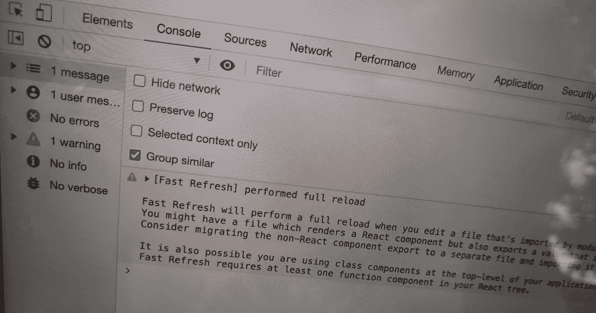

# 让浏览器控制台日志等待页面重新加载

> 原文：<https://javascript.plainenglish.io/how-to-make-a-browser-console-log-wait-until-after-a-page-reload-bccc538c9938?source=collection_archive---------14----------------------->

## 快速 JavaScript 操作指南

有没有想过创建一个浏览器控制台日志，在页面重新加载后保持不变？当然，如果你在你的开发者控制台[启用了“保存日志”选项](https://stackoverflow.com/questions/5327955/how-to-make-google-chrome-javascript-console-persistent)，这不是问题，但是请听我说。

假设您有一个带有开发服务器的 JavaScript 框架，当您在服务器运行时更新文件时，它通常会热重新加载。在少数情况下，热重新加载是不可能的，页面必须完全重新加载，你想警告你的用户，并解释为什么会发生这种情况。用`console.warn()`在控制台上记录一个警告是很好的，但是当它出现在控制台上的时候，你不知道吗，*页面会重新加载*，浏览器会清除它。即使你的用户足够敏锐地注意到你的警告在屏幕上闪了几分之一秒，也肯定没有足够长的时间来真正地阅读。

你*可以*说，如果你的任何用户不知道“保存日志”按钮在哪里，那是他们的问题，但是你比他们善良。你宁愿帮助他们掉进成功的陷阱。

碰巧的是，这正是我前几天逛我最喜欢的开源项目 [Next.js](https://nextjs.org/) 时遇到的问题。

在我的天真中，我第一次尝试只是将`console.warn()`移动到 `window.location.reload()`后面的*线上，然后交叉手指，但这没有用。我试着在谷歌上搜索类似“页面重新加载后的控制台日志”的东西，但这只给了我如何打开“保存日志”的指示，我已经知道如何做了。*

以下是奏效的方法。在之前的`console.warn()`语句中，我将警告的文本内容保存到窗口的`[sessionStorage](https://developer.mozilla.org/en-US/docs/Web/API/Window/sessionStorage)`中一个名为`"consoleWarnAfterReload"`的键中:

然后，在加载新页面所涉及的文件的顶部附近，我添加了几行来检查同一个`sessionStorage`键。如果该项存在，它会将警告内容记录到控制台，然后从`sessionStorage`中删除该项:

那成功了！

知道另一种让控制台日志等到页面重新加载之后的方法吗？请回复——我很想听听这件事！

## 简单英语的 JavaScript

喜欢这篇文章吗？如果有，通过 [**订阅获取更多类似内容解码，我们的 YouTube 频道**](https://www.youtube.com/channel/UCtipWUghju290NWcn8jhyAw) **！**