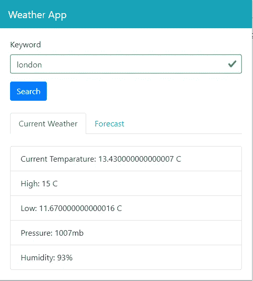
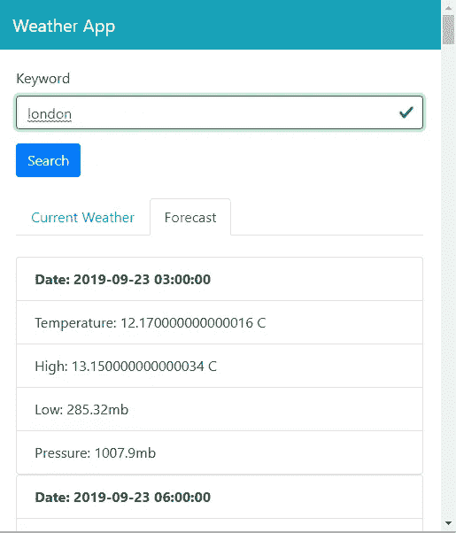
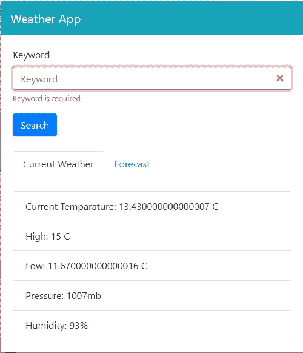

# 如何用 Vue.js 做一个 Chrome 扩展

> 原文：<https://javascript.plainenglish.io/how-to-make-a-chrome-extension-with-vue-js-56e50bd97972?source=collection_archive---------0----------------------->

【http://jauyeung.net/subscribe/】****现在在** [**订阅我的邮件列表。**](http://jauyeung.net/subscribe/)**

**在推特上关注我**[**https://twitter.com/AuMayeung**](https://twitter.com/AuMayeung)

最流行的网络浏览器 Chrome 和 Firefox 都支持扩展。扩展是一些小应用程序，您可以将它们添加到浏览器中，以获得浏览器中不包含的功能。这使得扩展浏览器功能变得非常容易。用户只需从 Chrome 网络商店或 Firefox 商店等在线商店添加浏览器插件即可。

浏览器扩展只是普通的 HTML 应用程序包的一种特定方式。这意味着我们可以使用 HTML、CSS 和 JavaScript 来构建自己的扩展。

Chrome 和 Firefox 扩展遵循 Web 扩展 API 标准。完整的细节在[https://developer . Mozilla . org/en-US/docs/Mozilla/Add-ons/web extensions](https://developer.mozilla.org/en-US/docs/Mozilla/Add-ons/WebExtensions)

在本文中，我们将制作一个 Chrome 扩展，显示来自 OpenWeatherMap API 的天气。我们将添加一个搜索，让用户从 API 中查找当前天气和预报，并将其显示在扩展的弹出框中。

我们将使用 Vue.js 来构建浏览器扩展。要开始构建它，我们先用 Vue CLI 创建项目。运行`npx @vue/cli create weather-app`来创建项目。在向导中，选择 Babel 和 Vuex。

OpenWeatherMap API 可在 https://openweathermap.org/api 获得。你可以在这里注册一个 API 密匙。一旦获得了 API 密钥，在根文件夹中创建一个`.env`文件，并添加`VUE_APP_APIKEY`作为密钥，API 密钥作为值。

接下来，我们使用 vue-CLI-plugin-browser-extension 来添加用于编写和编译 Chrome 扩展的文件。软件包设置和详细信息位于[https://www . npmjs . com/package/vue-CLI-plugin-browser-extension](https://www.npmjs.com/package/vue-cli-plugin-browser-extension)。

为了将它添加到我们的项目中，我们运行`vue add browser-extension`来添加构建扩展所需的文件。该命令将改变我们项目的文件结构。

运行该命令后，我们必须删除一些冗余文件。我们应该将`App.vue`和`main.js`从`src`文件夹中移除，而将同名文件单独留在`popup`文件夹中。然后，当我们修改代码时，我们运行`npm run serve`来构建文件。

接下来，我们必须安装扩展 Reload，以便在更改文件时重新加载扩展。从[https://chrome . Google . com/web store/detail/extensions-reloader/fimgfedafaedlieabdeeaondnlbhid](https://chrome.google.com/webstore/detail/extensions-reloader/fimgfedafeadlieiabdeeaodndnlbhid)安装它，以便在 Chrome 中热重装我们的扩展。

然后，我们进入 chrome 的 chrome://extensions/ URL，打开开发者模式。我们应该在左上角看到 Load unpacked 按钮。点击它，然后选择我们项目中的`dist`文件夹，将我们的扩展加载到 Chrome 中。

接下来，我们必须安装一些我们将使用的库。我们需要 Axios 进行 HTTP 请求，需要 BootstrapVue 进行样式设计，需要 Vee-Validate 进行表单验证。为了安装它们，我们运行`npm i axios bootstrap-vue vee-validate`来安装它们。

安装好所有的包后，我们可以开始写代码了。在`components`文件夹中创建`CurrentWeather.vue`，并添加:

```
<template>
  <div>
    <br />
    <b-list-group v-if="weather.main">
      <b-list-group-item>Current Temparature: {{weather.main.temp - 273.15}} C</b-list-group-item>
      <b-list-group-item>High: {{weather.main.temp_max - 273.15}} C</b-list-group-item>
      <b-list-group-item>Low: {{weather.main.temp_min - 273.15}} C</b-list-group-item>
      <b-list-group-item>Pressure: {{weather.main.pressure }}mb</b-list-group-item>
      <b-list-group-item>Humidity: {{weather.main.humidity }}%</b-list-group-item>
    </b-list-group>
  </div>
</template><script>
import { requestsMixin } from "@/mixins/requestsMixin";export default {
  name: "CurrentWeather",
  mounted() {},
  mixins: [requestsMixin],
  computed: {
    keyword() {
      return this.$store.state.keyword;
    }
  },
  data() {
    return {
      weather: {}
    };
  },
  watch: {
    async keyword(val) {
      const response = await this.searchWeather(val);
      this.weather = response.data;
    }
  }
};
</script><style scoped>
p {
  font-size: 20px;
}
</style>
```

当来自 Vuex 商店的`keyword`被更新时，该组件显示来自 OpenWeatherMap API 的当前天气。我们稍后将创建 Vuex 商店。`this.searchWeather`函数来自`requestsMixin`，这是我们将要创建的一个 Vue mixin。`computed`模块通过`this.$store.state.keyword`从存储器中获取`keyword`并返回最新值。

接下来，在同一个文件夹中创建`Forecast.vue`,并添加:

```
<template>
  <div>
    <br />
    <b-list-group v-for="(l, i) of forecast.list" :key="i">
      <b-list-group-item>
        <b>Date: {{l.dt_txt}}</b>
      </b-list-group-item>
      <b-list-group-item>Temperature: {{l.main.temp - 273.15}} C</b-list-group-item>
      <b-list-group-item>High: {{l.main.temp_max - 273.15}} C</b-list-group-item>
      <b-list-group-item>Low: {{l.main.temp_min }}mb</b-list-group-item>
      <b-list-group-item>Pressure: {{l.main.pressure }}mb</b-list-group-item>
    </b-list-group>
  </div>
</template><script>
import { requestsMixin } from "@/mixins/requestsMixin";export default {
  name: "Forecast",
  mixins: [requestsMixin],
  computed: {
    keyword() {
      return this.$store.state.keyword;
    }
  },
  data() {
    return {
      forecast: []
    };
  },
  watch: {
    async keyword(val) {
      const response = await this.searchForecast(val);
      this.forecast = response.data;
    }
  }
};
</script><style scoped>
p {
  font-size: 20px;
}
</style>
```

和`CurrentWeather.vue`很像。唯一的区别是我们得到的是当前天气而不是天气预报。

接下来，我们在`src`文件夹中创建一个`mixins`文件夹，并添加:

```
const APIURL = "[http://api.openweathermap.org](http://api.openweathermap.org)";
const axios = require("axios");export const requestsMixin = {
  methods: {
    searchWeather(loc) {
      return axios.get(
        `${APIURL}/data/2.5/weather?q=${loc}&appid=${process.env.VUE_APP_APIKEY}`
      );
    }, searchForecast(loc) {
      return axios.get(
        `${APIURL}/data/2.5/forecast?q=${loc}&appid=${process.env.VUE_APP_APIKEY}`
      );
    }
  }
};
```

这些函数分别用于从 OpenWeatherMap API 获取当前天气和天气预报。 `process.env.VUE_APP_APIKEY`是从我们之前创建的`.env`文件中获得的。

接下来，在`popup`文件夹内的`App.vue`中，我们将现有代码替换为:

```
<template>
  <div>
    <b-navbar toggleable="lg" type="dark" variant="info">
      <b-navbar-brand href="#">Weather App</b-navbar-brand>
    </b-navbar>
    <div class="page">
      <ValidationObserver ref="observer" v-slot="{ invalid }">
        <b-form [@submit](http://twitter.com/submit).prevent="onSubmit" novalidate>
          <b-form-group label="Keyword" label-for="keyword">
            <ValidationProvider name="keyword" rules="required" v-slot="{ errors }">
              <b-form-input
                :state="errors.length == 0"
                v-model="form.keyword"
                type="text"
                required
                placeholder="Keyword"
                name="keyword"
              ></b-form-input>
              <b-form-invalid-feedback :state="errors.length == 0">Keyword is required</b-form-invalid-feedback>
            </ValidationProvider>
          </b-form-group> <b-button type="submit" variant="primary">Search</b-button>
        </b-form>
      </ValidationObserver><br /> <b-tabs>
        <b-tab title="Current Weather">
          <CurrentWeather />
        </b-tab>
        <b-tab title="Forecast">
          <Forecast />
        </b-tab>
      </b-tabs>
    </div>
  </div>
</template><script>
import CurrentWeather from "@/components/CurrentWeather.vue";
import Forecast from "@/components/Forecast.vue";export default {
  name: "App",
  components: { CurrentWeather, Forecast },
  data() {
    return {
      form: {}
    };
  },
  methods: {
    async onSubmit() {
      const isValid = await this.$refs.observer.validate();
      if (!isValid) {
        return;
      }
      localStorage.setItem("keyword", this.form.keyword);
      this.$store.commit("setKeyword", this.form.keyword);
    }
  },
  beforeMount() {
    this.form = { keyword: localStorage.getItem("keyword") || "" };
  },
  mounted(){
    this.$store.commit("setKeyword", this.form.keyword);
  }
};
</script><style>
html {
  min-width: 500px;
}.page {
  padding: 20px;
}
</style>
```

我们在这里添加了 BootstrapVue `b-navbar`来添加一个顶部栏来显示扩展的名称。在那下面，我们添加了搜索天气信息的表单。表单验证是通过在`ValidationObserver`组件中包装表单和在`ValidationProvider`组件中包装输入来完成的。我们在`ValidationProvider`的`rules`道具中提供了验证规则。稍后会在`main.js`中添加规则。

错误信息显示在`b-form-invalid-feedback`组件中。我们从`ValidationProvider`的作用域槽中得到错误。这就是我们得到`errors`对象的地方。

当用户提交号码时，调用`onSubmit`函数。这就是`ValidationObserver`有用的地方，因为它为我们提供了用于表单验证的`this.$refs.observer.validate()`函数。

如果`isValid`解析为`true`，那么我们通过运行`this.$store.commit(“setKeyword”, this.form.keyword);`在本地存储器和 Vuex 存储器中设置`keyword`。

在`beforeMount`钩子中，我们设置了`keyword`,如果在本地存储器中设置了`keyword`,那么当扩展首次加载时，它将被填充。在`mounted`钩子中，我们在 Vuex 商店中设置了关键字，这样标签页就会得到`keyword`来触发天气数据的搜索。

然后在`store.js`中，我们将现有代码替换为:

```
import Vue from "vue";
import Vuex from "vuex";Vue.use(Vuex);export default new Vuex.Store({
  state: {
    keyword: ""
  },
  mutations: {
    setKeyword(state, payload) {
      state.keyword = payload;
    }
  },
  actions: {}
});
```

添加我们在组件中引用的 Vuex 商店。我们有用于在存储中存储搜索关键字的`keyword`状态和`setKeyword`突变函数，这样我们可以在组件中设置`keyword`。

接下来在`popup/main.js`中，我们将现有代码替换为:

```
import Vue from 'vue'
import App from './App.vue'
import store from "../store";
import "bootstrap/dist/css/bootstrap.css";
import "bootstrap-vue/dist/bootstrap-vue.css";
import BootstrapVue from "bootstrap-vue";
import { ValidationProvider, extend, ValidationObserver } from "vee-validate";
import { required } from "vee-validate/dist/rules";/* eslint-disable no-new */extend("required", required);
Vue.component("ValidationProvider", ValidationProvider);
Vue.component("ValidationObserver", ValidationObserver);
Vue.use(BootstrapVue);Vue.config.productionTip = false;new Vue({store,
  render: h => h(App)
}).$mount("#app");
```

我们在这里添加了我们在之前的文件中使用的验证规则，并包括了我们在应用程序中使用的所有库。我们通过调用`Vue.component`注册了`ValidationProvider`和`ValidationObserver`，这样我们就可以在我们的组件中使用它们。Vee-Validate 提供的验证规则包含在应用程序中，因此模板可以通过从 Vee-Validate 调用`extend`来使用这些规则。我们调用`Vue.use(BootstrapVue)`在我们的应用程序中使用 BootstrapVue。

最后，在`index.html`中，我们将现有代码替换为:

```
<!DOCTYPE html>
<html lang="en">
  <head>
    <meta charset="utf-8" />
    <meta http-equiv="X-UA-Compatible" content="IE=edge" />
    <meta name="viewport" content="width=device-width,initial-scale=1.0" />
    <link rel="icon" href="<%= BASE_URL %>favicon.ico" />
    <title>Weather App</title>
  </head>
  <body>
    <noscript>
      <strong
        >We're sorry but vue-chrome-extension-tutorial-app doesn't work properly
        without JavaScript enabled. Please enable it to continue.</strong
      >
    </noscript>
    <div id="app"></div>
    <!-- built files will be auto injected -->
  </body>
</html>
```

来代替标题。

经过所有的努力，我们得到了:

