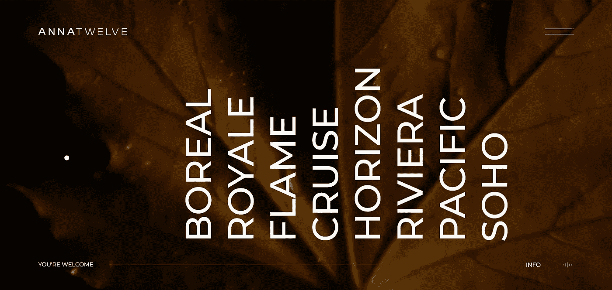

# 如何创建跟随指针的带有缓动的自定义光标

> 原文：<https://javascript.plainenglish.io/how-to-make-a-custom-cursor-with-lerp-that-follows-pointer-6aa6f92fe48a?source=collection_archive---------3----------------------->

## 给你的网站增加愉快的体验



Source: [ANNATWELVE](http://www.annatwelve.com) website. Has a similar interactive cursor.

前端开发人员每天都会发现新的东西。学习创造迷人的网络体验是每个创意开发者的梦想。这方面的一个例子是一个自定义光标，它在 Awwwards 或 FWA 的大多数网站上都有使用。

当我看到跟随鼠标指针的自定义光标时，我惊叹不已。你不会相信为了找到一些相关的东西，我在谷歌上搜索了多少次。但是一切都是徒劳的，因为我想不出要搜索什么。

本教程的先决条件—

*   HTML，CSS 的基础知识
*   JavaScript(对象)
*   jQuery(选择器和更改 CSS 属性)。

当你喜欢一个新概念时，很难找到关于它的东西，因为你真的不知道你应该搜索的确切术语。我相信这个简单的指南将帮助你创建自定义光标跟随鼠标指针。这类似于使用 lerp(线性插值)。所以让我们开始编码吧。

# 为它编写 HTML

光标的设计完全取决于你。你可以随意定制。我拿一个跟随鼠标的简单圆环。在 body 标记之间添加以下代码。

```
<div id="circle"></div> 
```

仅此而已。是的，不涉及太多的 HTML。真是松了一口气。

# 给我们的光标增加了一点美感

使用下面的 CSS 样式来设置`div with id circle`的样式。使用固定位置是为了使光标在滚动时保持不动。否则，当我们向下滚动时，它会随着页面一起向上移动。你不想失去光标。你知道吗？

```
#circle{
  width: 80px;
  height: 80px;
  border: 1px solid #3c2946;
  position: fixed;
  border-radius:50%;
}
```

# 让我们添加一些功能

这就是功能发挥作用的地方。我在这个项目中使用了`jQuery`,所以请确保将`jQuery.js`添加到您的 JavaScript 文件中，并将其与 **index.js** 文件一起链接到 HTML。

首先声明保存当前鼠标位置的变量并初始化它们。

```
var mouseX=window.innerWidth/2,
    mouseY=window.innerHeight/2;
```

现在添加圆形对象。使用 jQuery 选择器选择`div with id circle`。在这个对象中，我们声明了一个更新函数来更新光标的平移，使其位于实际鼠标指针的尖端。

```
var circle = { 
     el:$(‘#circle’),
     x:window.innerWidth/2, 
     y:window.innerHeight/2, 
     w:80, 
     h:80, 
     update:function(){
                   l = this.x-this.w/2; 
                   t = this.y-this.h/2; 
                   this.el.css({ 
                            ‘transform’:
                            ’translate3d(‘+l+’px,‘+t+’px, 0)’ }); 
                           }
}
```

# 更新位置和动画

然后我们使用`e.clientY`和`e.clientY`用当前鼠标位置更新`mouseX`和`mouseY`的值。

```
$(window).mousemove (function(e){
  mouseX = e.clientX;
  mouseY = e.clientY;
})
```

使用`setInterval`激活光标。然后我们有调用更新圆位置的移动函数。

```
setInterval (move,1000/60)function move(){
  circle.x = lerp (circle.x, mouseX, 0.1);
  circle.y = lerp (circle.y, mouseY, 0.1);
  circle.update() 
}
```

# 加入有机放松

现在，你已经走了这么远。我们来添加`lerp`函数。因子 0.1 定义了每次重画屏幕时，光标将移动起点和终点之间总距离的多少部分。所以它实际上永远不会到达目的地，因为距离变得越来越小，但永远不会变为零。但对我们来说，这是一种有机的放松效果。

```
function lerp (start, end, amt){
  return (1-amt)*start+amt*end
}
```

Lerp 是一个很棒的动画效果。你可以在你的滚动中使用它，让你的网站在滚动时更加自然。它不是复杂的大事情，而是小事情加起来形成一个真正伟大的网络体验。这让我们很高兴。

# 结论

这里是 [codepen 演示](https://codepen.io/Deepak426/pen/PoNKeLj?__cf_chl_jschl_tk__=8380a9cc4062c72a176f81fa9b5e705e6f64048d-1598937842-0-AV4YgRiowVJHkfF3PnJChlKwlmCZK6kMbLM0DrCR4SXs6FkAzvSkredBgThrcWJh8rhM_S8UFHn_GANKT2c14rSAWpZu2lGpSZU3LkSOKdkSrPy6asPxymDBc20gUsGmG8uTPgbsvYmqAP-yNiG6ZMjMVuhpoQtc83nP_j8yuc9_I9cWTLDHc7G9iimATThMohtA2d3JT3rns33E_6LHBKpyL6k4l6FaqaLJJcN1ZftkVBkuOD9pgCYisC8it6pahZj0y8Q0BSbsYSFfaTjgEUFRd17EAiriMfVKcOY-ZPR-5-6yoTm-JJ5xEVK_IAwppB3vmyWC7KXEu1kMQuaNF6E)来看看它的实际运行。

拥有这样的微交互和效果有助于我们创造身临其境的网络体验，这是创意开发者的首要目标。给自己一个鼓励，因为你现在离成为一个有创造力的开发者更近了一步。

我希望这对你有所帮助，你喜欢创造这种互动效果。如果你是前端开发的新手，你可能想尽可能简单地阅读 JavaScript [字符串](https://medium.com/front-end-weekly/8-javascript-string-methods-as-simple-as-possible-4239524035e8)的解释。感谢您为这个故事付出宝贵的时间。