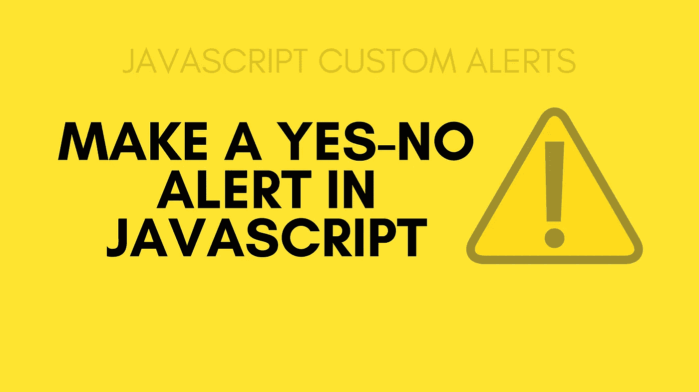

# 如何用 JavaScript 定制一个“是/否”提示？

> 原文：<https://javascript.plainenglish.io/how-to-make-a-custom-yes-no-alert-in-javascript-6cd2de221e6c?source=collection_archive---------0----------------------->

## 让我们通过制作一个“是”或“否”警告框来学习定制警告



使用内置 JavaScript，您只能获得三种类型的 JavaScript 警告弹出窗口，它们是:

*   警告框
*   确认框
*   提示席

现在，这些预定义的 JavaScript 警告的问题是，你不能定制它，你不能改变它的值或它的设计。

举个例子，如果你在 JavaScript 中创建一个确认警告框，它会创建一个带有确认或取消框的确认框。

现在，假设您正在做一个测验或某种 web 应用程序，您想用一个是或否框而不是确定或取消框来制作一个 JavaScript 警告，您将如何做呢？

很遗憾，你不能。尽管你可以用 HTML、CSS 和 JavaScript 在网页中定制警告框。但是你不会得到和普通 JavaScript 警告完全一样的警告框。

制作定制提醒的更好方法是使用 JavaScript 框架。

那么我说的是哪些 JavaScript 库呢？

尽管有许多 JavaScript 框架，您可以使用它们轻松地定制提醒。

jQuery UI 是一个很好的框架。

对于那些不知道的人，您可以使用 jQuery 轻松地制作交互式 web 应用程序。

让我们通过制作一个“是”或“否”警告框来学习定制警告。

# 那么如何制作一个是或否的警告框呢？

首先，通过 CDN 导入 jQuery UI 框架。

```
<link rel="stylesheet" href="//code.jquery.com/ui/1.12.1/themes/base/jquery-ui.css"><script src="https://code.jquery.com/jquery-1.12.4.js"></script><script src="https://code.jquery.com/ui/1.12.1/jquery-ui.js"></script>
```

现在，在 HTML 中创建一个输入框，并给它一个惟一的 id，然后创建一个 div，我们将在其中显示警告。并为其分配一个唯一的 id。

```
<input type="button" id="box" value="Tell about yourslef"/><div id="dialog-confirm"></div>
```

现在将这段代码复制并粘贴到 HTML 文件的脚本标签中。并在任何浏览器中运行。

```
<script>$('#box').click(function buttonAction() {$("#dialog-confirm").html("Do you feel good about your self?");// Define the Dialog and its properties.$("#dialog-confirm").dialog({resizable: false,modal: true,title: "Click Yes or No based on your preference",height: 250,width: 400,buttons: {"Yes": function () {$(this).dialog('close');alert("Yes, I do");},"No": function () {$(this).dialog('close');alert("Nope, I don't");}}});});$('#box').click(buttonAction);</script>
```

在这个脚本中，我们制作了一个对话框，有两个按钮，名字分别是“是”和“否”。只有当你点击 id 为“框”的按钮后，这个对话框才会显示。

你可以在这里了解更多关于如何在 jQuery 中定制这些警告框:[https://jqueryui.com/dialog/](https://jqueryui.com/dialog/)