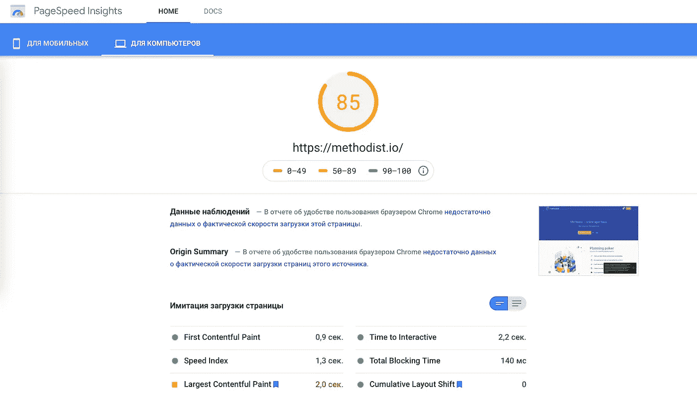
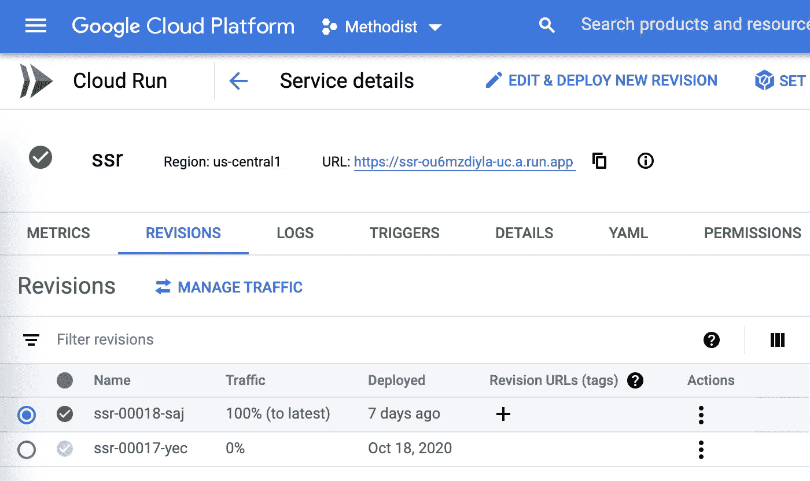

# 如何制作一个快速有棱角的 SEO 友好型 app

> 原文：<https://javascript.plainenglish.io/how-to-make-a-fast-angular-seo-friendly-app-a6d769bfd8d2?source=collection_archive---------7----------------------->

做一个有角度的 app，迟早会想到 SEO。首先，我认为谷歌无论如何都会解析我的应用程序，因为我听说它可以。日子一天天过去，却没有结果，于是我开始思考我能做些什么。我的目标是 SEO 友好的高 PageSpeed Insights 分数，不要把世界上所有的钱都花在服务器上。看起来我找到了一个方法！



85 PageSpeed Insights score for the real Angular app with SSR

因此，我的 PageSpeed Insights 得分约为 80+分，它是可扩展的，而且几乎可以免费托管。在获得这些结果之前，我尝试了不同的选择:

## 第一次尝试:预渲染

首先，我尝试对最重要的页面进行预渲染。理论上，它应该提供最佳性能，但我对 PWA 功能(渐进式 Web 应用程序)有很多问题。如果你不需要 PWA 支持，大概是你最好的选择。

## 第二次尝试:带有谷歌云功能的 SSR

通过这种方法，我的应用程序工作了很长一段时间。社交网络和爬虫可以解析应用程序的任何页面，它完全支持 PWA。但是它有一个超级大的性能问题——**冷启动**。云函数是无状态的，执行环境往往是从零开始初始化，这叫冷启动。开始执行前可能需要大约 3-5 秒+ SSR 时间 300-600 毫秒。2020 年要求用户等这么久是不能接受的。

## 第三次也是最后一次尝试:SSR 和 Google cloud Run

有了 Google Cloud Run，访客不必等待冷启动。该应用程序是搜索引擎友好的，并支持 PWA 功能。此外，谷歌提供了相当大的免费层限制，所以你托管一个应用程序可能不需要任何成本。

# 那么如何设置你的 app 呢？

首先你需要安装`@nguniversal/express-engine`。你可以用角度示意图来做。

```
ng add @nguniversal/express-engine
```

多亏了 Angular schematics，这几乎是你使用应用程序进行 SSR 的全部工作。您已经有了一个 npm 命令，它将构建应用程序和服务器的生产版本。

现在，我们应该将部署配置为云运行。有几个要求:

*   你需要[安装谷歌云 SDK](https://cloud.google.com/run/docs/quickstarts/build-and-deploy) 。
*   另外，你需要[安装 Firebase CLI](https://firebase.google.com/docs/cli) 。
*   你应该在谷歌控制台启用云运行，并启用计费。即使启用了计费，您仍有免费使用限制。虽然你的应用程序负载不是很重，但它不会花费什么。

云跑用的是 Docker 镜像，我们要准备一下。首先，我们需要创建一个 Docker 文件。对于我们的例子来说，这很简单:

我们到了最后一步，现在我们应该自动化 docker 映像的构建和部署。为了解决这个问题，我们可以看到不同的选项，我更喜欢使用 npm 脚本。

为什么是多个脚本？因为我们需要多名员工。

1.  我们需要建立一个码头工人的形象。
2.  我们需要将它部署到谷歌云。
3.  我们需要将静态文件部署到 Firebase 主机上，以便快速获取资产。

让我们将第一个脚本添加到 package.json 文件中。

```
"scripts": { "ng": "ng", "start": "ng serve", "build": "ng build --prod", ... "docker-build": "docker build ./ -t gcr.io/CLOUD_ACCOUNT/CLOUD_PROJECT && docker push gcr.io/CLOUD_ACCOUNT/CLOUD_PROJECT",}
```

命令`npm run docker-build`将从我们的 docker 文件构建一个 docker 映像并添加一个标签。有了这个标签，我们可以自动地将它直接部署到云上。

现在我们将添加一个 docker-deploy 脚本，它将把创建的映像部署到云运行中。

```
"docker-deploy": "gcloud run deploy ssr --image gcr.io/CLOUD_ACCOUNT/CLOUD_PROJECT --platform managed --region us-central1"
```

在您的情况下，地区可能会有所不同。这取决于您在启用云运行时在云控制台中的初始配置。

要在单个命令中运行这些脚本，我们可以创建`docker`脚本:

```
"docker": "npm run docker-build && npm run docker-deploy
```



部署之后，您需要在 google 控制台中启用最近部署的修订版的所有流量。

您的容器将免费存储在 5GB 空间的 Google 云存储中。超过这个限制后，你必须为空间付费，所以如果不必要，你可能需要删除以前的修订。

# 使用 Firebase 托管运行 SSR

至此，您已经完成了云运行部分。如果你使用 Firebase 托管，你需要做一些额外的设置和部署。

首先，我们需要更新 firebase.json。让我们为云运行服务添加所有 URL 的重写。

快好了。现在我们需要在 package.json 文件中添加更多的脚本。

```
"back-up-index": "mv dist/ANGULAR_PROJECT_NAME/browser/index.html dist/ANGULAR_PROJECT_NAME/browser/_index.html","restore-index": "mv dist/ANGULAR_PROJECT_NAME/browser/_index.html dist/ANGULAR_PROJECT_NAME/browser/index.html","hosting-ssr": "npm run back-up-index && firebase deploy --token=FIREBASE_CI_TOKEN --project=FIREBASE_PROJECT_NAME --non-interactive --only hosting && npm run restore-index"
```

> 要将云运行与 Firebase 一起使用，不要忘记从 dist 文件夹中删除 index.html。因为该文件的优先级高于 firebase 重写。

这就是为什么我们需要在部署之前将`index.html`重命名为`_index.html`。

要将资产部署到 firebase hosting，我们只需运行:

```
npm run build && npm run hosting-ssr
```

就是这样。

## 概括一下:

*   Google Cloud Run 在性能和价格上有很好的平衡。如果您需要更快的解决方案，可以选择 App Engine 或其他服务。
*   使用@nguniversal/express-engine 对 Angular app 进行服务器端渲染。
*   如果你使用 Firebase 托管，不要忘记从托管中删除 index.html，以免中断重写。

感谢阅读！如果您对此有任何想法，或者您知道如何提高 Angular SSR 的性能，请随时发表评论。