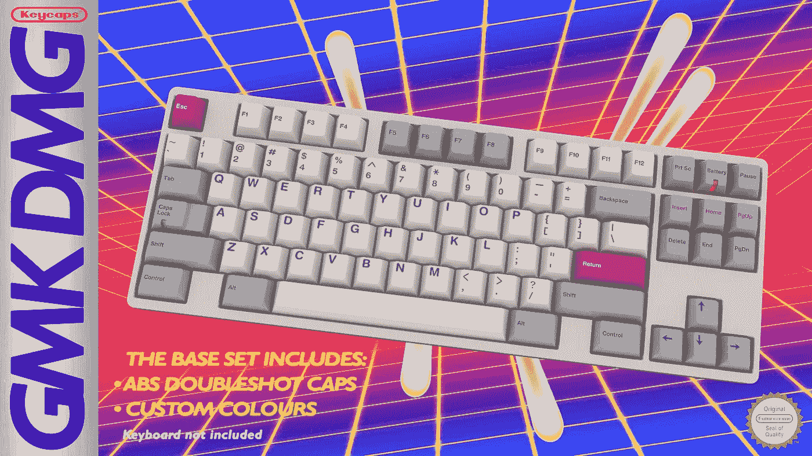
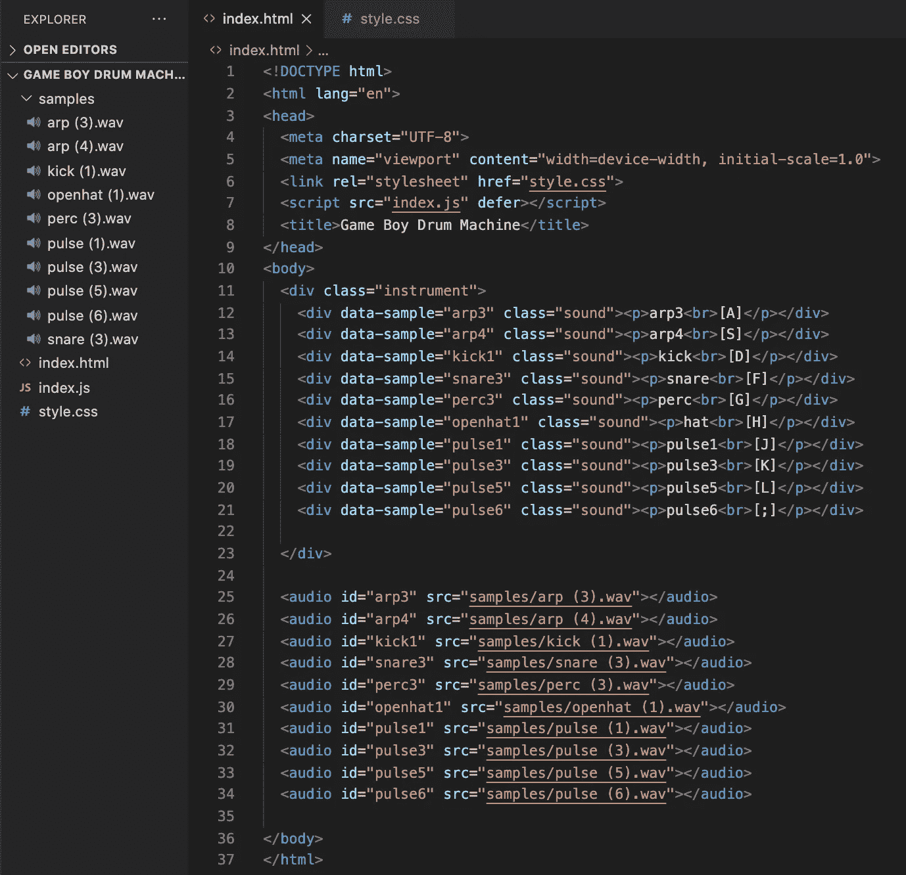
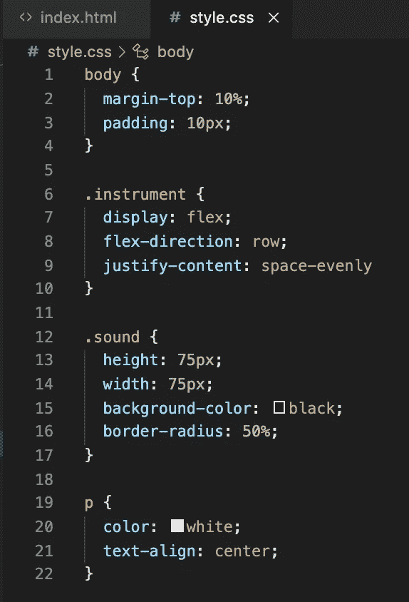
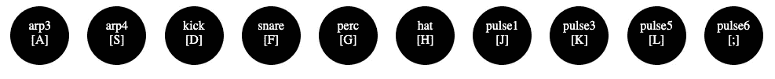
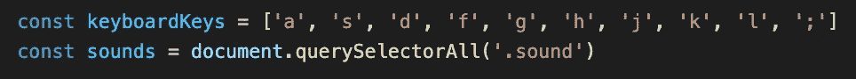
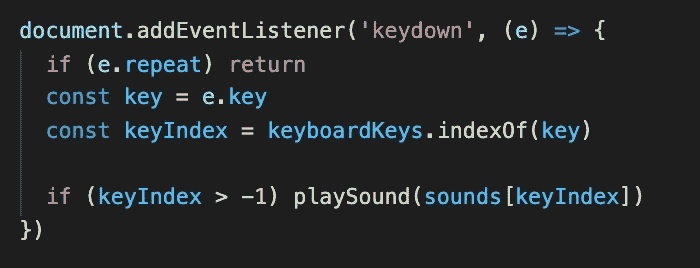
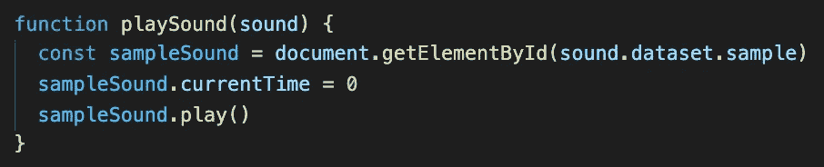

# 我用 JavaScript，HTML 和 CSS 做了一个 Game Boy 鼓机

> 原文：<https://javascript.plainenglish.io/how-to-make-a-game-boy-drum-machine-using-javascript-html-and-css-c389f032791a?source=collection_archive---------8----------------------->

[https://thekey.company/products/gmk-dmg?variant=12412178202724](https://thekey.company/products/gmk-dmg?variant=12412178202724)

如果你出生在 80 年代，和我一样，你可能仍然对 8 位时代的游戏有点痴迷。当我回头看时，我实际上发现自己在许多情况下比实际游戏更欣赏旧任天堂游戏的音乐(有一些不好的，好吗？).通常一段旋律会停留在我的脑海中——好几天都不知道它来自哪里，直到我意识到它来自我小时候沉迷了无数个小时的某个游戏。

因此，当我最近偶然看到 Web Dev Simplified 的[教程](https://youtu.be/vjco5yKZpU8)关于如何制作 JavaScript 钢琴时，我决定创建它，但使用 Game Boy 声音代替。我用的 Game Boy 样本包可以免费下载，[这里](https://bedroomproducersblog.com/2015/04/08/game-boy-drum-kit/)。

第一步是打开您选择的代码编辑器——我将使用 VS 代码。你需要创建 3 个文件和一个文件夹:**index.html**、 **index.js** 、 **style.css** 和一个 samples 文件夹。选出 10 个。wav 文件示例，并将它们添加到 sounds 文件夹中。接下来，我们想要创建一个包含 10 个 div 的 div(每个示例一个 div)。确保创建一个`data-sample=”sample name”`属性，并给它们所有声音的类名。用` `加上`
` s，输入名字和键盘按键，我用的是 home 行。我们还将使用样本声音文件创建 10 个音频标签。每个音频 id 必须与相应的数据集样本属性完全相同，这一点至关重要:

接下来，我们将向我们的。仪器和。声音类。我们将使用 Flexbox[https://css-tricks.com/snippets/css/a-guide-to-flexbox/](https://css-tricks.com/snippets/css/a-guide-to-flexbox/)创建一个响应浏览器窗口大小的简单行。我们将在。声音类为每个元素画一个圆，这些元素将在 flexbox 中均匀分布。我们还将为 p 元素添加一些灯光样式:

继续在您的终端中运行命令<open index.html="">，在您的浏览器中打开该文件。如果一切正常，您应该会看到类似这样的内容:</open>

现在来看看 JavaScript。

我们要做的第一件事是把我们将要使用的所有键盘字符放在一个数组中，并把它赋给一个变量。我的长这样`const keyboardKeys = ['a', 's', 'd', 'f', 'g', 'h', 'j', 'k', 'l', ';']`。接下来选择所有的。用 querySelectorAll 划分声音类，并将它们赋给一个变量`const sounds = document.querySelectorAll(‘.sound’)`。

现在我们将为整个文档添加一个事件监听器，它将监听`keydown`，这意味着它正在监听任何键盘按压。我们做的第一件事是确保如果一个键被按下并按住，它不会只是快速播放和重复声音；`if (e.repeat) return`我们只是返回，这样就不会播放声音了。我们将“keydown”事件赋给一个名为`key`的变量。现在，我们可以将变量`keyIndex`设置为`keyboardKeys`并按下键的索引。因此，如果被按下的键在我们的`keyboardKeys`数组中，它会将`keyIndex`设置为数组中被按下的键的位置。所以如果我输入`g`，那么`keyIndex`将会是`4`。如果我按下一个不在`keyboardKeys`数组中的键，那么索引将不会被找到，所以它将返回`-1`。所以让我们创建一个条件来检查`keyIndex`是否为`> -1`。如果`true`，那么我们可以调用该函数来播放声音。

`playSound`函数接受一个参数。我们将在`keyIndex`处从声音数组传入一个 div。所以想想看，如果我按键盘上的`g`，它会给我们`4`的`keyIndex`。如果我们将该索引传递给 sounds 数组，我们会发现自己位于第 4 个索引处，即`

perc [G]

`。我们将把它传递给`playSound`函数。一旦进入，我们可以使用 div 的 dataset sample 属性来提供相应样本声音的正确音频 id(它将是`perc3`)。

我们通过 sampleSound 变量中的 id 保存选定的音频。我们可以将`currentTime = 0`属性设置为`zero`——这将允许样本以我们希望的速度重新开始，而不是我们必须等待它结束播放，然后才能通过按键再次触发它。现在我们简单地对保存在 sampleSound 变量中的音频样本调用`play()`(这是一种在 JS 中播放视频或音频的方法)。如果一切都设置正确，你现在应该可以听到你分配的键盘按键的声音了！

GitHub 回购:[https://github.com/kylefarmer85/game-boy-drum-machine-js](https://github.com/kylefarmer85/game-boy-drum-machine-js)