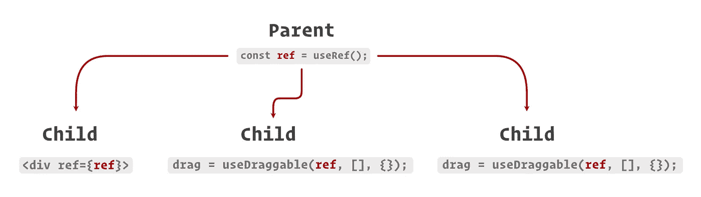

# 如何制作一个简单的自定义的 Drag React 钩子

> 原文：<https://javascript.plainenglish.io/how-to-make-a-simple-custom-usedrag-react-hook-6b606d45d353?source=collection_archive---------6----------------------->

## 使用自定义的可重用 React 挂钩处理元素拖动行为

大约有 10 亿个库在 Reactiverse 中处理 React 浮动的移动和拖动，其中许多库实际上非常棒。但是，有时你可能不想要一个完全成熟的库，或者你找到的库不能完成你需要的，*或者*你只是喜欢学习东西，想写你自己的代码！🤓

另外需要指出的是，我们将要构建的钩子是用来在页面上拖动一个元素，并通过一个`CSS`属性改变它的位置。因此，我们将使用`pointer`事件处理程序(`onpointermove`、`onpointerdown`等)。)来移动我们的元素。如果我们构建钩子来移动*数据，*而不是实际的元素，我们可能想要使用`drag`事件处理程序(`ondrag`、`ondragstart`等)。).

事不宜迟，这里有一个超级简单的自定义 React 钩子，您可以用它来完成所有基本的元素拖动任务。

# 使用抹布

酷毙了。这个钩子真的很简单，但是让我们来看看到底发生了什么。

第一个参数是一个必需的 React `ref`对象，它保存对一个 **HTML 元素**的引用。接下来是`deps`，一个**依赖关系列表**(重要)，最后是一个 **options** 对象，带有几个可选的回调:`onPointerDown`、`onPointerUp`、`onPointerMove`和`onDrag`。

## 状态和处理程序

我们将拖动状态存储在`isDragging`中，然后声明处理程序`handlePointerDown`、`handlePointerUp`和`handlePointerMove`。

`isDragging`简单地跟踪元素当前是否在拖动。注意，它也被从`useDrag`返回用于其他地方。

对于`handlePointerDown`，每当用户按下他们的设备时，我们将`isDragging`设置为`true`，然后通过我们的`onPointerDown`回调将事件传回。类似地，使用`handlePointerUp`，每当用户的设备上升时，将`isDragging`设置为`false`，并将拖动事件传回`onPointerUp`。最后，使用`handlePointerMove`，每当用户移动鼠标时，将事件传递回`onPointerMove`，如果我们当前正在拖动，也将事件传递回`onDrag`。

## 使用效果

之后，我们添加了负责注册和注销事件处理程序的`useEffect`钩子。我们首先检查以确保我们的元素`ref`已经初始化，然后我们用`addEventListener`和上面的处理函数注册每个事件。为了清理，我们返回一个函数，在每个处理程序上调用`removeEventListener`。[记住](https://www.osmosis.org/learn/Remember)钩子中返回的函数将在下一次更新之前运行。如果我们不这样做，每次效果挂钩运行的时候就会有新的事件监听器被注册*，这很快就会堆积起来。您可以通过注释掉`removeEventListener`调用并在`handlePointerDown`中添加一个`console.log`来亲自看到这一点。你会发现每次点击都会产生越来越多的日志。*

最后一位是我们的依赖数组，我们将`isDragging`与`deps`数组结合起来，这意味着只要这些变量中的任何一个发生变化，`useEffect`钩子就会运行。这里的依赖数组很重要！每次`useEffect`钩子运行时，它都会得到更新的函数处理程序向`addEventHandler`注册。如果那个*没有*发生，我们会以*过期的*函数注册到事件中结束。例如，如果我们有一个空数组——这意味着`useEffect`钩子只在组件被挂载时运行一次——那么`handlePointerMove`中的`isDragging`变量将始终是它被初始化时的样子— `false`!

最后，如上所述，我们返回一个带有`isDragging`的对象用于其他地方。

# 例子

不错！现在让我们继续演示这只小狗。

我用`create-react-app`搞出一个 React app，用大家最喜欢的 spinny React logo 作为拖动的目标。

为了实现拖动，首先我们将我们的`ref`容器声明为`divRef`，然后声明一个状态变量来保存 div 的当前`translate`位置。接下来，我们在`useDraggable`中声明从`onDrag`调用的`handleDrag`函数。最后，我们调用我们闪亮的新钩子，传递`divRef`、带有`translate`状态变量(重要)的依赖数组和`handleDrag`函数。现在，在下面，将我们的`divRef`连接到 logo 容器，并添加转换样式。

她就写了这么多！检查一下:

# 结束语

当然，和往常一样，还有很多其他方法可以实现上述目标。实际上，对于所用的示例，直接在容器`div`上使用 React 的`onPointerMove`、`onPointerUp`和`onPointerDown`处理程序会更快，并且在 App.js. *或*中处理拖动状态。您可以创建一个自定义组件来包装容器`div`并以这种方式处理拖动。

然而，我发现使用`useDraggable`钩子的一个好处是，你可以在同一个`ref`容器`div`上定义多个拖动处理程序，甚至可以通过传递`ref`在不同的组件中定义。

例如，您可能有一个定义了`ref`的父组件。然后将那个`ref`传递给包含目标元素的子组件。现在，您还可以将它传递给处理不同拖动行为的兄弟组件。

大概是这样的:

同样，在拖动元素的时候，有很多方法可以让你变得更加可爱，但是使用你自己的可重复使用的 React 钩子是一种快速简单的方法。

感谢阅读，希望你能学到一两件事！现在前进吧，带上你的元素！

# 资源

*   [https://codesandbox.io/s/late-lake-t1byk?file=/src/App.js](https://codesandbox.io/s/late-lake-t1byk?file=/src/App.js)
*   [https://github.com/tmarshall07/use-draggable-hook](https://github.com/tmarshall07/use-draggable-hook)