# 如何使一个抽搐亵渎过滤器铬扩展

> 原文：<https://javascript.plainenglish.io/how-to-make-a-twitch-profanity-filter-chrome-extension-195bce36b38d?source=collection_archive---------7----------------------->


我在这里和那里做了很多与 Twitch 相关的项目，试图看看有什么可能性。我最近的一个项目是为 Chrome 创建一个 Twitch 表情扩展，我展示了如何免费获得额外的表情“槽”。这让我进入了浏览器扩展，所以我想让我们通过为 Twitch 聊天构建一个脏话过滤器来展示如何从头开始制作一个。

最后，我们希望有一个扩展，当安装时，检查聊天中的一组标记的单词，并用更友好的版本替换它们。例如，这可能对观看视频流的儿童有用。

如果您只是想要这个扩展的代码，在本文的底部有一个到最终结果的链接。

# 修补时间

好吧，让我们先进入正题。在你喜欢的地方创建一个文件夹，命名为**脏话过滤器**。我在一个与 GitHub 同步的地方创建了我的。

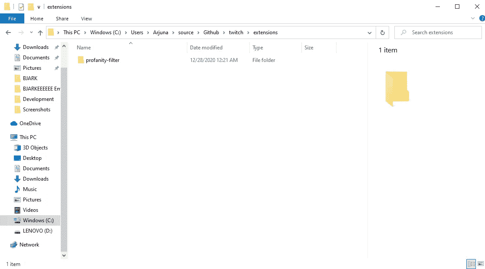

Any name will do, but this seems fitting

现在在这个文件夹中，创建两个新文件: **manifest.json** 和 **content.js** 。当我们开始构建扩展时，您将看到我们将如何使用它们。

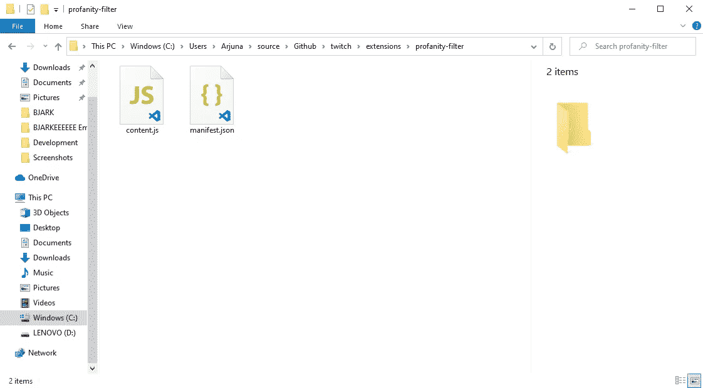

There we go

打开 **manifest.json** ，这是 Google 查找关于您的扩展的元数据的文件，并将以下内容粘贴到其中:

```
{ "manifest_version": 2, "name": "Twitch Profanity Filter Extension", "version": "0.1", "content_scripts": [ { "matches": ["https://www.twitch.tv/*"], "js": ["content.js"] } ]}
```

正如你所看到的，我们告诉 Google 这个扩展应该可以在 Twitch 的任何页面上运行，我们还说应该在这些页面上运行的逻辑驻留在名为 **content.js** 的文件中。请注意，我将版本设为 0.1，因为这是我的第一次尝试。

## 获取逻辑

现在在你选择的文本编辑器中打开 **content.js** 。我强烈推荐 [Visual Studio Code](https://code.visualstudio.com/download) ，它是我用来编辑任何编码相关内容的文本编辑器，而且是免费的。

现在，我们将通过几个步骤来设置它。我们想要实现什么，我们如何实现？我们知道我们想要将某些单词改为其他单词，这意味着阅读聊天消息，扫描它们以寻找标记的单词，然后将这些单词更新为更友好的单词。因此，当页面加载时，我们希望我们的逻辑能够做到以下几点:

*   找到聊天框
*   每次出现新的聊天消息时，获取消息或消息容器
*   将标记的单词改为友好的对应单词

所以让我们开始吧。第一部分实际上是在页面，或者更确切地说是窗口加载后激活脚本。在 javascript 中，您可以挂接加载事件，我们将这样做。更新您的 **content.js** 以包含以下内容:

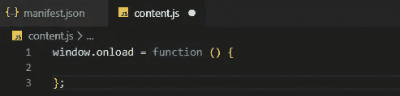

这将确保无论我们在函数中放入什么，当页面加载时都会被调用。

## 找到聊天框

那么我们如何找到聊天框呢？嗯，在 Twitch 网站的 Chrome 版本中，聊天框包含在一个 **< div >** 元素中，该元素有一个名为*聊天滚动区 _ _ 消息容器*的类。我们将通过 javascript 获得该元素或节点。更新文件，如下所示:

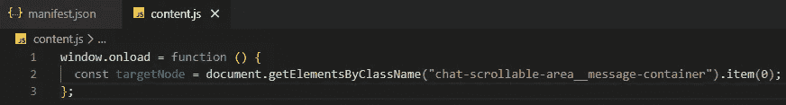

我们之所以加上**。item(0)** 在它后面，是因为 **getElementsByClassName()** 返回一个数组的元素。因为我们知道只有一个元素有这个类，我们通过指定我们想要的第一个东西(大多数编程语言从 0 开始计数)从数组中获取它。

## 获取聊天中的每条新消息

如果你不习惯编程或者不习惯观察者模式，理解起来就有点棘手了。我们获取每一条新消息的方法是在我们刚刚获得的 chatbox 节点上使用一个**突变观测器**。更新文件以匹配以下内容，然后我们将逐步了解发生了什么:

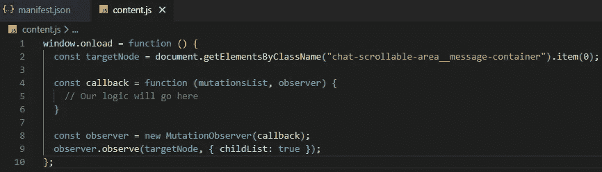

首先，在第 4 行，我们定义了一个回调函数，它接受一个突变列表和我们将在第 8 行创建的观察器。每当我们正在观察的节点中发生变化，或者*发生突变*，就会调用这个函数中的逻辑。

在第 8 行，我们创建了观察者，并把回调函数传递给它。然后，在第 9 行，我们告诉观察者开始观察我们的目标节点，我们将一个配置传递给 **childList** 表示我们只对突变感兴趣。消息作为子节点出现在我们正在查看的 chatbox 节点中，所以我们的回调函数将在每次新的聊天消息出现时被触发。这正是我们想要的！

但是现在我们仍然需要获得实际的消息元素，为此我们在回调中增加了一行代码:


这个名字可能看起来有点奇怪，但是消息的所有文本部分(我们没有扫描表情，只是实际的文本)都放在具有类 *text-fragment* 的 **< span >** HTML 元素中。此外，因为这个函数在每个新消息时被触发，我们知道我们想要的消息必须是 chatbox 节点中的最后一个元素，所以这就是为什么我们要获取 **lastElementChild** 。

## 将标记的单词改为友好的对应单词

让我们进入有趣的部分。如果我们想要改变被标记的单词，我们首先需要一些东西来告诉我们什么是被标记的单词以及它们的对应词。我们将通过使用一个简单的字典来做到这一点。更新文件，如下所示:


You can add more words as you like, just remember the comma at the end

现在我们将读取所有*文本片段*元素中的实际文本，循环所有禁用的单词，并在必要时替换它们。让我们开始这个循环，用下面的代码更新你的回调函数:

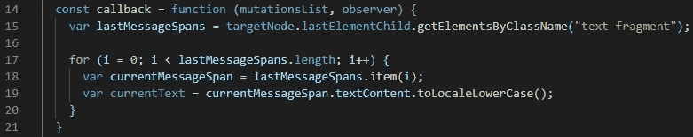

这里发生的事情是，我们正在遍历所有这些包含文本的元素。在第 18 行，我们一次取一个特定的元素，在第 19 行，我们从它那里得到小写的实际文本，因为我们标记的单词也都是小写的。这使得比较更加容易，但是在更高级的版本中，我们会注意保持大小写的整洁。现在我们有了文本，我们想要循环我们标记的单词，并检查它们是否存在。如果是这样，我们删除它们。更新功能:

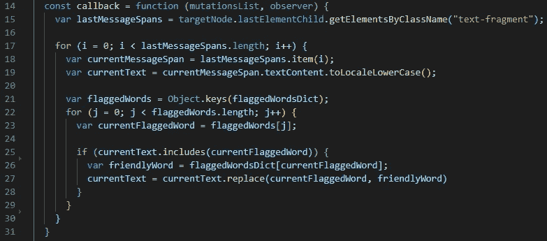

我们制作的字典使用键-值对，其中键是标记的单词，值是友好的单词，所以在第 21 行我们简单地得到所有键的数组，这是我们想要循环的标记单词的数组。在循环中，我们获取当前正在查看的标记单词，如果我们的文本包含一个或多个标记单词，我们将获取友好单词，并通过替换标记单词来更新我们的文本。这几乎就是全部，现在我们只需要把我们新的和改进的文本放回我们获取它的元素中:

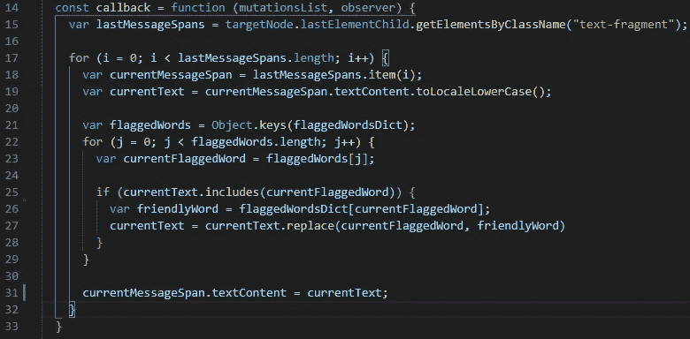

在第 31 行，我们已经将文本放回元素中，就这样！让我们在 Chrome 上测试一下。

# 测试

打开 Chrome，浏览到 **chrome://extensions** 。你应该会看到你的扩展，在右上角你会看到**开发者模式**。如果还没有打开，就打开它。之后，在右上方，您会看到**加载解包**选项。我们将使用它来加载我们的本地扩展，而不必通过 Chrome 网络商店。单击它并选择文件所在的文件夹:

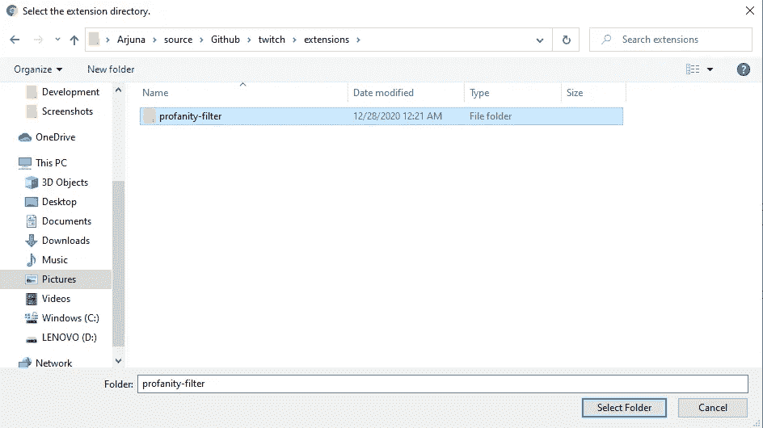

这应该会使它立即出现在我们的扩展列表中:

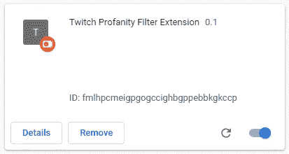

很好！现在让我们去任何可以聊天的频道。我会去我的朋友 [Bjarke 的频道](http://twitch.tv/bjarkeeeee)，一个热闹的丹麦流光，并尝试它:

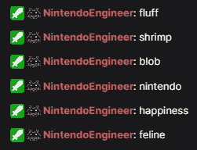

好了，成功了！我们自己的脏话过滤器。不是很难，对吧？剩下的就是发布到 Chrome 网上商店，如果你愿意的话。我将扩展这个单词列表并发布它，所以如果你不需要更多，你不必发布它，因为它需要一笔费用才能进入这个程序。我不会深入讨论这个版本是如何工作的，但是如果你感兴趣，我做了一个 [Twitch 表情扩展](https://chrome.google.com/webstore/detail/bjarkeeeee-emote-extensio/igpdgcgafncbamkndjppepompjlkaeoj)来获得你自己的无限表情槽[这篇文章](https://nintendoengineer.medium.com/how-to-get-infinitely-more-twitch-emote-slots-7eb17ee9a6a1)解释了如何在最后发布扩展。

如果你想看到这个扩展的所有代码，请点击这里查看 GitHub repo。快乐编码！