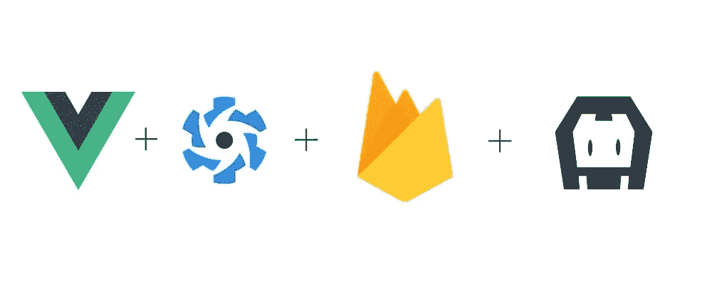
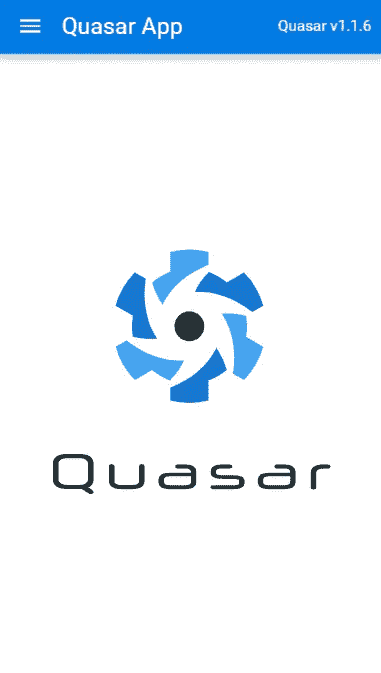
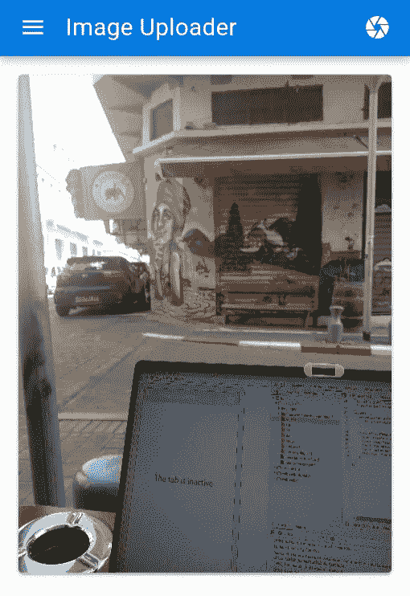

# 如何用 Vue、Quasar、Firebase Storage 和 Cordova 制作一个图片上传应用程序——第 1 部分

> 原文：<https://javascript.plainenglish.io/how-to-make-an-image-uploading-app-with-vue-quasar-firebase-storage-and-cordova-part-1-232b68755d0c?source=collection_archive---------2----------------------->



# 我们正在建造的东西

我们将构建一个跨平台的移动应用程序，用于拍摄照片并上传到 firebase。

在第 1 部分中，我们将拍摄一张照片并将其保存到 Firebase 云存储中，然后在我们的应用程序中显示它。在第 2 部分中，我们将卸载上传工作，并使用 blueimp 库在本地生成缩略图，并在上传时显示它。

# 堆栈

*   Vue JS —组件框架
*   Cordova —跨平台移动框架
*   Quasar — UI 框架(和 CLI)
*   Firebase 云存储—用于存储照片
*   web Workers——用于将上传卸载到单独的线程

# 脚手架

我们将使用 [Quasar CLI](https://quasar.dev/quasar-cli/developing-cordova-apps/preparation) 来初始化一个新项目，并运行 cordova 模式(android 或 ios)来查看在您连接的设备上运行的应用程序。

```
quasar create vue-firebase-image-upload 
cd vue-firebase-image-upload 
quasar dev -m android
```

> *如果运行在 android > 9* 上，你必须在 `*quasar.conf.js*` *的* `*devServer*` *部分添加* `*https: true*`

*您应该得到一个基本的工作版本，如下所示:*

**

*这是你第一次承诺的好时机。*

> **关于如何安装和设置 quasar 的更多细节，请看* [*这篇文章*](https://www.learningsomethingnew.com/how-to-build-a-sound-cloud-like-audio-player-app-with-vue-js-quasar-and-wave-surfer#scaffolding)*

# *拍照并获得 base64*

*在 Firebase 云存储中存储图像的方法是使用 Firebase 的`putString`方法保存图像的 base-64 字符串。请注意，在上传之前，您必须从字符串中删除 base64 前缀，否则 Firebase 将拒绝该字符串。首先，我们将添加一个使用 Cordova 的相机插件拍照的按钮，并打印 base64 字符串。*

# *添加插件*

*首先，添加科尔多瓦相机插件和文件插件:*

```
*cd src-cordova 
cordova plugin add cordova-plugin-file 
cordova plugin add cordova-plugin-camera*
```

# *拍照*

*为了拍照，我们将在一个新的服务文件`src/services/cordova-camera.js`中添加一些代码:*

```
*async function getCameraFileObject() {
  return new Promise((resolve, reject) => {

    let camera = navigator.camera;

    const options = {
      quality: 50,
      destinationType: camera.DestinationType.FILE_URI,
      encodingType: camera.EncodingType.JPG,
      mediaType: camera.MediaType.PICTURE,
      saveToPhotoAlbum: true,
      correctOrientation: true
    };

    camera.getPicture(imageURI => {
      window.resolveLocalFileSystemURL(imageURI,
        function (fileEntry) {
          fileEntry.file(
            function (fileObject) {
              resolve(fileObject)
            },
            function (err) {
              console.error(err);
              reject(err);
            }
          );
        },
        function () { }
      );
    },
      console.error,
      options
    );
  })

}

async function getBase64FromFileObject(fileObject) {
  return new Promise((resolve, reject) => {
    var reader = new FileReader()
    reader.onloadend = function (evt) {
      var image = new Image()
      image.onload = function (e) {
        resolve(evt.target.result)
      }
      image.src = evt.target.result
    }
    reader.readAsDataURL(fileObject)
  })
}

async function getBase64FromCamera() {
  let fileObject = await getCameraFileObject();
  let base64 = await getBase64FromFileObject(fileObject);
  return base64;
}

export default {
  getBase64FromCamera
}*
```

*该服务执行几个步骤:*

1.  *使用 Cordova 的相机插件拍照。这将返回图像 URI。*
2.  *使用 Cordova 的文件插件获得一个文件*条目*，带有`resolveLocalFileSystemURL`功能。*
3.  *使用`file`方法获取文件*对象*。*
4.  *使用`FileReader`获取文件的 base64 表示。*

*现在让我们添加一个简单的事件总线。添加文件`src/services/event-bus.js`，内容为:*

```
*import Vue from 'vue';
export const EventBus = new Vue();*
```

*现在在`src/layouts/MyLayout.vue`中，我们将在工具栏中添加一个用于拍照的按钮，并使用我们的事件总线将处理发送给`Index.vue`:*

```
*<template>
  ...

  <q-btn flat dense round @click="takePicture">
    <q-icon name="camera" />
  </q-btn>

  ...
</template>

<script>
  import { EventBus } from "../services/event-bus.js";

  export default {
    ...

    methods: {
      takePicture() {
        EventBus.$emit('takePicture')
      }
    }
  }
  </script>*
```

*最后，我们将在我们的主组件`Index.vue`中捕获`takePicture`事件，调用`cordova-camera.js`服务函数并打印 base64 结果(稍后我们将上传到 firebase):*

*在`<script>`部分的`Index.vue`文件中:*

```
*import { EventBus } from "../services/event-bus";
  import cordovaCamera from "../services/cordova-camera";

  export default {
    name: "PageIndex",
    mounted() {
      EventBus.$off("takePicture");
      EventBus.$on("takePicture", this.uploadImageFromCamera);
    },
    methods: {
      async uploadImageFromCamera() {
        let base64 = await cordovaCamera.getBase64FromCamera();
        console.log("base64", base64)
      }
    }
  };*
```

*使用`quasar dev -m android`运行，并查看 chrome 开发工具，我们可以看到 base64 输出作为一个长字符串打印在控制台中:*

**

# *添加 firebase*

## *Web SDK 还是原生 SDK？*

*当在 cordova 应用程序中使用 Firebase 时，您可以选择使用 Web SDK 或包装本地 SDK 的 Cordova 插件。目前 Firebase cordova 插件的状态对我来说似乎有点不稳定，还不完全支持 Firebase 云存储。由于能够将工作转移给 web 工作者，我们可以使用功能全面的官方 Web SDK，而不会影响性能。使用 yarn 添加 firebase sdk:*

```
*yarn add firebase*
```

## *Firebase 设置*

*遵循 Firebase 云存储[设置页面](https://firebase.google.com/docs/storage/web/start)中的说明。设置完成后，您应该有一个启用了存储的 firebase 项目。我们将把设置保存在一个单独的文件中:`firebase-config.js`(这个文件不会提交给我们的 repo)。内容应该是这样的:*

```
*export default {
    firebase: {
        apiKey: '<your-api-key>',
        authDomain: '<your-auth-domain>',
        databaseURL: '<your-database-url>',
        storageBucket: '<your-storage-bucket-url>'
    }
}*
```

# *上传图像*

*现在我们已经有了 Firebase 设置，我们将添加另一个服务来处理 Firebase 应用程序的初始化和上传。添加文件`src/services/cloud-storage.js`，内容为:*

```
*import * as firebase from "firebase/app";
import 'firebase/storage';
import firebaseConfig from './firebase-config';

async function uploadBase64(imageData, storageId) {
    return new Promise((resolve, reject) => {
        let uploadTask = firebase.storage().ref().child(storageId).putString(imageData, "base64");
        uploadTask.on(
            "state_changed",
            function (snapshot) {},
            function (error) {
                reject(error)
            },
            function () {
                uploadTask.snapshot.ref
                    .getDownloadURL()
                    .then(function (downloadURL) {
                        console.log("Uploaded a blob or file!");
                        console.log("got downloadURL: ", downloadURL);
                        resolve(downloadURL);
                    });
            }
        );
    });
}

function initialize() {
    firebase.initializeApp(firebaseConfig.firebase) 
}

export default {
    uploadBase64,
    initialize
}*
```

*`uploadBase64`函数使用`putString`方法上传`imageData`(base64 字符串)，在`storageId`的 Firebase 子节点下。您可以使用任何想要的 ID，这里我选择使用 unix datetime 数字作为子 ID。上传完成后，我们使用上传任务的`getDownloadURL`函数返回图像 URL。*

*在我们的主`App.vue`文件中，我们将在安装应用程序时调用初始化函数:*

```
*import cloudStorage from './services/cloud-storage'
export default {
    name: 'App',
    mounted() {
      cloudStorage.initialize();
    }
}*
```

*最后我们将从`Index.vue`调用上传函数。这是现在`Index.vue`的内容:*

```
*<template>
  <q-page>
    <div class="row justify-center q-ma-md" v-for="(pic, idx) in pics" :key="idx">
      <div class="col">
        <q-card>
          <q-img spinner-color="white" :src="pic" />
        </q-card>
      </div>
    </div>
  </q-page>
</template>

<script>
import { EventBus } from "../services/event-bus";
import cordovaCamera from "../services/cordova-camera";
import cloudStorage from "../services/cloud-storage";

export default {
  name: "PageIndex",
  data() {
    return {
      pics: []
    };
  },
  mounted() {
    EventBus.$off("takePicture");
    EventBus.$on("takePicture", this.uploadImageFromCamera);
  },
  methods: {
    removeBase64Prefix(base64Str) {
      return base64Str.substr(base64Str.indexOf(",") + 1);
    },

    async uploadImageFromCamera() {
      const base64 = await cordovaCamera.getBase64FromCamera();
      const imageData = this.removeBase64Prefix(base64);
      const storageId = new Date().getTime().toString();
      const uploadedPic = await cloudStorage.uploadBase64(imageData, storageId);
      this.pics.push(uploadedPic);
    }
  }
};
</script>*
```

*我们已经将`pics`数组添加到组件的`data`中，包含我们上传的所有图片的 URL。我们添加了一个`v-for`，它将显示一个`q-card`组件内的类星体`q-img`组件中的每张图片。我们还修改了`uploadImageFromCamera`来拍照，获取`base64`字符串(去掉前缀，这样 Firebase 就不会出错)，使用当前日期时间计算`storageId`，并调用上传函数。上传后，我们将结果 URL 添加到`pics`数组中。*

*我们现在可以看到上传的图像:*

**

*完整代码在 [GitHub](https://github.com/syonip/vue-firebase-image-upload) 上。*

*在本系列的下一部分中，我们将把任务转移到一个 web worker，添加一个 loading spinner，并将 URL 保存在本地存储中。敬请期待！*

**原载于*[*https://www.learningsomethingnew.com*](https://www.learningsomethingnew.com/how-to-make-an-image-uploading-app-with-vue-quasar-firebase-storage-and-cordova-part-1)*。**