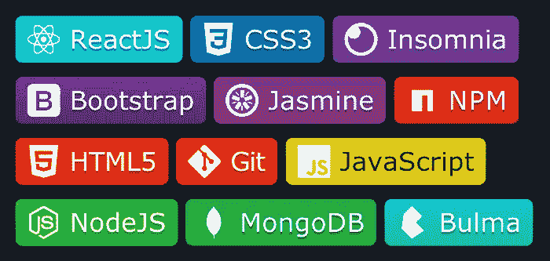
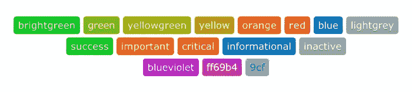
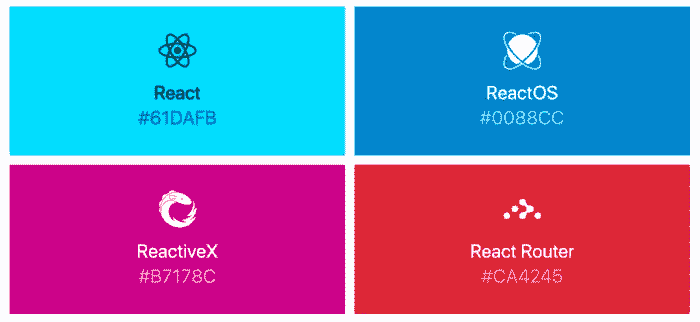
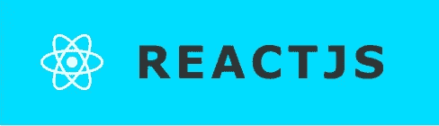
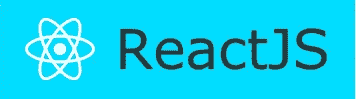

# 如何使用 shields.io 为您的个人资料制作自定义语言徽章

> 原文：<https://javascript.plainenglish.io/how-to-make-custom-language-badges-for-your-profile-using-shields-io-d2aeaf016b6b?source=collection_archive---------1----------------------->

几个月前，当我开始成为一名开发人员时，我经常在 Github 上的个人资料中看到那些小的语言徽章，并认为它们非常酷。但即使我看了个人资料、[shields.io](https://shields.io/)URL 和 shields . io 页面后面的代码，我还是对人们是如何做到这些的感到非常惊讶。

有一天，我在一个朋友的个人资料上发现了一些，我想我最终会发现如何去做。我联系了她，她告诉我一个悲伤的消息，她也不知道如何做，只是从别人那里抄袭，就像我自己做的一样。

嗯，我花了几个星期和一些研究，因为我试图同时从 Ironhack 的 Web Dev Bootcamp 毕业，但我终于能够对他们的 URL 进行“逆向工程”。所以今天我向你介绍如何制作你自己的徽章，让你的个人资料更有趣。

# 重要的事情先来

制作自己的徽章需要做的第一件事就是找到你需要的 logo 图像是否在 shields.io 上可用，这个很简单，可用的图像有:比特币、dependabot、discord、gitlab、npm、paypal、serverfault、stackexchange、超级用户、telegram、travis 或者任何简单图标上可用的图标:

 [## 简单图标

### 流行品牌的 1512 个免费 SVG 图标。

simpleicons.org](https://simpleicons.org/) 

在 Simple Icons 网站上，你只需要搜索你想要的语言、框架、库或品牌，看看它们是否可用。

# 1.网址

如果您想要的图标可用，您就可以开始制作您的徽章了，这是 url 的第一部分，将出现在所有徽章之前:

https://img.shields.io/badge/

然后，在第一部分之后，您将添加一个破折号，以及您希望在徽章上显示的任何内容(这一部分区分大小写)，以便您可以添加语言、框架、库、品牌或您希望为徽章编写的任何内容。我要做一些反应，例如:

【https://img.shields.io/badge/-ReactJS 

如果你想写多个单词，你需要用%20 代替空格:

[https://img.shields.io/badge/-React%20Router](https://img.shields.io/badge/-React%20Router)

# 2.颜色

在名字之后，你需要给你的徽章背景添加一种颜色。shields.io url 接受命名颜色和十六进制代码。url 接受的一些命名颜色有:*亮绿色、绿色、黄绿色、黄色、橙色、红色、蓝色、浅灰色、灰色/灰色、成功、重要、关键、信息、非活动、蓝紫色、黑色*，以及 CSS 中接受的任何其他颜色。

Some visual examples of the named colors

你可以在这里找到更多的命名颜色(和十六进制代码):

 [## 颜色名称- HTML 颜色代码

### 就像十六进制颜色代码一样，HTML 颜色名称可以与内联 HTML 样式一起使用，也可以在单独的 CSS 样式表中使用。HTML…

htmlcolorcodes.com](https://htmlcolorcodes.com/color-names/) 

要将命名的颜色或十六进制代码添加到链接中，您只需要再添加一个破折号(-)和颜色:

[https://img.shields.io/badge/-ReactJS-lightblue](https://img.shields.io/badge/-ReactJS-lightblue)

【https://img.shields.io/badge/-ReactJs-61DAFB 号

*一点小提示！*在寻找简单图标上的标志时，网站已经告诉你该图标/品牌的官方颜色(和十六进制代码):

# 3.标志

在知道徽标存在于简单的图标上之后，将它添加到 url 上可能会简单一些，也可能会复杂一些。如果图标只有一个名字，比如 React、Git 或 JavaScript，这很简单，只需添加**？logo =<name _ of _ the _ icon _ lower case>**:

[https://img.shields.io/badge/-ReactJs-61DAFB?logo=react](https://img.shields.io/badge/-ReactJs-61DAFB?logo=react)

对于包含多个单词的图标，如 React Router，您必须在单词之间添加一个破折号(-):

[https://img.shields.io/badge/-React%20Router-CA4245?logo=react-router](https://img.shields.io/badge/-React%20Router-CA4245?logo=react-router)

*另一个提示！*有些名字可能更难，比如 NodeJs 在 url 中写成: *node-dot-js* 。所以有些名字你可能需要试验一下。如果你在这方面有困难，请随时在 twitter 上联系我。

# 4.徽标颜色

你也可以为你的 logo 定义一种颜色，只需在 url 的末尾添加**&logo color =<color>**即可。徽标也接受命名颜色和十六进制代码:

[https://img.shields.io/badge/-ReactJs-61DAFB?logo=react&logo color =白色](https://img.shields.io/badge/-ReactJs-61DAFB?logo=react&logoColor=white)

# 5.其他风格

除了颜色，shields.io 还允许徽章的更多样式:

## **扁平式**

这是这些徽章的默认样式，但是如果由于任何原因默认样式在不同浏览器之间发生变化或者将来发生变化，要获得这种样式，您只需在 url 的末尾添加 **& style=flat** :

[https://img.shields.io/badge/-ReactJs-61DAFB?logo=react&logo color =白色& style=flat](https://img.shields.io/badge/-ReactJs-61DAFB?logo=react&logoColor=white&style=flat)

## **塑料按钮样式**

这将你的徽章转换成一个三维按钮一样的徽章。要使用它，只需在你的网址末尾添加 **& style=plastic**

[https://img.shields.io/badge/-ReactJs-61DAFB?logo=react&logo color =白色&style =塑料](https://img.shields.io/badge/-ReactJs-61DAFB?logo=react&logoColor=white&style=plastic)

## **方形粗体样式**

这使得你的徽章变成一个长方形的扁平徽章，上面的文字全部大写并且加粗。要使用它，只需在您的 url 末尾添加**&style = for-the-badge**

[https://img.shields.io/badge/-ReactJs-61DAFB?logo=react&logo color =白色& style=for-the-badge](https://img.shields.io/badge/-ReactJs-61DAFB?logo=react&logoColor=white&style=for-the-badge)

## **方形样式**

这使得你的徽章变成一个长方形的扁平徽章。要使用它，只需在你的 url 末尾添加 **& style=flat-square**

[https://img.shields.io/badge/-ReactJs-61DAFB?logo=react&logo color =白色&style =扁方](https://img.shields.io/badge/-ReactJs-61DAFB?logo=react&logoColor=white&style=flat-square)

## **徽章宽度**

您可以通过添加**&logo width =<amount _ of _ pixels>**为您的 logo 定义一个更大的宽度:

[https://img.shields.io/badge/-ReactJs-61DAFB?logo=react&logo color =白色& logoWidth=30](https://img.shields.io/badge/-ReactJs-61DAFB?logo=react&logoColor=white&logoWidth=30)

还有一些其他风格，但他们不适用这种徽章。你可以在 shields.io 上查看其他风格和其他类型的徽章，但我很快会写另一篇关于互动/实时徽章的文章！

还有一个 npm 包可以让你更容易获得徽章。我还没有尝试过，但它叫做{badgr}，你可以在这里找到更多关于它的信息。

我希望你喜欢这个小教程，并充分利用它来增加一些有趣的个人资料！