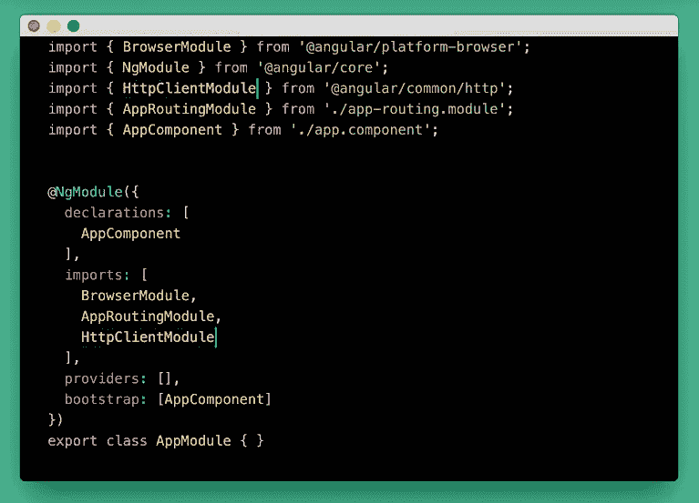

# 如何使用 HttpClient 在 Angular 中发出 HTTP 请求

> 原文：<https://javascript.plainenglish.io/how-to-make-http-requests-in-angular-using-httpclient-15e1fdf76a03?source=collection_archive---------9----------------------->

web 开发的首要原则之一是学习如何与后端通信，以获取或更新数据，并访问它提供的其他服务。

为了做到这一点，我们将使用 Angular 在 4.3.1 版本中引入的新 HttpClientModule。这取代了前面的 HttpModule，通过提供内置接口使利用和测试更加容易。

## **导入适当的模块**

开始使用 HTTP 客户端需要做的第一件事是将正确的模块导入到我们的项目中。

我们要注意的是，我们使用的应该是位于***@ angular/common/http***和**中的 ***HttpClientModule*** 而不是*****中的***http module****@ angular/http***目录*。**

*这是现在用 Angular 写 Http 请求时常见的困惑之一。有些人仍然引用旧模块，因此在服务中使用它时会出错。*

*现在，我们只需要将***imports*******array***中的 HttpClientModule 加上其他默认模块，如 *BrowserModule* 和*approving module*。**

****

**Importing HttpClientModule in the app module.**

## **将 HttpClient 服务作为依赖项注入**

**在我们的服务文件中，我们必须在构造函数中注入 *HttpClient* 模块，并使用它在我们的应用程序中发送任何 HTTP 请求。**

****

**Injecting the HttpClient token inside the constructor.**

## **使用 GET 方法从服务器获取数据**

**在这个例子中，我们将使用 [iTunes](https://developer.apple.com/library/archive/documentation/AudioVideo/Conceptual/iTuneSearchAPI/Searching.html) URL 来执行 HTTP 请求并在模板上显示一些数据。**

**我们将呼叫**。在 *getSongDetails* 函数中的 get()方法**，这将返回一个在收到响应时发出请求数据的可观察对象。我已经定义了一个实例，并把它放在上面，这样我们就可以在需要向服务器发出请求时引用 iTunes API。**

****

**Creating a method that will execute Http request.**

## **向方法添加类型**

**指定 Http 请求结果的类型是一种常见的做法，这样我们就知道我们将得到什么类型的数据。如果我们没有指定它的类型，那么调用的结果将是一个。**

**在下面的图片中，我创建了一个歌曲界面模型来给我们的数据赋予形状。这将用于设置函数和 HttpClient 方法的类型。**

****

**Creating a Song interface.**

**然后我们必须在服务文件中导入这个接口。**

**您会注意到，除了接口之外，我们还从 RxJS 导入了 Observable。**

**现在，请记住，当您将 *getSongDetails()* 函数的类型指定为可观察的<歌曲>时，您还必须添加实际的*的类型。get()* 调用<歌曲>，这样就不会出现错误。**

****

**Specifying get method result as an Observable with Song as its type.**

## **创建具有不可变状态的其他 Http 操作**

## **PUT 方法**

**这个方法类似于我们之前创建的方法。但是，没有使用*。get()，*我们现在将使用*。放()*方法。我们还需要传递附加信息，比如该项目的 ID 和更新值，以便能够在数据库中更新它。**

**查看下面的示例:**

****

## **删除方法**

**对于删除请求，非常简单，我们只需要创建一个新函数来构造**。delete()** 请求方法。这次我们不需要传递更新的数据，所以我们可以只引用完整的 URL (ITUNES_API)并传递项目的 ID，然后它将从数据库中删除。**

****

## **过帐方法**

**POST 请求类似于。put()请求，在这个方法中，我们需要引用资源 URL，并且需要传递一个额外的参数，即*主体*或我们需要添加到数据库中的数据。当我们成功添加数据后，组件将返回一组新的数据，包括我们刚刚添加的数据。**

****

## **添加自定义标题和参数**

## **HttpHeaders**

**一些服务器在向数据库添加数据时需要额外的协议。常见的有以下[实体头](https://developer.mozilla.org/en-US/docs/Glossary/Entity_header):**

*   **内容类型(Mime 类型)**
*   **内容长度(要上传的数据量)**
*   **授权令牌**

**Angular 的 **HttpHeaders** 类提供了一种处理这种需求的方法。您只需要创建一个包含这些标题选项属性的对象。**

**这里有一个例子:**

****

**Creating new HttpHeaders entity and assigning it to an object.**

**为了更新 headers 属性，我们需要引用 *options* 对象并使用**。设置**操作，为其分配新值。在本例中，我们将更新前面定义的标题的授权令牌。**

**下面是传递新 headers 属性的实际 Http 请求的示例:**

****

**Passing updated headers to response.**

## **http 程序**

**获取数据时，GET 请求通常有多个参数。参数需要动态地传递或分配给请求。为此，我们需要将 HttpParams 类导入到我们的服务中。**

**在下面的例子中，我们定义了新的 HttpParams 并添加了三个 URL 查询字符串，分别是*‘term’、‘media’和‘limit’:***

****

**Defining new Httpparams and assigning query strings.**

**由于 HttpParams 对象是不可变的，我们需要使用**。set()** 方法是否需要更新选项。**

**在下图中，我们已经更新了 *getSongDetails* 函数并动态分配了参数。在这种情况下，代码看起来更加清晰:**

****

## **备忘单:**

*   ****HttpClientModule** 需要导入到应用程序的根模块中。**
*   ****HttpClient** 类应该导入并注入到服务的构造函数内部。**
*   ****HttpHeaders** 类应该在定义新的头选项之前导入。**
*   ****定义动态参数查询字符串时导入 HttpParams** 类。**
*   **在编写 Http 调用时，最好的做法是**创建模型并将类型**添加到方法和请求中。**

****

**[Alexandre Debiève](https://unsplash.com/@alexkixa)**

**你觉得这个博客有帮助吗？别忘了在评论区留下一些反馈。**

## **资源**

**[http 头](https://developer.mozilla.org/en-US/docs/Web/HTTP/Headers) | [使用 http 的后端服务](https://angular.io/guide/http#configuring-http-url-parameters)**