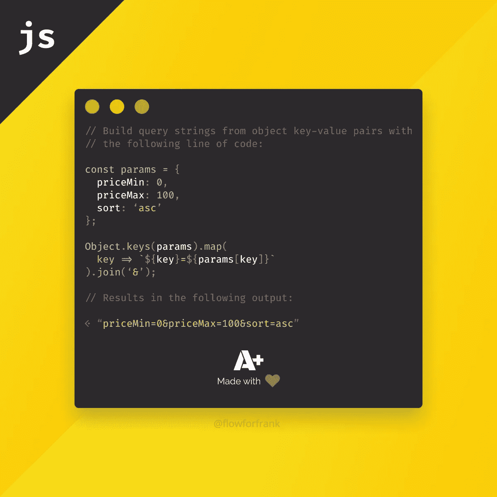

# 如何为 Figma 制作插件

> 原文：<https://javascript.plainenglish.io/how-to-make-plugins-for-figma-d29190a64d8a?source=collection_archive---------0----------------------->

## 如何用句法突出文本


Photo by [Ferenc Almasi](https://unsplash.com/@flowforfrank?utm_source=unsplash&utm_medium=referral&utm_content=creditCopyText) on [Unsplash](/@flowforfrank?utm_source=unsplash&utm_medium=referral&utm_content=creditCopyText)

[](https://www.webtips.dev/how-to-make-plugins-for-figma)

如果你没有听说过 Figma，它是一个 UX/UI 设计应用程序，就像 Adobe XD 或 Sketch 一样。它自称为

> “协作界面设计工具”

我使用它已经有一段时间了，主要是为了创建如下的网络提示:



但是以前我也把它用于它的主要目的；设计用户界面。你能猜出创建一张类似于上面的卡片时什么最耗时吗？—如果你猜突出显示语法，你是对的。

因为我一遍又一遍地为相同的标记使用相同的颜色，所以这一步是多余的，不自动化它只是毫无理由地浪费你的时间。

幸运的是，Figma 有可能解决这个问题的插件。不幸的是，我还没有找到一个，所以我必须创建自己的。

# 这个概念

首先，我们需要弄清楚是否有可能创建这样一个东西，所以我查阅了 Figma 上的 [API 文档](https://www.figma.com/plugin-docs/api/api-overview/)，并研究了 [TextNode](https://www.figma.com/plugin-docs/api/TextNode/) 对象，因为我想处理文本。看起来你可以用`setRangeFills`方法给一段文字上色，所以我得出了以下结论:

`setRangeFills`期望一个 start *(包含)*和 end *(不包含)*索引来知道文本的哪一部分应该被样式化。因此，首先我们需要获取选定的文本，通过 regex 从文本中获取标记，找出每个标记的开始和结束位置，然后对其应用适当的样式。

请注意，用 regex 实现语法高亮并不是首选方式。你不能用 regex 解析 HTML、CSS 或 JS，因为它们的语法比 regex 所能处理的要复杂得多。为了完成这项任务，您需要一个完整的词法分析器和解析器来识别每个标记，并使它更健壮，像一个真正的语法高亮器一样工作。然而，我想用最少的努力完成一小组令牌。

# 设置插件

为了开始插件工作，你需要有桌面应用程序，因为它不能从 web 应用程序完成。你可以在这里下载桌面 app [。](https://www.figma.com/downloads/)

安装完成后，打开它，进入左侧的“插件”选项，然后点击右侧“*开发*”旁边的加号。它将向您显示以下弹出窗口:


为你的插件添加一个名字，然后点击继续。对于模板，我们将使用默认值:运行一次。您也可以创建一个空项目或带有用户界面的项目。它将为您呈现以下文件夹结构:


一切都将在`code.ts`文件中完成。可以看到，Figma 使用了 TypeScript。你也可以用普通的 JavaScript 编写你的插件，在这种情况下，你可以跳过下面的步骤，直接进入下一节。

如果您还没有安装 TypeScript，您可以使用`npm i -g typescript`进行全局安装。使用 Visual Studio 代码，运行“*运行构建任务*”菜单项*(Windows 上的*`*ctrl*`*+*`*shift*`+`*b*`*)*并选择`tsc: watch — tsconfig.json`在每次保存时编译项目。

如果在全局安装 TypeScript 后仍出现以下错误:

```
tsc is not a recognized as an internal or external command...
```

尝试将以下内容添加到系统环境变量中:

```
C:\Users\<user_name>\AppData\Roaming\npm
```

# 样式文本

最初，`code.ts`持有一个示例插件。您可以删除文件中的所有内容，因为我们将从头开始构建我们的文件。

为了做一些预防措施，我们将需要检查是否有一个活动的选择，如果选择是一个文本。我们可以用一个简单的 if 语句做到这一点:

全局`figma`对象由 API 公开。一旦我们确定我们有一个选择，我们可以通过访问`characters`节点获得整个文本。

为了确保不会出现类型错误，我们需要将当前选择转换为`TextNode`。为了对文本进行样式化，我们可以对它调用`setRangeFills`,它接受三个参数:

*   开始指数(*含*)
*   结束索引(*独占*)
*   具有类型和颜色对象的颜色定义。

让整个文本变白可以通过:

正如你所看到的，颜色的值可以在 0 到 1 之间，而不是 0 到 255。为了使它更容易使用，让我们建立一个归一化值的函数。

# 标准化颜色

要将值限制在 0 和 1 之间，我们只需将每个值除以 255:

使用这个函数，我还设置了一些预定义的颜色，这样就可以很容易地引用它们:

这样，我们可以简单地将`colours.x`传递给`setRangeFills`函数，而不必标准化和写出每种颜色。尽管如此，写出整个`setRangeFills`调用可能是乏味的，我们可能不得不用相同的颜色给文本的多个部分着色。为了使它更加动态，让我们也为`setRangeFills`调用创建一个函数。

# 让事情充满活力

由于我们可能有多个需要相同颜色的块，我们希望我们的函数接受一个索引数组，更具体地说，是一个多维索引数组，其中每个子数组包含一个起始和结束索引，如下所示:

```
[[0, 10], [23, 42]]
```

我们可能还想在这里传递颜色。这留给我们以下功能:

我们循环遍历`ranges`数组，并将开始索引设置为`index[0]`，结束索引设置为`index[1]`。为了进行试验，让我们通过下面的函数调用将一种基本颜色应用于文本:

我们基本上可以对其他所有东西做同样的调用。阻止我们这样做的唯一问题是为每个文本块获取合适的索引。我们可能需要一个函数来返回一个多维数组，类似于上面的那个，它保存每个开始和结束索引。

## 获取文本范围

为了获取索引，我定义了下面的函数，它接受一个文本和一个正则表达式模式，应该对其运行:

`text.matchAll`返回一个`RegExpStringIterator`，可以使用 spread 运算符将其转换为一个数组。对于每个结果，我们得到匹配的索引——*这将是开始索引*——和结果的长度，这将是结束索引。

## 添加一些正则表达式的魔力

我们带着正则表达式离开了。这将为我们获取每个文本块的索引。为了将所有内容保存在一个地方，我在文件的顶部添加了一个 regex 对象，它负责保存每个可能的标记和语言的 regex:

正如您所看到的，大多数正则表达式模式都以一个 lookahead 结尾，这有助于我们匹配某些模式，但在最终结果中忽略了匹配。不幸的是，lookbehinds 还不被支持，所以我们可能会选择字符串中不必要的部分。例如，`attributeValue`将在开头包含一个等号和一个引号，我们不想给它们涂上和属性值一样的颜色，所以我们需要为其中一些模式偏移索引。

解决这个问题的方法是稍微修改一下`getTextRange`函数:

我们可以引入第三个参数`padding`。我们可以定义一个变量，将`padding`加到`textIndex`上，并将其用作文本范围的起始索引，而不是使用`textIndex`作为起始索引。我还添加了一个安全检查来避免进入负值，因为我们可能会因此出错。

# 把所有东西放在一起

综上所述，我们可以通过两个函数调用的组合来应用不同的风格:`applyStyles`和`getTextRange`:

我们向`applyStyles`函数提供`getTextRange`文本和所需的正则表达式。对于样式化属性值，我们可以提供偏移量 2，这样每个属性开头的`="`就不会用相同的颜色进行样式化。

最后，不要忘记调用`figma.closePlugin()`作为终止插件的最后一件事。

要试用这个插件，右击你的文本，选择插件——开发，你就会找到它。现在，只需点击一个按钮，代码块就会活跃起来:


Using the highlighter on HTML markup

*自从撰写本文以来，出现了一个更健壮的实现，它使用*[*highlight . js*](https://highlightjs.org/)*解析逻辑。你可以在这里* *获得* [*插件。*](https://www.figma.com/c/plugin/764836637878472379/Figma-Code-Highlighter)

[](https://medium.com/@ferencalmasi/membership)[](https://www.webtips.dev/)