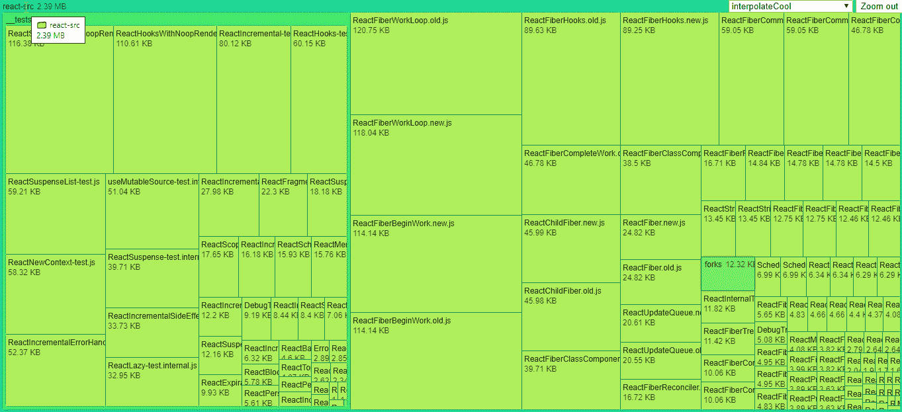

# 如何用 D3.js 制作令人惊叹的数据可视化

> 原文：<https://javascript.plainenglish.io/how-to-make-stunning-data-visualizations-with-d3-js-93a588600b45?source=collection_archive---------1----------------------->

## 将分层数据集显示为交互式树形图

Photo by [Aaron Burden](https://unsplash.com/@aaronburden?utm_source=medium&utm_medium=referral) on [Unsplash](https://unsplash.com?utm_source=medium&utm_medium=referral)

随着数据变得越来越普遍，用可视化让它们变得生动起来也变得越来越普遍。它帮助我们理解趋势和模式，否则很难发现。

在本教程中，我们将学习如何制作一个树状图。受到 Mike Bostock 的启发——D3.js 的创建者——我们将在 D3 . js 的最新第五版中讨论如何实现这一点。

# D3 是什么？

[D3.js](https://d3js.org/) 是一个 JavaScript 库，我们可以使用它通过 HTML、CSS 和 SVG 来创建数据可视化。这个名字本身代表数据驱动文档。

这是一个非常强大的框架，可以创建各种具有流畅动画和交互性的可视化效果。本教程结束时，您将学习如何创建以下交互式树形图:

# 项目设置

让我们开始建立我们的项目吧。用一个索引文件创建一个新文件夹并导入 D3。

我还创建了一个`styles.css`文件来保存一些重置，以及负责生成树形图的`treemap.js`。其他一切都将由 D3 处理。我们将从 JavaScript 填充 SVG。

在`styles.css`中，此时我只有两条规则来让 SVG 占据整个屏幕。

然而，在开始处理树形图之前，我们需要一个数据集。

# 生成数据

我们将使用一个 JSON 文件。最后，我们希望有一个这样的结构:

我们在顶部有根文件夹。每个文件夹都可以有文件或子文件夹。子文件夹由一个名称和一组`children`表示。如果我们遇到一个文件，我们也想将它的大小存储为`value`。

为了生成数据，我们可以创建一个递归函数。为此，我使用了我在以前的教程中创建的一个类似的实现。在那里，我解释了递归是如何工作的。这是函数:

让我们简单看看它是如何工作的。

## 了解数据生成功能

我们可以通过调用选择文件夹的函数来生成一个对象。因为它返回一个 JavaScript 对象，我们将不得不对它调用`JSON.stringify`。让我们来分析一下它是如何工作的:

*   我们从一些检查开始。如果文件夹不存在，我们用`null`返回。
*   **行:6** :我们定义根对象。它有一个名字和一些孩子。
*   **行:13** :如果我们正在处理一个目录，我们想循环遍历每个文件，从第 16 行开始。
*   **行:19** :如果其中一个文件是子目录，我们想用一个新的路径调用这个函数。它的输出值将是一个`child`节点。
*   **Line:25** :如果我们正在处理一个文件，我们可以简单地把它的名字和大小附加到`children`上。
*   **Line:32** :如果我们在根目录下，并且我们传入的参数是一个文件，同样的步骤也可以完成。

你可以在我使用的同一个文件夹上运行这个函数，得到同样的结果。我用的是 [React 的一个包](https://github.com/facebook/react/tree/master/packages/react-reconciler/src)。别忘了用`JSON.stringify`包起来。将输出保存为`data.json`，因为我们稍后会用到它。

# 制作树形图设置

现在我们已经设置好了一切，让我们进入`treemap.js`。首先，从定义一些配置变量开始。

## 定义配置

将以下内容添加到您的`treemap.js`中。

我们希望全屏显示树形图，所以我们使用窗口的宽度和高度。我们还想在开始时定义数据的路径，以便以后可以轻松地更改它。

最后，我创建了另外两个变量，一个在我们读取文件时保存 JSON 数据。另一个是配色方案。这将返回一个我们可以用不同的数字调用的新函数。对于每个数字，它将返回不同的颜色。

我们将使用树的深度为不同的层次创建不同的颜色。

## 创建树形图函数

首先，我们需要一个函数，它将根据传递的数据为我们创建一个树形图。为此我们可以使用内置的`d3.treemap`函数。将以下内容添加到您的`treemap.js`中。

让我们来看看这个函数的作用。我们调用`d3.treemap`并设置一些参数:

*   我们让它全屏显示
*   设置一些填充，使矩形很好地分开
*   对矩形的宽度和高度启用舍入
*   然后我们用`d3.hierarchy`调用 treemap 函数，传递我们的 JSON 数据。这将用额外的属性来修饰我们的数据集，比如`depth`或`parent`。然后我们需要对数据集求和并排序，这样我们就可以将最大的元素放在最上面。

## 从 JSON 获取数据

下一步是获取 JSON 数据。为此我们可以使用`d3.json`。

由于这个函数在内部使用了 [Fetch API](https://developer.mozilla.org/en-US/docs/Web/API/Fetch_API) ，我们将需要使用一个 web 服务器。为此，我使用了`[http-server](https://www.npmjs.com/package/http-server)`模块，这是服务静态资产的完美解决方案。你可以通过运行`npm i http-server -g`在全球范围内安装它。

之后，我们可以将数据传递给一个`render`函数，该函数会将所有内容绘制到屏幕上。让我们现在就创建它。

# 制作树状图

首先，我们想定义树形图的根，并从 DOM 中获取 SVG。这是我们放东西的地方。

这可以用`d3.select`来完成。它就像 jQuery 选择器一样工作。我们也可以用`attr`方法操作属性。由于每个`d3`调用都返回相同的对象，我们可以一个接一个地连锁调用。我们想让我们的 SVG 占据整个屏幕。这就是为什么我们将`viewBox`设置为屏幕的宽度和高度。

另外,`root`现在将有每个节点的位置和尺寸信息，所以我们知道在哪里放置它们。

## 创建 SVG 组

现在我们需要为包含矩形及其标题的组创建节点。将以下内容添加到`render`功能中。

乍一看，这似乎有点吓人，但是让我们看看每个函数是做什么的。首先，我们选择 SVG 并选择其中的所有组元素。因为我们没有，D3 将根据我们传入的数据长度为我们创建这个。

第二个`data`函数用于数据绑定。它需要一个数组。对于每一层，我们希望创建一个单独的组。从我们的树形图的后代，`d3.nest.key.entries`会计算出我们有多少深度。基于传递给`key`的数据的高度属性。

data returned from d3.nest().key(*d* => d.height).entries(root.descendants()), 4 groups

然后我们需要调用`join`来更新元素，以匹配之前由`data`绑定的数据。

然后我们想再次绑定数据。为了做到这一点，我们必须再次调用`selectAll`。但这一次，我们将使用之前数据绑定返回的`values`。因此，对于每个数组元素，我们在每个顶部组中创建一个新的组项。之后，我们需要再次调用`join`来更新元素。

因此，现在我们有了可以向每个元素添加转换的数据。这用于在地图中定位矩形。

The generated DOM

## 创建矩形

现在让我们在屏幕上显示一些东西。我们首先要创建矩形。在`node`变量后添加以下内容。

在每个`attr`调用中，`d`代表数据，即每个元素的属性。对于每个节点，我们添加一个矩形，并根据其高度属性选择填充颜色。这是我们使用我们定义的颜色函数的地方。我们也可以根据起点和终点来计算宽度和高度。现在你应该有一些空的矩形画在屏幕上:

## 添加标签

下一步让我们添加标签。在矩形后添加以下行。

这里我们再次使用`selectAll-data-join`链。这将在`text`节点中创建两个`tspan`元素。一个具有名称，一个具有值。在第 5 行，我们也设置不透明度值为 75%。如您所见，回调函数可以接受三个参数:

*   一个用于数据，保存关于节点的信息。由于我们之前绑定了`d.data.name`和`d.value`，它将只保存那些值。
*   一个用于循环中的索引
*   一个用于保存对 DOM 节点的引用的节点

因此，如果循环是在最后一个元素，它持有`d.value`，我们减少不透明度。否则，我们可以让它保持原样。如果你刷新页面，我们现在将有一些标题。但是他们定位很差。让我们修理它。

## 定位标签

我们想把父母和孩子分开定位。为此，向`treemap.js`添加两个新模块。

这可以通过使用过滤器来完成。对于第一个块，任何有子块的都将被选中。第二个块的情况正好相反。对于父类，我们希望名字和值在同一行。对于孩子们，我们想让他们在不同的线上。我们可以遵循用于`fill-opacity`的相同逻辑来正确定位两个`tspan`元素。

开始有点眉目了，但是我们还有一个问题。短信泛滥。

## 固定溢出

为了解决这个问题，我们想添加一个`clipPath`元素，其尺寸与矩形相同。在 SVG 中，这可以通过使用引用矩形 id 的`use`标签来完成。

由于页面上有相当多的元素，我们需要以某种方式生成唯一的 id。为此，我求助于 [StackOverflow](https://stackoverflow.com/questions/105034/how-to-create-guid-uuid) 来找出最佳方法。这是我最终使用的函数:

首先，让我们用 id 属性扩展矩形。

Adding an id for the existing rectangles

我们还可以向数据添加其他属性。稍后我们将在`clipPath`元素中重用`nodeId`。所以接下来让我们补充一下。就在我们定义矩形之后添加它。

Add clipPath before the text element, otherwise we won’t have access to d.clipId

我们还想为剪辑路径设置一个 id。这是为了我们可以在正文中引用它。对于`href`，我们可以使用之前设置的`nodeId`。最后，我们需要在文本元素中引用这个剪辑路径。

Adding the clip-path attribute to the text elements

如果我们做的一切都正确，我们现在应该有一个相当坚实的基础。

## 格式化值

我们可以添加一个东西使标签更漂亮。这些值目前以字节为单位。这对于一般人来说并没有太大的意义，我们就把它们转换成可读性更强的格式吧。我再次求助于 StackOverflow 来找出我们如何将字节转换成 KB 和 MB。这是我们想要使用的函数:

要格式化这些值，我们所要做的就是将`d.value`包装到这个函数中，在这里我们添加文本。

现在看起来好多了。

## 添加标题

为了提高可访问性，让我们也给矩形添加标题。我们更希望看到完整的路径，如下图所示。

为此，将以下内容添加到`treemap.js`:

基于`getPath` — *的返回值，我们还没有定义* —我们想要显示一个文件或文件夹图标。接下来是文件的完整路径。在新的一行中，我们还可以显示尺寸。`getPath`功能可以在一行中完成。

它需要一个元素和一个分隔符。有了`element.ancestors`，我们可以得到每一个家长。先从根开始，我们还需要调用`reverse`。由于我们只对它们的名字感兴趣，我们可以调用一个`map`并用传递的分隔符将字符串连接在一起。

## 添加阴影

最后，为了让每一层的深度更加突出，让我们添加一些阴影。为此，我们需要在 SVG 上创建一个新的过滤器。在`render`功能的开头，添加以下内容:

就其本身而言，这不会做太多，但是现在我们有了一个 id 为`shadow`的`filter`元素，我们可以为我们的节点引用它。

要使用它，我们需要做的就是为组元素添加一个`filter`属性。

现在我们应该有一些漂亮的阴影显示。

# 使地图互动

作为最后一步，让我们让整个事情互动起来。首先，让我们从创建一个主题切换器开始，这样我们就可以从不同的配色方案中进行选择。然后，我们还可以实现缩放功能，使树状图可以导航。

## **主题**切换器

为此，我们需要一个下拉菜单。将以下内容添加到您的`index.html`文件中。

我们还可以在 CSS 中添加一些绝对定位，使其始终显示在右上角。为了让它工作，我们需要为 select 添加一个 on-change 监听器。

在回调函数中，我们只需要重新定义`color`变量，它是我们在开始时作为配置添加的。然后我们从 select 中获取值，并将其传递给`scaleSequential`。例如，如果我们选择第四个选项，我们将返回`d3['interpolateInferno']`，这将返回一个插值器。

然后我们只需将`fill`属性重新分配给具有新颜色的矩形。

## **增加缩放功能**

现在有一些节点非常小，我们看不到任何子文件夹。就像上面 GIF 中的“forks”文件夹一样。理想情况下，我们想放大它们。所以现在我们来补充一下。

要做到这一点，我们需要用一个新的根重新渲染树形图。在本例中，根将是“forks”文件夹。

从过滤器开始。我们只想添加一个点击事件到那些有孩子的。我们也不想在根上有一个点击监听器。为了向用户暗示这个元素可以被交互，让我们也把鼠标变成一个指针。

这将调用一个带有路径和 JSON 数据的`zoom`函数。因为我们在数据上没有路径属性，所以让我们也添加它。在我们追加文本的标题内，添加这一新行:

## 创建缩放功能

对于`zoom`函数，我们想用一个新的根来调用`render`。

根的名称将是路径中的最后一个元素。停留在例子上，万一`react-src.forks`了，那就“分叉”了。为了得到`treemapData`,我们可以使用一个 reducer 来遍历 JSON 并得到我们感兴趣的部分。

由于我们总是从根开始，所以我们可以去掉路径的第一部分。对于`react-src.forks`来说，我们只剩下`forks`了。这将是`normalizedPath`的价值。在 reducer 内部，我们使用一个`forEach`来遍历子对象，如果名称匹配，我们就返回那个对象。如果我们尝试这样做，我们会得到一个错误。

这是因为，在`render`函数的最开始，我们需要删除 SVG 中的所有内容。否则，我们会尝试为已经填充的 SVG 添加相同的内容。

re-rendering the treemap with a new root

但是我们没有办法缩小。要解决这个问题，在我们呈现初始数据之后，向您的索引文件添加一个按钮和一个新的 click listener。

这确保我们能够重置视图并返回到原始根。

> 你刚刚创建了你的第一个树状图！

# 包装东西

我希望完成这个项目所需的步骤不会太多。总结一下，我想给你提供一些文档，可以帮助你更深入地了解 D3.js 的世界。虽然官方的 [D3 文档](https://github.com/d3/d3/blob/master/API.md)相当大，但是很难看出它们是如何组合在一起的。这就是为什么我建议浏览一下[可观察的](https://observablehq.com/@d3/gallery)上的例子。

此外，整个项目托管在 [GitHub](https://github.com/flowforfrank/d3-treemap) 上，所以如果你想用完成的作品做实验，你可以克隆它。感谢您花时间阅读这篇文章。编码快乐！

## **用简单英语写的 JavaScript 笔记**

我们已经推出了三种新的出版物！请关注我们的新出版物，表达对它们的喜爱:[**AI in Plain English**](https://medium.com/ai-in-plain-english)，[**UX in Plain English**](https://medium.com/ux-in-plain-english)，[**Python in Plain English**](https://medium.com/python-in-plain-english)**——谢谢，继续学习！**

**我们也一直有兴趣帮助推广高质量的内容。如果您有一篇文章想要提交给我们的任何出版物，请发送电子邮件至[**submissions @ plain English . io**](mailto:submissions@plainenglish.io)**，使用您的 Medium 用户名，我们会将您添加为作者。另外，请让我们知道您想加入哪个/哪些出版物。****