# 如何充分利用控制台日志

> 原文：<https://javascript.plainenglish.io/how-to-make-the-most-console-log-ac0b88cdab03?source=collection_archive---------7----------------------->

## 我甚至不知道第四条建议。

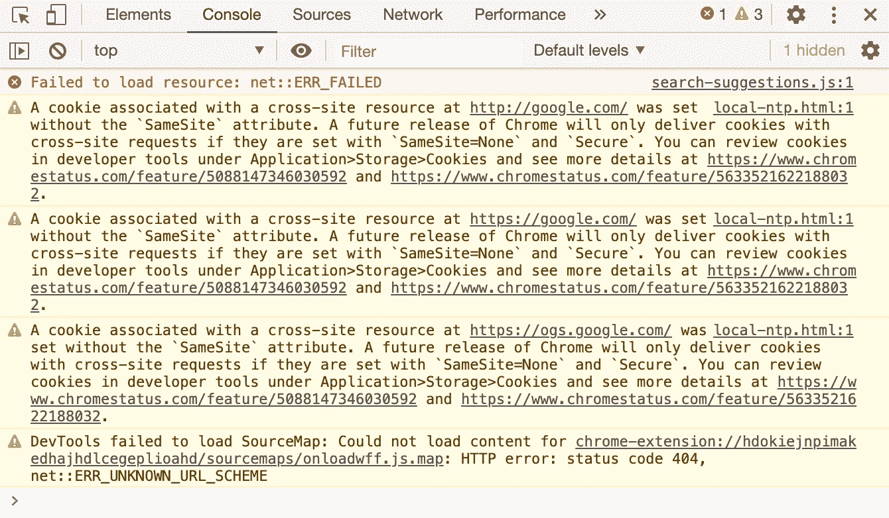

你可能认为 **console.log()** 非常简单，不需要任何使用技巧。嗯，你说它简单只是因为你用简单的方式使用它。

在这篇文章中，我将向你展示一些高级技巧来充分利用 **console.log()**

继续读。

# 用说明符格式化

对于简单的日志，通常只需要一个参数:

```
let year = 2020;console.log(year); // 2020
```

对于两个或两个以上的参数，您可以简单地将它们串联起来，如下所示:

```
let year = 2020;let age = 27;console.log(age, year); // 27, 2020
```

但是，您可以通过使用格式化使日志消息更有意义。

```
let year = 2020;let age = 27;console.log('I am %i now. But please do not add %i up to my age, I did not use it.', age, year);
```

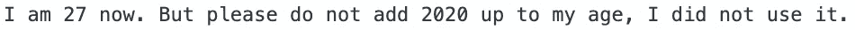

如你所见， **%i** 被替换为实际值。

下面是您可以使用的说明符的完整列表:

```
╔═══════════╦═════════════════════════════════════════════╗
║ **SPECIFIER** ║ **OUTPUT**                                      ║
╠═══════════╬═════════════════════════════════════════════╣
║ %s        ║ String                                      ║
╠═══════════╬═════════════════════════════════════════════╣
║ %i or %d  ║ Integer                                     ║
╠═══════════╬═════════════════════════════════════════════╣
║ %f        ║ Floating point value                        ║
╠═══════════╬═════════════════════════════════════════════╣
║ %o        ║ Optimally formatting (arrays, objects, DOM) ║
╠═══════════╬═════════════════════════════════════════════╣
║ %O        ║ Expandable JavaScript data                  ║
╠═══════════╬═════════════════════════════════════════════╣
║ %c        ║ Applies CSS style                           ║
╚═══════════╩═════════════════════════════════════════════╝
```

# 让原木更漂亮

你注意到上面列表中的说明符 **%c** 了吗？是的，为了充分利用格式，您甚至可以在日志消息中添加样式。结果会更漂亮，如下图所示:


但是怎么做呢？只需向日志提供一些 CSS 样式:

```
console.log(‘%c I am red’, ‘color: red’);
```

最好的部分:您可以在一个日志中应用多种样式，只需将 **%c** 放在您想要格式化的文本部分之前，然后为它定义 CSS 样式。

```
console.log(‘%c I am red and %c big’, ‘color: red’, ‘font-size: 30px’);
```

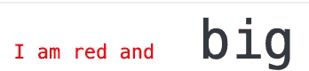

# 显示记录的变量名

对于单个日志，您只需:

```
let number = 3;console.log(number);
```

这只是一行日志，你马上就知道是什么了。


但是多行怎么样，比如:

```
let number1 = 3;let number2 = 5;let number3 = 7;let string1 = ‘amy’;let string2 = ‘javascript’;let string3 = ‘react native’;console.log(number1);console.log(number2);console.log(number3);console.log(string1);console.log(string2);console.log(string3);
```

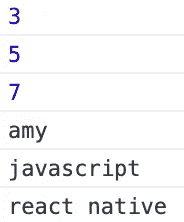

很难知道那些日志的变量名是什么，不是吗？

为了解决这个问题，你需要把变量放在花括号中:

```
console.log({ number1 });
```

这是结果:

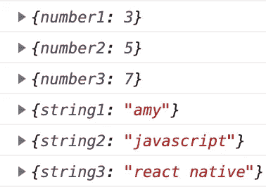

更清晰，对吗？

# 对象和数组

老实说，我第一次使用时并不知道 **console.log()** 可以记录对象或数组。你能猜到我做了什么吗？为了了解数组/对象内部的内容，我对其进行了迭代，并记录了每一项:

```
let arr = [1, 2, 3, 4];for (let i = 0; i < arr.length; i++) {
  console.log(arr[i]);
}
```

可怜的我！

简而言之，您需要做的事情与其他数据类型一样:

```
console.log(arr);
```

消息将以 JSON 格式显示:

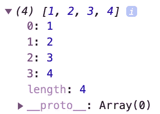

对象也是如此:

```
let person = {
  name: ‘amy’,
  age: 27
};console.log(person);
```

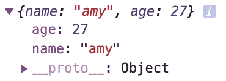

或者使用说明符 **%o** 对其进行格式化:

```
console.log(‘I am %o’, person);
```

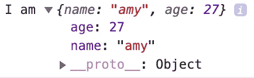

如果您想将对象直接添加到消息中，请使用 JSON.stringify。

```
console.log(‘I am ‘ + JSON.stringify(person));
```

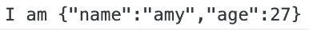

甚至 DOM:

```
console.log(document.getElementById(‘scroll-to-top’));
```

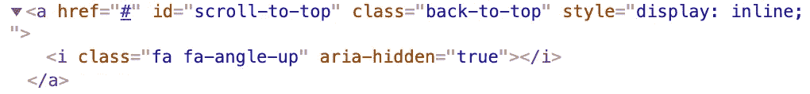

# 结论

有时候我们把事情看得很简单，低估了它们。但是如果我们更深入一点，仍然有一些我们不知道的空白。

有什么我没想到的技巧吗？请在下面的评论中告诉我。

[](https://medium.com/javascript-in-plain-english/how-to-write-effective-javascript-code-that-every-programmer-loves-to-maintain-a490b42b9b9f) [## 如何编写每个程序员都喜欢维护的有效 JavaScript 代码

### 要不要写更易维护的代码？运用坚实的原则

medium.com](https://medium.com/javascript-in-plain-english/how-to-write-effective-javascript-code-that-every-programmer-loves-to-maintain-a490b42b9b9f) [](https://medium.com/javascript-in-plain-english/9-great-javascript-extensions-for-visual-studio-code-to-speed-up-your-development-8b3275248718) [## Visual Studio 代码的 9 大 JavaScript 扩展加速您的开发

### 谁想更快更容易地编码？

medium.com](https://medium.com/javascript-in-plain-english/9-great-javascript-extensions-for-visual-studio-code-to-speed-up-your-development-8b3275248718) [](https://medium.com/javascript-in-plain-english/7-simple-ways-to-conditionally-render-components-in-react-a3170d0cd9e0) [## 在 React 中有条件地呈现组件的 7 种简单方法

### 为用户类型 A 显示红色用户名，为用户类型 B 显示蓝色用户名，或者只为登录用户显示仪表板…

medium.com](https://medium.com/javascript-in-plain-english/7-simple-ways-to-conditionally-render-components-in-react-a3170d0cd9e0) 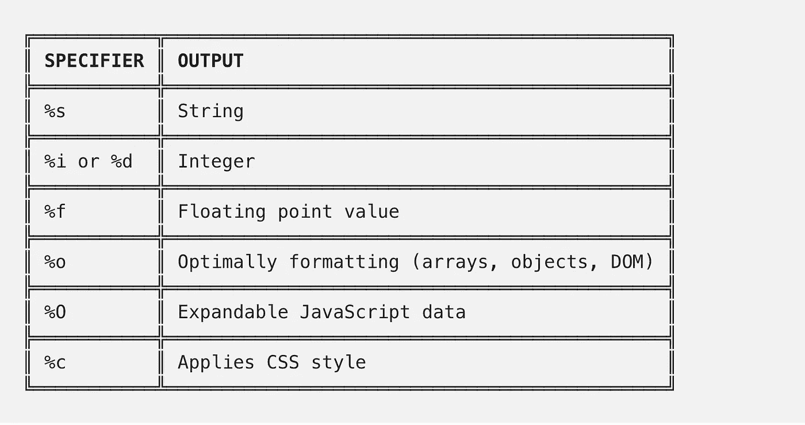