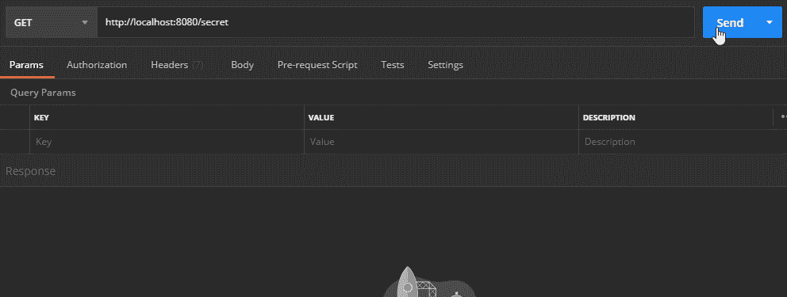
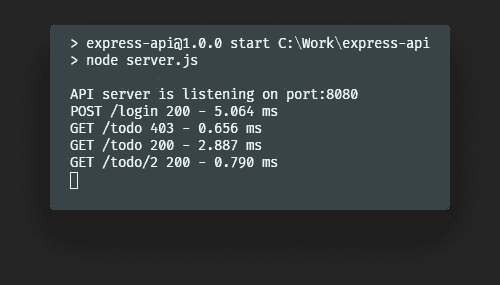
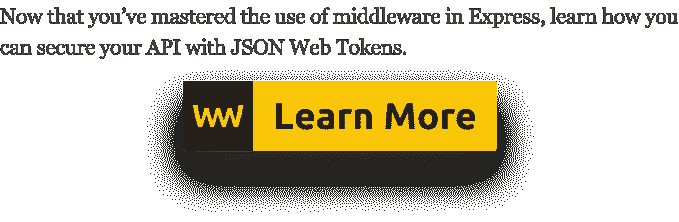

# 如何制作你自己的 Express 中间件

> 原文：<https://javascript.plainenglish.io/how-to-make-your-very-own-express-middleware-6b42692de32a?source=collection_archive---------12----------------------->

## 揭秘 Express 中的一个简单概念

Photo by [Ferenc Almasi](https://unsplash.com/@flowforfrank?utm_source=medium&utm_medium=referral) on [Unsplash](https://unsplash.com?utm_source=medium&utm_medium=referral)

Express 本质上是由一系列中间件功能组成的。然而“中间件”这个词乍听起来可能有些吓人。实际上，它们只不过是可以访问特殊对象的函数。`request`和`response`对象，以及链中的下一个中间件函数。这通常被称为`next`。

它们的生命周期也非常简单。他们可以执行任何代码，对请求/响应对象进行更改，或者完成他们的工作。他们可以通过结束循环或调用堆栈中的下一个中间件函数来实现这一点。

# 它们是如何工作的？

当您请求 Express 时，您要么必须结束请求-响应循环(例如通过返回响应)要么调用下一个中间件。否则，请求将被搁置。

这里，传递给`app.get`的第二个参数实际上是一个中间件函数。中间件功能需要三个参数:

*   **请求:**请求对象包含 HTTP 请求属性。例如参数、请求正文或查询字符串。
*   **response:**response 对象表示一个 HTTP 响应，一旦接收到 HTTP 请求，就可以发送该响应。
*   **next:** 回调到下一个中间件函数，通常按照惯例称为`next`。

## 中间件序列

我们必须注意，当处理多个中间件时，它们的顺序很重要。看看下面的例子。

如果我们调用服务器，中间件功能将按顺序执行。这意味着我们在控制台中得到以下内容。

还要注意，对于所有这些请求，您都必须调用`next()`，否则请求将永远不会有响应。这里我们指定了全局函数。您也可以对单个路线执行此操作。

## 全球中间件

概括地说，全局中间件功能是为每条路线执行的功能。您可以在`app`变量上定义它们。

我们可以使用上面的中间件来超时任何需要超过 5 秒才能完成的请求。

## 路由中间件

另一方面，路由中间件功能用于指定为特定路由执行的功能。

只有当我们向`/treasury`发出请求时，这个中间件才会被执行。对于同一个路由，也可以有多个中间件。您可以通过传递回调函数数组来实现这一点。

现在让我们看一些例子，看看如何创建自己的实用中间件功能。

# 项目设置

首先，您需要设置一个基本的快速服务器。为了节省一些时间，我们可以把重点放在重要的部分，我使用这个 [GitHub](https://github.com/flowforfrank/express-api) 仓库作为样板。它来自于之前的教程，该教程解释了如何从头开始构建自己的 REST API。

我们不需要任何外部依赖，因为我们可以用简单、普通的旧 JavaScript 实现一切。

# 扩展请求

让我们从一个应用级中间件开始。我们将能够使用它来扩展请求对象。假设您的服务器收到一个包含令牌的请求。您希望所有用户信息都可以用于所有请求。您的标题中已经有可用的令牌。这意味着我们可以通过以下方式非常简单地完成它。

the getUser function fetches user information based on the passed token

它确保下一个中间件函数总是接收一个用户对象。所有可用的用户信息。

# 扩展响应

我们可以对响应对象执行相同的操作。如果您想公开更多关于您的服务器的数据，您可以简单地用附加信息来扩展它。

您也可以设置可以通过函数参数配置的中间件函数。

在这种情况下，您需要返回一个新的中间件函数，该函数接受三个必要的参数。

# 隐藏路线

最后，让我们看看另一个例子，我们可以在单独的路线上使用。假设您想授权访问某个资源，或者您只是想隐藏它。

创建一个名为`/secret`的新路由，并将自定义中间件作为第一个参数传递给它的`get`处理程序。

这调用了一个名为`hidden`的函数，然后它继续到第二个参数。让我们定义中间件。

这里有一张简单的支票。如果头存在并且它的值是`true`，我们可以进入下一个中间件，也是最后一个。否则，我们会发回一个空的回复。同样，我们要么调用下一个中间件，要么发回响应。我们不想让快递公司悬而未决。

一个额外的注意事项:不要在`next`呼叫后放置额外的逻辑。您可能会遇到多次尝试发送邮件头的问题。假设您将上面的代码更改为下面的代码。

在这种情况下，如果设置了头，您将开始调用下一个中间件函数，直到最后一个返回响应。但是在这之后，执行会跳转回这个函数，因为它不是一个 return 语句。然后，快递会再次尝试发送回复，并且已经回复了。解决这个问题的一个简单方法是返回下一个中间件。

现在，让我们看看邮递员是如何工作的。该路线仅接受`true`值。

# 其他的用例是什么？

有无数有用的 Express 中间件。每个都是为不同的任务设计的。你可能以前见过甚至用过其中的一些。有些是你绝对想利用的。让我们看几个。

## [摩根](https://www.npmjs.com/package/morgan)

如果你想让登录就位，Morgan 是一个现成的中间件。您可以使用自定义日志函数，但它也附带了一些预定义的标记。

例如，如果您使用上面的配置，它将生成如下所示的日志。

## [CORS](https://www.npmjs.com/package/cors)

另一个常用的快速中间件是 CORS。只需添加以下内容，为您的 Express 服务器启用所有 CORS 请求。

您还可以使用路由级中间件为单个路由启用它。

## [主体解析器](https://www.npmjs.com/package/body-parser)

如果您有传递给服务器的用户输入，那么 body-parser 绝对是您应该使用的。这是因为`req.body`对象不可信，因为用户可能会欺骗它。Body-parser 将解析传入的请求体，使您的请求更加安全。

## [头盔](https://www.npmjs.com/package/helmet)

使用头盔是保护你的快递应用的另一个好方法。它设置了各种 HTTP 头来增加 XSS 保护，防止点击劫持，等等。要使用其默认值，您可以将以下内容添加到您的`server.js`中。

## [压缩](https://www.npmjs.com/package/compression)

最后，压缩可以用来优化您的服务器。它压缩请求以节省一些宝贵的字节。它支持`deflate`和`gzip`。要压缩所有回答，请在您的路线前放置以下内容。

# 摘要

这就是你熟悉中间件所需要知道的一切。正如开头提到的，Express 本身是由不同的中间件功能组成的。一旦你理解了流程，由于它们的模块化，它们会成为一个真正强大的工具。如果你对在 Express 中使用中间件功能有任何建议，请不要犹豫，在评论中分享它们。感谢您花时间阅读这篇文章。编码快乐！

## **用简单英语写的 JavaScript 笔记**

我们已经推出了三种新的出版物！请关注我们的新出版物:[**AI in Plain English**](https://medium.com/ai-in-plain-english)[**UX in Plain English**](https://medium.com/ux-in-plain-english)[**Python in Plain English**](https://medium.com/python-in-plain-english)**——谢谢，继续学习！**

**我们也一直有兴趣帮助推广高质量的内容。如果您有一篇文章想要提交给我们的任何出版物，请发送电子邮件至[**submissions @ plain English . io**](mailto:submissions@plainenglish.io)**，并附上您的 Medium 用户名，我们会将您添加为作者。另外，请让我们知道您想加入哪个/哪些出版物。****