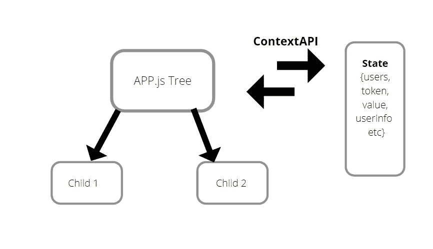
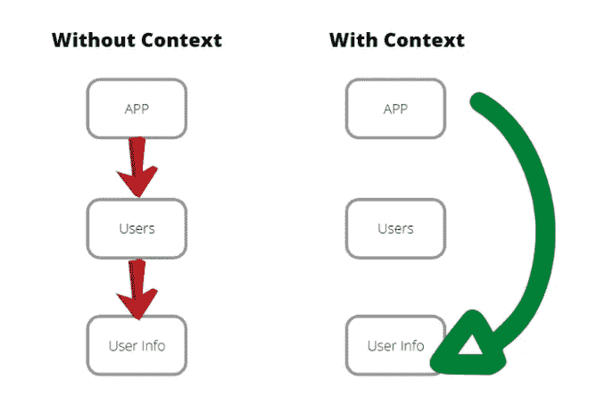

# 如何用 useReducer()和上下文 API 管理 React 状态

> 原文：<https://javascript.plainenglish.io/how-to-manage-state-with-usereducer-and-context-api-3f0ea40a3ac3?source=collection_archive---------2----------------------->


React 是 2020 年最流行的前端开发框架。React 成功背后的原因是学习曲线短，以及它可以让你的应用程序快速启动和运行。但是在 React 中有一个概念是大多数开发人员都很难理解的，也就是状态管理。

像 Redux、MobX 这样的库是围绕 React 构建的，用于处理状态，但是对于一个新的和即将到来的开发人员来说，学习这些库可能是令人生畏的。在本文中，我将解释如何使用 React 内置的上下文 API 和钩子来管理状态。一旦你使用 React 的内置特性掌握了状态管理的概念，当你学习 Redux 的时候，它会帮你省去很多痛苦。

# 什么是国家管理？

从 React 16.8 开始，每个 React 组件，包括类组件和函数组件，都可以有一个状态。简单地说，状态是一个 JavaScript 对象，表示组件的内存。由于用户的操作或事件，它可以随时改变。状态可以在称为 props drilling 的过程中沿着组件树向下传递。

随着应用程序变得越来越大，管理状态变得越来越困难，而 props drilling 使得跟踪所有依赖关系变得更加困难。更好的解决方案是使用 Context API 将状态从应用程序中分离出来，然后在需要的地方共享它。



State Management using Context API

# 什么是上下文 API？

我在这里的文章中用一个例子解释了上下文 API:[**如何在 React**](https://karntech.medium.com/how-to-use-context-api-in-react-673260df24d7) 中使用上下文 API



上下文 API 被设计为在整个 React 组件树中共享状态。使用上下文 API，您可以共享整个“App”组件树的状态，而不必在每一层将它作为道具传递。然后，您可以直接操作“用户信息”组件中的状态，而不必通过中间的“用户”组件。

# 什么是 useReducer()钩子？


一个 useReducer()钩子接受一个 Reducer 和初始状态，并用一个 dispatch 方法输出当前状态。当前状态是更新后的状态。基本就是这样！！

# 什么是减速器？

Reducer 是一个接受两个参数的函数，这两个参数是 action 和 initialstate(有效负载),并根据执行的操作输出新的状态(当前状态)。您可以使用 useReducer()钩子来访问您的 reducer。


# 履行

现在我们对什么是 Reducer、useReducer()和上下文 API 有了基本的了解，让我们构建一个简单的应用程序来巩固这些概念。在这个应用程序中，我们将创建一个简单的计数器，并使用上下文 API 存储计数器的值。这里重要的是理解状态管理背后的概念，即使你不理解每一行代码。

让我们用 npx **create-react-app** 成为我们的建筑。

```
**npx create-react-app counterapp**
```

## 步骤 1:构建 DataLayer.js

DataLayer.js 是我们创建上下文的地方，然后将其导出，供 App.js 树中的其他组件使用。首先，我们将创建一个名为 DataLayerContext 的上下文。这个上下文存储了我们的状态。我们可以将其导入子组件，以便以后使用和操作状态。

```
const DataLayerContext = React.createContext();
```

接下来将创建一个以 initialstate、reducer 和 children 为参数的函数 DataLayer。DataLayerContext。提供程序只是一个与所有子组件共享状态的包装。很可能，这段代码现在对您来说没有意义。但是不要气馁，因为一旦你开始识别模式，状态管理就会变得非常简单。目前，只需将此代码复制并粘贴到您的项目中。

```
export const DataLayer = ({ initialstate, reducer, children }) => (<DataLayerContext.Provider value={useReducer(reducer, initialstate)}>{children}</DataLayerContext.Provider>);
```

现在我们的上下文已经创建，是时候导出了，这样其他组件就可以使用它了。

```
export const useDataLayerValue = () => useContext(DataLayerContext);
```

## 第 2 步:初始状态和还原剂-还原剂. js

要管理一个国家，首先我们需要创建一个国家。我们将称我们的州为初始州。它将有一个值设置为 0 的属性“data”。

```
export const initialState = {data: 0};
```

接下来，我们创建我们的减速器。如上所述，Reducer 只是一个函数，它接受两个参数，即动作和初始状态(有效负载)，并基于执行的动作输出新的状态(当前状态)。

对于我们的减速器，如果动作是“INSC”，减速器将更新我们的状态，并将数据属性值增加 1。如果操作是“DESC”，它会将数据属性值减少 1。非常直截了当！！！

```
export const reducer = (state, action) => {switch (action.type) {case "INSC":return { ...state, data: state.data - 1 };case "DESC":return { ...state, data: state.data + 1 };default:return state;}};
```

## 第 3 步:用数据层包装应用组件。

随着 reducer、DataLayer 和 initialstate 就绪，是时候将状态传递给应用程序组件树了。我们通过在 index.js 文件中用 DataLayer 包装应用组件来实现这一点。现在，App.js 组件树中的每个组件都可以访问状态。嘣！！！！

```
import React from "react";import ReactDOM from "react-dom";import { DataLayer } from "./Datalayer";import App from "./App";import { initialState } from "./Reducer";import { reducer } from "./Reducer";const rootElement = document.getElementById("root");ReactDOM.render(<React.StrictMode><DataLayer initialstate={initialState} reducer={reducer}><App /></DataLayer></React.StrictMode>,rootElement);
```

## 第 4 步:访问和修改 App.js 组件中的状态

```
App.js componentimport { useDataLayerValue } from "./Datalayer";
```

我们可以使用 useDataLayerValue()访问状态属性“data”。

```
const [{ data }, dispatch] = useDataLayerValue();
```

最后，我们将使用 2 个按钮修改状态的值。按钮“+1”触发具有动作类型“INSC”的调度——将数据值增加 1 并更新状态。按钮“-1”触发具有操作类型“DESC”的调度——将数据值减 1 并更新状态。

```
<button onClick={() => dispatch({ type: "INSC" })}>-1</button><button onClick={() => dispatch({ type: "DESC" })}>+1</button>
```

我们的柜台应用程序现已完成。我希望我简单的状态管理教程能帮助你理解反应和网络开发最核心的概念之一。整个代码可以在沙箱 [**这里**](https://codesandbox.io/s/context-api-example-t7eux?file=/src/App.js:228-359) 找到。

喜欢应用:[csb-t7eux-qq7equee4t . vercel . App](https://csb-t7eux-qq7eque4t.vercel.app/)

## 快乐编码！