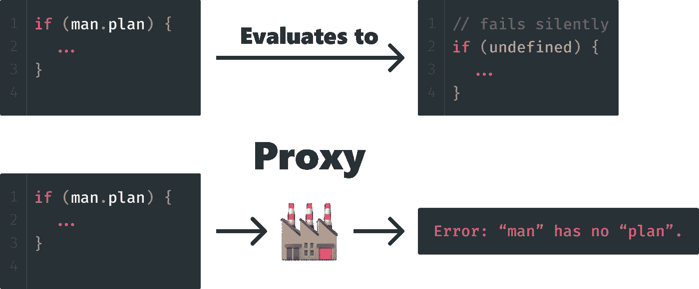
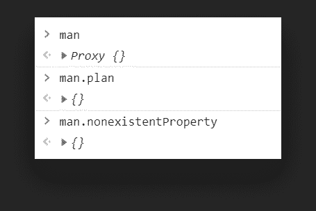
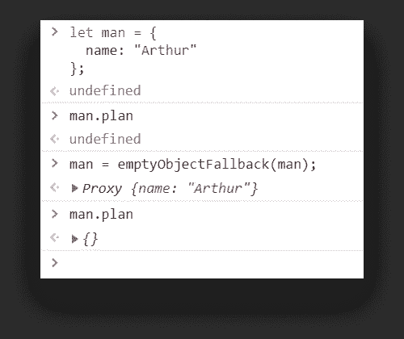
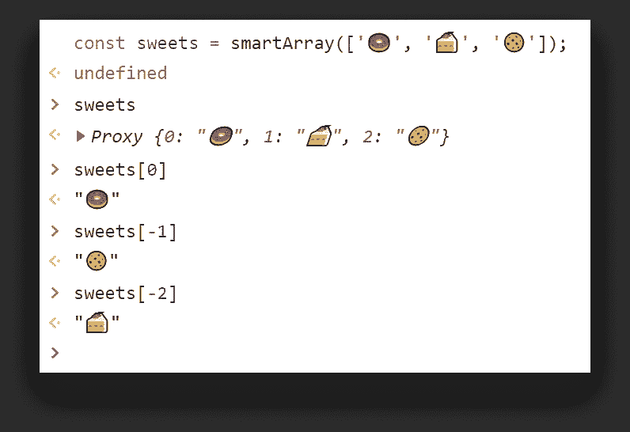
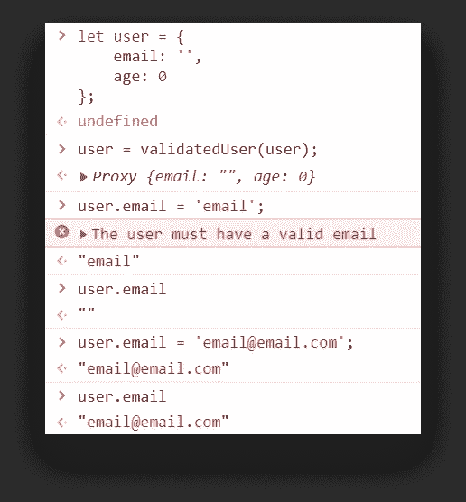
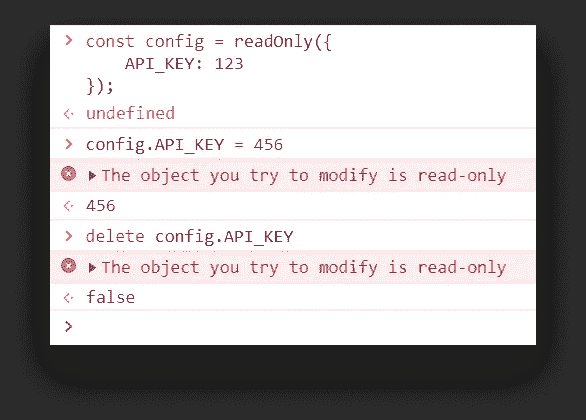
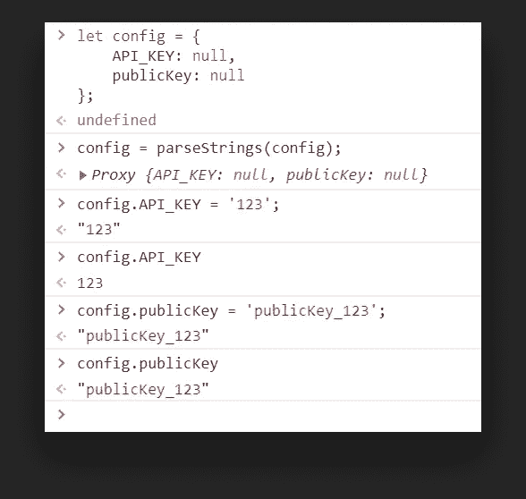

# 如何掌握 JavaScript 中的代理 API

> 原文：<https://javascript.plainenglish.io/how-to-master-the-proxy-api-in-javascript-c30ed54db16d?source=collection_archive---------7----------------------->

## 查看元编程的实际用例

Photo by [Ferenc Almasi](https://unsplash.com/@flowforfrank?utm_source=unsplash&utm_medium=referral&utm_content=creditCopyText) on [Unsplash](https://unsplash.com/@flowforfrank?utm_source=unsplash&utm_medium=referral&utm_content=creditCopyText)

JavaScript 是一种非常灵活的语言。它是松散类型的，本质上是动态的。你可能已经知道它的第一个版本——T6，当时被称为摩卡——是[在仅仅 10 天内创造出来的](https://thenewstack.io/brendan-eich-on-creating-javascript-in-10-days-and-what-hed-do-differently-today/)。这种灵活性意味着开发人员可以轻松地扩展它，以满足他们的定制用例。

有了代理 API，这种灵活性达到了一个新的水平。您可以挂钩到元级别来改变 JavaScript 本身的行为。

# 什么是元编程？

元编程可能意味着几件事。但是在代理 API 的上下文中，这意味着程序可以在执行过程中修改自己。

在[代理 API](https://developer.mozilla.org/en-US/docs/Web/JavaScript/Reference/Global_Objects/Proxy) 的帮助下，您可以重新定义基本操作的语义和行为，比如属性查找或赋值。这就是代理 API 的全部。那么它是如何工作的呢？

# 这是个陷阱

代理使用所谓的“陷阱”为操作提供自定义行为。它们是拦截操作的方法，就像代理服务器拦截网络请求一样。让我们来看几个例子，看看它们是如何工作的。

The Proxy API sits between a property lookup and produces an error if a property is not defined

# **获取数值**

首先，让我们来看看当我们试图读取一个属性时，如何截取属性查找并提供自定义行为。

## 默认为自定义值

想象一下，每当您的一个属性未定义时，您希望围绕返回一个空对象来构建您的逻辑。你不想用`undefined`，你想有一个回退值。在这种情况下是空的`{}`。我们可以通过以下方式做到这一点:

我们将`man`分配给一个`new Proxy`。代理接受两个参数:

*   **Target:** 第一个参数是我们想要包装到代理中的目标对象。它甚至可以是一个数组、一个函数或另一个代理。这里我们使用一个空对象。
*   **处理程序:**第二个参数是一个具有预定义方法的对象。我们可以使用这些方法来定义操作的自定义行为。它们被称为陷阱。`get`陷阱用于获取属性值。

在这个例子中，我们只是检查对象上是否存在该属性。如果不是，我们返回一个空对象。

如果您在控制台中请求这个，您可以看到`man`是一个代理。每当我试图访问一个不存在的属性时，它都会返回一个空对象。

为了提高可读性，我们可以将这个调用外包到一个函数中。这样，我们可以在以后需要的时候重用它。

如果我们将一个对象包装到这个函数中，它将返回一个具有新功能的代理。这也隐藏了底层的逻辑，使事情更具可读性。意图传达得很清楚。

## 发信号

让我们看一个更实际的例子。现在你想知道什么时候你的属性没有被定义。你可以用它来设置一些警报。

使用与前面相同的对象调用此方法，每当引用未定义的属性时，您都会得到一个错误，并将其记录到控制台。这使得发现应用程序中的潜在问题变得更加容易。

## 智能阵列

我们还可以通过实现 get 陷阱的定制逻辑来改进数组查找。

如果索引是正数，这个陷阱将使用 [*反射 API*](https://developer.mozilla.org/en-US/docs/Web/JavaScript/Reference/Global_Objects/Reflect) 获得原始值*。但是，如果我们传入一个负数，我们可以从数组的末尾检索值。*

我们可以进一步增强这一点，以支持区间。

## 智能对象

我们可以对物体做同样的事情。假设您想要到达一个深度嵌套的属性，而不必写出完整的路径。您只知道对象的名称，以及您正在寻找的属性。我们可以借助递归函数来实现这一点。

现在，您可以访问属性，就像它们存在于顶层一样。问题是，你应该吗？

# **设定值**

就像`get`陷阱可以用于拦截属性查找一样，`set`陷阱可以用于赋值。一切都保持不变，除了我们需要使用`set`而不是`get`。让我们看一看。

## 验证属性

最常见的情况是验证属性。让我们创建一个验证用户对象的验证器。

与`get`陷阱不同，`set`有三个参数。一个用于对象，一个用于属性，一个用于其值。如你所见，我们总是要归还一些东西。

如果某些验证失败，我们返回 false。这将阻止设置该属性。最后，如果验证成功，我们可以使用 Reflect API 来设置值。

如您所见，如果电子邮件无效，将不会设置该值。年龄也是如此。

## 将属性设为只读

我们还可以使用陷阱来创建只读属性。这样，您可以确保没有人能够更改它们。

这里我们使用了一个函数，它的唯一目的是向控制台写入一个错误。代理不仅阻止赋值，还阻止删除或任何类型的扩展。

您还可以在适当的位置放置一些自定义逻辑，以便只将选定数量的属性设置为只读。

## 将字符串转换为数字

另一个用例是自动将字符串转换成数字。这可以通过一些正则表达式的魔法来实现。

如果值只包含数字，我们只需要一个 if 语句来重新赋值。现在，每当你赋值一个字符串，但只包含数字，代理将为我们转换它。

If the string only contains numbers, it will be converted to an integer

# 结论

现在，您应该对 JavaScript 中的代理 API 有了很好的了解。一旦你掌握了它，这将是一个非常强大的工具来增强你的日常操作。

你知道代理 API 可以用于哪些其他用例，但在本教程中没有提到？请在评论中告诉我们！感谢您花时间阅读本文，编码快乐！

## 进一步阅读

 [## 如何将代理与 Python 请求集成

### 本教程将向您展示如何使用代理服务器来利用 Python 请求模块。为了避免他们的 IP…

简明英语. io](https://plainenglish.io/blog/how-to-integrate-proxy-with-python-requests) 

*更多内容请看*[***plain English . io***](https://plainenglish.io/)*。报名参加我们的* [***免费周报***](http://newsletter.plainenglish.io/) *。关注我们关于*[***Twitter***](https://twitter.com/inPlainEngHQ)*和*[***LinkedIn***](https://www.linkedin.com/company/inplainenglish/)*。查看我们的* [***社区不和谐***](https://discord.gg/GtDtUAvyhW) *加入我们的* [***人才集体***](https://inplainenglish.pallet.com/talent/welcome) *。*