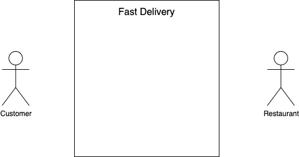
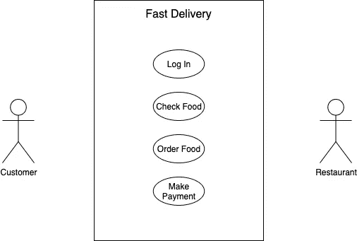
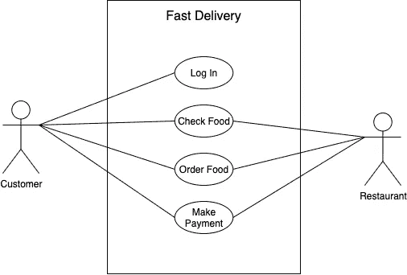
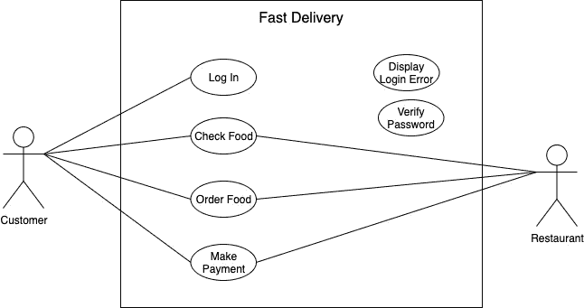
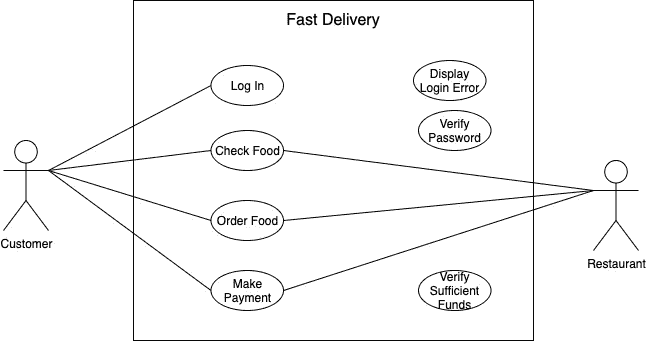
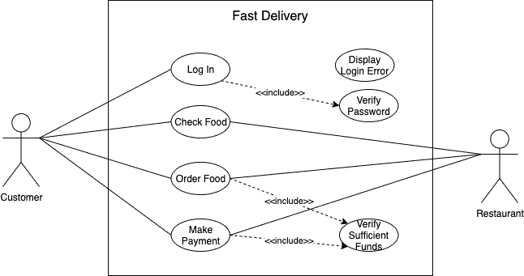
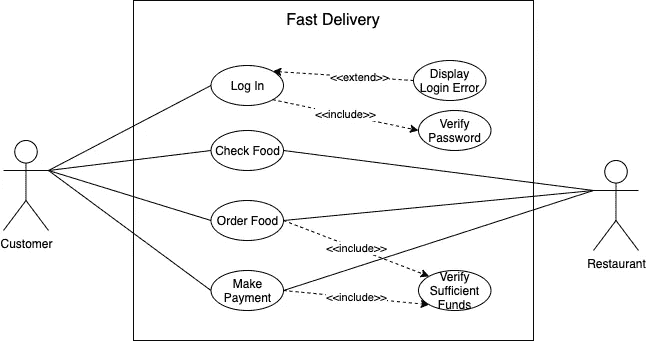
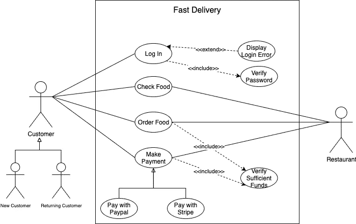
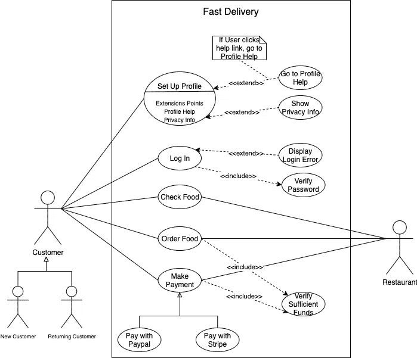

# 如何为信息系统建模

> 原文：<https://javascript.plainenglish.io/how-to-model-an-information-system-294bb7994ff5?source=collection_archive---------9----------------------->

## 主用例图

## 开始考虑综合系统

Photo by [Clint Adair](https://unsplash.com/@clintadair?utm_source=unsplash&utm_medium=referral&utm_content=creditCopyText) on [Unsplash](https://unsplash.com/s/photos/system?utm_source=unsplash&utm_medium=referral&utm_content=creditCopyText)

# 从奢侈品到必需品

一个好的信息系统设计已经从奢侈品变成了必需品。解决方案架构师成为软件开发领域薪酬最高的职位之一。**为什么会这样？**

让我们看看[亚历克斯·施莱弗](https://medium.com/u/7b7cc53255ac?source=post_page-----294bb7994ff5--------------------------------) (CDO 在 [Airbnb](https://airbnb.com/) )对设计一个健壮的系统有什么想法:

> 这里有一个简单的事实:如果不首先创新制造产品的方式，你就无法创新产品。

# 你应该如何解释一个想法？

你有过这样的经历吗？你脑子里有一个绝对有意义的想法，但当你试图向某人解释时，他却无法理解。因此，它无法理解如何与应用程序交互，或者应用程序应该做什么。

幸运的是，有一个工具可以解决这些问题。我们称之为用例图。我们可以说**是一个约定，我们通过它来描述一个系统或者系统的一部分，以及基本流程**。简单来说，**它显示了系统做什么**。

它还可以显示与我们的系统交互的人或其他系统。这是一个高层次的图表，通常不会呈现太多的细节(仍然是表达复杂想法的一种不错的方式)。

在我们设计我们的 ***快速交付*** 应用程序之前，我们应该谈谈绘图的先决条件。我们可以用笔和纸把它画出来，但是使用应用程序是一种更快捷的方式。有很多程序如 [Lucidchart](https://lucid.co/) 、 [IBM Rational Rose](https://www.ibm.com/support/pages/node/1244542) 、[企业架构师](https://sparxsystems.com/)、 [StarUML](https://staruml.io/) 、 [MS Visio](https://www.microsoft.com/en-us/microsoft-365/p/visio-professional-2019/cfq7ttc0k7cg) 等。

我比较喜欢用 [draw.io](https://medium.com/u/9ce34d1dcdce?source=post_page-----294bb7994ff5--------------------------------) (免费使用)。可以在[浏览器](https://draw.io/)里面使用，也可以[下载](https://github.com/jgraph/drawio-desktop/releases)。

# 神奇四侠

不，这里没有魔法，但是用例图由四个不同的元素组成:

1.  系统，
2.  演员，
3.  用例，
4.  关系。

## 系统

系统就是我们正在开发的东西。它可以是一个网站、一个软件组件、一个业务流程、一个应用程序等。**我们用一个矩形**表示一个系统，然后我们把系统的名称放在顶部:

Use Case’s System element (drawn by [draw.io](https://medium.com/u/9ce34d1dcdce?source=post_page-----294bb7994ff5--------------------------------))

这个矩形帮助我们定义系统的范围。**这个矩形内的任何事情都发生在系统内。**

## 行动者

一个演员(stickman 人物)将会是一个使用这个系统的人或事物。它可以是一个人、一个组织或任何其他类型的外部系统。我问你一个问题:谁或者什么东西要用 ***快送*** ？

当然是顾客。它会下载应用程序并使用它。为了让我们的系统充分发挥作用，我们必须增加一个演员——餐馆。餐厅要提供服务于我们 app 的信息(菜品、交易等。).

和演员打交道时，我们必须记住两件事。首先，记住这些**演员是外部对象**。它们总是需要被放置在矩形之外。二、**演员需要按类型或类别分类**。让我们看一个例子:

Use Case’s Actors (drawn by [draw.io](https://medium.com/u/9ce34d1dcdce?source=post_page-----294bb7994ff5--------------------------------))

我们不会给我们的演员贴上马克和卡兹熟食店的标签。我们想保持事情的明确性。我们说顾客和餐厅都将使用我们的应用程序，这就引出了**主要**和**次要** **参与者**的话题。

**主要行动者发起系统的使用，而次要行动者更为反动。**客户将启动 ***快速交付*** 应用程序，并使用它做一些事情。而餐厅则是次要演员。

餐厅演员只有在顾客做某件事的时候才会去经营。例如，如果客户去看菜品清单，餐厅就会为应用程序提供数据。

最佳实践是让主要参与者在系统的左边，次要参与者在右边。这在视觉上强化了顾客与 ***快速交付*** 应用程序互动以及餐厅演员反应的事实。

## 用例

用例是我们开始描述我们的系统做什么的地方。我们用一个省略号来表示它，它表达了一个在系统中完成某些任务的动作。它们将被放置在矩形中，因为应用程序中会发生一些操作。

那么我们的 ***快送*** app 要做什么呢？它将允许顾客登录，检查食物，点餐，并支付。我们将有下一个用例:*登录*、*检查食物*、*点餐*、*付款*。您可以看到，每个用例都以一个动词开始，并强调一个发生的动作:

Use Cases inside the System (drawn by [draw.io](https://medium.com/u/9ce34d1dcdce?source=post_page-----294bb7994ff5--------------------------------))

我们也希望他们有代表性。如果这个用例只是说*检查*，那就晦涩难懂了。最后，尽可能将你的用例按照逻辑顺序排列是一个好习惯。这就是为什么我们把*日志放在*顶部的原因。

## 关系

用例图中的最后一个元素是关系。根据定义，一个演员正在使用我们的系统。因此**所有参与者都必须与系统中的至少一个用例进行交互**:

Relationships in Use Case Diagram (drawn by [draw.io](https://medium.com/u/9ce34d1dcdce?source=post_page-----294bb7994ff5--------------------------------))

当顾客想查询食物供应情况时，餐厅会提供一份菜品清单。类似地，当顾客想要点餐或付款时，餐馆会照做。所以我们在参与者和用例之间画一条线来显示关系，称为**关联**。

除了关联之外，还有三种其他类型的关系:

*   包括，
*   延伸，
*   一般化。

当客户键入凭据时，应用程序将在完成登录过程之前验证凭据。但是如果凭证不正确，应用程序将显示一条错误消息。让我创建两个新的用例(*验证密码*和*显示登录错误*):

Two new Use Cases (drawn by [draw.io](https://medium.com/u/9ce34d1dcdce?source=post_page-----294bb7994ff5--------------------------------))

当顾客想要*点餐*时，应用程序会确保有足够的钱进行交易。因此，我们还将创建另一个用例，名为*验证足够的资金*:

Additional Use Case (drawn by [draw.io](https://medium.com/u/9ce34d1dcdce?source=post_page-----294bb7994ff5--------------------------------))

那么*如何验证密码*与图的其余部分相关呢？我们的演员都没有直接开始这个动作。每当有人试图登录时，应用程序内就会立即发生这种情况。这是一种包含关系:

Include relationship in action (drawn by [draw.io](https://medium.com/u/9ce34d1dcdce?source=post_page-----294bb7994ff5--------------------------------))

**包含**关系显示了基本用例与包含用例之间的依赖关系。每次基本用例执行时，包含的用例都会调用。另一种思考方式是，基本用例需要一个包含的用例来完成。

当*登录*用例发生时，app 会自动*验证密码*。*登录*不完整，除非*验证密码*完整。所以我们画一条虚线，箭头指向被包含的用例，我们用双人字写“include”。

下一种关系是**扩展**关系。当基本用例执行时，扩展用例有时会出现(这个用例只有在满足标准时才会出现)。让我们看一个例子:

Extend relationship in action (drawn by [draw.io](https://medium.com/u/9ce34d1dcdce?source=post_page-----294bb7994ff5--------------------------------))

在我们的例子中，*登录*是一个基本用例，*显示登录错误*是一个扩展用例。我们的应用程序不会在每次*登录*时显示*登录错误消息*。只有当客户输入不正确的凭据时，才会发生这种情况。

由于这是一个扩展关系，我们画一条虚线，箭头指向基本用例，并在双人字纹之间写“extend”。请记住，多个基本用例可以指向同一个包含或扩展用例。

我们将讨论的最后一种关系是**一般化**，也称为继承。当您使用我们的应用程序付款时，您可以通过 Paypal 或 Stripe 支付:

Generalization relationship in action (drawn by [draw.io](https://medium.com/u/9ce34d1dcdce?source=post_page-----294bb7994ff5--------------------------------))

在这个场景中，*付款*是一个通用用例，而 *Pay with Paypal* 和 *Pay with Stripe* 是专门的用例。你也可以使用父母和子女这两个术语。每个孩子都有父母相同的行为，但是每个孩子都有自己的特点。

也可以用演员来概括。有时，您可能想要区分新客户和回头客。你可以让他们两个都成为普通客户角色的孩子。

我们要讨论的最后一个方面是带有扩展点的**用例。我们可以看到一个例子:**

Extension Points in the Use Case Diagram (drawn by [draw.io](https://medium.com/u/9ce34d1dcdce?source=post_page-----294bb7994ff5--------------------------------))

用例的名字在线上面，线下面，有扩展点。扩展点只是扩展关系的详细版本。

这个用例向我们展示了客户可以*设置配置文件*，并且可以选择导航到几个不同的屏幕。可以转到*个人资料帮助*和*隐私信息*。我们甚至可以添加一个注释来显示什么样的条件会导致这些扩展点。

这是一个基本的例子，但是**即使是更复杂的系统也有限制，需要对功能、行为和关系进行简单的可视化**。