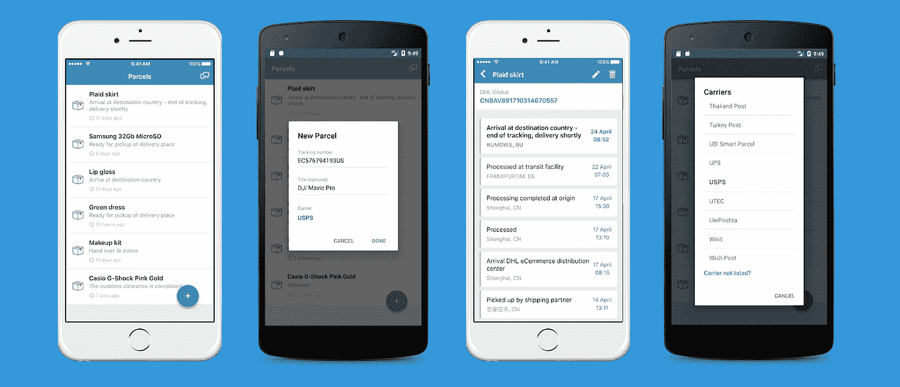
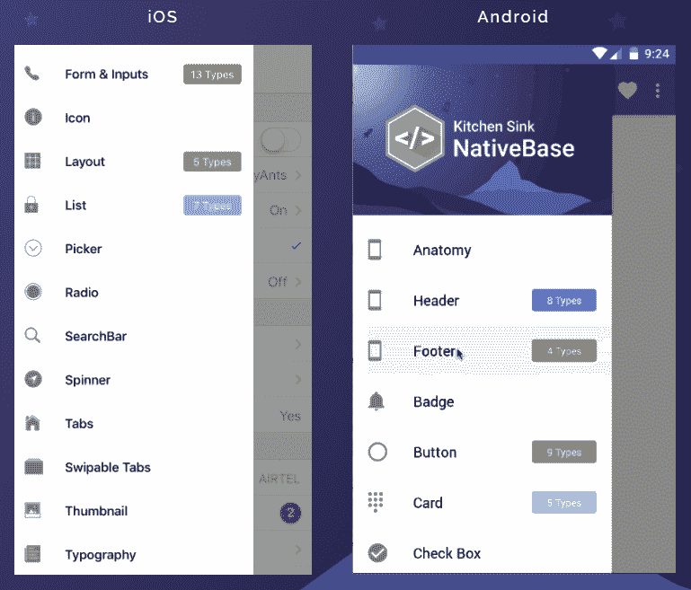
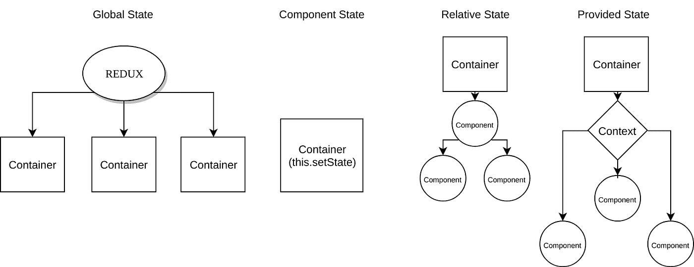
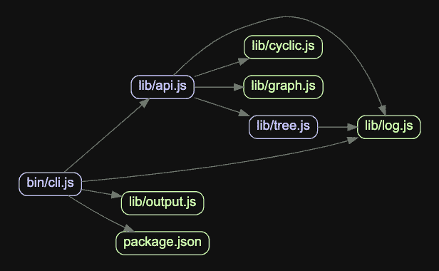

# 如何优化 React 原生 App 以获得更好的性能？

> 原文：<https://javascript.plainenglish.io/how-to-optimize-a-react-native-app-for-better-performance-2fff8a3d62d4?source=collection_archive---------3----------------------->

如果有大量的后台线程/任务，如位置跟踪/音乐播放器，蓝牙连接，那么它很可能应该小心处理，否则它很可能会消耗大量的电池。

很明显，对于开发团队来说，当涉及到 react/react-native 的工作时，由于快节奏的发布，包括 React/React native 本身在内的每个包都会出现很多问题。为了解决这些问题中的大部分，我们必须同时管理其他人的升级和迁移任务，即使对于美国 的 [**best react native app 开发公司来说，这也不是一个简单的挑战。为了让您的应用程序与框架的最新版本保持同步，及时完成这项工作也很重要。**](https://www.brainmobi.com/blog/top-10-react-native-development-companies-usa/)

**1。升级包**

包捆

它应该包含所有最新的软件包，几乎全部。重要的是要明白，大多数软件包都有大量的错误修复，几乎每隔几周，更新的新版本，包括逻辑上的改进，都由 **react 原生移动应用开发者**解决。这在许多情况下会自动提高性能。

**2。使用更好的导航库**

更好的图书馆导航

React Native mobile app developmentframework 的最新版本对 navigator 进行了更大的改进，使用 0.48x 之前版本的大多数应用程序也在使用 React-Native-deprecated-custom-components，而不是现在可以替换的 navigator。

**3。Redux 或 Flux —公共状态管理**

公共状态管理

对于开发人员来说，在状态管理的情况下使用本地组件是非常常见的，尤其是在应用程序很小并且只包含几个屏幕的情况下。这样做有意义的唯一原因是，管理不同屏幕之间的状态并没有太多的事情要做，但是一旦你的应用程序变大，这可能会导致缺陷和问题。之后，使用 React Native 的 [**公司拥有一个公共的状态存储变得非常必要，这样所有不同的屏幕都可以在需要的时候访问可能需要的内容。Redux 是首选。**](https://www.brainmobi.com/)

**4。将 React Native 升级至最新版本**

每个开发人员都知道这样一个事实，即可以简单地使用 react-native upgrade 命令，但是还需要查看 package.json 中使用的其他版本的包/库。

有很多选项可用，根据 React 原生移动应用开发者的经验，最好的方法是广泛阅读 react-native 指南。它建议使用 react-native-gift-升级包。

**5。升级依赖包**

依赖包

如果有任何遗留的/不赞成使用的/被删除的类可能首先从包依赖关系中产生，并且为了成功地构建它，需要修复它，那么您肯定会面临许多问题。

像 react-native-camera 包一样，它也有一个不同的相机类名，以便 **react-native 移动应用开发者**可以从代码库中的任何地方更新它。

**6。升级到 React-Native 以更好地访问库**

因此，当你使用 React Native 的最新版本时，你应该使用最新的 react-navigation，除非你有特别的理由去适应旧版本。

当您已经在使用导航库时，还应该在组件中使用类似 _navigate 的方法。

帮助您实现这一点的第一步是通过改变这一方法的实现，甚至尝试以一种我们只认识到一些地方需要纠正的方式来运行应用程序，这些地方是[**react native app development**](https://www.brainmobi.com/technology/react-native-app-development)策略可以解决的。
一旦它被用于组件/屏幕，您就可以对所有屏幕执行同样的操作。

**结论:**

重要的是要记住，任何组件的整个状态现在都应该在 redux store 中，任何纯 react 组件的生命周期都将选择使用美国的[**top react native app development company**](https://www.brainmobi.com/contact-us)来定义，因为它可以用容器和 reducers 来定义。

这并不是什么特别的好消息，重构总是一个持续的过程，应该经常进行，以便让你的应用程序走在所有问题的前面。