# 如何针对生产优化 React App 并将其部署到 Heroku

> 原文：<https://javascript.plainenglish.io/how-to-optimize-react-app-for-production-and-deploy-it-to-heroku-498fbf222de?source=collection_archive---------2----------------------->

## 了解如何让您的 React 应用程序更快


Photo by [Artem Sapegin](https://unsplash.com/@sapegin?utm_source=medium&utm_medium=referral) on [Unsplash](https://unsplash.com?utm_source=medium&utm_medium=referral)

在本文中，我们将了解如何优化我们在上一篇文章[中创建的 react 应用程序](https://medium.com/javascript-in-plain-english/build-an-amazing-application-using-react-and-nodejs-together-fad13ab7b49c)

首先，从[https://github.com/myogeshchavan97/react_node](https://github.com/myogeshchavan97/react_node)克隆存储库

通过依次执行以下命令来运行应用程序

```
npm install
npm run build
npm run start-server
```

打开 Chrome 开发者工具，检查`bundle.js`文件大小。你可以看到，差不多有 1.3 MB

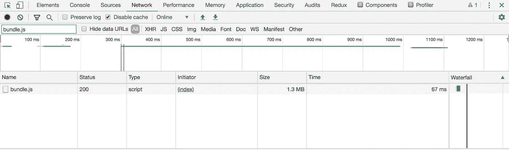

另外，如果你查看源代码标签，你可以在`webpack://`下看到我们写的所有代码

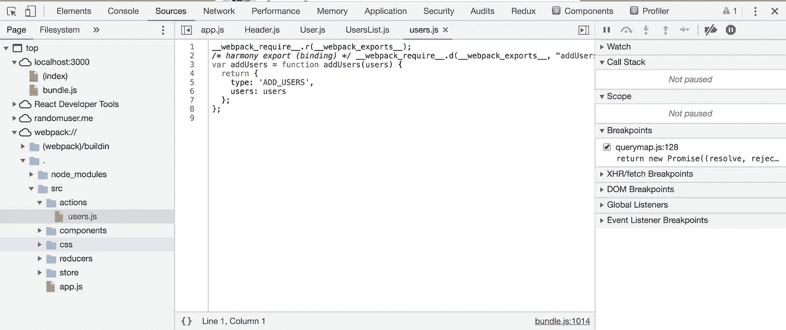

这显然不好。因为一旦你的应用程序投入生产，你绝不会希望任何人看到你的代码。因此，为了解决这些问题，我们对应用程序使用了优化技术。

Webpack 使用`-p`标志提供了一种简单的优化方法。
如果你在 package.json 中看到我们当前的脚本部分，它看起来像这样

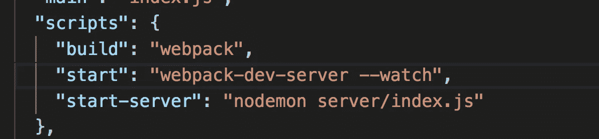

我们将在这里添加另一个带有-p 标志的脚本

```
"build-prod": "webpack -p"
```

现在，脚本部分如下所示

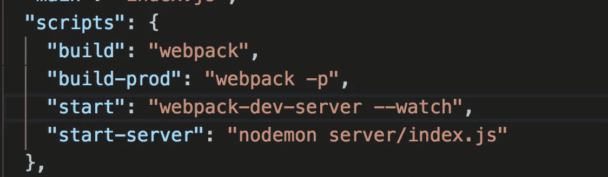

从终端运行以下命令

```
npm run build-prod
```

并检查输出

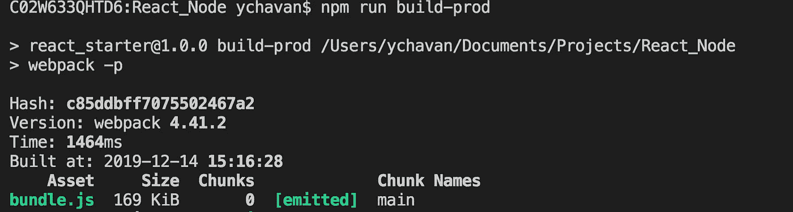

您可以看到文件大小从 1.3MB 减少到了 169KB。

如果您现在使用`npm run start-server`运行应用程序并检查 network 选项卡，您将看到同样大小的 169KB

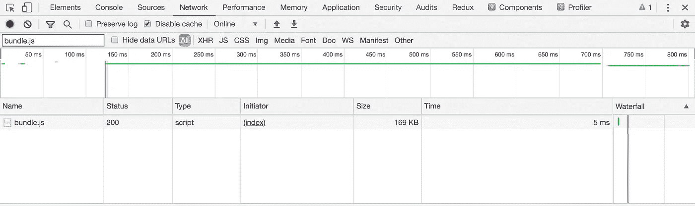

如果你检查源代码标签，你就再也看不到我们在`webpack://`下的代码了

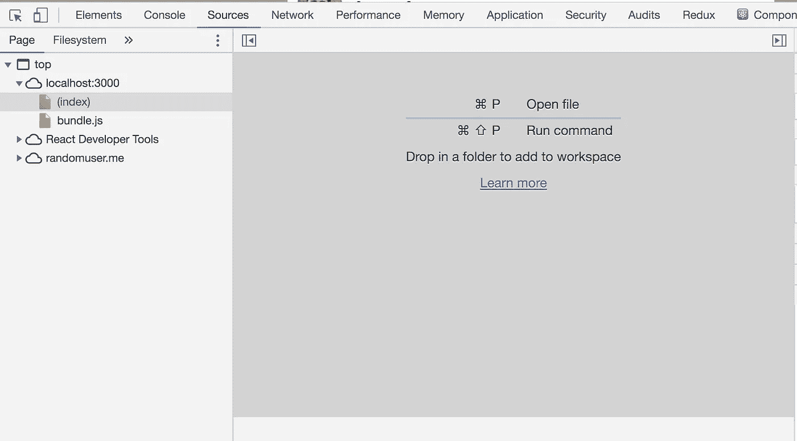

应用程序中仍有一个问题。

如果你打开`src/app.js`，你可以看到我们在顶部包含了 CSS 文件的导入，这是 React 中的惯例

```
import './css/styles.css';
```

因此，在 javascript 加载之前，CSS 不会被加载，这是一个问题。所以现在我们将从`bundle.js`中提取 CSS 并创建一个单独的`.css`文件

那么就从它开始吧。

通过执行以下命令安装 npm 软件包`mini-css-extract-plugin`

```
npm install mini-css-extract-plugin
```

安装完成后，打开`package.json`文件并进行更改

```
"build-prod": "webpack -p"
```

到

```
"build-prod": "webpack -p --env production"
```

这里，我们添加了值为`production`的环境变量。

现在，在`webpack.config.js`文件中我们将改变

```
module.exports = { };
```

到

```
module.exports = (env) => {};
```

这里我们返回一个函数而不是一个对象，因此函数的第一个参数将接收我们在`package.json`中设置的环境变量值

你的`webpack.config.js`现在会是这个样子:

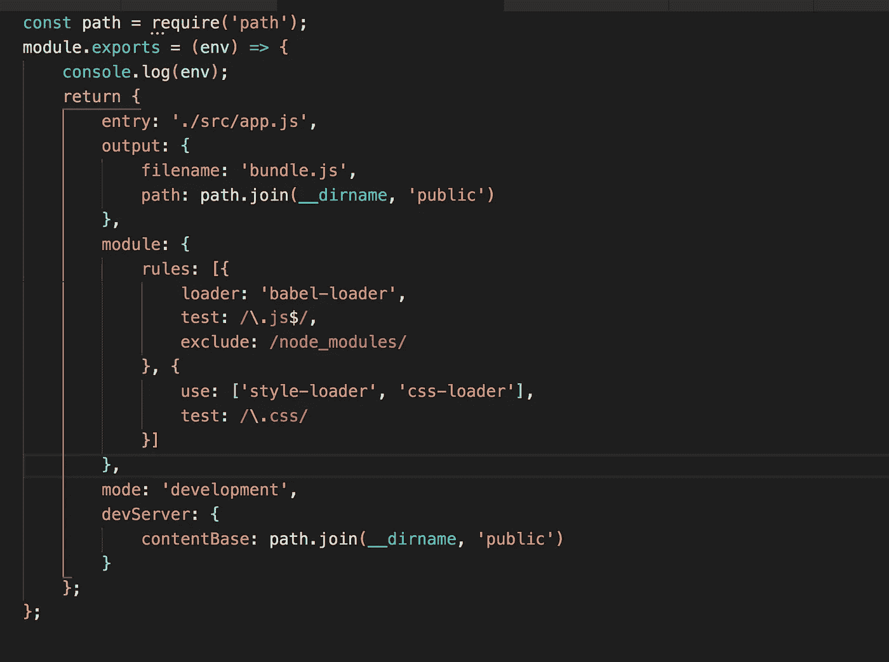

现在我们将使用`webpack.config.js`文件中的`mini-css-extract-plugin`来提取 CSS。
在顶部为插件添加导入

```
const MiniCssExtractPlugin = require('mini-css-extract-plugin');
```

将 CSS 的`use`数组从

```
use: ['style-loader', 'css-loader']
```

到

```
use: [{
 loader: MiniCssExtractPlugin.loader,
 options: {
  publicPath: path.join(__dirname, 'public')
 },
}, 'css-loader'
]
```

这里我们告诉在哪里创建新的 CSS 文件

改变模式从

```
mode: 'development'
```

到

```
mode: env ? 'production' : 'development'
```

并在末尾添加新的插件属性

```
plugins: [
 new MiniCssExtractPlugin({
 filename: 'main.css',
 chunkFilename: 'main.css',
})]
```

这里，我们告诉创建一个名为 main.css 的单独的 CSS 文件

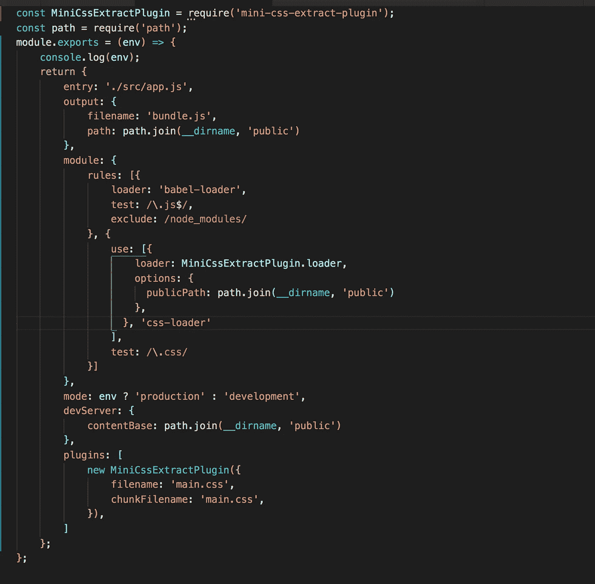

现在，在`public/index.html`文件中添加`main.css`文件链接

```
<link rel="stylesheet" href="main.css"></link>
```

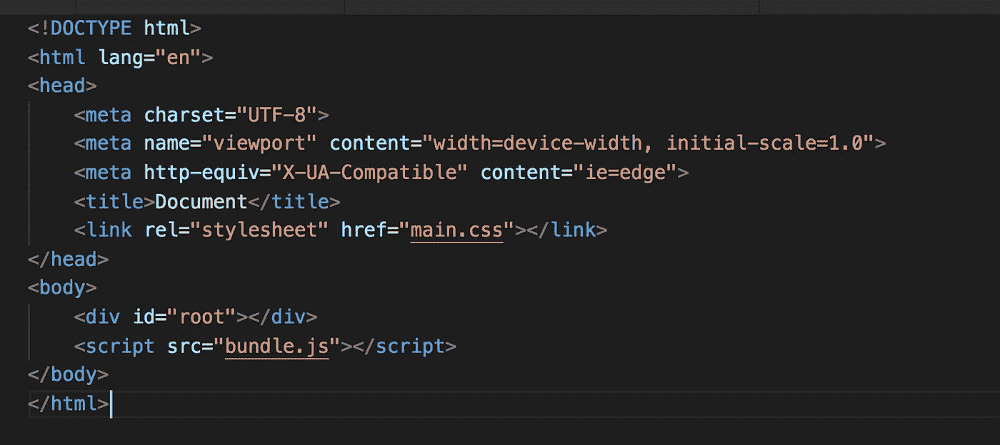

现在，运行以下命令

```
npm run build-prod
```

这将在`public`文件夹中创建一个新的`main.css`文件。您将能够看到如下所示的单独的`main.css`和`bundle.js`

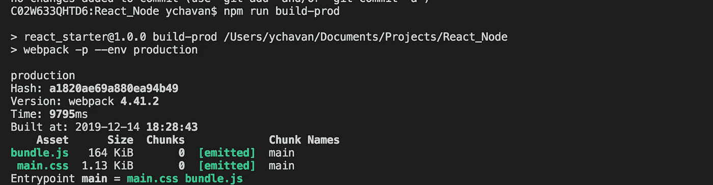

你现在可以看到，`bundle.js`文件大小减少了一点，这很好。
现在，如果您使用

```
npm run start-server
```

你会看到一个单独的`main.css`文件被加载到浏览器中，而不是唯一的`bundle.js`

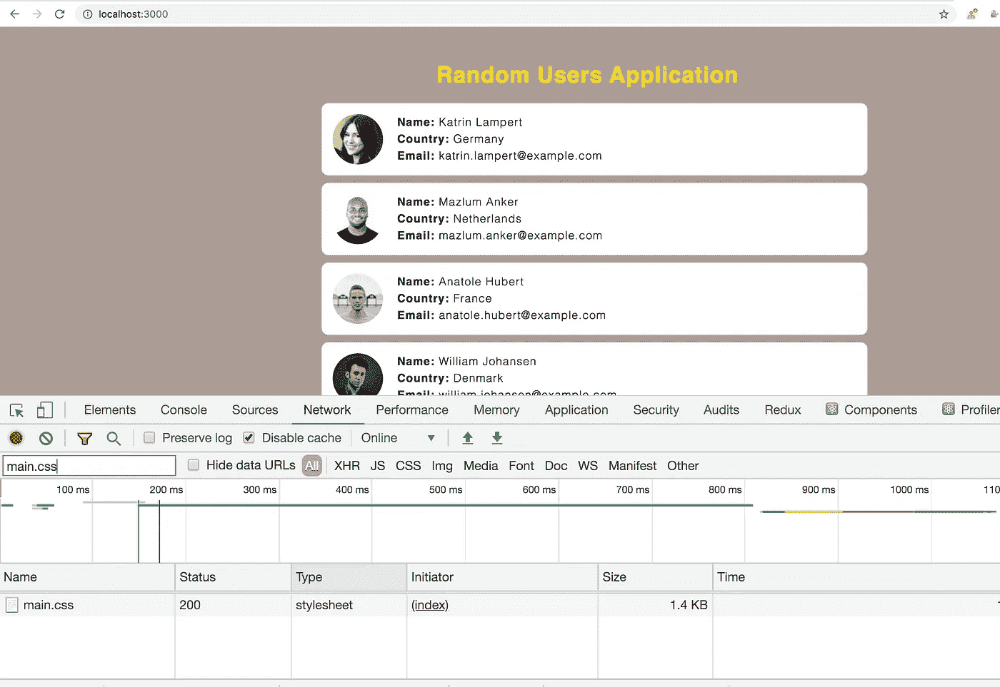

应用程序仍然运行良好，而且加载速度会更快。

**部署到 Heroku:**

1.使用以下命令安装 Heroku 软件包

```
npm install -g heroku
```

2.从终端执行以下命令

```
heroku login
```

这将重定向到 Heroku 站点，您必须点击登录按钮登录到`heroku-cli`

3.单击登录按钮后，您就可以切换到命令行，使用 Heroku 帐户启动部署过程

4.要在 Heroku 上部署，我们需要做一些代码更改

*   打开`server/index.js`文件，添加下面的语句
    `const port = process.env.PORT || 3000;`
    ，在`app.listen`方法中，传递变量`port`而不是 3000。这是因为 Heroku 创建了一个名为 PORT 的环境变量，并为您的应用程序分配了您可以使用的随机端口
*   在`package.json`中添加`start`脚本，当我们在 Heroku 上部署应用程序时，该脚本将自动执行。
*   所以打开`package.json`并改变

```
"start": "webpack-dev-server --watch"
```

到

```
"start-server": "webpack-dev-server --watch"
```

和改变

```
"start-server": "nodemon server/index.js"
```

到

```
"start": "npm run build-prod && node server/index.js"
```

在这里，我们首先运行 npm run build-prod 脚本，然后运行 node server/index.js

我们不需要`nodemon`,因为一旦部署，我们不会对产品做任何更改，所以不需要重启服务器

所以当应用程序被部署到 Heroku 时，只有`start`脚本会被执行。

5.使用以下命令在 Heroku 上创建一个新的应用程序

```
heroku create <any_application_name>Ex. heroku create my-first-app
```

6.一旦完成，应用程序就在 Heroku 上创建了，我们现在准备部署代码

7.通过执行以下命令，将当前项目作为 git 存储库

```
git init . // it's ( git init dot )
```

8.现在，使用以下命令将所有更改添加到临时区域

```
git add --all .
```

9.使用提交更改

```
git commit -m "changes"
```

10.把密码推给 Heroku

```
git push heroku master
```

11.恭喜你已经在 Heroku 上部署了应用程序。

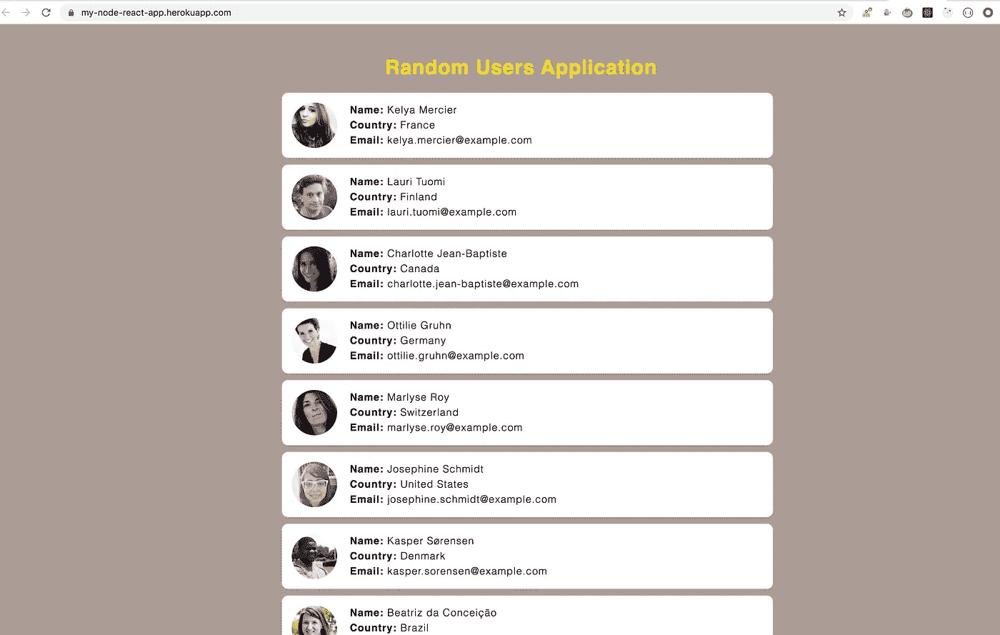

现场演示:[https://my-node-react-app.herokuapp.com/](https://my-node-react-app.herokuapp.com/)
完整源代码:[https://github.com/myogeshchavan97/react_node_optimized](https://github.com/myogeshchavan97/react_node_optimized)

今天到此为止。希望你今天学到了新东西。

**别忘了直接在你的收件箱** [**这里**](https://yogeshchavan.dev) **订阅我的每周简讯，里面有惊人的技巧、窍门和文章。**