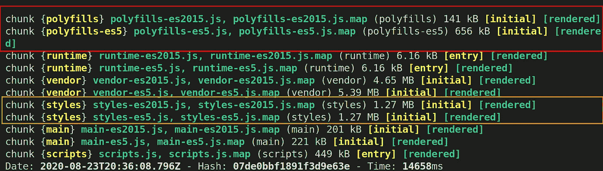
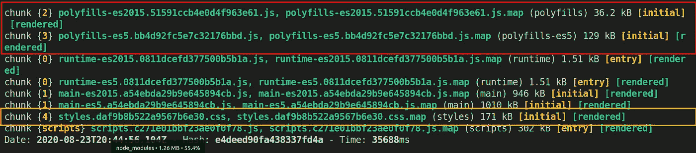

# 如何为生产优化您的角度应用

> 原文：<https://javascript.plainenglish.io/how-to-optimize-your-angular-application-for-production-e80537f1c9e?source=collection_archive---------1----------------------->

## 为生产优化您的角度应用


Photo by [chuttersnap](https://unsplash.com/@chuttersnap?utm_source=medium&utm_medium=referral) on [Unsplash](https://unsplash.com?utm_source=medium&utm_medium=referral)

交付高质量的软件不仅仅是编写好的代码。为了实现高质量的用户体验，您运输和交付 Angular 应用程序的方式至关重要。

本指南的主要目的是向您展示如何提供一个稳健且高质量的角度应用。您可以通过在构建过程中针对生产优化应用程序来实现这一点。

# **简介**

使用 Angular CLI 构建您的 Angular 应用程序非常简单。只需从您的工作区目录运行以下命令。

```
ng build
```

默认情况下，`ng build`命令编译您的角度代码，并将其放在 ***dist*** 文件夹中。对于一个开发版本来说，这是可以的，但是，对于一个生产版本来说，这并不重要。

`build` 命令有几个选项，我们将在下面的章节中看看其中一些重要的选项。

# 基本生产构建

最基本的是，您应该使用`--prod`选项运行您的构建命令。`--prod`选项将执行以下操作:

*   简单的摇树
*   从应用程序中移除死代码
*   设置生产环境变量

**注:** `--prod`是`--configuration=production`的简称。因此，`--prod`会将您的应用程序设置为指向生产环境变量，默认情况下，这些变量位于***environment . prod . ts***文件中。

您可以使用下面的命令，通过基本的优化来构建您的生产应用程序。

```
ng build --prod 
```

# 提前编译(AOT)

当您构建 Angular 应用程序时，默认情况下它使用实时编译(JIT)。这意味着您的 Angular 应用程序是在运行时在浏览器内部编译的。你可以想象这可能会很慢。

为了让你的构建优化更进一步，你可以使用提前编译(AOT)来构建你的角度生产代码。使用 AOT，您的 Angular 应用程序在构建时编译，也就是在它到达浏览器之前。以下是您应该使用 AOT 的一些原因。

## AOT 的优势

*   更快地呈现代码，因为编译是在构建时完成的，而不是在运行时在浏览器中完成的
*   较小的 Angular 应用程序大小，因为 Angular 编译器没有随代码一起提供
*   更好的代码质量，因为模板解析错误在构建的早期就被检测到
*   安全可靠，因为模板不会在浏览器中动态评估

AOT 的一个小挫折是你的构建过程或 CI/CD 管道可能需要更长的时间来完成。

使用下面的`--aot=true`选项用 AOT 构建你的应用程序。

```
ng build --prod --aot=true 
```

**注意**:Angular 的新版本在- prod 标志中包含了 AOT 编译。

# 角度构建优化器

您可以使用`--buildOptimizer`选项进一步优化您的生产角度应用

构建优化器移除了角度特定的装饰器、构造器参数，并使代码缩减器更容易移除未使用的代码。

```
ng build --prod --aot=true --buildOptimizer=true 
```

**注意**:`--buildOptimizer`选项只对 AOT 编译的代码有效。

# 构建输出的分析

在这一节中，我比较和分析了我一直在开发的一个应用程序的构建过程的输出。

第一个数字是非优化生产版本的输出，而第二个数字是优化生产版本的输出。

如您所见，在第一张图中，以红色突出显示的 polyfill 总计为*，而优化构建的 polyfill 总计仅为*165 KB。惊人的 ***减少 79%***。**

**对于样式表，用橙色突出显示。在第一张图中，它们总计为 ***2.5 MB*** ，而在优化构建中，它们总计为 ***171 KB*** 。代表着 ***下降 93%***。**

**正如我们之前强调的，优化的构建需要更长的时间。两个图中的最后一行显示了构建花费的时间。完成非优化构建所需的时间 ***比*** 少 60%。**

## **1.非优化的生产版本**

****

**non-optimized production build**

## **2.优化的生产构建**

****

**optimized production build**

# **结论**

**优化您的 Angular 应用程序构建不仅对良好的用户体验很重要，而且对安全性和交付高质量的应用程序也很重要。**

## ****简单英语的 JavaScript****

**你知道我们有三份出版物和一个 YouTube 频道吗？在[**plain English . io**](https://plainenglish.io/)找到一切的链接！**